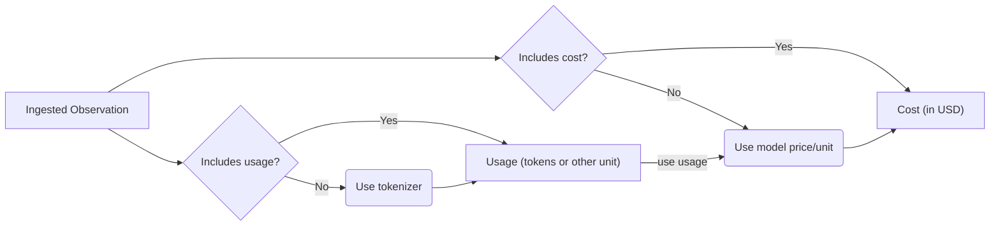

# Model Usage & Cost

Across AssistMe, usage and cost are tracked for LLM generations:

- **Usage**: token/character counts
- **Cost**: USD cost of the generation

Both usage and cost can be either

- [**ingested**](#ingest) via API, SDKs or integrations
- or [**inferred**](#infer) based on the `model` parameter of the generation. AssistMe comes with a list of predefined popular models and their tokenizers including OpenAI, Anthropic, and Google models.

Ingested usage and cost are prioritized over inferred usage and cost:



## Ingest usage and/or cost [#ingest]

If available in the LLM response, ingesting usage and/or cost is the most accurate and robust way to track usage in AssistMe:

```typescript
AssistMe.generation({
  ...
  usage: {
    // usage
    input: integer,
    output: integer,
    total: integer, // if no separate input&output, otherwise derived from input + output
    unit: string, // 'TOKENS' or 'CHARACTERS', defaults to 'TOKENS'

    // usd cost
    inputCost: number
    outputCost: number
    totalCost: number
  },
  ...
})
```

### Compatibility with OpenAI

For increased compatibility with OpenAI, you can also use the following attributes to ingest usage:

```typescript
AssistMe.generation({
  usage: {
    // usage
    promptTokens: integer,
    completionTokens: integer,
    totalTokens: integer, // optional, derived from prompt + completion
  },
});
```


### Usage

If a tokenizer is specified for the model, AssistMe automatically calculates token amounts for ingested generations.

The following tokenizers are currently supported:

| Tokenizer | Package                                                                            |
| --------- | ---------------------------------------------------------------------------------- |
| `openai`  | [`js-tiktoken`](https://www.npmjs.com/package/js-tiktoken)                         |
| `claude`  | [`@anthropic-ai/tokenizer`](https://www.npmjs.com/package/@anthropic-ai/tokenizer) |

### Cost

Model definitions include prices per unit (input, output, total).

AssistMe automatically calculates cost for ingested generations if (1) usage is ingested or inferred, (2) and a matching model definition includes prices.

## Troubleshooting

**Usage and cost are missing for historical generations**. Except for changes in prices, AssistMe does not retroactively infer usage and cost for existing generations when model definitions are changed. You can request a batch job or run a [script](/docs/deployment/self-host#migrate-models) (self-hosting) to apply new model definitions to existing generations.
