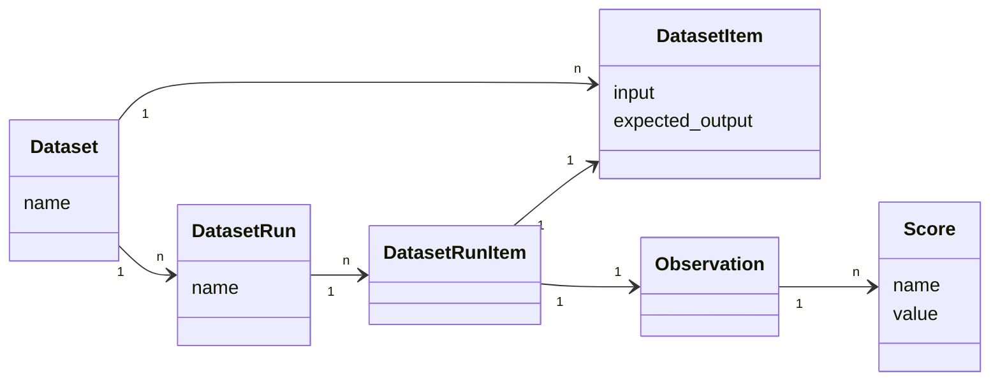

import { Tab, Tabs } from "nextra-theme-docs";
import { Callout } from "nextra/components";

# Datasets

<Callout type="info" emoji="ℹ️">
  
Datasets are a beta feature as the api is still subject to change.
- Reach out via the chat if you want to try it on Langfuse Cloud.
- When self-hosting, set env: _NEXT_PUBLIC_ENABLE_EXPERIMENTAL_FEATURES="true"_

</Callout>

Datasets in Langfuse are a collection of inputs (and expected outputs) of an LLM application. They are used to benchmark new releases before deployment to production. Datasets can be incrementally created from new edge cases found in production.

For an end-to-end example, checkout the [Datasets Notebook (Python)](/docs/datasets/python-cookbook).

## Creating a dataset

Datasets have a name which is unique within a project.

<Tabs items={["Python", "JS/TS", "UI"]} storageKey="datasets">
<Tab>

```python
from langfuse.model import CreateDatasetRequest

langfuse.create_dataset(CreateDatasetRequest(name="<dataset_name>"))
```

</Tab>
<Tab>

```ts
langfuse.createDataset("<dataset_name>");
```

</Tab>
<Tab>

Datasets: `+ New dataset`

</Tab>
</Tabs>

## Create new dataset items

Individual items can be added to a dataset by providing the input and optionally the expected output.

<Tabs items={["Python", "JS/TS", "UI"]} storageKey="datasets">
<Tab>

```python
from langfuse.model import CreateDatasetItemRequest

langfuse.create_dataset_item(
    CreateDatasetItemRequest(
        dataset_name="<dataset_name>",
        # any python object or value
        input={
            "text": "hello world"
        },
        # any python object or value, optional
        expected_output={
            "text": "hello world"
        }
    )
)
```

</Tab>
<Tab>

```ts
langfuse.createDatasetItem({
  datasetName: "<dataset_name>",
  // any JS object or value
  input: {
    text: "hello world",
  },
  // any JS object or value, optional
  expectedOutput: {
    text: "hello world",
  },
});
```

</Tab>
<Tab>

Datasets > Items: `+ New item`

</Tab>
</Tabs>

**Create items from production data**

In the UI, use `+ Add to dataset` on any production trace.

**Edit/archive items**

In the UI, you can edit or archive items by clicking on the item in the table. Archiving items will remove them from future experiment runs.

## Run experiment on a dataset

When running an experiment on a dataset, the application that shall be tested is executed for each item in the dataset. The execution trace is then linked to the dataset item. This allows to compare different runs of the same application on the same dataset. Each experiment is identified by a `run_name`.

Optionally, the output of the application can be evaluated to compare different runs more easily. Use any evaluation function and add a score to the observation. More details on scores/evals [here](/docs/scores).

<Tabs items={["Python", "JS/TS"]} storageKey="datasets">
<Tab>

```python
from langfuse.model import CreateScore

dataset = langfuse.get_dataset("<dataset_name>")

for item in dataset.items:
    # execute application function and get Langfuse parent observation (span/generation/event)
    # output also returned as it is used to evaluate the run
    generation, output = my_llm_application.run(item.input)

    # link the execution trace to the dataset item and give it a run_name
    item.link(generation, "<run_name>")

    # optionally, evaluate the output to compare different runs more easily
    generation.score(
        CreateScore(
            name="<example_eval>",
            # any float value
            value=my_eval_fn(
                item.input,
                output,
                item.expected_output
            )
        )
    )
```

**Using the Langchain integration**

```python
dataset = langfuse.get_dataset("<dataset_name>")

for item in dataset.items:
    # Langchain calback handler that automatically links the execution trace to the dataset item
    handler = item.get_langchain_handler(run_name="<run_name>")

    # Execute application and pass custom handler
    my_langchain_chain.run(item.input, callbacks=[handler])
```

</Tab>
<Tab>

```ts
const dataset = await langfuse.getDataset("<dataset_name>");

for (const item of dataset.items) {
  // execute application function and get Langfuse parent observation (span/generation/event)
  // output also returned as it is used to evaluate the run
  const [generation, output] = await myLlmApplication.run(item.input);

  // link the execution trace to the dataset item and give it a run_name
  await item.link(generation, "<run_name>");

  // optionally, evaluate the output to compare different runs more easily
  generation.score({
    name: "<score_name>",
    value: myEvalFunction(item.input, output, item.expectedOutput),
  });
}
```

</Tab>
</Tabs>

## Evaluate dataset runs

After each experiment run on a dataset, you can check the aggregated score in the dataset runs table.

<Frame border></Frame>

## Conceptually


