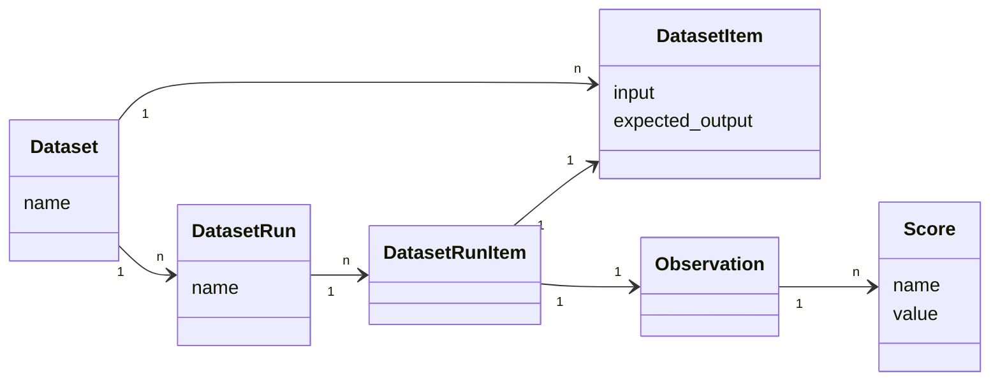

# Datasets

Datasets in AssistMe are a collection of inputs (and expected outputs) of an LLM application. They are used to benchmark new releases before deployment to production. Datasets can be incrementally created from new edge cases found in production.

## Creating a dataset

Datasets have a name which is unique within a project.

<Tabs items={["UI"]} storageKey="datasets">

<Tab>

Datasets: `+ New dataset`

</Tab>
</Tabs>

## Create new dataset items

Individual items can be added to a dataset by providing the input and optionally the expected output.

<Tabs items={["UI"]} storageKey="datasets">

<Tab>

Datasets > Items: `+ New item`

</Tab>
</Tabs>

**Create items from production data**

In the UI, use `+ Add to dataset` on any observation (span, event, generation) of a production trace.

**Edit/archive items**

In the UI, you can edit or archive items by clicking on the item in the table. Archiving items will remove them from future experiment runs.

## Run experiment on a dataset

When running an experiment on a dataset, the application that shall be tested is executed for each item in the dataset. The execution trace is then linked to the dataset item. This allows to compare different runs of the same application on the same dataset. Each experiment is identified by a `run_name`.

Optionally, the output of the application can be evaluated to compare different runs more easily. Use any evaluation function and add a score to the observation. More details on scores/evals [here](/docs/scores).

<Tabs items={["UI"]} storageKey="datasets">
<Tab>
   Add links to our data set runs
   Its in UI playground
</Tab>
</Tabs>

## Evaluate dataset runs

After each experiment run on a dataset, you can check the aggregated score in the dataset runs table.

<Frame border></Frame>

## Conceptually

