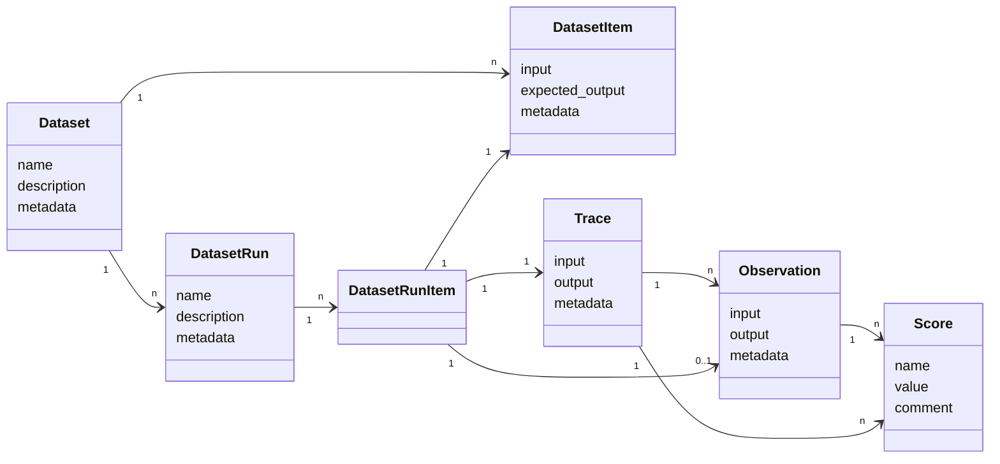

# Datasets

Datasets in Langfuse are a collection of inputs (and expected outputs) of an LLM application. They are used to benchmark new releases before deployment to production. Datasets can be incrementally created from new edge cases found in production.

For an end-to-end example, check out the [Datasets Notebook (Python)](/docs/datasets/python-cookbook).

<CloudflareVideo
  videoId="bb521aa5ad9160ce723a6a77376f5651"
  aspectRatio={16 / 9.5}
  title="Introduction to Datasets v2"
  className="mt-10"
/>

## Creating a dataset

Datasets have a name which is unique within a project.

<Tabs items={["Python", "JS/TS", "UI"]}>
<Tab>

```python
langfuse.create_dataset(
    name="<dataset_name>",
    # optional description
    description="My first dataset",
    # optional metadata
    metadata={
        "author": "Alice",
        "date": "2022-01-01",
        "type": "benchmark"
    }
)
```

_See [low-level SDK](/docs/sdk/python/low-level-sdk) docs for details on how to initialize the Python client._

</Tab>
<Tab>

```ts
langfuse.createDataset({
  name: "<dataset_name>",
  // optional description
  description: "My first dataset",
  // optional metadata
  metadata: {
    author: "Alice",
    date: "2022-01-01",
    type: "benchmark",
  },
});
```

</Tab>
<Tab>

Datasets: `+ New dataset`

</Tab>
</Tabs>

## Create new dataset items

Individual items can be added to a dataset by providing the input and optionally the expected output.

<Tabs items={["Python", "JS/TS", "UI"]}>
<Tab>

```python
langfuse.create_dataset_item(
    dataset_name="<dataset_name>",
    # any python object or value, optional
    input={
        "text": "hello world"
    },
    # any python object or value, optional
    expected_output={
        "text": "hello world"
    },
    # metadata, optional
    metadata={
        "model": "llama3",
    }
)
```

_See [low-level SDK](/docs/sdk/python/low-level-sdk) docs for details on how to initialize the Python client._

</Tab>
<Tab>

```ts
langfuse.createDatasetItem({
  datasetName: "<dataset_name>",
  // any JS object or value
  input: {
    text: "hello world",
  },
  // any JS object or value, optional
  expectedOutput: {
    text: "hello world",
  },
  // metadata, optional
  metadata: {
    model: "llama3",
  },
});
```

</Tab>
<Tab>

Datasets > Items: `+ New item`

</Tab>
</Tabs>

**Create items from production data**

<Tabs items={["UI", "Python", "JS/TS"]}>
<Tab>
In the UI, use `+ Add to dataset` on any observation (span, event, generation) of a production trace.
</Tab>
<Tab>

```python
langfuse.create_dataset_item(
    dataset_name="<dataset_name>",
    input={ "text": "hello world" },
    expected_output={ "text": "hello world" },
    # link to a trace
    source_trace_id="<trace_id>",
    # optional: link to a specific span, event, or generation
    source_observation_id="<observation_id>"
)
```

</Tab>
<Tab>

```ts
langfuse.createDatasetItem({
  datasetName: "<dataset_name>",
  input: { text: "hello world" },
  expectedOutput: { text: "hello world" },
  // link to a trace
  sourceTraceId: "<trace_id>",
  // optional: link to a specific span, event, or generation
  sourceObservationId: "<observation_id>",
});
```

</Tab>
</Tabs>

**Edit/archive items**

Archiving items will remove them from future experiment runs.

<Tabs items={["UI", "Python", "JS/TS"]}>
<Tab>
In the UI, you can edit or archive items by clicking on the item in the table.
</Tab>
<Tab>

You can upsert items by providing the `id` of the item you want to update.

```python
langfuse.create_dataset_item(
    id="<item_id>",
    # example: update status to "ARCHIVED"
    status="ARCHIVED"
)
```

</Tab>
<Tab>

You can upsert items by providing the `id` of the item you want to update.

```ts
langfuse.createDatasetItem({
  id: "<item_id>",
  // example: update status to "ARCHIVED"
  status: "ARCHIVED",
});
```

</Tab>
</Tabs>

## Run experiment on a dataset

When running an experiment on a dataset, the application that shall be tested is executed for each item in the dataset. The execution trace is then linked to the dataset item. This allows to compare different runs of the same application on the same dataset. Each experiment is identified by a `run_name`.

Optionally, the output of the application can be evaluated to compare different runs more easily. Use any evaluation function and add a score to the observation. More details on scores/evals [here](/docs/scores/overview).

<Tabs items={["Python", "JS/TS", "Langchain (Python)", "LlamaIndex (Python)"]}>
<Tab>

```python
dataset = langfuse.get_dataset("<dataset_name>")

for item in dataset.items:
    # execute application function and get langfuse_object (trace/span/generation/event)
    # output also returned as it is used to evaluate the run
    # you can also link using ids, see sdk reference for details
    langfuse_object, output = my_llm_application.run(item.input)

    # link the execution trace to the dataset item and give it a run_name
    item.link(
        langfuse_object,
        "<run_name>",
        run_description="My first run", # optional
        run_metadata={ "model": "llama3" } # optional
    )

    # optionally, evaluate the output to compare different runs more easily
    langfuse_object.score(
        name="<example_eval>",
        # any float value
        value=my_eval_fn(
            item.input,
            output,
            item.expected_output
        ),
        comment="This is a comment" # optional, useful to add reasoning
    )
```

_See [low-level SDK](/docs/sdk/python/low-level-sdk) docs for details on how to initialize the Python client._

</Tab>
<Tab>

```ts
const dataset = await langfuse.getDataset("<dataset_name>");

for (const item of dataset.items) {
  // execute application function and get langfuseObject (trace/span/generation/event)
  // output also returned as it is used to evaluate the run
  // you can also link using ids, see sdk reference for details
  const [langfuseObject, output] = await myLlmApplication.run(item.input);

  // link the execution trace to the dataset item and give it a run_name
  await item.link(langfuseObject, "<run_name>", {
    description: "My first run", // optional run description
    metadata: { model: "llama3" }, // optional run metadata
  });

  // optionally, evaluate the output to compare different runs more easily
  langfuseObject.score({
    name: "<score_name>",
    value: myEvalFunction(item.input, output, item.expectedOutput),
    comment: "This is a comment", // optional, useful to add reasoning
  });
}
```

</Tab>
<Tab>

```python
dataset = langfuse.get_dataset("<dataset_name>")

for item in dataset.items:
    # Langchain callback handler that automatically links the execution trace to the dataset item
    handler = item.get_langchain_handler(run_name="<run_name>")

    # Execute application and pass custom handler
    my_langchain_chain.run(item.input, callbacks=[handler])
```

</Tab>
<Tab>

```python
from llama_index.core.callbacks import CallbackManager
from llama_index.core import Settings

dataset = langfuse.get_dataset("<dataset_name>")

for item in dataset.items:
    # LlamaIndex callback handler that automatically links the execution trace to the dataset item
    handler = item.get_llama_index_handler(run_name="<run_name>")

    # Update the global LlamaIndex callback manager
    Settings.callback_manager = CallbackManager([handler])

    # Run your LlamaIndex application on the input
    index = VectorStoreIndex.from_documents([doc1,doc2])
    response = index.as_query_engine().query(item.input)
```

</Tab>
</Tabs>

## Evaluate dataset runs

After each experiment run on a dataset, you can check the aggregated score in the dataset runs table.

<Frame border></Frame>

## Conceptually


