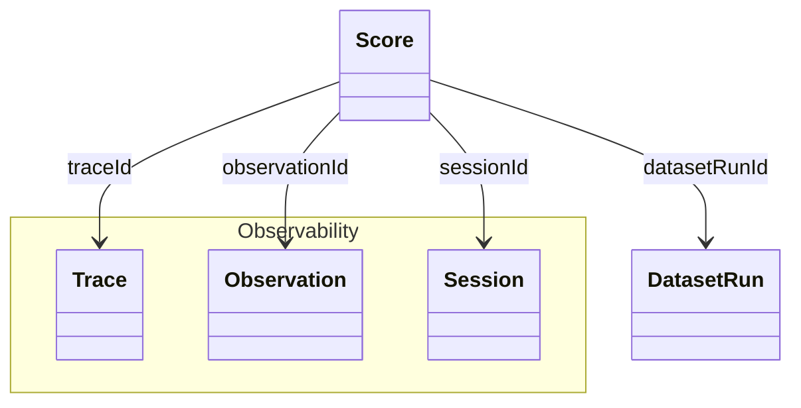
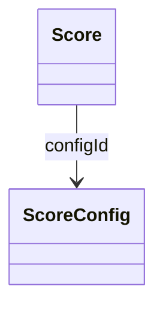

# Evaluation Concepts

- [**Scores**](#scores) are a flexible data object that can be used to store any evaluation metric and link it to other objects in Langfuse.
- [**Evaluation Methods**](#evaluation-methods) are functions or tools to assign scores to other objects.
- [**Datasets**](#datasets) are a collection of inputs and, optionally, expected outputs that can be used during Experiments.
- [**Experiments**](#experiments) loop over your dataset, trigger your application on each item and optionally apply evaluation methods to the results.

## Scores [#scores]

`Scores` serve as objects for storing evaluation metrics in Langfuse. Here are its core properties:

- Scores reference a `Trace`, `Observation`, `Session`, or `DatasetRun`
- Each Score references **exactly one** of the above objects.
- Scores are either **numeric**, **categorical**, or **boolean**.
- Scores can **optionally be linked to a `ScoreConfig`** to ensure they comply with a specific schema.

Common Use

| Level       | Description                                                                                                           |
| ----------- | --------------------------------------------------------------------------------------------------------------------- |
| Trace       | Used for evaluation of a single interaction. (most common)                                                            |
| Observation | Used for evaluation of a single observation below the trace level.                                                    |
| Session     | Used for comprehensive evaluation of outputs across multiple interactions.                                            |
| Dataset Run | Used for performance scores of a Dataset Run. [See Dataset Runs for context.](/docs/datasets/dataset-runs/data-model) |

Score object

| Attribute       | Type   | Description                                                                                                                                                                                               |
| --------------- | ------ | --------------------------------------------------------------------------------------------------------------------------------------------------------------------------------------------------------- |
| `name`          | string | Name of the score, e.g. user_feedback, hallucination_eval                                                                                                                                                 |
| `value`         | number | Optional: Numeric value of the score. Always defined for numeric and boolean scores. Optional for categorical scores.                                                                                     |
| `stringValue`   | string | Optional: String equivalent of the score's numeric value for boolean and categorical data types. Automatically set for categorical scores based on the config if the `configId` is provided.              |
| `traceId`       | string | Optional: Id of the trace the score relates to                                                                                                                                                            |
| `observationId` | string | Optional: Observation (e.g. LLM call) the score relates to                                                                                                                                                |
| `sessionId`     | string | Optional: Id of the session the score relates to                                                                                                                                                          |
| `datasetRunId`  | string | Optional: Id of the dataset run the score relates to                                                                                                                                                      |
| `comment`       | string | Optional: Evaluation comment, commonly used for user feedback, eval reasoning output or internal notes                                                                                                    |
| `id`            | string | Unique identifier of the score. Auto-generated by SDKs. Optionally can also be used as an idempotency key to update scores.                                                                               |
| `source`        | string | Automatically set based on the source of the score. Can be either `API`, `EVAL`, or `ANNOTATION`                                                                                                          |
| `dataType`      | string | Automatically set based on the config data type when the `configId` is provided. Otherwise can be defined manually as `NUMERIC`, `CATEGORICAL` or `BOOLEAN`                                               |
| `configId`      | string | Optional: Score config id to ensure that the score follows a specific schema. Can be defined in the Langfuse UI or via API. When provided the score's `dataType` is automatically set based on the config |

### Score Configs [#score-configs]

Score configs are used to ensure that your scores follow a specific schema.
Using score configs allows you to standardize your scoring schema across your team and ensure that scores are consistent and comparable for future analysis.

You can define a `scoreConfig` in the Langfuse UI or via our API (how to guide [here](/faq/all/manage-score-configs)) Configs are immutable but can be archived (and restored anytime).

A score config includes:

- **Score name**
- **Data type:** `NUMERIC`, `CATEGORICAL`, `BOOLEAN`
- **Constraints on score value range** (Min/Max for numerical, Custom categories for categorical data types

Score Config object

| Attribute     | Type    | Description                                                                                     |
| ------------- | ------- | ----------------------------------------------------------------------------------------------- |
| `id`          | string  | Unique identifier of the score config.                                                          |
| `name`        | string  | Name of the score config, e.g. user_feedback, hallucination_eval                                |
| `dataType`    | string  | Can be either `NUMERIC`, `CATEGORICAL` or `BOOLEAN`                                             |
| `isArchived`  | boolean | Whether the score config is archived. Defaults to false                                         |
| `minValue`    | number  | Optional: Sets minimum value for numerical scores. If not set, the minimum value defaults to -∞ |
| `maxValue`    | number  | Optional: Sets maximum value for numerical scores. If not set, the maximum value defaults to +∞ |
| `categories`  | list    | Optional: Defines categories for categorical scores. List of objects with label value pairs     |
| `description` | string  | Optional: Provides further description of the score configuration                               |

## Evaluation Methods [#evaluation-methods]

Evaluation methods let you assign evaluation `scores` to `traces`, `observations`, `sessions`, or `dataset runs`. 

You can use the following evaluation methods to add `scores`:

- [LLM-as-a-Judge](/docs/evaluation/evaluation-methods/llm-as-a-judge)
- [Scores via UI](/docs/evaluation/evaluation-methods/scores-via-ui)
- [Annotation Queues](/docs/evaluation/evaluation-methods/annotation-queues)
- [Scores via API/SDK](/docs/evaluation/evaluation-methods/scores-via-sdk)

## Experiments [#experiments]

Experiments are used to loop your LLM application through [Datasets](/docs/evaluation/experiments/datasets) (local or hosted on Langfuse) and optionally apply [Evaluation Methods](/docs/evaluation/evaluation-methods/overview) to the results. This lets you strategically evaluate your application and compare the performance of different inputs, prompts, models, or other parameters side-by-side against controlled conditions.

Langfuse supports [Experiments via SDK](/docs/evaluation/experiments/experiments-via-sdk) and [Experiments via UI](/docs/evaluation/experiments/experiments-via-ui). Experiments via UI rely on Dataset, Prompts and optionally LLM-as-a-Judge Evaluators all being on the Langfuse platform and can be thus triggered and executed directly on the platform. Experiments via SDK are fully flexible and can be triggered from any external system.

- [Create a Dataset](/docs/evaluation/experiments/datasets)
- [Experiments via SDK](/docs/evaluation/experiments/experiments-via-sdk)
- [Experiments via UI](/docs/evaluation/experiments/experiments-via-ui)

Learn more about the [Experiments Data Model](/docs/evaluation/experiments/data-model).

