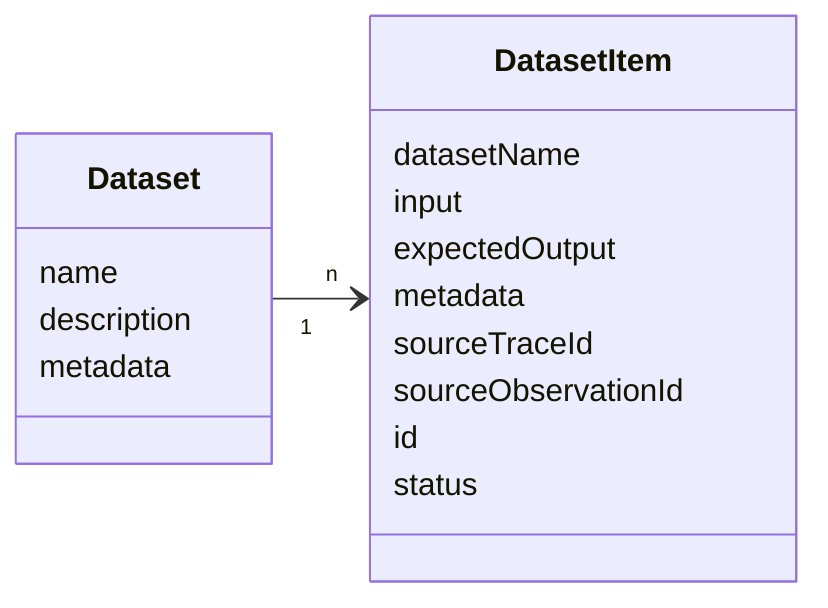
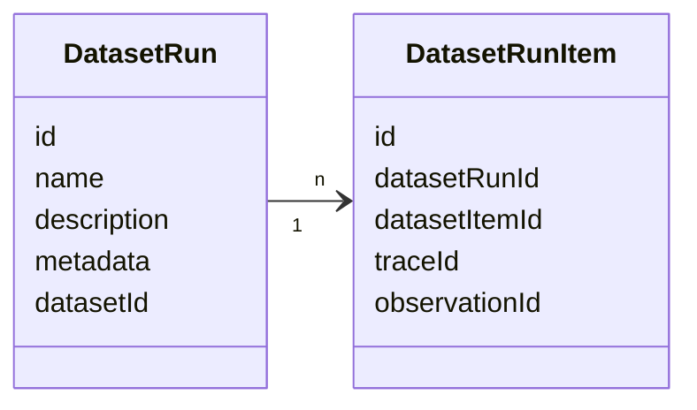
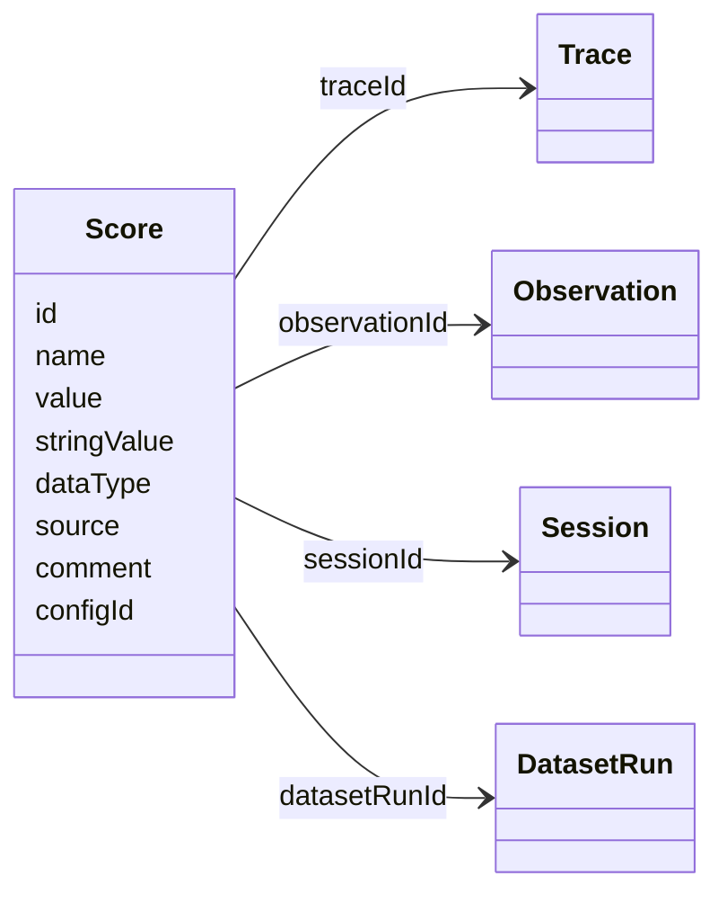
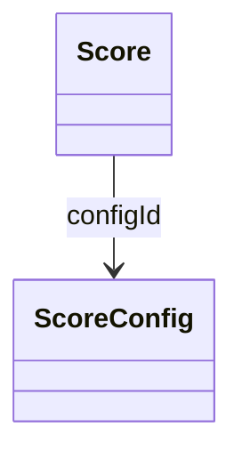
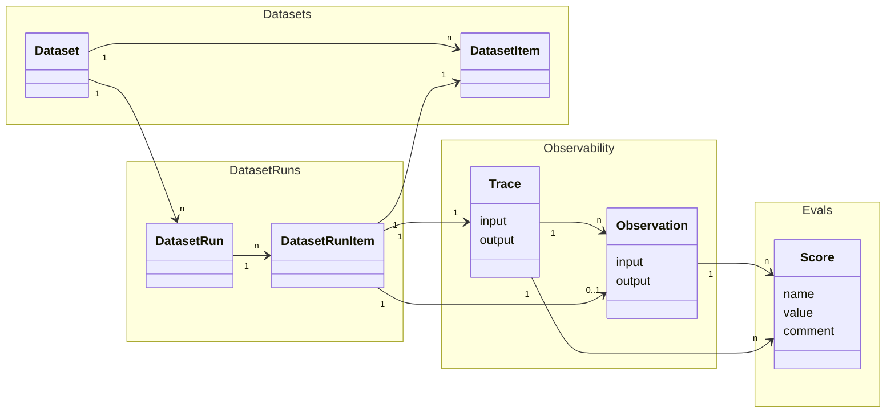

# Evaluation Data Model

This page describes the data model for evaluation-related objects in Langfuse. For an overview of how these objects work together, see the [Core Concepts](/docs/evaluation/core-concepts) page.

For detailed reference please refer to 
- the [Python SDK reference](https://python.reference.langfuse.com)
- the [JS/TS SDK reference](https://js.reference.langfuse.com)
- the [API reference](https://api.reference.langfuse.com)

The following objects are covered in this page:

| Object/Function definition | Description |
| ------ | ----------- |
| [Dataset](#datasets) | A collection of dataset items to run experiments on. |
| [Dataset Item](#datasetitem-object) | An individual item in a dataset. |
| [Dataset Run](#experiment-objects) | Or experiment run. The object linking the results of an experiment. |
| [Dataset Run Item](#experiment-objects) | Or experiment run item. |
| [Score](#scores) | The output of an evaluator. |
| [Score Config](#score-configs) | Configuration defining how a score is calculated and interpreted. |
| [Task Function](#task-function-definitions) |Function definition of the task to run on dataset items for a specific experiment. |
| [Evaluator Function](#evaluator-function-definitions) | Function definition for an evaluator. |

## Objects

### Datasets

Datasets are a collection of inputs and, optionally, expected outputs that can be used during Dataset runs.

`Dataset`s are a collection of `DatasetItem`s. 

#### Dataset object

| Attribute                 | Type   | Required | Description                                                                 |
| ------------------------- | ------ | -------- | --------------------------------------------------------------------------- |
| `id`                      | string | Yes      | Unique identifier for the dataset                                           |
| `name`                    | string | Yes      | Name of the dataset                                                         |
| `description`             | string | No       | Description of the dataset                                                  |
| `metadata`                | object | No       | Additional metadata for the dataset                                         |
| `remoteExperimentUrl`     | string | No       | Webhook endpoint for triggering experiments                                 |
| `remoteExperimentPayload` | object | No       | Payload for triggering experiments                                 |

#### DatasetItem object

| Attribute               | Type           | Required | Description                                                                                                                                                                                               |
| ----------------------- | -------------- | -------- | --------------------------------------------------------------------------------------------------------------------------------------------------------------------------------------------------------- |
| `id`                    | string         | Yes      | Unique identifier for the dataset item. Dataset items are upserted on their id. Id needs to be unique (project-level) and cannot be reused across datasets.                                              |
| `datasetId`             | string         | Yes      | ID of the dataset this item belongs to                                                                                                                                                                    |
| `input`                 | object         | No       | Input data for the dataset item                                                                                                                                                                           |
| `expectedOutput`        | object         | No       | Expected output data for the dataset item                                                                                                                                                                 |
| `metadata`              | object         | No       | Additional metadata for the dataset item                                                                                                                                                                  |
| `sourceTraceId`         | string         | No       | ID of the source trace to link this dataset item to                                                                                                                                                       |
| `sourceObservationId`   | string         | No       | ID of the source observation to link this dataset item to                                                                                                                                                 |
| `status`                | DatasetStatus  | No       | Status of the dataset item. Defaults to ACTIVE for newly created items. Possible values: `ACTIVE`, `ARCHIVED`                                                                                            |

### DatasetRun (Experiment Run)

Dataset runs are used to run a dataset through your LLM application and optionally apply evaluation methods to the results. This is often referred to as Experiment run.

 

#### DatasetRun object

| Attribute      | Type   | Required | Description                                                                 |
| -------------- | ------ | -------- | --------------------------------------------------------------------------- |
| `id`           | string | Yes      | Unique identifier for the dataset run                                       |
| `name`         | string | Yes      | Name of the dataset run                                                     |
| `description`  | string | No       | Description of the dataset run                                              |
| `metadata`     | object | No       | Additional metadata for the dataset run                                     |
| `datasetId`    | string | Yes      | ID of the dataset this run belongs to                                       |

#### DatasetRunItem object

| Attribute        | Type   | Required | Description                                                                                                                                                                                               |
| ---------------- | ------ | -------- | --------------------------------------------------------------------------------------------------------------------------------------------------------------------------------------------------------- |
| `id`             | string | Yes      | Unique identifier for the dataset run item                                                                                                                                                               |
| `datasetRunId`   | string | Yes      | ID of the dataset run this item belongs to                                                                                                                                                               |
| `datasetItemId`  | string | Yes      | ID of the dataset item to link to this run                                                                                                                                                               |
| `traceId`        | string | Yes      | ID of the trace to link to this run                                                                                                                                                                      |
| `observationId`  | string | No       | ID of the observation to link to this run                                                                                                                                                                |

<Callout type="info">
Most of the time, we recommend that DatasetRunItems reference TraceIDs directly. The reference to ObservationID exists for backwards compatibility with older SDK versions. 
</Callout>

### Scores

Scores are the data object to store evaluation results. They are used to assign evaluation scores to traces, observations, sessions, or dataset runs. Scores can be added manually via annotations, programmatically via the SDK/API, or automatically via LLM-as-a-Judge evaluators.

 

Scores have the following properties:
- Each Score references **exactly one** of `Trace`, `Observation`, `Session`, or `DatasetRun`
- Scores are either **numeric**, **categorical**, or **boolean**
- Scores can **optionally be linked to a `ScoreConfig`** to ensure they comply with a specific schema

#### Score object

| Attribute       | Type   | Required | Description                                                                                                                                                                                               |
| --------------- | ------ | -------- | --------------------------------------------------------------------------------------------------------------------------------------------------------------------------------------------------------- |
| `id`            | string | Yes      | Unique identifier of the score. Auto-generated by SDKs. Optionally can also be used as an idempotency key to update scores.                                                                               |
| `name`          | string | Yes      | Name of the score, e.g. user_feedback, hallucination_eval                                                                                                                                                 |
| `value`         | number | No       | Numeric value of the score. Always defined for numeric and boolean scores. Optional for categorical scores.                                                                                               |
| `stringValue`   | string | No       | String equivalent of the score's numeric value for boolean and categorical data types. Automatically set for categorical scores based on the config if the `configId` is provided.                        |
| `dataType`      | string | No       | Automatically set based on the config data type when the `configId` is provided. Otherwise can be defined manually as `NUMERIC`, `CATEGORICAL` or `BOOLEAN`                                               |
| `source`        | string | Yes      | Automatically set based on the source of the score. Can be either `API`, `EVAL`, or `ANNOTATION`                                                                                                           |
| `comment`       | string | No       | Evaluation comment, commonly used for user feedback, eval reasoning output or internal notes                                                                                                              |
| `traceId`       | string | No       | Id of the trace the score relates to                                                                                                                                                                      |
| `observationId` | string | No       | Id of the observation (e.g. LLM call) the score relates to                                                                                                                                                |
| `sessionId`     | string | No       | Id of the session the score relates to                                                                                                                                                                    |
| `datasetRunId`  | string | No       | Id of the dataset run the score relates to                                                                                                                                                                |
| `configId`      | string | No       | Score config id to ensure that the score follows a specific schema. Can be defined in the Langfuse UI or via API.                                                                                         |

#### Common Use Cases

| Level       | Description                                                                                                           |
| ----------- | --------------------------------------------------------------------------------------------------------------------- |
| Trace       | Used for evaluation of a single interaction. (most common)                                                            |
| Observation | Used for evaluation of a single observation below the trace level.                                                    |
| Session     | Used for comprehensive evaluation of outputs across multiple interactions.                                            |
| Dataset Run | Used for performance scores of a Dataset Run.                                                                         |

### Score Config

Score configs are used to ensure that your scores follow a specific schema. Using score configs allows you to standardize your scoring schema across your team and ensure that scores are consistent and comparable for future analysis.

You can define a `ScoreConfig` in the Langfuse UI or via our API. Configs are immutable but can be archived (and restored anytime).

A score config includes:
- **Score name**
- **Data type:** `NUMERIC`, `CATEGORICAL`, `BOOLEAN`
- **Constraints on score value range** (Min/Max for numerical, Custom categories for categorical data types)

#### ScoreConfig object

| Attribute     | Type    | Required | Description                                                                                     |
| ------------- | ------- | -------- | ----------------------------------------------------------------------------------------------- |
| `id`          | string  | Yes      | Unique identifier of the score config.                                                          |
| `name`        | string  | Yes      | Name of the score config, e.g. user_feedback, hallucination_eval                                |
| `dataType`    | string  | Yes      | Can be either `NUMERIC`, `CATEGORICAL` or `BOOLEAN`                                             |
| `isArchived`  | boolean | No       | Whether the score config is archived. Defaults to false                                         |
| `minValue`    | number  | No       | Sets minimum value for numerical scores. If not set, the minimum value defaults to -∞           |
| `maxValue`    | number  | No       | Sets maximum value for numerical scores. If not set, the maximum value defaults to +∞           |
| `categories`  | list    | No       | Defines categories for categorical scores. List of objects with label value pairs              |
| `description` | string  | No       | Provides further description of the score configuration                                         |

### End to end data relations

An experiment can combine a few Langfuse objects:
- `DatasetRuns` (or Experiment runs) are created by looping through all or selected `DatasetItem`s of a `Dataset` with your LLM application.
- For each `DatasetItem` passed into the LLM application as an Input a `DatasetRunItem` & a `Trace` are created. 
- Optionally `Score`s can be added to the `Trace`s to evaluate the output of the LLM application during the `DatasetRun`. 

 

See the [core concepts page](/docs/evaluation/core-concepts) for more information on how these objects work together conceptually.
See the [observability core concepts page](/docs/observability/data-model) for more details on traces and observations. 

## Function Definitions

When running experiments via the SDK, you define **task** and **evaluator** functions. These are user-defined functions that the experiment runner calls for each dataset item. For more information on how experiments work conceptually, see the [core concepts page](/docs/evaluation/core-concepts).

### Task

A task is a function that takes a dataset item and returns an output during an experiment run.

See SDK references for function signatures and parameters:
- [Python SDK: `TaskFunction`](https://python.reference.langfuse.com/langfuse/experiment#TaskFunction)
- [JS/TS SDK: `ExperimentTask`](https://js.reference.langfuse.com/types/_langfuse_client.ExperimentTask.html)

### Evaluator

An evaluator is a function that scores the output of a task for a single dataset item. Evaluators receive the input, output, expected output, and metadata, and return an `Evaluation` object that becomes a Score in Langfuse.

See SDK references for function signatures and parameters:
- [Python SDK: `EvaluatorFunction`](https://python.reference.langfuse.com/langfuse/experiment#EvaluatorFunction)
- [JS/TS SDK: `Evaluator`](https://js.reference.langfuse.com/types/_langfuse_client.Evaluator.html)

### Run Evaluator

A run evaluator is a function that assesses the full experiment results and computes aggregate metrics. When run on Langfuse datasets, the resulting scores are attached to the dataset run.

See SDK references for function signatures and parameters:
- [Python SDK: `RunEvaluatorFunction`](https://python.reference.langfuse.com/langfuse/experiment#RunEvaluatorFunction)
- [JS/TS SDK: `RunEvaluator`](https://js.reference.langfuse.com/types/_langfuse_client.RunEvaluator.html)

<Callout type="info">
For detailed usage examples of tasks and evaluators, see [Experiments via SDK](/docs/evaluation/experiments/experiments-via-sdk).
</Callout>

## Local Datasets

Currently, if an [Experiment via SDK](/docs/evaluation/experiments/experiments-via-sdk) is used to run experiments on local datasets, only traces are created in Langfuse - no dataset runs are generated. Each task execution creates an individual trace for observability and debugging.

<Callout type="info">

We have improvements on our roadmap to support similar functionality such as run overviews, comparison views, and more for experiments on local datasets as for Langfuse datasets.

</Callout>

