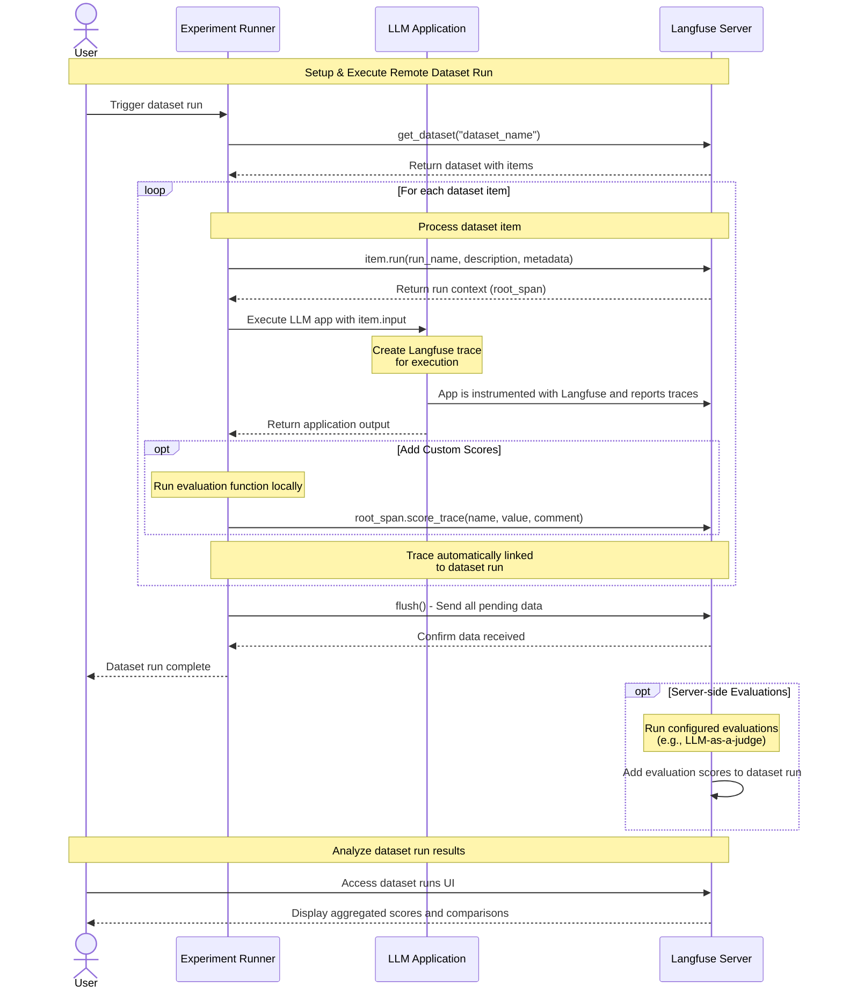

# Remote Dataset Runs

Once you [created a dataset](/docs/evaluation/dataset-runs/datasets), you can use the dataset to test how your application performs on different inputs.
Remote Dataset Runs are used to programmatically loop your applications or prompts through a dataset and optionally apply Evaluation Methods to the results.

They are called "Remote Dataset Runs" because they can make use of "remote" or external logic and code.

Optionally, you can also trigger Remote Dataset Runs via the Langfuse UI which will call them via a webhook.

## Why use Remote Dataset Runs?

- Full flexibility to use your own application logic
- Use custom scoring functions to evaluate the outputs
- Run multiple experiments on the same dataset in parallel
- Easy to integrate with your existing evaluation infrastructure

<details>
<summary>Sequence Diagram</summary>



</details>

## Experiment runner SDK

Both the Python and JS/TS SDKs provide a high-level abstraction for running an experiment on a dataset. The dataset can be both local or hosted on Langfuse. Using the Experiment runner is the recommended way to run an experiment on a dataset with our SDK.

The experiment runner automatically handles:
- **Concurrent execution** of tasks with configurable limits
- **Automatic tracing** of all executions for observability
- **Flexible evaluation** with both item-level and run-level evaluators  
- **Error isolation** so individual failures don't stop the experiment
- **Dataset integration** for easy comparison and tracking

### Basic Usage

Start with the simplest possible experiment to test your task function on local data.

<LangTabs items={["Python SDK", "JS/TS SDK"]}>
<Tab>
{/* PYTHON SDK */}

```python
from langfuse import get_client
from langfuse.experiment import format_experiment_result
from langfuse.openai import OpenAI

# Initialize client
langfuse = get_client()


# Define your task function
def my_task(*, item, **kwargs):
    # Process the input from each dataset item
    question = item["input"]

    # Your application logic here
    response = OpenAI().chat.completions.create(
        model="gpt-4.1", messages=[{"role": "user", "content": question}]
    )

    return response.choices[0].message.content


# Run experiment on local data
local_data = [
    {"input": "What is the capital of France?"},
    {"input": "What is the capital of Germany?"},
]

result = langfuse.run_experiment(
    name="Geography Quiz",
    description="Testing basic functionality",
    data=local_data,
    task=my_task,
)

# Use prettyPrint to display results
print(format_experiment_result(result))
```

</Tab>
<Tab>
{/* JS/TS SDK */}
Make sure that OpenTelemetry is properly set up for traces to be delivered to Langfuse. See the [tracing setup documentation](/docs/observability/sdk/typescript/setup#tracing-setup) for configuration details. Always flush the span processor at the end of execution to ensure all traces are sent.

```typescript
import { OpenAI } from "openai";
import { NodeSDK } from "@opentelemetry/sdk-node";

import {
  LangfuseClient,
  ExperimentTask,
  ExperimentItem,
} from "@langfuse/client";
import { observeOpenAI } from "@langfuse/openai";
import { LangfuseSpanProcessor } from "@langfuse/otel";

// Initialize OpenTelemetry
const otelSdk = new NodeSDK({ spanProcessors: [new LangfuseSpanProcessor()] });
otelSdk.start();

// Initialize client
const langfuse = new LangfuseClient();

// Run experiment on local data
const localData: ExperimentItem[] = [
  { input: "What is the capital of France?" },
  { input: "What is the capital of Germany?" },
];

// Define your task function
const myTask: ExperimentTask = async (item) => {
  const question = item.input;

  const response = await observeOpenAI(new OpenAI()).chat.completions.create({
    model: "gpt-4.1",
    messages: [
      {
        role: "user",
        content: question,
      },
    ],
  });

  return response;
};

// Run the experiment
const result = await langfuse.experiment.run({
  name: "Geography Quiz",
  description: "Testing basic functionality",
  data: localData,
  task: myTask,
});

// Use prettyPrint to display results
console.log(await result.prettyPrint());

// Important: shut down OTEL SDK to deliver traces
await otelSdk.shutdown();
```

**Note for JS/TS SDK**: OpenTelemetry must be properly set up for traces to be delivered to Langfuse. See the [tracing setup documentation](/docs/observability/sdk/typescript/setup#tracing-setup) for configuration details. Always flush the span processor at the end of execution to ensure all traces are sent.

</Tab>
</LangTabs>

When running experiments on local data, only traces are created in Langfuse - no dataset runs are generated. Each task execution creates an individual trace for observability and debugging.

### Usage with Langfuse Datasets

Run experiments directly on datasets stored in Langfuse for automatic tracing and comparison.

<LangTabs items={["Python SDK", "JS/TS SDK"]}>
<Tab>
{/* PYTHON SDK */}

```python
# Get dataset from Langfuse
dataset = langfuse.get_dataset("my-evaluation-dataset")

# Run experiment directly on the dataset
result = dataset.run_experiment(
    name="Production Model Test",
    description="Monthly evaluation of our production model",
    task=my_task
)

# Use prettyPrint to display results
print(format_experiment_result(result))
```

</Tab>

<Tab>
{/* JS/TS SDK */}

```typescript
// Get dataset from Langfuse
const dataset = await langfuse.dataset.get("my-evaluation-dataset");

// Run experiment directly on the dataset
const result = await dataset.runExperiment({
  name: "Production Model Test",
  description: "Monthly evaluation of our production model",
  task: myTask
});

// Use prettyPrint to display results
console.log(await result.prettyPrint());

// Important: shut down OpenTelemetry to ensure traces are sent
await otelSdk.shutdown()
```

</Tab>
</LangTabs>

When using Langfuse datasets, dataset runs are automatically created in Langfuse and are available for comparison in the UI. This enables tracking experiment performance over time and comparing different approaches on the same dataset.

### Advanced Features

Enhance your experiments with evaluators and advanced configuration options.

#### Evaluators

Evaluators assess the quality of task outputs at the item level. They receive the input, metadata, output, and expected output for each item and return evaluation metrics that are reported as scores on the traces in Langfuse.

<LangTabs items={["Python SDK", "JS/TS SDK"]}>
<Tab>
{/* PYTHON SDK */}

```python
# Define evaluation functions
def accuracy_evaluator(*, input, output, expected_output, **kwargs):
    if expected_output and expected_output.lower() in output.lower():
        return {
            "name": "accuracy",
            "value": 1.0,
            "comment": "Correct answer found"
        }
    return {
        "name": "accuracy", 
        "value": 0.0,
        "comment": "Incorrect answer"
    }

def length_evaluator(*, input, output, **kwargs):
    return {
        "name": "response_length",
        "value": len(output),
        "comment": f"Response has {len(output)} characters"
    }

# Use multiple evaluators
result = langfuse.run_experiment(
    name="Multi-metric Evaluation",
    data=test_data,
    task=my_task,
    evaluators=[accuracy_evaluator, length_evaluator]
)

print(format_experiment_result(result))
```

</Tab>
<Tab>
{/* JS/TS SDK */}

```typescript
// Define evaluation functions
const accuracyEvaluator = async ({ input, output, expectedOutput }) => {
  if (expectedOutput && output.toLowerCase().includes(expectedOutput.toLowerCase())) {
    return {
      name: "accuracy",
      value: 1.0,
      comment: "Correct answer found"
    };
  }
  return {
    name: "accuracy",
    value: 0.0,
    comment: "Incorrect answer"
  };
};

const lengthEvaluator = async ({ input, output }) => {
  return {
    name: "response_length",
    value: output.length,
    comment: `Response has ${output.length} characters`
  };
};

// Use multiple evaluators
const result = await langfuse.experiment.run({
  name: "Multi-metric Evaluation",
  data: testData,
  task: myTask,
  evaluators: [accuracyEvaluator, lengthEvaluator]
});

console.log(await result.prettyPrint());
```

</Tab>
</LangTabs>

#### Run-level Evaluators

Run-level evaluators assess the full experiment results and compute aggregate metrics. When run on Langfuse datasets, these scores are attached to the full dataset run for tracking overall experiment performance.

<LangTabs items={["Python SDK", "JS/TS SDK"]}>
<Tab>
{/* PYTHON SDK */}

```python
def average_accuracy(*, item_results, **kwargs):
    """Calculate average accuracy across all items"""
    accuracies = [
        eval["value"] for result in item_results 
        for eval in result["evaluations"] 
        if eval["name"] == "accuracy"
    ]
    
    if not accuracies:
        return {"name": "avg_accuracy", "value": None}
    
    avg = sum(accuracies) / len(accuracies)
    return {
        "name": "avg_accuracy",
        "value": avg,
        "comment": f"Average accuracy: {avg:.2%}"
    }

result = langfuse.run_experiment(
    name="Comprehensive Analysis",
    data=test_data,
    task=my_task,
    evaluators=[accuracy_evaluator],
    run_evaluators=[average_accuracy]
)

print(format_experiment_result(result))
```

</Tab>
<Tab>
{/* JS/TS SDK */}

```typescript
const averageAccuracy = async ({ itemResults }) => {
  // Calculate average accuracy across all items
  const accuracies = itemResults
    .flatMap(result => result.evaluations)
    .filter(evaluation => evaluation.name === "accuracy")
    .map(evaluation => evaluation.value as number);
  
  if (accuracies.length === 0) {
    return { name: "avg_accuracy", value: null };
  }
  
  const avg = accuracies.reduce((sum, val) => sum + val, 0) / accuracies.length;

  return {
    name: "avg_accuracy",
    value: avg,
    comment: `Average accuracy: ${(avg * 100).toFixed(1)}%`
  };
};

const result = await langfuse.experiment.run({
  name: "Comprehensive Analysis",
  data: testData,
  task: myTask,
  evaluators: [accuracyEvaluator],
  runEvaluators: [averageAccuracy]
});

console.log(await result.prettyPrint());
```

</Tab>
</LangTabs>

#### Async Tasks and Evaluators

Both task functions and evaluators can be asynchronous.

<LangTabs items={["Python SDK", "JS/TS SDK"]}>
<Tab>
{/* PYTHON SDK */}

```python
import asyncio
from langfuse.openai import AsyncOpenAI

async def async_llm_task(*, item, **kwargs):
    """Async task using OpenAI"""
    client = AsyncOpenAI()
    response = await client.chat.completions.create(
        model="gpt-4",
        messages=[{"role": "user", "content": item["input"]}]
    )

    return response.choices[0].message.content

# Works seamlessly with async functions
result = langfuse.run_experiment(
    name="Async Experiment",
    data=test_data,
    task=async_llm_task,
    max_concurrency=5  # Control concurrent API calls
)

print(format_experiment_result(result))
```

</Tab>
<Tab>
{/* JS/TS SDK */}

```typescript
import OpenAI from "openai";

const asyncLlmTask = async (item) => {
  // Async task using OpenAI
  const client = new OpenAI();
  const response = await client.chat.completions.create({
    model: "gpt-4",
    messages: [{ role: "user", content: item.input }]
  });

  return response.choices[0].message.content;
};

// Works seamlessly with async functions
const result = await langfuse.experiment.run({
  name: "Async Experiment",
  data: testData,
  task: asyncLlmTask,
  maxConcurrency: 5  // Control concurrent API calls
});

console.log(await result.prettyPrint());
```

</Tab>
</LangTabs>

#### Configuration Options

Customize experiment behavior with various configuration options.

<LangTabs items={["Python SDK", "JS/TS SDK"]}>
<Tab>
{/* PYTHON SDK */}

```python
result = langfuse.run_experiment(
    name="Configurable Experiment",
    description="Experiment with custom configuration",
    data=test_data,
    task=my_task,
    evaluators=[accuracy_evaluator],
    run_evaluators=[average_accuracy],
    max_concurrency=10,  # Max concurrent executions
    metadata={  # Attached to all traces
        "model": "gpt-4",
        "temperature": 0.7,
        "version": "v1.2.0"
    }
)

print(result.prettyPrint())
```

</Tab>
<Tab>
{/* JS/TS SDK */}

```typescript
const result = await langfuse.experiment.run({
  name: "Configurable Experiment",
  description: "Experiment with custom configuration",
  data: testData,
  task: myTask,
  evaluators: [accuracyEvaluator],
  runEvaluators: [averageAccuracy],
  maxConcurrency: 10,  // Max concurrent executions
  metadata: {  // Attached to all traces
    model: "gpt-4",
    temperature: 0.7,
    version: "v1.2.0"
  }
});

console.log(await result.prettyPrint());
```

</Tab>
</LangTabs>

### Autoevals Integration

Access pre-built evaluation functions through the [autoevals library](https://github.com/braintrustdata/autoevals) integration.

<LangTabs items={["Python SDK", "JS/TS SDK"]}>
<Tab>
{/* PYTHON SDK */}

The Python SDK supports AutoEvals evaluators through direct integration:

```python
from langfuse.experiment import createEvaluatorFromAutoevals
from autoevals.llm import Factuality

evaluator = create_evaluator_from_autoevals(Factuality())

result = langfuse.run_experiment(
    name="Autoevals Integration Test",
    data=test_data,
    task=my_task,
    evaluators=[evaluator]
)

print(format_experiment_result(result))
```

</Tab>
<Tab>
{/* JS/TS SDK */}

The JS SDK provides seamless integration with the AutoEvals library for pre-built evaluation functions:

```typescript
import { Factuality, Levenshtein } from "autoevals";
import { createEvaluatorFromAutoevals } from "@langfuse/client";

// Convert AutoEvals evaluators to Langfuse-compatible format
const factualityEvaluator = createEvaluatorFromAutoevals(Factuality());
const levenshteinEvaluator = createEvaluatorFromAutoevals(Levenshtein());

// Use with additional parameters
const customFactualityEvaluator = createEvaluatorFromAutoevals(
  Factuality,
  { model: "gpt-4o" }  // Additional AutoEvals parameters
);

const result = await langfuse.experiment.run({
  name: "AutoEvals Integration Test",
  data: testDataset,
  task: myTask,
  evaluators: [
    factualityEvaluator,
    levenshteinEvaluator,
    customFactualityEvaluator
  ]
});

console.log(await result.prettyPrint());
```
</Tab>
</LangTabs>

## Low-level SDK methods

If you need more control over the dataset run, you can use the low-level SDK methods in order to loop through the dataset items and execute your application logic.

<Steps>

### Load the dataset

Use the Python or JS/TS SDK to load the dataset.

<LangTabs items={["Python SDK", "JS/TS SDK"]}>
<Tab>
{/* PYTHON SDK */}

```python
from langfuse import get_client

dataset = get_client().get_dataset("<dataset_name>")
```

</Tab>
<Tab>
{/* JS/TS SDK */}

```ts
import { LangfuseClient } from "@langfuse/client";

const langfuse = new LangfuseClient();

const dataset = await langfuse.dataset.get("<dataset_name>");
```

</Tab>
</LangTabs>

### Instrument your application

First we create our application runner helper function. This function will be called for every dataset item in the next step. If you use Langfuse for production observability, you do not need to change your application code.

<Callout type="info" emoji="ℹ️">
  For a dataset run, it is important that your application creates Langfuse
  traces for each execution so they can be linked to the dataset item. Please
  refer to the [integrations](/docs/integrations/overview) page for details on
  how to instrument the framework you are using.
</Callout>

<LangTabs items={["Python SDK", "JS/TS SDK", "Langchain (Python)", "Langchain (JS/TS)", "Vercel AI SDK", "Other frameworks"]}>
<Tab>
{/* PYTHON SDK*/}

Assume you already have a Langfuse-instrumented LLM-app:

```python filename="app.py"
from langfuse import get_client, observe
from langfuse.openai import OpenAI

@observe
def my_llm_function(question: str):
    response = OpenAI().chat.completions.create(
        model="gpt-4o", messages=[{"role": "user", "content": question}]
    )
    output = response.choices[0].message.content

    # Update trace input / output
    get_client().update_current_trace(input=question, output=output)

    return output
```

_See [Python SDK](/docs/sdk/python/sdk-v3) docs for more details._

</Tab>

<Tab>
{/* JS/TS SDK */}

Please make sure you have [the JS/TS SDK](/docs/observability/sdk/typescript/setup) set up for tracing of your application. If you use Langfuse for [observability](/docs/observability/overview), this is the same setup.

Example:

```ts filename="app.ts"
import { OpenAI } from "openai"

import { LangfuseClient } from "@langfuse/client";
import { startActiveObservation } from "@langfuse/tracing";
import { observeOpenAI } from "@langfuse/openai";

const myLLMApplication = async (input: string) => {
  return startActiveObservation("my-llm-application", async (span) => {
    const output = await observeOpenAI(new OpenAI()).chat.completions.create({
      model: "gpt-4o",
      messages: [{ role: "user", content: input }],
    });

    span.update({ input, output: output.choices[0].message.content });

    // return reference to span and output
    // will be simplified in a future version of the SDK
    return [span, output] as const;
  }
};
```

</Tab>
<Tab>
{/* LANGCHAIN (PYTHON) */}

```python filename="app.py" /config={"callbacks": [langfuse_handler]}/
from langchain_openai import ChatOpenAI
from langchain_core.prompts import ChatPromptTemplate

def my_langchain_chain(question, langfuse_handler):
  llm = ChatOpenAI(model_name="gpt-4o")
  prompt = ChatPromptTemplate.from_template("Answer the question: {question}")
  chain = prompt | llm

  response = chain.invoke(
      {"question": question},
      config={"callbacks": [langfuse_handler]})

  return response
```

</Tab>

<Tab>
{/* LANGCHAIN (JS/TS) */}

```ts filename="app.ts" /callbacks: [langfuseHandler]/
import { CallbackHandler } from "@langfuse/langchain";

const myLLMApplication = async (input: string) => {
  return startActiveObservation('my_llm_application', async (span) => {
    // ... your Langchain code ...
    const langfuseHandler = new CallbackHandler();
    const output = await chain.invoke({ input }, { callbacks: [langfuseHandler] });

    span.update({ input, output });

    // return reference to span and output
    // will be simplified in a future version of the SDK
    return [span, output] as const;
  }
}
```

</Tab>

<Tab>
{/* Vercel AI SDK */}

Please refer to the [Vercel AI SDK](/integrations/frameworks/vercel-ai-sdk) docs for details on how to use the Vercel AI SDK with Langfuse.

```ts filename="app.ts"
const runMyLLMApplication = async (input: string, traceId: string) => {
  return startActiveObservation("my_llm_application", async (span) => {
    const output = await generateText({
      model: openai("gpt-4o"),
      maxTokens: 50,
      prompt: input,
      experimental_telemetry: {
        isEnabled: true,
        functionId: "vercel-ai-sdk-example-trace",
      },
    });

    span.update({ input, output: output.text });

    // return reference to span and output
    // will be simplified in a future version of the SDK
    return [span, output] as const;
  }
};
```

</Tab>

<Tab>
{/* OTHER FRAMEWORKS */}

Please refer to the [integrations](/docs/integrations/overview) page for details on how to instrument the framework you are using.

<Cards num={2}>
  <Card
    icon={
      <div className="w-6 h-6 dark:bg-white rounded-sm p-0.5 flex items-center justify-center">
        
      </div>
    }
    title="Vercel AI SDK"
    href="/integrations/frameworks/vercel-ai-sdk"
    arrow
  />
  <Card
    icon={
      <div className="w-6 h-6 dark:bg-white rounded-sm p-0.5 flex items-center justify-center">
        
      </div>
    }
    title="Llamaindex"
    href="/integrations/frameworks/llamaindex"
    arrow
  />
  <Card
    icon={
      <div className="w-6 h-6 dark:bg-white rounded-sm p-0.5 flex items-center justify-center">
        
      </div>
    }
    title="CrewAI"
    href="/integrations/frameworks/crewai"
    arrow
  />
  <Card
    icon={
      <div className="w-6 h-6 dark:bg-white rounded-sm p-0.5 flex items-center justify-center">
        
      </div>
    }
    title="Ollama"
    href="/integrations/model-providers/ollama"
    arrow
  />
  <Card
    icon={
      <div className="w-6 h-6 dark:bg-white rounded-sm p-0.5 flex items-center justify-center">
        
      </div>
    }
    title="LiteLLM"
    href="/integrations/gateways/litellm"
    arrow
  />
  <Card
    icon={
      <div className="w-6 h-6 dark:bg-white rounded-sm p-0.5 flex items-center justify-center">
        
      </div>
    }
    title="AutoGen"
    href="/integrations/frameworks/autogen"
    arrow
  />
  <Card
    icon={
      <div className="w-6 h-6 dark:bg-white rounded-sm p-0.5 flex items-center justify-center">
        
      </div>
    }
    title="Google ADK"
    href="/integrations/frameworks/google-adk"
    arrow
  />
  <Card title="All integrations" href="/integrations" arrow />
</Cards>

</Tab>

</LangTabs>

### Run experiment on dataset

When running an experiment on a dataset, the application that shall be tested is executed for each item in the dataset. The execution trace is then linked to the dataset item. This allows you to compare different runs of the same application on the same dataset. Each experiment is identified by a `run_name`.

<LangTabs items={["Python SDK", "JS/TS SDK", "Langchain (Python)", "Langchain (JS/TS)", "Vercel AI SDK", "Other frameworks"]}>
<Tab>

You may then execute that LLM-app for each dataset item to create a dataset run:

```python filename="execute_dataset.py" /for item in dataset.items:/
from langfuse import get_client
from .app import my_llm_application

# Load the dataset
dataset = get_client().get_dataset("<dataset_name>")

# Loop over the dataset items
for item in dataset.items:
    # Use the item.run() context manager for automatic trace linking
    with item.run(
        run_name="<run_name>",
        run_description="My first run",
        run_metadata={"model": "llama3"},
    ) as root_span:
        # Execute your LLM-app against the dataset item input
        output = my_llm_application.run(item.input)

        # Optionally: Add scores computed in your experiment runner, e.g. json equality check
        root_span.score_trace(
            name="<example_eval>",
            value=my_eval_fn(item.input, output, item.expected_output),
            comment="This is a comment",  # optional, useful to add reasoning
        )

# Flush the langfuse client to ensure all data is sent to the server at the end of the experiment run
get_client().flush()
```

_See [Python SDK](/docs/sdk/python/sdk-v3) docs for details on the new OpenTelemetry-based SDK._

</Tab>

<Tab>

```ts /for (const item of dataset.items)/
import { LangfuseClient } from "@langfuse/client";

const langfuse = new LangfuseClient();

for (const item of dataset.items) {
  // execute application function and get langfuseObject (trace/span/generation/event)
  // output also returned as it is used to evaluate the run
  // you can also link using ids, see sdk reference for details
  const [span, output] = await myLlmApplication.run(item.input);

  // link the execution trace to the dataset item and give it a run_name
  await item.link(span, "<run_name>", {
    description: "My first run", // optional run description
    metadata: { model: "llama3" }, // optional run metadata
  });

  // Optionally: Add scores
  langfuse.score.trace(span, {
    name: "<score_name>",
    value: myEvalFunction(item.input, output, item.expectedOutput),
    comment: "This is a comment", // optional, useful to add reasoning
  });
}

// Flush the langfuse client to ensure all score data is sent to the server at the end of the experiment run
await langfuse.flush();
```

</Tab>
<Tab>

```python /for item in dataset.items:/
from langfuse import get_client
from langfuse.langchain import CallbackHandler
#from .app import my_llm_application

# Load the dataset
dataset = get_client().get_dataset("<dataset_name>")

# Initialize the Langfuse handler
langfuse_handler = CallbackHandler()

# Loop over the dataset items
for item in dataset.items:
    # Use the item.run() context manager for automatic trace linking
    with item.run(
        run_name="<run_name>",
        run_description="My first run",
        run_metadata={"model": "llama3"},
    ) as root_span:
        # Execute your LLM-app against the dataset item input
        output = my_langchain_chain(item.input, langfuse_handler)

        # Update top-level trace input and output
        root_span.update_trace(input=item.input, output=output.content)

        # Optionally: Add scores computed in your experiment runner, e.g. json equality check
        root_span.score_trace(
            name="<example_eval>",
            value=my_eval_fn(item.input, output, item.expected_output),
            comment="This is a comment",  # optional, useful to add reasoning
        )

# Flush the langfuse client to ensure all data is sent to the server at the end of the experiment run
get_client().flush()
```

</Tab>

<Tab>

```typescript /item.link/ /langfuseHandler/ /for (const item of dataset.items)/
import { LangfuseClient } from "@langfuse/client";
import { CallbackHandler } from "@langfuse/langchain";
...

const langfuse = new LangfuseClient()
const runName = "my-dataset-run";
for (const item of dataset.items) {
  const [span, output] = await startActiveObservation('my_llm_application', async (span) => {
    // ... your Langchain code ...
    const langfuseHandler = new CallbackHandler();
    const output = await chain.invoke({ input: item.input }, { callbacks: [langfuseHandler] });

    span.update({ input: item.input, output });

    return [span, output] as const;
  });

  await item.link(span, runName)

  // Optionally: Add scores
  langfuse.score.trace(span, {
    name: "test-score",
    value: 0.5,
  });
}

await langfuse.flush();
```

</Tab>
<Tab>

```typescript /for (const item of dataset.items)/
import { LangfuseClient } from "@langfuse/client";

const langfuse = new LangfuseClient();

// iterate over the dataset items
for (const item of dataset.items) {
  // run application on the dataset item input
  const [span, output] = await runMyLLMApplication(item.input, trace.id);

  // link the execution trace to the dataset item and give it a run_name
  await item.link(span, "<run_name>", {
    description: "My first run", // optional run description
    metadata: { model: "gpt-4o" }, // optional run metadata
  });

  // Optionally: Add scores
  langfuse.score.trace(span, {
    name: "<score_name>",
    value: myEvalFunction(item.input, output, item.expectedOutput),
    comment: "This is a comment", // optional, useful to add reasoning
  });
}

// Flush the langfuse client to ensure all score data is sent to the server at the end of the experiment run
await langfuse.flush();
```

</Tab>
<Tab>
{/* OTHER FRAMEWORKS */}

Please refer to the [integrations](/docs/integrations/overview) page for details on how to instrument the framework you are using.

</Tab>
</LangTabs>

If you want to learn more about how adding evaluation scores from the code works, please refer to the docs:

import { SquarePercent } from "lucide-react";

<Cards num={1}>

  <Card
    icon={<SquarePercent size="24" />}
    title="Add custom scores"
    href="/docs/evaluation/evaluation-methods/custom-scores"
    arrow
  />
</Cards>

### Optionally: Run Evals in Langfuse

In the code above, we show how to add scores to the dataset run from your experiment code.

Alternatively, you can run evals in Langfuse. This is useful if you want to use the [LLM-as-a-judge](/docs/evaluation/evaluation-methods/llm-as-a-judge) feature to evaluate the outputs of the dataset runs. We have recorded a [10 min walkthrough](/guides/videos/llm-as-a-judge-eval-on-dataset-experiments) on how this works end-to-end.

import { Lightbulb } from "lucide-react";

<Cards num={1}>

  <Card
    icon={<Lightbulb size="24" />}
    title="Set up LLM-as-a-judge"
    href="/docs/evaluation/evaluation-methods/llm-as-a-judge"
    arrow
  />
</Cards>

### Compare dataset runs

After each experiment run on a dataset, you can check the aggregated score in the dataset runs table and compare results side-by-side.

<Video
  src="https://static.langfuse.com/docs-videos/datasets-compare.mp4"
  aspectRatio={16 / 9}
  gifStyle
/>
</Steps>

## Optional: Trigger Remote Dataset Runs via UI

When setting up Remote Dataset Runs via the SDK, it can be useful to expose a trigger in the Langfuse UI that helps you trigger the experiment runs.

You need to set up a webhook to receive the trigger request from Langfuse.

<Steps>

### Navigate to the dataset

- **Navigate to** `Your Project` > `Datasets`
- **Click on** the dataset you want to set up a remote experiment trigger for

<Frame border>
  
</Frame>

### Open the setup page

**Click on** `Start Experiment` to open the setup page

<Frame border></Frame>

**Click on** `⚡` below `Custom Experiment`

<Frame border>
  
</Frame>

### Configure the webhook

**Enter** the URL of your external evaluation service that will receive the webhook when experiments are triggered.
**Specify** a default config that will be sent to your webhook. Users can modify this when triggering experiments.

<Frame border>
  
</Frame>

### Trigger experiments

Once configured, team members can trigger remote experiments via the `Run` button under the **Custom Experiment** option. Langfuse will send the dataset metadata (ID and name) along with any custom configuration to your webhook.

<Frame border>
  
</Frame>

</Steps>

**Typical workflow**: Your webhook receives the request, fetches the dataset from Langfuse, runs your application against the dataset items, evaluates the results, and ingests the scores back into Langfuse as a new Dataset Run.
