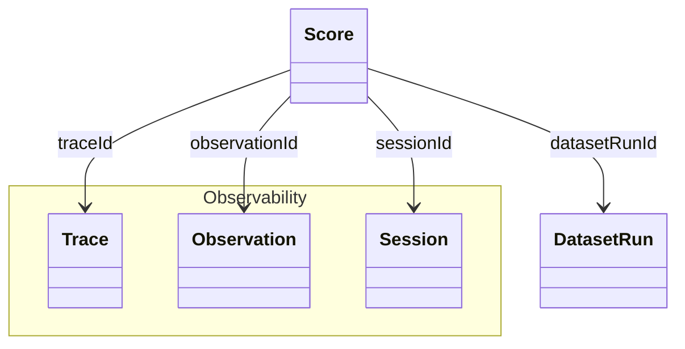
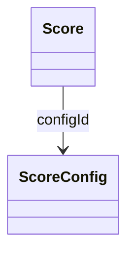

# Scores Data Model

In Langfuse `Scores` are the data object to store evaluations. They are a flexible object that is used across all [evaluation methods](/docs/evaluation/overview) to assign evaluation scores to different objects across the Langfuse platform. High level you can think of Scores as the output of an evaluation method. 

## Scores [#scores]

`Scores` serve as objects for storing evaluation metrics in Langfuse. Here are its core properties:

- Scores reference a `Trace`, `Observation`, `Session`, or `DatasetRun`
- Each Score references **exactly one** of the above objects.
- Scores are either **numeric**, **categorical**, or **boolean**.
- Scores can **optionally be linked to a `ScoreConfig`** to ensure they comply with a specific schema.

### Common Use

| Level         | Description                                                                                       |
|--------------|---------------------------------------------------------------------------------------------------|
| Trace        | Used for evaluation of a single interaction. (most common)                                        |
| Observation  | Used for evaluation of a single observation below the trace level.                                |
| Session      | Used for comprehensive evaluation of outputs across multiple interactions.     |
| Dataset Run  | Used for performance scores of a Dataset Run. [See Dataset Runs for context.](/docs/datasets/dataset-runs/data-model) |

### Score object

| Attribute       | Type   | Description                                                                                                                                                                                               |
| --------------- | ------ | --------------------------------------------------------------------------------------------------------------------------------------------------------------------------------------------------------- |
| `name`          | string | Name of the score, e.g. user_feedback, hallucination_eval                                                                                                                                                 |
| `value`         | number | Optional: Numeric value of the score. Always defined for numeric and boolean scores. Optional for categorical scores.                                                                                     |
| `stringValue`   | string | Optional: String equivalent of the score's numeric value for boolean and categorical data types. Automatically set for categorical scores based on the config if the `configId` is provided.              |
| `traceId`       | string | Required: Id of the trace the score relates to                                                                                                                                                            |
| `observationId` | string | Optional: Observation (e.g. LLM call) the score relates to                                                                                                                                                |
| `sessionId`     | string | Optional: Id of the session the score relates to                                                                                                                                                          |
| `datasetRunId`  | string | Optional: Id of the dataset run the score relates to                                                                                                                                                      |
| `comment`       | string | Optional: Evaluation comment, commonly used for user feedback, eval output or internal notes                                                                                                              |
| `id`            | string | Unique identifier of the score. Auto-generated by SDKs. Optionally can also be used as an indempotency key to update scores.                                                                              |
| `source`        | string | Automatically set based on the souce of the score. Can be either `API`, `EVAL`, or `ANNOTATION`                                                                                                           |
| `dataType`      | string | Automatically set based on the config data type when the `configId` is provided. Otherwise can be defined manually as `NUMERIC`, `CATEGORICAL` or `BOOLEAN`                                               |
| `configId`      | string | Optional: Score config id to ensure that the score follows a specific schema. Can be defined in the Langfuse UI or via API. When provided the score's `dataType` is automatically set based on the config |

## Score Config

Score configs are used to ensure that your scores follow a specific schema. 
Using score configs allows you to standardize your scoring schema across your team and ensure that scores are consistent and comparable for future analysis.

You can define a `scoreConfig` in the Langfuse UI or via our API. Configs are immutable but can be archived (and restored anytime). 

A score config includes:

- **Score name**
- **Data type:** `NUMERIC`, `CATEGORICAL`, `BOOLEAN`
- **Constraints on score value range** (Min/Max for numerical, Custom categories for categorical data types

### Score Config object

| Attribute     | Type    | Description                                                                                     |
| ------------- | ------- | ----------------------------------------------------------------------------------------------- |
| `id`          | string  | Unique identifier of the score config.                                                          |
| `name`        | string  | Name of the score config, e.g. user_feedback, hallucination_eval                                |
| `dataType`    | string  | Can be either `NUMERIC`, `CATEGORICAL` or `BOOLEAN`                                             |
| `isArchived`  | boolean | Whether the score config is archived. Defaults to false                                         |
| `minValue`    | number  | Optional: Sets minimum value for numerical scores. If not set, the minimum value defaults to -∞ |
| `maxValue`    | number  | Optional: Sets maximum value for numerical scores. If not set, the maximum value defaults to +∞ |
| `categories`  | list    | Optional: Defines categories for categorical scores. List of objects with label value pairs     |
| `description` | string  | Optional: Provides further description of the score configuration     
