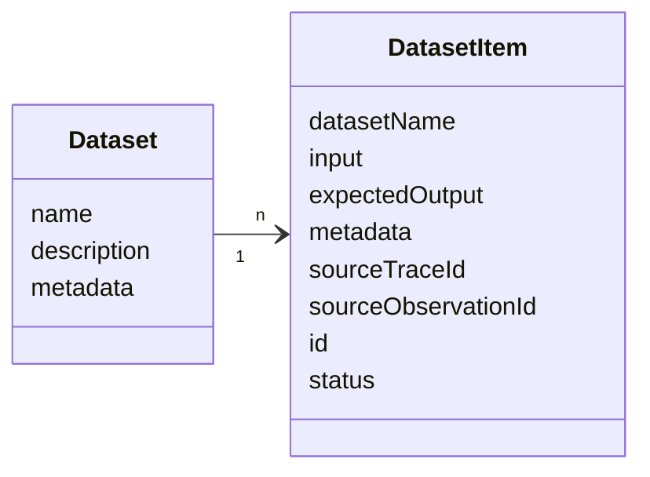
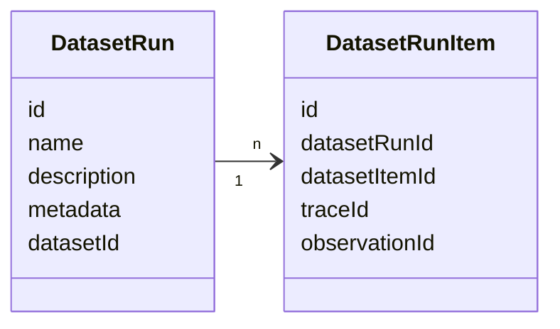
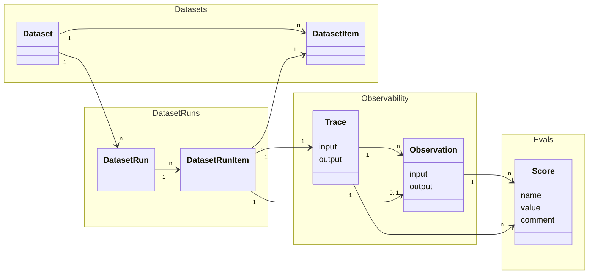

# Experiments Data Model

## Targeting Langfuse datasets

This section describes the data model of experiments on Langfuse datasets. For detailed reference please refer to the [API Reference](https://api.reference.langfuse.com).

### Datasets

Datasets are a collection of inputs and, optionally, expected outputs that can be used during Dataset runs.

`Dataset`s are a collection of `DatasetItem`s.

#### Dataset object

| Attribute                 | Type   | Required | Description                                 |
| ------------------------- | ------ | -------- | ------------------------------------------- |
| `id`                      | string | Yes      | Unique identifier for the dataset           |
| `name`                    | string | Yes      | Name of the dataset                         |
| `description`             | string | No       | Description of the dataset                  |
| `metadata`                | object | No       | Additional metadata for the dataset         |
| `remoteExperimentUrl`     | string | No       | Webhook endpoint for triggering experiments |
| `remoteExperimentPayload` | object | No       | Payload for triggering experiments          |

#### DatasetItem object

| Attribute             | Type          | Required | Description                                                                                                                                                 |
| --------------------- | ------------- | -------- | ----------------------------------------------------------------------------------------------------------------------------------------------------------- |
| `id`                  | string        | Yes      | Unique identifier for the dataset item. Dataset items are upserted on their id. Id needs to be unique (project-level) and cannot be reused across datasets. |
| `datasetId`           | string        | Yes      | ID of the dataset this item belongs to                                                                                                                      |
| `input`               | object        | No       | Input data for the dataset item                                                                                                                             |
| `expectedOutput`      | object        | No       | Expected output data for the dataset item                                                                                                                   |
| `metadata`            | object        | No       | Additional metadata for the dataset item                                                                                                                    |
| `sourceTraceId`       | string        | No       | ID of the source trace to link this dataset item to                                                                                                         |
| `sourceObservationId` | string        | No       | ID of the source observation to link this dataset item to                                                                                                   |
| `status`              | DatasetStatus | No       | Status of the dataset item. Defaults to ACTIVE for newly created items. Possible values: `ACTIVE`, `ARCHIVED`                                               |

### DatasetRun

Dataset runs are used to run a dataset through your LLM application and optionally apply evaluation methods to the results.

 

#### DatasetRun object

| Attribute     | Type   | Required | Description                             |
| ------------- | ------ | -------- | --------------------------------------- |
| `id`          | string | Yes      | Unique identifier for the dataset run   |
| `name`        | string | Yes      | Name of the dataset run                 |
| `description` | string | No       | Description of the dataset run          |
| `metadata`    | object | No       | Additional metadata for the dataset run |
| `datasetId`   | string | Yes      | ID of the dataset this run belongs to   |

#### DatasetRunItem object

| Attribute       | Type   | Required | Description                                |
| --------------- | ------ | -------- | ------------------------------------------ |
| `id`            | string | Yes      | Unique identifier for the dataset run item |
| `datasetRunId`  | string | Yes      | ID of the dataset run this item belongs to |
| `datasetItemId` | string | Yes      | ID of the dataset item to link to this run |
| `traceId`       | string | Yes      | ID of the trace to link to this run        |
| `observationId` | string | No       | ID of the observation to link to this run  |

<Callout type="info">
  Most of the time, we recommend that DatasetRunItems reference TraceIDs
  directly. The reference to ObservationID exists for backwards compatibility
  with older SDK versions.
</Callout>

### End to end data relations

DatasetRun can combine a few Langfuse objects:

- `DatasetRuns` are created by looping through all or selected `DatasetItem`s of a `Dataset` with your LLM application.
- For each `DatasetItem` passed into the LLM application as an Input a `DatasetRunItem` & a `Trace` are created.
- Optionally `Score`s can be added to the `Trace`s to evaluate the output of the LLM application during the `DatasetRun`.

 

## Targeting local datasets

Currently, if an [Experiment via SDK](/docs/evaluation/experiments/experiments-via-sdk) is used to run experiments on local datasets, only traces are created in Langfuse - no dataset runs are generated. Each task execution creates an individual trace for observability and debugging.

<Callout type="info">

We have improvements on our roadmap to support similar functionality such as run overviews, comparison views, and more for experiments on local datasets as for Langfuse datasets.

</Callout>
