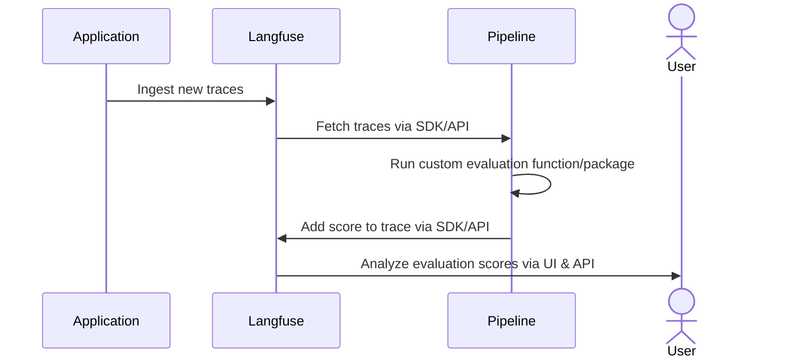

# Custom Scores via API/SDKs

{/* todo: simplify this a lot */}

{/* todo: add api focused instructions */}

Langfuse gives you full flexibility to ingest custom `Scores` [(see Evaluation Data Model)](/docs/evaluation/data-model) via the Langfuse SDKs or API. 

The scoring workflow allows you to run custom quality checks on the output of your workflows at runtime, or to run custom human evaluation workflows.

Common use cases:

- [**Collecting user feedback**](/docs/evaluation/features/evaluation-methods/user-feedback): collect feedback from your users on application quality or performance. Can be captured in the frontend via our Browser SDK.
- [**Custom evaluation data pipeline**](/docs/evaluation/features/evaluation-methods/external-evaluation-pipelines): continuously monitor the quality by fetching traces from Langfuse, running custom evaluations, and ingesting scores back into Langfuse.
- [**Guardrails and security checks**](/docs/evaluation/features/security-and-guardrails): check if output contains a certain keyword, adheres to a specified structure/format or if the output is longer than a certain length.
- **Custom internal workflow tooling**: build custom internal tooling that helps you manage human-in-the-loop workflows. Ingest scores back into Langfuse, optionally following your custom schema by referencing a config.
- **Custom run-time evaluations**: e.g. track whether the generated SQL code actually worked, or if the structured output was valid JSON.

## How to add scores

You can add scores via the Langfuse SDKs or API. Scores can take one of three data types:

- **Numeric**: used to record scores that fall into a numerical range
- **Categorical**: used to record string score values
- **Boolean**: used to record binary score values

### SDK ingestion examples by data type

<Tabs items={["Numeric", "Categorical", "Boolean"]}>
<Tab>
Numeric score values must be provided as float.

SDK examples

<Tabs items={["Python SDK v3", "Python SDK v2", "JS/TS SDK"]}>
<Tab>

```python
from langfuse import get_client
langfuse = get_client()

# Method 1: Score via low-level method
langfuse.create_score(
    name="correctness",
    value=0.9,
    trace_id="trace_id_here",
    observation_id="observation_id_here", # optional
    data_type="NUMERIC", # optional, inferred if not provided
    comment="Factually correct", # optional
)

# Method 2: Score current span/generation (within context)
with langfuse.start_as_current_span(name="my-operation") as span:
    # Score the current span
    span.score(
        name="correctness",
        value=0.9,
        data_type="NUMERIC",
        comment="Factually correct"
    )

    # Score the trace
    span.score_trace(
        name="overall_quality",
        value=0.95,
        data_type="NUMERIC"
    )


# Method 3: Score via the current context
with langfuse.start_as_current_span(name="my-operation"):
    # Score the current span
    langfuse.score_current_span(
        name="correctness",
        value=0.9,
        data_type="NUMERIC",
        comment="Factually correct"
    )

    # Score the trace
    langfuse.score_current_trace(
        name="overall_quality",
        value=0.95,
        data_type="NUMERIC"
    )
```

</Tab>
<Tab>

```python
langfuse.score(
    id="unique_id", # optional, can be used as an indempotency key to update the score subsequently
    trace_id=message.trace_id,
    observation_id=message.generation_id, # optional
    name="correctness",
    value=0.9,
    data_type="NUMERIC", # optional, inferred if not provided
    comment="Factually correct", # optional
)
```

</Tab>
<Tab>

```ts
await langfuse.score({
  id: "unique_id", // optional, can be used as an indempotency key to update the score subsequently
  traceId: message.traceId,
  observationId: message.generationId, // optional
  name: "correctness",
  value: 0.9,
  dataType: "NUMERIC", // optional, inferred if not provided
  comment: "Factually correct", // optional
});
```

</Tab>
</Tabs>

</Tab>

<Tab>
Categorical score values must be provided as strings.

SDK examples

<Tabs items={["Python SDK v3", "Python SDK v2", "JS/TS SDK"]}>
<Tab>

```python
from langfuse import get_client
langfuse = get_client()

# Method 1: Score via low-level method
langfuse.create_score(
    name="accuracy",
    value="partially correct",
    trace_id="trace_id_here",
    observation_id="observation_id_here", # optional
    data_type="CATEGORICAL", # optional, inferred if not provided
    comment="Some factual errors", # optional
)

# Method 2: Score current span/generation (within context)
with langfuse.start_as_current_span(name="my-operation") as span:
    # Score the current span
    span.score(
        name="accuracy",
        value="partially correct",
        data_type="CATEGORICAL",
        comment="Some factual errors"
    )

    # Score the trace
    span.score_trace(
        name="overall_quality",
        value="partially correct",
        data_type="CATEGORICAL"
    )

# Method 3: Score via the current context
with langfuse.start_as_current_span(name="my-operation"):
    # Score the current span
    langfuse.score_current_span(
        name="accuracy",
        value="partially correct",
        data_type="CATEGORICAL",
        comment="Some factual errors"
    )

    # Score the trace
    langfuse.score_current_trace(
        name="overall_quality",
        value="partially correct",
        data_type="CATEGORICAL"
    )
```

</Tab>
<Tab>

```python
langfuse.score(
    id="unique_id", # optional, can be used as an idempotency key to update the score subsequently
    trace_id=message.trace_id,
    observation_id=message.generation_id, # optional
    name="accuracy",
    value="partially correct",
    data_type="CATEGORICAL", # optional, inferred if not provided
    comment="Factually correct", # optional
)
```

</Tab>
<Tab>

```ts
await langfuse.score({
  id: "unique_id", // optional, can be used as an indempotency key to update the score subsequently
  traceId: message.traceId,
  observationId: message.generationId, // optional
  name: "accuracy",
  value: "partially correct",
  dataType: "CATEGORICAL", // optional, inferred if not provided
  comment: "Factually correct", // optional
});
```

</Tab>
</Tabs>

</Tab>

<Tab>
Boolean scores must be provided as a float. The value's string equivalent will be automatically populated and is accessible on read. See [API reference](/docs/api) for more details on POST/GET scores endpoints.

SDK examples

<Tabs items={["Python SDK v3", "Python SDK v2", "JS/TS SDK"]}>
<Tab>

```python
from langfuse import get_client
langfuse = get_client()

# Method 1: Score via low-level method
langfuse.create_score(
    name="helpfulness",
    value=0, # 0 or 1
    trace_id="trace_id_here",
    observation_id="observation_id_here", # optional
    data_type="BOOLEAN", # required, numeric values without data type would be inferred as NUMERIC
    comment="Incorrect answer", # optional
)

# Method 2: Score current span/generation (within context)
with langfuse.start_as_current_span(name="my-operation") as span:
    # Score the current span
    span.score(
        name="helpfulness",
        value=1, # 0 or 1
        data_type="BOOLEAN",
        comment="Very helpful response"
    )

    # Score the trace
    span.score_trace(
        name="overall_quality",
        value=1, # 0 or 1
        data_type="BOOLEAN"
    )
# Method 3: Score via the current context
with langfuse.start_as_current_span(name="my-operation"):
    # Score the current span
    langfuse.score_current_span(
        name="helpfulness",
        value=1, # 0 or 1
        data_type="BOOLEAN",
        comment="Very helpful response"
    )

    # Score the trace
    langfuse.score_current_trace(
        name="overall_quality",
        value=1, # 0 or 1
        data_type="BOOLEAN"
    )
```

</Tab>
<Tab>

```python
langfuse.score(
    id="unique_id", # optional, can be used as an indempotency key to update the score subsequently
    trace_id=message.trace_id,
    observation_id=message.generation_id, # optional
    name="helpfulness",
    value=0, # 0 or 1
    data_type="BOOLEAN", # required, numeric values without data type would be inferred as NUMERIC
    comment="Incorrect answer", # optional
)
```

</Tab>
<Tab>

```ts
await langfuse.score({
  id: "unique_id", // optional, can be used as an indempotency key to update the score subsequently
  traceId: message.traceId,
  observationId: message.generationId, // optional
  name: "helpfulness",
  value: 0, // 0 or 1
  dataType: "BOOLEAN", // required, numeric values without data type would be inferred as NUMERIC
  comment: "Incorrect answer", // optional
});
```

</Tab>
</Tabs>

</Tab>
→ More details in [Python SDK docs](/docs/sdk/python) and [JS/TS SDK docs](/docs/sdk/typescript/guide#score). See [API reference](/docs/api) for more details on POST/GET score configs endpoints.

</Tabs>

### Update an existing score

When creating a score, you can provide an optional `id` parameter. This will update the score if it already exists within your project.

If you want to update a score without needing to fetch the list of existing scores from Langfuse, you can set your own `id` parameter when initially creating the score.

### Prevent duplicated scores via an idempotency key

By default, Langfuse allows for multiple scores of the same `name` on the same trace. This is useful if you'd like to track the evolution of a score over time or if e.g. you've received multiple user feedback scores on the same trace.

In some cases, you want to prevent this behavior or update an existing score. This can be achieved by creating an idempotency key on the score and add this as an `id` when creating the score, e.g. `<trace_id>-<score_name>`.

### How to ensure your scores comply with a certain schema

Given your scores are required to follow a specific schema such as data range, name or data type, you can define and reference a [score config](/docs/evaluation/features/evaluation-methods/custom-scores#creating-score-config-object-in-langfuse) on your scores. 

Configs are helpful when you want to standardize your scores for future analysis. They can be defined in the Langfuse UI or via our API.

Whenever you provide a config, the score data will be validated against the config. The following rules apply:

- **Score Name**: Must equal the config's name
- **Score Data Type**: When provided, must match the config's data type
- **Score Value**: Must match the config's data type and be within the config's value range:
  - **Numeric**: Value must be within the min and max values defined in the config (if provided, min and max are optional and otherwise are assumed as -∞ and +∞ respectively)
  - **Categorical**: Value must map to one of the categories defined in the config
  - **Boolean**: Value must equal `0` or `1`

#### Score ingestion referencing configs via SDK

<Tabs items={["Numeric Scores", "Categorical Scores", "Boolean Scores"]}>

<Tab>
When ingesting numeric scores, you can provide the value as a float. If you provide a configId, the score value will be validated against the config's numeric range, which might be defined by a minimum and/or maximum value.

<Tabs items={["Python SDK v3", "Python SDK v2", "JS/TS SDK"]}>
<Tab>

```python
from langfuse import get_client
langfuse = get_client()

# Method 1: Score via low-level method
langfuse.create_score(
    trace_id="trace_id_here",
    observation_id="observation_id_here", # optional
    name="accuracy",
    value=0.9,
    comment="Factually correct", # optional
    score_id="unique_id", # optional, can be used as an indempotency key to update the score subsequently
    config_id="78545-6565-3453654-43543", # optional, to ensure that the score follows a specific min/max value range
    data_type="NUMERIC" # optional, possibly inferred
)

# Method 2: Score within context
with langfuse.start_as_current_span(name="my-operation") as span:
    span.score(
        name="accuracy",
        value=0.9,
        comment="Factually correct",
        config_id="78545-6565-3453654-43543",
        data_type="NUMERIC"
    )
```

</Tab>
<Tab>

```python
langfuse.score(
    trace_id=message.trace_id,
    observation_id=message.generation_id, # optional
    name="accuracy",
    value=0.9,
    comment="Factually correct", # optional
    id="unique_id" # optional, can be used as an indempotency key to update the score subsequently
    config_id="78545-6565-3453654-43543" # optional, to ensure that the score follows a specific min/max value range
    data_type="NUMERIC" # optional, possibly inferred
)
```

</Tab>
<Tab>

```ts
await langfuse.score({
  traceId: message.traceId,
  observationId: message.generationId, // optional
  name: "accuracy",
  value: 0.9,
  comment: "Factually correct", // optional
  id: "unique_id", // optional, can be used as an indempotency key to update the score subsequently
  configId: "78545-6565-3453654-43543", // optional, to ensure that the score follows a specific min/max value range
  dataType: "NUMERIC", // optional, possibly inferred
});
```

</Tab>
</Tabs>

</Tab>

<Tab>
Categorical scores are used to evaluate data that falls into specific categories. When ingesting categorical scores, you can provide the value as a string. If you provide a configId, the score value will be validated against the config's categories.

<Tabs items={["Python SDK v3", "Python SDK v2", "JS/TS SDK"]}>
<Tab>

```python
from langfuse import get_client
langfuse = get_client()

# Method 1: Score via low-level method
langfuse.create_score(
    trace_id="trace_id_here",
    observation_id="observation_id_here", # optional
    name="correctness",
    value="correct",
    comment="Factually correct", # optional
    score_id="unique_id", # optional, can be used as an indempotency key to update the score subsequently
    config_id="12345-6565-3453654-43543", # optional, to ensure that the score maps to a specific category defined in a score config
    data_type="CATEGORICAL" # optional, possibly inferred
)

# Method 2: Score within context
with langfuse.start_as_current_span(name="my-operation") as span:
    span.score(
        name="correctness",
        value="correct",
        comment="Factually correct",
        config_id="12345-6565-3453654-43543",
        data_type="CATEGORICAL"
    )
```

</Tab>
<Tab>

```python
langfuse.score(
    trace_id=message.trace_id,
    observation_id=message.generation_id, # optional
    name="correctness",
    value="correct",
    comment="Factually correct", # optional
    id="unique_id" # optional, can be used as an indempotency key to update the score subsequently
    config_id="12345-6565-3453654-43543" # optional, to ensure that the score maps to a specific category defined in a score config
    data_type="CATEGORICAL" # optional, possibly inferred
)
```

</Tab>
<Tab>

```ts
await langfuse.score({
  traceId: message.traceId,
  observationId: message.generationId, // optional
  name: "correctness",
  value: "correct",
  comment: "Factually correct", // optional
  id: "unique_id", // optional, can be used as an indempotency key to update the score subsequently
  configId: "12345-6565-3453654-43543", // optional, to ensure that a score maps to a specific category defined in a score config
  dataType: "CATEGORICAL", // optional, possibly inferred
});
```

</Tab>
</Tabs>

</Tab>
<Tab>
When ingesting boolean scores, you can provide the value as a float. If you provide a configId, the score's name and config's name must match as well as their data types.

<Tabs items={["Python SDK v3", "Python SDK v2", "JS/TS SDK"]}>
<Tab>

```python
from langfuse import get_client
langfuse = get_client()

# Method 1: Score via low-level method
langfuse.create_score(
    trace_id="trace_id_here",
    observation_id="observation_id_here", # optional
    name="helpfulness",
    value=1,
    comment="Factually correct", # optional
    score_id="unique_id", # optional, can be used as an indempotency key to update the score subsequently
    config_id="93547-6565-3453654-43543", # optional, can be used to infer the score data type and validate the score value
    data_type="BOOLEAN" # optional, possibly inferred
)

# Method 2: Score within context
with langfuse.start_as_current_span(name="my-operation") as span:
    span.score(
        name="helpfulness",
        value=1,
        comment="Factually correct",
        config_id="93547-6565-3453654-43543",
        data_type="BOOLEAN"
    )
```

</Tab>
<Tab>

```python
langfuse.score(
    trace_id=message.trace_id,
    observation_id=message.generation_id, # optional
    name="helpfulness",
    value=1,
    comment="Factually correct", # optional
    id="unique_id" # optional, can be used as an indempotency key to update the score subsequently
    config_id="93547-6565-3453654-43543" # optional, can be used to infer the score data type and validate the score value
    data_type="BOOLEAN" # optional, possibly inferred
)
```

</Tab>
<Tab>

```ts
await langfuse.score({
  traceId: message.traceId,
  observationId: message.generationId, // optional
  name: "helpfulness",
  value: 1,
  comment: "Factually correct", // optional
  id: "unique_id", // optional, can be used as an indempotency key to update the score subsequently
  configId: "93547-6565-3453654-43543", // optional, can be used to infer the score data type and validate the score value
  dataType: "BOOLEAN", // optional, possibly inferred
});
```

</Tab>
</Tabs>

</Tab>
→ More details in [Python SDK docs](/docs/sdk/python) and [JS/TS SDK docs](/docs/sdk/typescript/guide#score). See [API reference](/docs/api) for more details on POST/GET score configs endpoints.
</Tabs>

#### Creating Score Config object in Langfuse

A `score config` includes the desired score name, data type, and constraints on score value range such as min and max values for numerical data types and custom categories for categorical data types. See [API reference](/docs/api) for more details on POST/GET score configs endpoints. Configs are crucial to ensure that scores comply with a specific schema therefore standardizing them for future analysis.

| Attribute     | Type    | Description                                                                                     |
| ------------- | ------- | ----------------------------------------------------------------------------------------------- |
| `id`          | string  | Unique identifier of the score config.                                                          |
| `name`        | string  | Name of the score config, e.g. user_feedback, hallucination_eval                                |
| `dataType`    | string  | Can be either `NUMERIC`, `CATEGORICAL` or `BOOLEAN`                                             |
| `isArchived`  | boolean | Whether the score config is archived. Defaults to false                                         |
| `minValue`    | number  | Optional: Sets minimum value for numerical scores. If not set, the minimum value defaults to -∞ |
| `maxValue`    | number  | Optional: Sets maximum value for numerical scores. If not set, the maximum value defaults to +∞ |
| `categories`  | list    | Optional: Defines categories for categorical scores. List of objects with label value pairs     |
| `description` | string  | Optional: Provides further description of the score configuration                               |

### Detailed Score Ingestion Examples

**Certain score properties might be inferred based on your input**. If you don't provide a score data type it will always be inferred. See tables below for details. 

For boolean and categorical scores, we will provide the score value in both numerical and string format where possible. The score value format that is not provided as input, i.e. the translated value is referred to as the inferred value in the tables below. On read for boolean scores both numerical and string representations of the score value will be returned, e.g. both 1 and True. 

For categorical scores, the string representation is always provided and a numerical mapping of the category will be produced only if a score config was provided.

<Tabs items={["Numeric Scores", "Categorical Scores", "Boolean Scores"]}>
<Tab> 
For example, let's assume you'd like to ingest a numeric score to measure **accuracy**. We have included a table of possible score ingestion scenarios below.

| Value   | Data Type | Config Id | Description                                                 | Inferred Data Type | Valid                            |
| ------- | --------- | --------- | ----------------------------------------------------------- | ------------------ | -------------------------------- |
| `0.9`   | `Null`    | `Null`    | Data type is inferred                                       | `NUMERIC`          | Yes                              |
| `0.9`   | `NUMERIC` | `Null`    | No properties inferred                                      |                    | Yes                              |
| `depth` | `NUMERIC` | `Null`    | Error: data type of value does not match provided data type |                    | No                               |
| `0.9`   | `NUMERIC` | `78545`   | No properties inferred                                      |                    | Conditional on config validation |
| `0.9`   | `Null`    | `78545`   | Data type inferred                                          | `NUMERIC`          | Conditional on config validation |
| `depth` | `NUMERIC` | `78545`   | Error: data type of value does not match provided data type |                    | No                               |

</Tab>
<Tab>
For example, let's assume you'd like to ingest a categorical score to measure **correctness**. We have included a table of possible score ingestion scenarios below.

| Value     | Data Type     | Config Id | Description                                                 | Inferred Data Type | Inferred Value representation       | Valid                            |
| --------- | ------------- | --------- | ----------------------------------------------------------- | ------------------ | ----------------------------------- | -------------------------------- |
| `correct` | `Null`        | `Null`    | Data type is inferred                                       | `CATEGORICAL`      |                                     | Yes                              |
| `correct` | `CATEGORICAL` | `Null`    | No properties inferred                                      |                    |                                     | Yes                              |
| `1`       | `CATEGORICAL` | `Null`    | Error: data type of value does not match provided data type |                    |                                     | No                               |
| `correct` | `CATEGORICAL` | `12345`   | Numeric value inferred                                      |                    | `4` numeric config category mapping | Conditional on config validation |
| `correct` | `NULL`        | `12345`   | Data type inferred                                          | `CATEGORICAL`      |                                     | Conditional on config validation |
| `1`       | `CATEGORICAL` | `12345`   | Error: data type of value does not match provided data type |                    |                                     | No                               |

</Tab>
<Tab>
For example, let's assume you'd like to ingest a boolean score to measure **helpfulness**. We have included a table of possible score ingestion scenarios below.

| Value   | Data Type | Config Id | Description                                                 | Inferred Data Type | Inferred Value representation | Valid                            |
| ------- | --------- | --------- | ----------------------------------------------------------- | ------------------ | ----------------------------- | -------------------------------- |
| `1`     | `BOOLEAN` | `Null`    | Value's string equivalent inferred                          |                    | `True`                        | Yes                              |
| `true`  | `BOOLEAN` | `Null`    | Error: data type of value does not match provided data type |                    |                               | No                               |
| `3`     | `BOOLEAN` | `Null`    | Error: boolean data type expects `0` or `1` as input value  |                    |                               | No                               |
| `0.9`   | `Null`    | `93547`   | Data type and value's string equivalent inferred            | `BOOLEAN`          | `True`                        | Conditional on config validation |
| `depth` | `BOOLEAN` | `93547`   | Error: data type of value does not match provided data type |                    |                               | No                               |

</Tab>
</Tabs>

### Data pipeline example



You can run custom evaluations on data in Langfuse by fetching traces from Langfuse (e.g. via the Python SDK) and then adding evaluation results as `Scores` [(see Evaluation Data Model)](/docs/evaluation/data-model) back to the traces in Langfuse.

The example notebook is a good template to get started with building your own evaluation pipeline.

import { FileCode, BookOpen } from "lucide-react";

<Cards num={1}>
  <Card
    title="Example: External Evaluation Pipeline"
    href="/docs/scores/external-evaluation-pipelines"
    icon={<FileCode />}
  />
</Cards>
