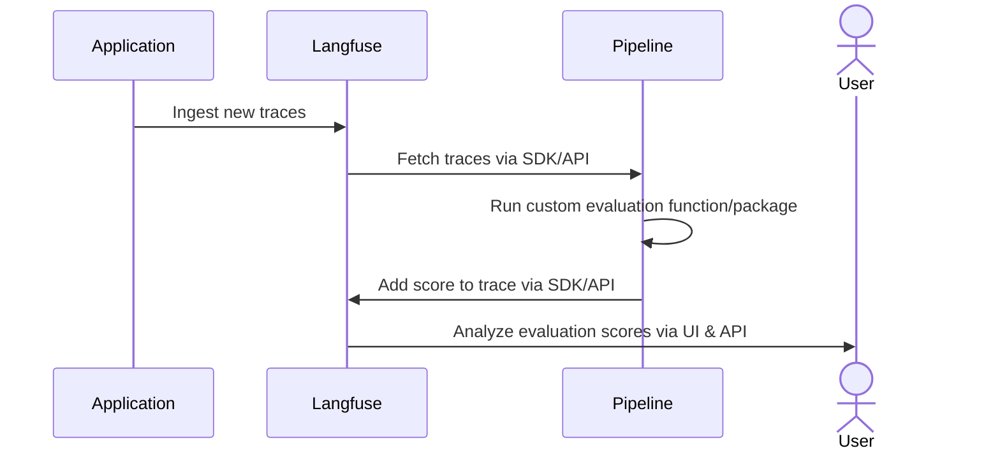

# Evaluate Langfuse LLM Traces with an External Evaluation Pipeline

This cookbook explains how to build an external evaluation pipeline to measure the performance of your production LLM application using Langfuse.

As a rule of thumb, we encourage you to check first if the [evaluations in the Langfuse UI](https://langfuse.com/docs/scores/model-based-evals) cover your use case. If your needs go beyond these, you can still implement in Langfuse custom evaluation templates without code.

Consider implementing an external evaluation pipeline if you need:

- More control over **when** traces get evaluated. You could schedule the pipeline to run at specific times or responding to event-based triggers like Webhooks.
- Greater flexibility with your custom evaluations, when your needs go beyond what’s possible with the Langfuse UI
- Version control for your custom evaluations
- The ability to evaluate data using existing evaluation frameworks

If your use case meets any of this situations, let’s go ahead and implement your first external evaluation pipeline!

<iframe
  width="100%"
  className="aspect-[3230/2160] rounded mt-10"
  src="https://www.youtube-nocookie.com/embed/rHfME8KDmIw?si=V4m8smxZ219AKmOU"
  title="YouTube video player"
  frameborder="0"
  allow="accelerometer; autoplay; clipboard-write; encrypted-media; gyroscope; picture-in-picture; web-share"
  referrerpolicy="strict-origin-when-cross-origin"
  allowFullScreen
></iframe>

---

By the end of this cookbook, you’ll be able to:

- Create a synthetic dataset to test your models.
- Use the Langfuse client to gather and filter traces of previous model runs
- Evaluate these traces offline and incrementally
- Add scores to existing Langfuse traces


Conceptually, we will implement the following architecture:



---

**Note**: While we’re using a Jupyter notebook for this cookbook, in production you'd use your preferred orchestration tool. Just make sure to extract the code into a .py file and ensure all dependencies are available at runtime.


## (Prep-work) Loading synthetic traces to Langfuse

In this demo, we’ll build a mock application: a science communicator LLM that explains any topic in an engaging and approachable way.

Since we don’t have real user data, our first step is to create a synthetic dataset. We’ll generate a variety of potential questions that real users might ask. While this is a great way to kickstart your LLM development, collecting real user queries as soon as possible is invaluable.

You can get your Langfuse API keys [here](https://cloud.langfuse.com/) and OpenAI API key [here](https://platform.openai.com/api-keys)

_**Note:** This notebook utilizes the [Langfuse OTel Python SDK v3](https://langfuse.com/docs/sdk/python/sdk-v3). For users of [Python SDK v2](https://langfuse.com/docs/sdk/python/decorators), please refer to [our legacy notebook](https://github.com/langfuse/langfuse-docs/blob/366ec9395851da998d390eac4ab8c4dd2e985054/cookbook/example_external_evaluation_pipelines.ipynb)._


```python
%pip install langfuse openai deepeval --upgrade
```


```python
import os

# Get keys for your project from the project settings page: https://cloud.langfuse.com
os.environ["LANGFUSE_PUBLIC_KEY"] = "pk-lf-..." 
os.environ["LANGFUSE_SECRET_KEY"] = "sk-lf-..." 
os.environ["LANGFUSE_HOST"] = "https://cloud.langfuse.com" # 🇪🇺 EU region
# os.environ["LANGFUSE_HOST"] = "https://us.cloud.langfuse.com" # 🇺🇸 US region

# Your openai key
os.environ["OPENAI_API_KEY"] = "sk-proj-..."
```

Let's go ahead and generate a list of topic suggestions that we can later query to our application.


```python
import openai

topic_suggestion = """ You're a world-class journalist, specialized
in figuring out which are the topics that excite people the most.
Your task is to give me 50 suggestions for pop-science topics that the general
public would love to read about. Make sure topics don't repeat.
The output must be a comma-separated list. Generate the list and NOTHING else.
The use of numbers is FORBIDDEN.
"""

output = openai.chat.completions.create(
    messages=[
        {
            "role": "user",
            "content": topic_suggestion
        }
    ],
    model="gpt-4o",

    temperature=1
).choices[0].message.content

topics = [item.strip() for item in output.split(",")]
for topic in topics:
    print(topic)
```

    The science of sleep and its effects on health
    How emotions are affected by music
    The impact of microplastics on marine life
    Exploring the quantum world
    The science behind mindfulness and mental health
    How climate change is affecting weather patterns
    The future of space travel and colonization
    The role of genetics in human behavior
    The mysteries of dark matter and dark energy
    Understanding the science of addiction
    The role of biodiversity in ecosystem health
    The brain's ability to change: neuroplasticity
    The science of superfoods: fact vs fiction
    How CRISPR is changing genetic engineering
    Exploring the ocean's deepest trenches
    The rise of AI and machine learning
    How vaccines work and their importance
    The mysteries of human consciousness
    The future of renewable energy
    How plants communicate with each other
    The science of aging and longevity
    The impact of social media on mental health
    The role of gut bacteria in overall health
    The science behind climate change denial
    The search for extraterrestrial life
    How memories are formed and recalled
    The physics of black holes
    The rise of sustainable fashion
    The science of empathy and altruism
    The effects of meditation on the brain
    The role of sleep in memory consolidation
    The science of pheromones and attraction
    How technology is transforming education
    The biology of resilience and stress management
    The ethics of gene editing
    The impact of deforestation on the environment
    The future of personalized medicine
    How technology is changing agriculture
    The science of tsunamis and earthquakes
    The chemistry behind culinary flavors
    Nanotechnology and its impact on medicine
    How dolphins communicate and their intelligence
    The role of emotions in decision-making
    Exploring the limits of human endurance
    The impact of urbanization on wildlife
    How the brain processes fear
    Space dust and its impact on the solar system
    The evolutionary mysteries of the human hand
    How virtual reality is changing therapy
    The physics behind time travel theories.


Great job! You now have a list of interesting topics users might ask about. Next, let's have our science communicator LLM handle those queries and add the results to Langfuse. To keep things simple, we’ll use Langfuse’s `@observe()` decorator. This decorator automatically monitors all LLM calls (generations) nested in the function. We’re also using the `langfuse` class to label and tag the traces, making it easier to fetch them later.


```python
from langfuse import observe, get_client
langfuse = get_client()

prompt_template = """
You're an expert science communicator, able to explain complex topics in an
approachable manner. Your task is to respond to the questions of users in an
engaging, informative, and friendly way. Stay factual, and refrain from using
jargon. Your answer should be 4 sentences at max.
Remember, keep it ENGAGING and FUN!

Question: {question}
"""

@observe()
def explain_concept(topic):
    langfuse.update_current_trace(
        name=f"Explanation '{topic}'",
        tags=["ext_eval_pipelines"]
    )
    prompt = prompt_template.format(question=topic)


    return openai.chat.completions.create(
        messages=[
            {
                "role": "user",
                "content": prompt,
            }
        ],
        model="gpt-4o-mini",

        temperature=0.6
    ).choices[0].message.content


for topic in topics:
    print(f"Input: Please explain to me {topic.lower()}")
    print(f"Answer: {explain_concept(topic)} \n")
```

    Input: Please explain to me the science of sleep and its effects on health
    Answer: Sleep is like a magical reset button for our bodies and minds! When we snooze, our bodies repair cells, strengthen our immune system, and even boost our mood. Lack of sleep can lead to problems like poor concentration and increased stress, while good sleep helps us think clearly and feel energized. So, snuggle up and enjoy those zzz's – they're essential for a happy, healthy life! 
    
    Input: Please explain to me how emotions are affected by music
    Answer: Music has a magical way of tapping into our emotions! When we listen to a song, it can evoke feelings of joy, sadness, nostalgia, or excitement, often because of its rhythm, melody, and lyrics. Our brains release chemicals like dopamine when we hear music we love, making us feel good! So next time you’re feeling a certain way, turn on a tune and let it amplify your mood! 🎶✨ 
    
    Input: Please explain to me the impact of microplastics on marine life
    Answer: Microplastics are tiny plastic particles that can be as small as a grain of rice, and they’re making waves in our oceans! Marine animals often mistake these particles for food, which can lead to serious health issues, like blockages or toxins entering their bodies. This not only affects individual creatures, but it can also disrupt entire ecosystems and food chains. By reducing our plastic use and supporting clean-up efforts, we can help protect our ocean friends and their homes! 
    
    Input: Please explain to me exploring the quantum world
    Answer: Welcome to the fascinating realm of the quantum world, where the rules of nature get a little quirky! Imagine particles that can be in two places at once or can instantly influence each other, no matter how far apart they are—it's like magic, but it’s all about science! This tiny universe underpins everything, from how your phone works to the mysteries of black holes. So, buckle up for a wild ride through the smallest building blocks of our universe! 
    
    Input: Please explain to me the science behind mindfulness and mental health
    Answer: Mindfulness is all about paying attention to the present moment, which can help calm our busy minds and reduce stress. When we practice mindfulness, we train our brains to focus and let go of worries, leading to improved mood and mental clarity. Research shows that this practice can decrease symptoms of anxiety and depression, making us feel more balanced. Plus, it’s a fun way to connect with ourselves and the world around us! 
    
    Input: Please explain to me how climate change is affecting weather patterns
    Answer: Climate change is like turning up the heat on our planet, which leads to some wild weather shifts! As temperatures rise, we see more intense storms, heavier rainfall, and longer droughts in different places. This means some areas might face flooding while others struggle with water shortages. It's a bit like Mother Nature is mixing up her recipe for weather, and we're all feeling the effects! 
    
    Input: Please explain to me the future of space travel and colonization
    Answer: The future of space travel and colonization is looking super exciting! With advancements in technology, we might soon see humans living on the Moon or Mars, turning science fiction into reality. Imagine exploring new worlds, growing food in space, and meeting the challenges of living off Earth! The possibilities are as vast as the universe itself, and who knows what amazing discoveries await us out there! 
    
    Input: Please explain to me the role of genetics in human behavior
    Answer: Genetics plays a fascinating role in shaping human behavior by influencing traits like personality, intelligence, and even our reactions to stress! Think of it as a recipe where genes provide the ingredients, but the environment stirs them into a dish. While some behaviors might be inherited, experiences and surroundings also play a huge part in who we become. It's like a dance between nature and nurture, creating the unique individuals we are! 
    
    Input: Please explain to me the mysteries of dark matter and dark energy
    Answer: Dark matter and dark energy are two of the universe's biggest puzzles! Dark matter is like an invisible friend that has mass and helps hold galaxies together, while dark energy is a mysterious force that's causing the universe to expand faster and faster. Together, they make up about 95% of the universe, yet we can't see them directly. It's like having a cosmic treasure hunt—scientists are on a quest to uncover their secrets! 
    
    Input: Please explain to me understanding the science of addiction
    Answer: Addiction is like a rollercoaster ride for your brain! It happens when certain substances or behaviors hijack the brain's reward system, making you feel good in the short term but often leading to negative consequences later. Your brain starts craving that "feel-good" feeling, which can make it hard to resist the urge. Understanding this can help us find better ways to support those struggling with addiction! 
    
    Input: Please explain to me the role of biodiversity in ecosystem health
    Answer: Biodiversity is like nature's insurance policy! It includes all the different plants, animals, and microorganisms that make up our ecosystems, and each plays a unique role in keeping things balanced. When we have a rich variety of species, they help each other thrive, pollinate plants, clean our water, and even regulate the climate. So, protecting biodiversity is not just about saving cute animals—it's essential for a healthy planet and our well-being! 
    
    Input: Please explain to me the brain's ability to change: neuroplasticity
    Answer: Neuroplasticity is like your brain's superpower! It’s the amazing ability of your brain to reorganize itself by forming new connections throughout life. This means that when you learn something new or recover from an injury, your brain adapts and reshapes itself to support those changes. So, whether you're picking up a new hobby or overcoming a challenge, your brain is constantly evolving and growing—how cool is that? 
    
    Input: Please explain to me the science of superfoods: fact vs fiction
    Answer: Superfoods are often hailed as magical health boosters, but the truth is a bit more nuanced! While many foods labeled as "superfoods" like blueberries and kale are indeed packed with nutrients, there's no single food that can dramatically change your health on its own. A balanced diet filled with a variety of fruits, veggies, whole grains, and proteins is what truly keeps us healthy. So, enjoy those superfoods, but remember, it’s all about the bigger picture of your diet! 
    
    Input: Please explain to me how crispr is changing genetic engineering
    Answer: CRISPR is like a pair of molecular scissors that can precisely cut DNA, allowing scientists to edit genes much more easily than before! This groundbreaking tool is helping researchers develop treatments for genetic diseases, improve crops, and even explore the possibilities of gene therapy. Imagine being able to fix a typo in a recipe—CRISPR lets us do that with the genetic code of living things! It's an exciting time in science, as CRISPR opens up new doors for innovation and discovery! 
    
    Input: Please explain to me exploring the ocean's deepest trenches
    Answer: Diving into the ocean's deepest trenches is like venturing into another world! These underwater canyons, like the Mariana Trench, can reach depths of over 36,000 feet—deeper than Mount Everest is tall! They are home to bizarre creatures that thrive in extreme conditions, showcasing nature's incredible adaptability. Exploring these depths helps scientists understand more about our planet's history and the mysteries of life in extreme environments! 
    
    Input: Please explain to me the rise of ai and machine learning
    Answer: The rise of AI and machine learning is like having super-smart assistants that can learn from data and help us solve problems faster! Imagine teaching a computer to recognize your favorite songs or suggest the best route to avoid traffic—it's all thanks to these technologies. They’re transforming everything from healthcare to entertainment, making our lives easier and more efficient. It’s an exciting time where creativity and technology are teaming up to shape the future! 
    
    Input: Please explain to me how vaccines work and their importance
    Answer: Vaccines are like training camps for your immune system! They introduce a tiny, harmless piece of a virus or bacteria, teaching your body to recognize and fight it off if you ever encounter the real thing. This not only helps protect you from getting sick but also keeps those around you safe by preventing the spread of diseases. So, getting vaccinated is like giving your immune system a superhero cape! 🦸‍♂️✨ 
    
    Input: Please explain to me the mysteries of human consciousness
    Answer: Human consciousness is like the ultimate puzzle! It’s the way we think, feel, and perceive the world around us, but scientists are still unraveling how it all works. Imagine your brain as a super complex orchestra, with different sections playing together to create the music of your thoughts and experiences. While we have some clues, the full symphony of consciousness remains one of the most exciting mysteries to explore! 🎶✨ 
    
    Input: Please explain to me the future of renewable energy
    Answer: The future of renewable energy is bright and full of exciting possibilities! As technology advances, sources like solar, wind, and hydro power are becoming more efficient and affordable, making them accessible to more people. Imagine a world where our homes, cars, and even airplanes run on clean energy, reducing pollution and fighting climate change! With continued innovation and support, we can transform our energy landscape into a sustainable and vibrant one for generations to come. 
    
    Input: Please explain to me how plants communicate with each other
    Answer: Plants have a secret language! They communicate through their roots and the air using chemicals. For example, when a plant is attacked by pests, it can release signals that warn nearby plants to prepare their defenses. Some even use fungi in the soil as a network to share nutrients and information—it's like a plant social network underground! 🌱✨ 
    
    Input: Please explain to me the science of aging and longevity
    Answer: Aging is like a natural clock ticking away, with our bodies gradually changing over time! Scientists study this process to understand how we can live longer, healthier lives by looking at our cells, genes, and even the foods we eat. Exciting research is uncovering ways to slow down aging, like boosting our immune systems and maintaining a balanced lifestyle. So, while we can't stop time, we can definitely make the most of it and enjoy the journey! 
    
    Input: Please explain to me the impact of social media on mental health
    Answer: Social media can be a double-edged sword for mental health! On one hand, it helps people connect and share experiences, which can boost feelings of support and belonging. On the other hand, it can sometimes lead to comparison, anxiety, or feelings of isolation. Balancing your online time and being mindful of what you consume can help keep your mental health in check while enjoying the fun side of social media! 
    
    Input: Please explain to me the role of gut bacteria in overall health
    Answer: Gut bacteria are like tiny superheroes living in your digestive system! They help break down food, produce vitamins, and even support your immune system. A balanced community of these bacteria can boost your mood and energy levels, while an imbalance might lead to health issues. So, think of them as your body's little helpers, making sure everything runs smoothly! 
    
    Input: Please explain to me the science behind climate change denial
    Answer: Climate change denial often stems from a mix of misinformation, emotional responses, and a resistance to change. Some people may find it hard to accept the overwhelming scientific evidence because it challenges their beliefs or lifestyle. It’s like refusing to believe that your favorite ice cream flavor is melting on a hot day—sometimes, it’s just too tough to face! Engaging in friendly conversations and sharing credible information can help bridge the gap and inspire understanding. 
    
    Input: Please explain to me the search for extraterrestrial life
    Answer: The search for extraterrestrial life is like a cosmic treasure hunt! Scientists are exploring places like Mars and the icy moons of Jupiter and Saturn, looking for signs of life or conditions that could support it. They also listen for signals from distant stars, hoping to catch a message from intelligent beings. Who knows? One day we might find a new friend among the stars! 🌌✨ 
    
    Input: Please explain to me how memories are formed and recalled
    Answer: Memories are like little stories that our brains create from our experiences! When something happens, our brain takes in the details and stores them in a special way, almost like saving a file on your computer. When we want to recall a memory, our brain digs it up, kind of like opening that file to read the story again. Isn’t it fascinating how our brains keep track of our adventures and moments? 
    
    Input: Please explain to me the physics of black holes
    Answer: Black holes are like cosmic vacuum cleaners, but instead of sucking up dirt, they pull in everything around them with their intense gravity! They form when massive stars collapse under their own weight, creating a point where gravity is so strong that not even light can escape. Imagine a whirlpool in space that traps everything nearby—once something crosses the "event horizon," there's no turning back! They're mysterious and fascinating, giving scientists a glimpse into the extreme laws of physics. 
    
    Input: Please explain to me the rise of sustainable fashion
    Answer: Sustainable fashion is all about creating clothes in a way that’s kind to our planet and its people! It focuses on using eco-friendly materials, reducing waste, and ensuring fair labor practices. More brands are embracing this shift as consumers demand stylish options that don’t harm the environment. So, when you choose sustainable fashion, you’re not just looking good—you’re making a positive impact! 
    
    Input: Please explain to me the science of empathy and altruism
    Answer: Empathy is like having a superpower that lets us understand and share the feelings of others, helping us connect on a deeper level. Altruism, on the other hand, is when we act selflessly to help someone else, often without expecting anything in return. Scientists believe that both traits are rooted in our brains and can be influenced by our experiences and environment. So, by practicing kindness and compassion, we can actually boost our empathy and make the world a better place! 
    
    Input: Please explain to me the effects of meditation on the brain
    Answer: Meditation is like a workout for your brain, helping it become more flexible and resilient! Studies show that regular meditation can increase the thickness of the prefrontal cortex, which is responsible for decision-making and self-control. It also boosts areas linked to emotional regulation, making you feel calmer and more focused. So, not only does meditation help you relax, but it also gives your brain a superpower upgrade! 🧠✨ 
    
    Input: Please explain to me the role of sleep in memory consolidation
    Answer: Sleep is like a superhero for your brain when it comes to memory! During those cozy hours of slumber, your brain works hard to organize and strengthen the memories you've made throughout the day. It’s as if your mind is filing away important information, making it easier to recall later. So, if you want to remember that fun fact or new skill, don’t skip out on a good night’s sleep! 💤✨ 
    
    Input: Please explain to me the science of pheromones and attraction
    Answer: Pheromones are like nature's secret signals that our bodies release to communicate with others, especially when it comes to attraction! These invisible chemical messengers can influence how we perceive someone and even spark interest without us realizing it. Think of them as the ultimate "love scents" that help us find a compatible partner. So, the next time you feel an instant connection with someone, it might just be those sneaky pheromones at play! 
    
    Input: Please explain to me how technology is transforming education
    Answer: Technology is shaking up education in some really exciting ways! Imagine learning from the comfort of your home with online classes, where you can connect with teachers and friends from all over the world. Plus, interactive tools like apps and games make studying feel more like playtime, helping students grasp tough concepts with ease. With all these cool gadgets and resources at their fingertips, learners today can explore their passions like never before! 
    
    Input: Please explain to me the biology of resilience and stress management
    Answer: Resilience is like our body’s built-in superhero cape, helping us bounce back from challenges! It involves a mix of our brain’s wiring, hormones, and even our immune system working together. When stress hits, our body releases chemicals that can either help us cope or, if we're overwhelmed, can make things tougher. By practicing self-care, like exercise and mindfulness, we can boost our resilience and manage stress like a pro! 
    
    Input: Please explain to me the ethics of gene editing
    Answer: Gene editing is like having a superpower to change the instructions in our DNA, but it comes with big responsibilities! While it has the potential to cure diseases and improve crops, we must consider the moral implications, like fairness and safety. Imagine if we could edit traits in humans—what would that mean for diversity and identity? It’s a thrilling adventure in science, but we need to tread carefully and think about the impact on everyone! 
    
    Input: Please explain to me the impact of deforestation on the environment
    Answer: Deforestation is like giving our planet a bad haircut! When we cut down trees, we lose homes for countless animals and plants, and it disrupts the balance of our ecosystems. Plus, trees play a crucial role in cleaning our air by absorbing carbon dioxide, so fewer trees mean more greenhouse gases in the atmosphere. Let’s plant more trees and protect our forests to keep our planet healthy and happy! 🌳✨ 
    
    Input: Please explain to me the future of personalized medicine
    Answer: The future of personalized medicine is like having a tailored suit for your health! Imagine doctors using your unique genetic makeup to create treatments that fit you perfectly, just like your favorite outfit. This could mean more effective therapies with fewer side effects, as well as proactive health measures that keep you feeling your best. With ongoing advances in technology and research, we’re on the brink of a healthcare revolution that truly puts you at the center of your wellness journey! 
    
    Input: Please explain to me how technology is changing agriculture
    Answer: Technology is transforming agriculture in exciting ways! Farmers are now using drones to monitor crops from above, which helps them spot issues like pests or diseases early on. Smart sensors in the soil can tell them exactly when to water or fertilize, saving resources and boosting yields. Plus, with the rise of apps and data analysis, farmers can make better decisions based on real-time information, leading to healthier crops and a more sustainable future! 
    
    Input: Please explain to me the science of tsunamis and earthquakes
    Answer: Tsunamis and earthquakes are like nature's dramatic dance! Earthquakes happen when the Earth's tectonic plates shift, releasing energy that causes the ground to shake. If that shift occurs under the ocean, it can displace a massive amount of water, creating a tsunami that travels across the sea like a giant wave. While both are powerful forces of nature, understanding them helps us prepare and stay safe when the earth decides to shake things up! 
    
    Input: Please explain to me the chemistry behind culinary flavors
    Answer: Culinary flavors are like a delicious dance of chemistry! When you cook, heat causes ingredients to release aromatic compounds that tickle your taste buds. For example, caramelization transforms sugars into rich, sweet flavors, while the Maillard reaction creates those mouthwatering savory notes in grilled meats. So, every time you savor a dish, you’re enjoying a symphony of chemical reactions that make your food truly delightful! 
    
    Input: Please explain to me nanotechnology and its impact on medicine
    Answer: Nanotechnology is like having tiny superheroes at our disposal! These minuscule particles, often smaller than a human cell, can deliver drugs directly to where they're needed in the body, making treatments more effective and reducing side effects. They can also help in diagnosing diseases earlier by highlighting problem areas in scans. With ongoing research, the future of medicine looks brighter and more precise thanks to these little wonders! 
    
    Input: Please explain to me how dolphins communicate and their intelligence
    Answer: Dolphins are like the chatty social butterflies of the ocean! They use a mix of clicks, whistles, and body movements to express themselves, almost like a complex language. Their intelligence is off the charts; they can solve problems, recognize themselves in mirrors, and even play games! It’s no wonder we find these playful creatures so fascinating! 
    
    Input: Please explain to me the role of emotions in decision-making
    Answer: Emotions play a huge role in how we make decisions, often acting like a guiding compass! They help us weigh our options by influencing what feels right or wrong in a situation. For example, excitement might push us to take a risk, while fear could hold us back. So, the next time you’re faced with a choice, remember that your feelings are there to help you navigate the path ahead! 
    
    Input: Please explain to me exploring the limits of human endurance
    Answer: Exploring the limits of human endurance is like a thrilling adventure into what our bodies can really do! From ultra-marathons to extreme sports, people are constantly pushing their physical and mental boundaries. Amazing feats, like climbing Mount Everest or swimming across the English Channel, show us just how far determination and training can take us. It’s not just about strength; it’s also about the power of the mind and the spirit to keep going, even when the going gets tough! 
    
    Input: Please explain to me the impact of urbanization on wildlife
    Answer: Urbanization profoundly changes the habitats where wildlife lives, often leading to a struggle for survival. As cities expand, animals may lose their homes, face more pollution, and encounter more vehicles, making it harder for them to thrive. However, some species adapt remarkably well, finding new niches in urban environments, like raccoons rummaging through trash or pigeons nesting on buildings. It’s a fascinating reminder of nature’s resilience, even in the face of our bustling cities! 
    
    Input: Please explain to me how the brain processes fear
    Answer: When you sense something scary, your brain kicks into high gear! It starts with a tiny area called the amygdala, which acts like a smoke alarm, detecting danger and triggering a fear response. This can make your heart race and your senses sharper, preparing you to either fight or run away. Isn’t it fascinating how our brains help keep us safe, even when we’re just watching a spooky movie? 
    
    Input: Please explain to me space dust and its impact on the solar system
    Answer: Space dust might sound like a tiny detail, but it plays a big role in our solar system! This cosmic sprinkle, made of tiny particles from comets and asteroids, helps form new planets and even supports the creation of stars. Plus, it can affect the orbits of smaller celestial bodies, giving them a little nudge now and then. So, next time you gaze at the night sky, remember that even the smallest bits of dust are part of a grand cosmic dance! 
    
    Input: Please explain to me the evolutionary mysteries of the human hand
    Answer: Isn't it fascinating how our hands tell a story of evolution? They’re not just tools for gripping and holding; they’re a perfect blend of strength and dexterity! Over millions of years, our ancestors adapted their hands for tasks like climbing, making tools, and even expressing emotions. So next time you wave hello or tackle a tricky puzzle, remember—your hands are a remarkable result of evolutionary creativity! 
    
    Input: Please explain to me how virtual reality is changing therapy
    Answer: Virtual reality (VR) is shaking up therapy by creating immersive experiences that help people face their fears and practice new skills in a safe space! For example, someone with a fear of heights can explore a virtual skyscraper, gradually building confidence without the real-world risks. It also allows therapists to tailor experiences to individual needs, making sessions more engaging and effective. Plus, who wouldn't want to tackle challenges while wearing cool VR goggles? 
    
    Input: Please explain to me the physics behind time travel theories.
    Answer: Time travel is a fascinating concept that sparks the imagination! Theories suggest that if we could manipulate space and time, like bending a cosmic highway, we might jump to different moments in time. Some ideas involve cosmic phenomena, like black holes or wormholes, which are like shortcuts through the universe. While it’s all still theoretical, exploring these ideas can feel like stepping into a sci-fi adventure! 
    


Now you should see in the *Traces* section of the langfuse UI the traces you just added.


Remember, the goal of this tutorial is to show you how to build an external evaluation pipeline. These pipelines will run in your CI/CD environment, or be run in a different orchestrated container service. No matter the environment you choose, three key steps always apply:


1.   **Fetch Your Traces**: Get your application traces to your evaluation environment
2.   **Run Your Evaluations**: Apply any evaluation logic you prefer
3.   **Save Your Results**: Attach your evaluations back to the Langfuse trace used for calculating them.

For the rest of the notebook, we'll have one goal:

---

🎯 Goal: ***Every day, at 5 am, our pipeline should evaluate 50 traces from the previous day***

---

## 1. Fetch Your Traces

Fetching traces from Langfuse is straightforward. Just set up the Langfuse client and use one of its functions to fetch the data. We'll take an incremental approach: first, we'll fetch the initial 10 traces and evaluate them. After that, we'll add our scores back into Langfuse and move on to the next batch of 10 traces. We'll keep this cycle going until we've processed a total of 50 traces.

The `fetch_traces()` function has arguments to filter the traces by tags, timestamps, and beyond. We can also choose the number of samples for pagination. You can find more about other methods to [query traces](https://langfuse.com/docs/query-traces) in our docs.


```python
from langfuse import get_client
from datetime import datetime, timedelta

BATCH_SIZE = 10
TOTAL_TRACES = 50

langfuse = get_client()

now = datetime.now()
five_am_today = datetime(now.year, now.month, now.day, 5, 0)
five_am_yesterday = five_am_today - timedelta(days=1)

traces_batch = langfuse.api.trace.list(page=1,
                                     limit=BATCH_SIZE,
                                     tags="ext_eval_pipelines",
                                     from_timestamp=five_am_yesterday,
                                     to_timestamp=datetime.now()
                                   ).data

print(f"Traces in first batch: {len(traces_batch)}")
```

    Traces in first batch: 10


## 2. Run your evaluations

Langfuse can handle numerical, boolean and categorical (`string`) scores.  Wrapping your custom evaluation logic in a function is often a good practice. Evaluation functions should take a `trace` as input and yield a valid score. Let's begin with a simple example using a categorical score.

### 2.1. Categoric Evaluations

When analyzing the outputs of your LLM applications, you may want to evaluate traits that are best defined qualitatively, such as sentiment, tonality or text complexity (Grade level).

We're building a science educator LLM that should sound engaging and positive.
To ensure it hits the right notes, we'll evaluate the tone of its outputs to see if they match our intent. We'll draft an evaluation prompt ourselves (no library) to identify the three main tones in each model output.


```python
template_tone_eval = """
You're an expert in human emotional intelligence. You can identify with ease the
 tone in human-written text. Your task is to identify the tones present in a
 piece of <text/> with precission. Your output is a comma separated list of three
 tones. PRINT THE LIST ALONE, NOTHING ELSE.

<possible_tones>
neutral, confident, joyful, optimistic, friendly, urgent, analytical, respectful
</possible_tones>

<example_1>
Input: Citizen science plays a crucial role in research by involving everyday
people in scientific projects. This collaboration allows researchers to collect
vast amounts of data that would be impossible to gather on their own. Citizen
scientists contribute valuable observations and insights that can lead to new
discoveries and advancements in various fields. By participating in citizen
science projects, individuals can actively contribute to scientific research
and make a meaningful impact on our understanding of the world around us.

Output: respectful,optimistic,confident
</example_1>

<example_2>
Input: Bionics is a field that combines biology and engineering to create
devices that can enhance human abilities. By merging humans and machines,
bionics aims to improve quality of life for individuals with disabilities
or enhance performance for others. These technologies often mimic natural
processes in the body to create seamless integration. Overall, bionics holds
great potential for revolutionizing healthcare and technology in the future.

Output: optimistic,confident,analytical
</example_2>

<example_3>
Input: Social media can have both positive and negative impacts on mental
health. On the positive side, it can help people connect, share experiences,
and find support. However, excessive use of social media can also lead to
feelings of inadequacy, loneliness, and anxiety. It's important to find a
balance and be mindful of how social media affects your mental well-being.
Remember, it's okay to take breaks and prioritize your mental health.

Output: friendly,neutral,respectful
</example_3>

<text>
{text}
</text>
"""


test_tone_score = openai.chat.completions.create(
    messages=[
        {
            "role": "user",
            "content": template_tone_eval.format(
                text=traces_batch[1].output),
        }
    ],
    model="gpt-4o",

    temperature=0
).choices[0].message.content
print(f"User query: {traces_batch[1].input['args'][0]}")
print(f"Model answer: {traces_batch[1].output}")
print(f"Dominant tones: {test_tone_score}")
```

    User query: How virtual reality is changing therapy
    Model answer: Virtual reality (VR) is shaking up therapy by creating immersive experiences that help people face their fears and practice new skills in a safe space! For example, someone with a fear of heights can explore a virtual skyscraper, gradually building confidence without the real-world risks. It also allows therapists to tailor experiences to individual needs, making sessions more engaging and effective. Plus, who wouldn't want to tackle challenges while wearing cool VR goggles?
    Dominant tones: optimistic,joyful,confident


Identifying human intents and tones can be tricky for language models. To handle this, we used a multi-shot prompt, which means giving the model several examples to learn from. Now let's wrap our code in an evaluation function for convenience.


```python
def tone_score(trace):
    return openai.chat.completions.create(
        messages=[
            {
                "role": "user",
                "content": template_tone_eval.format(text=trace.output),
            }
        ],
        model="gpt-4o",
        temperature=0
    ).choices[0].message.content

tone_score(traces_batch[1])
```


    'optimistic,joyful,confident'


Great! Now let's go ahead and create a numeric evaluation score.

### 2.2. Numeric Evaluations

In this cookbook, we'll use the `Deepeval` framework ([docs](https://docs.confident-ai.com/docs/getting-started)) to handle our numeric evaluations. Deepeval provides scores ranging from zero to one for many common LLM metrics. Plus, you can create custom metrics by simply describing them in plain language. To ensure our app's responses are joyful and engaging, we'll define a custom 'joyfulness' score.

You can use any evaluation library. These are popular ones:
- OpenAI Evals ([GitHub](https://github.com/openai/evals))
- Langchain Evaluators
- [RAGAS](https://docs.ragas.io/en/latest/concepts/metrics/index.html) for RAG applications


```python
from deepeval.metrics import GEval
from deepeval.test_case import LLMTestCaseParams, LLMTestCase

def joyfulness_score(trace):
		joyfulness_metric = GEval(
		    name="Correctness",
		    criteria="Determine whether the output is engaging and fun.",
		    evaluation_params=[LLMTestCaseParams.ACTUAL_OUTPUT],
		)
		test_case = LLMTestCase(
    input=trace.input["args"],
    actual_output=trace.output)

		joyfulness_metric.measure(test_case)

		print(f"Score: {joyfulness_metric.score}")
		print(f"Reason: {joyfulness_metric.reason}")

		return {"score": joyfulness_metric.score, "reason": joyfulness_metric.reason}

joyfulness_score(traces_batch[1])
```

Under the hood, GEval uses chain of thought (CoT) prompting to formulate a set of criteria for scoring prompts. When developing your own metrics, it's important to review the reasoning behind these scores. This helps ensure that the model evaluates the traces just as you intended when you wrote the evaluation prompt.

Our eval function returns a dictionary with both the score and the model's reasoning. We do this as we'll persist the reasoning with every langfuse score, ensuring interpretability.

Now we're done with defining our evaluation functions. Let's push those scores back to Langfuse!

## 3. Pushing Scores to Langfuse

Now that we have our evaluation functions ready, it’s time to put them to work. Use the Langfuse client to add scores to existing traces.


```python
langfuse.create_score(
    trace_id=traces_batch[1].id,
    name="tone",
    value=joyfulness_score(traces_batch[1])["score"],
    comment=joyfulness_score(traces_batch[1])["reason"]
)
```

And thus, you've added your first externally-evaluated score to Langfuse! Just 49 more to go 😁. But don't worry — our solutions are easy to scale.

## 4. Putting everything together

Until now, we went through each of the necessary steps to build an external evaluation pipeline: Fetching traces, running the evaluations, and persisting the scores to Langfuse. Let's sum it up into a compact script that you could run in your evaluation pipeline.

We'll fetch the data in batches of 10 traces and then iterate through each trace to score it and push the scores back to Langfuse. Note that this batch size is for demonstration purposes. In a production setup, you might want to process multiple batches in parallel to speed things up. Batching not only reduces the memory load on your system but also allows you to create checkpoints, so you can easily resume if something goes wrong.


```python
import math

for page_number in range(1, math.ceil(TOTAL_TRACES/BATCH_SIZE)):

    traces_batch = langfuse.api.trace.list(
        tags="ext_eval_pipelines",
        page=page_number,
        from_timestamp=five_am_yesterday,
        to_timestamp=five_am_today,
        limit=BATCH_SIZE
    ).data

    for trace in traces_batch:
        print(f"Processing {trace.name}")

        if trace.output is None:
            print(f"Warning: \n Trace {trace.name} had no generated output, \
            it was skipped")
            continue

        langfuse.create_score(
            trace_id=trace.id,
            name="tone",
            value=tone_score(trace)
        )

        jscore = joyfulness_score(trace)
        langfuse.create_score(
            trace_id=trace.id,
            name="joyfulness",
            value=jscore["score"],
            comment=jscore["reason"]
        )

    print(f"Batch {page_number} processed 🚀 \n")
```

If your pipeline ran successfully, you should see your score in the Langfuse UI.


And that's it! You're now ready to integrate these lines into your preferred orchestration tool to ensure they run at the right times.

To achieve our original goal of running the script every day at 5 am, simply schedule a Cron task in your chosen environment with the rule `cron(0 5 * * ? *)`.

Thanks for coding along! I hope you enjoyed the tutorial and found it helpful.
