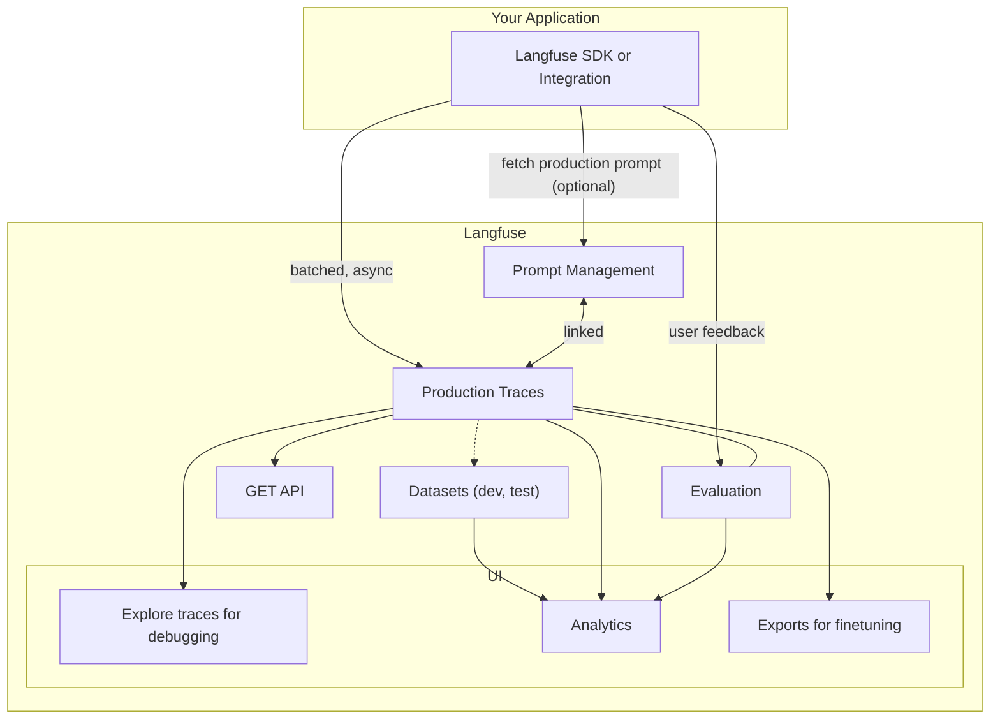

import { ProductUpdateSignup } from "@/components/productUpdateSignup";

# Introduction

Langfuse is an **open source observability and product analytics suite for LLM apps**.

## Overview

<Frame
  transparent
  fullWidth
  className="mt-10 rounded-lg ring-primary/20 ring-1 dark:hidden"
>
  
</Frame>
<Frame
  transparent
  fullWidth
  className="mt-10 rounded-lg ring-primary/20 ring-1 hidden dark:block"
>
  
</Frame>
_Langfuse features along the development lifecycle_

_How Langfuse works on a very high-level (click links for docs of modules)_

## Features

1. [Integrations](/docs/integrations): Data collection via SDKs
   - Tracing LLM chains by collecting specific data such as prompts, outputs and configurations
   - Fully async SDKs for [JS/TS (Node, Edge)](/docs/sdk/typescript) and [Python](/docs/sdk/python)
   - Integrations
     - Langchain ([Python](/docs/langchain/python), [JS/TS](/docs/langchain/typescript))
     - [OpenAI SDK (Python)](/docs/openai), drop-in replacement
     - [HTTP API](/docs/api)
     - Other: [LiteLLM](/docs/litellm), [Flowise](/docs/flowise), [Langflow](/docs/langflow)
1. [Nested traces](/docs/tracing)
   - Find the root cause of issues
   - Segment traces based on user feedback and other metrics
   - Track multiple traces in a single [session](/docs/sessions)
1. [Evaluation](/docs/scores): Measure quality of outputs via scores
   - [Manually in the Langfuse UI](/docs/scores/manually) (human-in-the-loop)
   - [User feedback](/docs/scores/user-feedback), explicit or implicit, optionally directly from the browser via [JS/TS Web SDK](/docs/sdk/typescript-web)
   - [Model-based evaluations](/docs/scores/model-based-evals)
   - [Custom via SDK/API](/docs/scores/custom)
1. [Analytics](/docs/analytics)
   - [User-level reporting](/docs/user-explorer): costs, usage, feedback/quality
   - [Model usage and cost](/docs/model-usage-and-cost)
1. [Prompt management](/docs/prompts) (beta)
   - Manage, version and deploy prompts collaboratively in Langfuse
   - Fetch prompts via SDKs

## Why Langfuse?

- [Open source](/docs/open-source) (MIT license)
- Run Langfuse [self-hosted](/docs/deployment/self-host) (Docker), [locally](/docs/deployment/local) (Docker compose), or use [Langfuse cloud](/docs/deployment/cloud) (generous [free plan](/pricing))
- Model agnostic
- Incrementally adoptable, start with a single LLM call, expand to full tracing of complex chains/agents
- Use [GET API](/docs/api) to build downstream use cases

## What's next?

<Cards num={3}>
  <Card href="/docs/demo" title="Live demo" image arrow>
    
  </Card>
  <Card href="/docs/get-started" title="Quickstart" image arrow>
    
  </Card>
  <Card href="/docs/video" title="Langfuse in 2 minutes" image arrow>
    
  </Card>
</Cards>

## Updates

### Changelog

Langfuse is moving fast, check out the [changelog](/changelog) for the latest updates.

Subscribe to our **mailing list** to get notified about new major features:

<ProductUpdateSignup source="langfuse.com/docs" className="mt-2" />

### Releases

For more granular updates, see the release notes of our repositories: [langfuse](https://github.com/langfuse/langfuse/releases) (application), [langfuse-python](https://github.com/langfuse/langfuse-python/releases) (Python SDK), [langfuse-js](https://github.com/langfuse/langfuse-js/releases) (JS/TS SDK).

<Frame className="max-w-md block mb-0" border>
  
</Frame>
_Watch the repository on GitHub to get notified about new releases_

## Get in touch

We actively develop Langfuse in [open source](/docs/open-source). Join our [Discord](/discord), provide feedback, report bugs, or request features via GitHub [issues](/issue).

If you want to chat about your use case, reach out to us via email (contact@langfuse.com) or [schedule a demo](/schedule-demo).
