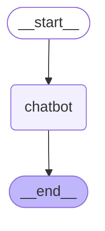
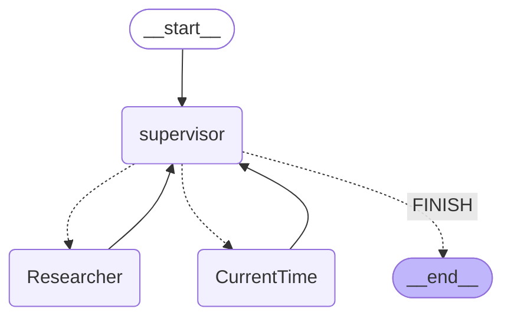

# Cookbook: LangGraph Integration

## What is LangGraph?

[LangGraph](https://langchain-ai.github.io/langgraph/) is an open-source framework by the LangChain team for building complex, stateful, multi-agent applications using large language models (LLMs). LangGraph includes built-in persistence to save and resume state, which enables error recovery and human-in-the-loop workflows.

## Goal of this Cookbook

This cookbook demonstrates how [Langfuse](https://langfuse.com/docs) helps to debug, analyze, and iterate on your LangGraph application using the [LangChain integration](https://langfuse.com/docs/integrations/langchain/tracing).

**By the end of this cookbook, you will be able to:**

- Automatically trace LangGraph application via the Langfuse integration
- Monitor advanced multi-agent setups
- Add scores (like user feedback)
- Manage your prompts used in LangGraph with Langfuse

## Initialize Langfuse

Initialize the Langfuse client with your [API keys](https://langfuse.com/faq/all/where-are-langfuse-api-keys) from the project settings in the Langfuse UI and add them to your environment.

<Callout type="info" emoji="⚠️">
  _**Note:** This notebook utilizes the Langfuse Python SDK v3. For users of
  Python SDK v2, please refer to our [legacy LangGraph integration
  guide](https://github.com/langfuse/langfuse-docs/blob/662509b3296daddcddb292f14b10a62e7c39407d/cookbook/integration_langgraph.ipynb)._
</Callout>

<Callout type="info" emoji="ℹ️">
  _**Note:** You need to run at least Python 3.11 ([GitHub
  Issue](https://github.com/langfuse/langfuse/issues/1926))._
</Callout>

```python
%pip install langfuse langchain langgraph langchain_openai langchain_community
```

```python
import os

# Get keys for your project from the project settings page: https://cloud.langfuse.com
os.environ["LANGFUSE_PUBLIC_KEY"] = "pk-lf-..."
os.environ["LANGFUSE_SECRET_KEY"] = "sk-lf-..."
os.environ["LANGFUSE_HOST"] = "https://cloud.langfuse.com" # 🇪🇺 EU region
# os.environ["LANGFUSE_HOST"] = "https://us.cloud.langfuse.com" # 🇺🇸 US region

# Your openai key
os.environ["OPENAI_API_KEY"] = "sk-proj-..."
```

With the environment variables set, we can now initialize the Langfuse client. get_client() initializes the Langfuse client using the credentials provided in the environment variables.

```python
from langfuse import get_client

langfuse = get_client()

# Verify connection
if langfuse.auth_check():
    print("Langfuse client is authenticated and ready!")
else:
    print("Authentication failed. Please check your credentials and host.")
```

## Example 1: Simple chat app with LangGraph

**What we will do in this section:**

- Build a support chatbot in LangGraph that can answer common questions
- Tracing the chatbot's input and output using Langfuse

We will start with a basic chatbot and build a more advanced multi agent setup in the next section, introducing key LangGraph concepts along the way.

### Create Agent

Start by creating a `StateGraph`. A `StateGraph` object defines our chatbot's structure as a state machine. We will add nodes to represent the LLM and functions the chatbot can call, and edges to specify how the bot transitions between these functions.

```python
from typing import Annotated

from langchain_openai import ChatOpenAI
from langchain_core.messages import HumanMessage
from typing_extensions import TypedDict

from langgraph.graph import StateGraph
from langgraph.graph.message import add_messages

class State(TypedDict):
    # Messages have the type "list". The `add_messages` function in the annotation defines how this state key should be updated
    # (in this case, it appends messages to the list, rather than overwriting them)
    messages: Annotated[list, add_messages]

graph_builder = StateGraph(State)

llm = ChatOpenAI(model = "gpt-4o", temperature = 0.2)

# The chatbot node function takes the current State as input and returns an updated messages list. This is the basic pattern for all LangGraph node functions.
def chatbot(state: State):
    return {"messages": [llm.invoke(state["messages"])]}

# Add a "chatbot" node. Nodes represent units of work. They are typically regular python functions.
graph_builder.add_node("chatbot", chatbot)

# Add an entry point. This tells our graph where to start its work each time we run it.
graph_builder.set_entry_point("chatbot")

# Set a finish point. This instructs the graph "any time this node is run, you can exit."
graph_builder.set_finish_point("chatbot")

# To be able to run our graph, call "compile()" on the graph builder. This creates a "CompiledGraph" we can use invoke on our state.
graph = graph_builder.compile()
```

### Add Langfuse as callback to the invocation

Now, we will add then [Langfuse callback handler for LangChain](https://langfuse.com/docs/integrations/langchain/tracing) to trace the steps of our application: `config={"callbacks": [langfuse_handler]}`

```python
from langfuse.langchain import CallbackHandler

# Initialize Langfuse CallbackHandler for Langchain (tracing)
langfuse_handler = CallbackHandler()

for s in graph.stream({"messages": [HumanMessage(content = "What is Langfuse?")]},
                      config={"callbacks": [langfuse_handler]}):
    print(s)
```

### View traces in Langfuse

Example trace in Langfuse: https://cloud.langfuse.com/project/cloramnkj0002jz088vzn1ja4/traces/85b0c53c4414f22ed8bfc9eb35f917c4


### Visualize the chat app

You can visualize the graph using the `get_graph` method along with a "draw" method

```python
from IPython.display import Image, display
display(Image(graph.get_graph().draw_mermaid_png()))
```



### Use Langfuse with LangGraph Server

You can add Langfuse as callback when using [LangGraph Server](https://langchain-ai.github.io/langgraph/concepts/langgraph_server/)

When using the LangGraph Server, the LangGraph Server handles graph invocation automatically. Therefore, you should add the Langfuse callback when declaring the graph.

```python
from typing import Annotated

from langchain_openai import ChatOpenAI
from typing_extensions import TypedDict

from langgraph.graph import StateGraph
from langgraph.graph.message import add_messages

from langfuse.langchain import CallbackHandler

class State(TypedDict):
  messages: Annotated[list, add_messages]

graph_builder = StateGraph(State)

llm = ChatOpenAI(model = "gpt-4o", temperature = 0.2)

def chatbot(state: State):
  return {"messages": [llm.invoke(state["messages"])]}

graph_builder.add_node("chatbot", chatbot)
graph_builder.set_entry_point("chatbot")
graph_builder.set_finish_point("chatbot")

# Initialize Langfuse CallbackHandler for Langchain (tracing)
langfuse_handler = CallbackHandler()

# Call "with_config" from the compiled graph.
# It returns a "CompiledGraph", similar to "compile", but with callbacks included.
# This enables automatic graph tracing without needing to add callbacks manually every time.
graph = graph_builder.compile().with_config({"callbacks": [langfuse_handler]})
```

## Example 2: Multi agent application with LangGraph

**What we will do in this section**:

- Build 2 executing agents: One research agent using the LangChain WikipediaAPIWrapper to search Wikipedia and one that uses a custom tool to get the current time.
- Build an agent supervisor to help delegate the user questions to one of the two agents
- Add Langfuse handler as callback to trace the steps of the supervisor and executing agents

```python
%pip install langfuse langgraph langchain langchain_openai langchain_experimental pandas wikipedia
```

### Create tools

For this example, you build an agent to do wikipedia research, and one agent to tell you the current time. Define the tools they will use below:

```python
from typing import Annotated

from langchain_community.tools import WikipediaQueryRun
from langchain_community.utilities import WikipediaAPIWrapper
from datetime import datetime
from langchain.tools import Tool

# Define a tools that searches Wikipedia
wikipedia_tool = WikipediaQueryRun(api_wrapper=WikipediaAPIWrapper())

# Define a new tool that returns the current datetime
datetime_tool = Tool(
    name="Datetime",
    func = lambda x: datetime.now().isoformat(),
    description="Returns the current datetime",
)
```

### Helper utilities

Define a helper function below to simplify adding new agent worker nodes.

```python
from langchain.agents import AgentExecutor, create_openai_tools_agent
from langchain_core.messages import BaseMessage, HumanMessage
from langchain_openai import ChatOpenAI

def create_agent(llm: ChatOpenAI, system_prompt: str, tools: list):
    # Each worker node will be given a name and some tools.
    prompt = ChatPromptTemplate.from_messages(
        [
            (
                "system",
                system_prompt,
            ),
            MessagesPlaceholder(variable_name="messages"),
            MessagesPlaceholder(variable_name="agent_scratchpad"),
        ]
    )
    agent = create_openai_tools_agent(llm, tools, prompt)
    executor = AgentExecutor(agent=agent, tools=tools)
    return executor

def agent_node(state, agent, name):
    result = agent.invoke(state)
    return {"messages": [HumanMessage(content=result["output"], name=name)]}
```

### Create agent supervisor

It will use function calling to choose the next worker node OR finish processing.

```python
from langchain_core.output_parsers.openai_functions import JsonOutputFunctionsParser
from langchain_core.prompts import ChatPromptTemplate, MessagesPlaceholder

members = ["Researcher", "CurrentTime"]
system_prompt = (
    "You are a supervisor tasked with managing a conversation between the"
    " following workers:  {members}. Given the following user request,"
    " respond with the worker to act next. Each worker will perform a"
    " task and respond with their results and status. When finished,"
    " respond with FINISH."
)
# Our team supervisor is an LLM node. It just picks the next agent to process and decides when the work is completed
options = ["FINISH"] + members

# Using openai function calling can make output parsing easier for us
function_def = {
    "name": "route",
    "description": "Select the next role.",
    "parameters": {
        "title": "routeSchema",
        "type": "object",
        "properties": {
            "next": {
                "title": "Next",
                "anyOf": [
                    {"enum": options},
                ],
            }
        },
        "required": ["next"],
    },
}

# Create the prompt using ChatPromptTemplate
prompt = ChatPromptTemplate.from_messages(
    [
        ("system", system_prompt),
        MessagesPlaceholder(variable_name="messages"),
        (
            "system",
            "Given the conversation above, who should act next?"
            " Or should we FINISH? Select one of: {options}",
        ),
    ]
).partial(options=str(options), members=", ".join(members))

llm = ChatOpenAI(model="gpt-4o")

# Construction of the chain for the supervisor agent
supervisor_chain = (
    prompt
    | llm.bind_functions(functions=[function_def], function_call="route")
    | JsonOutputFunctionsParser()
)
```

### Construct graph

Now we are ready to start building the graph. Below, define the state and worker nodes using the function we just defined. Then we connect all the edges in the graph.

```python
import functools
import operator
from typing import Sequence, TypedDict
from langchain_core.prompts import ChatPromptTemplate, MessagesPlaceholder
from langgraph.graph import END, StateGraph, START

# The agent state is the input to each node in the graph
class AgentState(TypedDict):
    # The annotation tells the graph that new messages will always be added to the current states
    messages: Annotated[Sequence[BaseMessage], operator.add]
    # The 'next' field indicates where to route to next
    next: str

# Add the research agent using the create_agent helper function
research_agent = create_agent(llm, "You are a web researcher.", [wikipedia_tool])
research_node = functools.partial(agent_node, agent=research_agent, name="Researcher")

# Add the time agent using the create_agent helper function
currenttime_agent = create_agent(llm, "You can tell the current time at", [datetime_tool])
currenttime_node = functools.partial(agent_node, agent=currenttime_agent, name = "CurrentTime")

workflow = StateGraph(AgentState)

# Add a "chatbot" node. Nodes represent units of work. They are typically regular python functions.
workflow.add_node("Researcher", research_node)
workflow.add_node("CurrentTime", currenttime_node)
workflow.add_node("supervisor", supervisor_chain)

# We want our workers to ALWAYS "report back" to the supervisor when done
for member in members:
    workflow.add_edge(member, "supervisor")

# Conditional edges usually contain "if" statements to route to different nodes depending on the current graph state.
# These functions receive the current graph state and return a string or list of strings indicating which node(s) to call next.
conditional_map = {k: k for k in members}
conditional_map["FINISH"] = END
workflow.add_conditional_edges("supervisor", lambda x: x["next"], conditional_map)

# Add an entry point. This tells our graph where to start its work each time we run it.
workflow.add_edge(START, "supervisor")

# To be able to run our graph, call "compile()" on the graph builder. This creates a "CompiledGraph" we can use invoke on our state.
graph_2 = workflow.compile()
```

### Add Langfuse as callback to the invocation

Add [Langfuse handler](https://langfuse.com/docs/integrations/langchain/tracing) as callback: `config={"callbacks": [langfuse_handler]}`

```python
from langfuse.langchain import CallbackHandler

# Initialize Langfuse CallbackHandler for Langchain (tracing)
langfuse_handler = CallbackHandler()

# Add Langfuse handler as callback: config={"callbacks": [langfuse_handler]}
# You can also set an optional 'run_name' that will be used as the trace name in Langfuse
for s in graph_2.stream({"messages": [HumanMessage(content = "How does photosynthesis work?")]},
                      config={"callbacks": [langfuse_handler]}):
    print(s)
    print("----")
```

```python
# Add Langfuse handler as callback: config={"callbacks": [langfuse_handler]}
for s in graph_2.stream({"messages": [HumanMessage(content = "What time is it?")]},
                      config={"callbacks": [langfuse_handler]}):
    print(s)
    print("----")
```

### See traces in Langfuse

Example traces in Langfuse:

1. [How does photosynthesis work?](https://cloud.langfuse.com/project/cloramnkj0002jz088vzn1ja4/traces/7d5f970573b8214d1ca891251e42282c)
2. [What time is it?](https://cloud.langfuse.com/project/cloramnkj0002jz088vzn1ja4/traces/3a69fe4998df50d42054f8944bd6a8d9)


### Visualize the agent

You can visualize the graph using the `get_graph` method along with a "draw" method

```python
from IPython.display import Image, display
display(Image(graph_2.get_graph().draw_mermaid_png()))
```



## Multiple LangGraph Agents

There are setups where one LangGraph agent uses one or multiple other LangGraph agents. To combine all corresponding spans in one single trace for the multi agent execution, we can pass a custom `trace_id`.

First, we generate a trace_id that can be used for both agents to group the agent executions together in one Langfuse trace.

```python
from langfuse import get_client, Langfuse
from langfuse.langchain import CallbackHandler

langfuse = get_client()

# Generate deterministic trace ID from external system
predefined_trace_id = Langfuse.create_trace_id()

# Initialize Langfuse CallbackHandler for Langchain (tracing)
langfuse_handler = CallbackHandler()
```

Next, we set up the sub-agent.

```python
from typing import Annotated
from langchain_openai import ChatOpenAI
from langchain_core.messages import HumanMessage
from typing_extensions import TypedDict
from langgraph.graph import StateGraph
from langgraph.graph.message import add_messages

class State(TypedDict):
    messages: Annotated[list, add_messages]

graph_builder = StateGraph(State)

llm = ChatOpenAI(model = "gpt-4o", temperature = 0.2)

def chatbot(state: State):
    return {"messages": [llm.invoke(state["messages"])]}

graph_builder.add_node("chatbot", chatbot)
graph_builder.set_entry_point("chatbot")
graph_builder.set_finish_point("chatbot")
sub_agent = graph_builder.compile()
```

Then, we set the tool that uses the research-sub-agent to answer questions.

```python
from langchain_core.tools import tool

@tool
def langgraph_research(question):
  """Conducts research for various topics."""

  with langfuse.start_as_current_span(
      name="🤖-sub-research-agent",
      trace_context={"trace_id": predefined_trace_id}
  ) as span:
      span.update_trace(input=question)

      response = sub_agent.invoke({"messages": [HumanMessage(content = question)]},
                        config={"callbacks": [langfuse_handler]})

      span.update_trace(output= response["messages"][1].content)

  return response["messages"][1].content
```

Set up a second simple LangGraph agent that uses the new `langgraph_research`.

```python
from langgraph.prebuilt import create_react_agent
from langchain_openai import ChatOpenAI

llm = ChatOpenAI(model = "gpt-4o", temperature = 0.2)

main_agent = create_react_agent(
    model=llm,
    tools=[langgraph_research]
)
```

```python
user_question = "What is Langfuse?"

# Use the predefined trace ID with trace_context
with langfuse.start_as_current_span(
    name="🤖-main-agent",
    trace_context={"trace_id": predefined_trace_id}
) as span:
    span.update_trace(input=user_question)

    # LangChain execution will be part of this trace
    response = main_agent.invoke({"messages": [{"role": "user", "content": user_question}]},
                            config={"callbacks": [langfuse_handler]})

    span.update_trace(output=response["messages"][1].content)

print(f"Trace ID: {predefined_trace_id}")  # Use this for scoring later
```

### View traces in Langfuse


Example trace in Langfuse: https://cloud.langfuse.com/project/cloramnkj0002jz088vzn1ja4/traces/85b0c53c4414f22ed8bfc9eb35f917c4

## Adding scores to traces as scores

[Scores](https://langfuse.com/docs/scores/overview) are used to evaluate single observations or entire traces. They enables you to implement custom quality checks at runtime or facilitate human-in-the-loop evaluation processes.

In the example below, we demonstrate how to score a specific span for `relevance` (a numeric score) and the overall trace for `feedback` (a categorical score). This helps in systematically assessing and improving your application.

**→ Learn more about [Custom Scores in Langfuse](https://langfuse.com/docs/scores/custom).**

```python
from langfuse import get_client

langfuse = get_client()

# Option 1: Use the yielded span object from the context manager
with langfuse.start_as_current_span(
    name="langgraph-request") as span:
    # ... LangGraph execution ...

    # Score using the span object
    span.score_trace(
        name="user-feedback",
        value=1,
        data_type="NUMERIC",
        comment="This was correct, thank you"
    )

# Option 2: Use langfuse.score_current_trace() if still in context
with langfuse.start_as_current_span(name="langgraph-request") as span:
    # ... LangGraph execution ...

    # Score using current context
    langfuse.score_current_trace(
        name="user-feedback",
        value=1,
        data_type="NUMERIC"
    )

# Option 3: Use create_score() with trace ID (when outside context)
langfuse.create_score(
    trace_id=predefined_trace_id,
    name="user-feedback",
    value=1,
    data_type="NUMERIC",
    comment="This was correct, thank you"
)
```

### View trace with score in Langfuse

Example trace: https://cloud.langfuse.com/project/cloramnkj0002jz088vzn1ja4/traces/e60a078b828d4fdc7ea22c73193b0fe4


## Manage prompts with Langfuse

Use [Langfuse prompt management](https://langfuse.com/docs/prompts/example-langchain) to effectively manage and version your prompts. We add the prompt used in this example via the SDK. In production, however, users would update and manage the prompts via the Langfuse UI instead of using the SDK.

Langfuse prompt management is basically a Prompt CMS (Content Management System). Alternatively, you can also edit and version the prompt in the Langfuse UI.

- `Name` that identifies the prompt in Langfuse Prompt Management
- Prompt with prompt template incl. `{{input variables}}`
- `labels` to include `production` to immediately use prompt as the default

In this example, we create a system prompt for an assistant that translates every user message into Spanish.

```python
from langfuse import get_client

langfuse = get_client()

langfuse.create_prompt(
    name="translator_system-prompt",
    prompt="You are a translator that translates every input text into Spanish.",
    labels=["production"]
)
```


Use the utility method `.get_langchain_prompt()` to transform the Langfuse prompt into a string that can be used in Langchain.

**Context:** Langfuse declares input variables in prompt templates using double brackets (`{{input variable}}`). Langchain uses single brackets for declaring input variables in PromptTemplates (`{input variable}`). The utility method `.get_langchain_prompt()` replaces the double brackets with single brackets. In this example, however, we don't use any variables in our prompt.

```python
# Get current production version of prompt and transform the Langfuse prompt into a string that can be used in Langchain
langfuse_system_prompt = langfuse.get_prompt("translator_system-prompt")
langchain_system_prompt = langfuse_system_prompt.get_langchain_prompt()

print(langchain_system_prompt)
```

Now we can use the new system prompt string to update our assistant.

```python
from typing import Annotated
from langchain_openai import ChatOpenAI
from typing_extensions import TypedDict
from langgraph.graph import StateGraph
from langgraph.graph.message import add_messages

class State(TypedDict):
    messages: Annotated[list, add_messages]

graph_builder = StateGraph(State)

llm = ChatOpenAI(model = "gpt-4o", temperature = 0.2)

# Add the system prompt for our translator assistent
system_prompt = {
    "role": "system",
    "content": langchain_system_prompt
}

def chatbot(state: State):
    messages_with_system_prompt = [system_prompt] + state["messages"]
    response = llm.invoke(messages_with_system_prompt)
    return {"messages": [response]}

graph_builder.add_node("chatbot", chatbot)
graph_builder.set_entry_point("chatbot")
graph_builder.set_finish_point("chatbot")
graph = graph_builder.compile()
```

```python
from langfuse.langchain import CallbackHandler

# Initialize Langfuse CallbackHandler for Langchain (tracing)
langfuse_handler = CallbackHandler()

# Add Langfuse handler as callback: config={"callbacks": [langfuse_handler]}
for s in graph.stream({"messages": [HumanMessage(content = "What is Langfuse?")]},
                      config={"callbacks": [langfuse_handler]}):
    print(s)
```

## Add custom spans to a LangGraph trace

Sometimes it is helpful to add custom spans to a LangGraph trace. This [GitHub discussion thread](https://github.com/orgs/langfuse/discussions/2988#discussioncomment-11634600) provides an example of how to do this.
