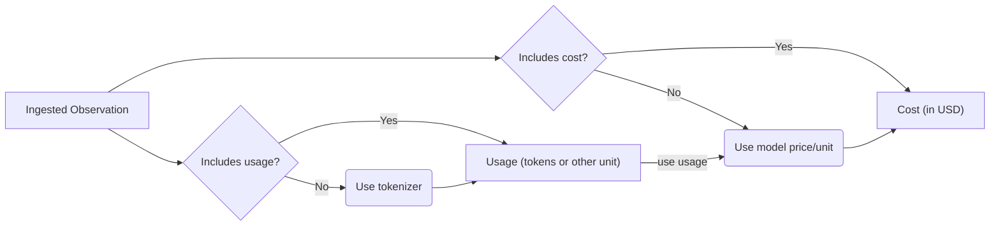

# Model Usage & Cost Tracking


Langfuse tracks the usage and costs of your LLM generations and provides breakdowns by usage types.

- **Usage details**: number of units consumed per usage type
- **Cost details**: USD cost per usage type

Usage types can be arbitrary strings and differ by LLM provider. At the highest level, they can be simply `input` and `output`. As LLMs grow more sophisticated, additional usage types are necessary, such as `cached_tokens`, `audio_tokens`, `image_tokens`.

In the UI, Langfuse summarizes all usage types that include the string `input` as input usage types, similarly`output` as output usage types. If no `total` usage type is ingested, Langfuse sums up all usage type units to a total.

Both usage details and cost details can be either

- [**ingested**](#ingest) via API, SDKs or integrations
- or [**inferred**](#infer) based on the `model` parameter of the generation. Langfuse comes with a list of predefined popular models and their tokenizers including OpenAI, Anthropic, and Google models. You can also add your own [custom model definitions](#custom-model-definitions) or request official support for new models via [GitHub](/issue). Inferred cost are calculated at the time of ingestion with the model and price information available at that point in time.

Ingested usage and cost are prioritized over inferred usage and cost:



Via the [Daily Metrics API](/docs/analytics/daily-metrics-api), you can retrieve aggregated daily usage and cost metrics from Langfuse for downstream use in analytics, billing, and rate-limiting. The API allows you to filter by application type, user, or tags.

## Ingest usage and/or cost [#ingest]

If available in the LLM response, ingesting usage and/or cost is the most accurate and robust way to track usage in Langfuse.

Many of the Langfuse integrations automatically capture usage details and cost details data from the LLM response. If this does not work as expected, please create an [issue](/issue) on GitHub.

<Tabs items={["Python (Decorator)", "Python (low-level SDK)", "JS"]}>
<Tab>

```python
@observe(as_type="generation")
def anthropic_completion(**kwargs):
  # optional, extract some fields from kwargs
  kwargs_clone = kwargs.copy()
  input = kwargs_clone.pop('messages', None)
  model = kwargs_clone.pop('model', None)
  langfuse_context.update_current_observation(
      input=input,
      model=model,
      metadata=kwargs_clone
  )

  response = anthopic_client.messages.create(**kwargs)

  langfuse_context.update_current_observation(
      usage_details={
          "input": response.usage.input_tokens,
          "output": response.usage.output_tokens,
          "cache_read_input_tokens": response.usage.cache_read_input_tokens
          # "total": int,  # if not set, it is derived from input + cache_read_input_tokens + output
        }
      # Optionally, also ingest usd cost. Alternatively, you can infer it via a model definition in Langfuse.
      cost_details={
          # Here we assume the input and output cost are 1 USD each and half the price for cached tokens.
          "input": 1,
          "cache_read_input_tokens": 0.5,
          "output": 1,
          # "total": float, # if not set, it is derived from input + cache_read_input_tokens + output
      }
  )

  # return result
  return response.content[0].text

@observe()
def main():
  return anthropic_completion(
      model="claude-3-opus-20240229",
      max_tokens=1024,
      messages=[
          {"role": "user", "content": "Hello, Claude"}
      ]
  )

main()
```

</Tab>
<Tab>

```python
generation = langfuse.generation(
  # ...
  usage_details={
    # usage
    "input": int,
    "output": int,
    "cache_read_input_tokens": int,
    "total": int,  # if not set, it is derived from input + cache_read_input_tokens + output
  },
  cost_details: {
    # usd cost
    "input": float,
    "cache_read_input_tokens": float,
    "output": float,
    "total": float, # if not set, it is derived from input + cache_read_input_tokens + output
  },
  # ...
)
```

</Tab>
<Tab>

```ts
const generation = langfuse.generation({
  // ...
  usageDetails: {
    // usage
    input: int,
    output: int,
    cache_read_input_tokens: int,
    total: int, // optional, it is derived from input + cache_read_input_tokens + output
  },
  costDetails: {
    // usd cost
    input: float,
    cache_read_input_tokens: float,
    output: float,
    total: float, // optional, it is derived from input + cache_read_input_tokens + output
  },
  // ...
});
```

</Tab>
</Tabs>

You can also update the usage and cost via `generation.update()` and `generation.end()`.

### Compatibility with OpenAI

For increased compatibility with OpenAI, you can also use the OpenAI Usage schema. `prompt_tokens` will be mapped to `input`, `completion_tokens` will be mapped to `output`, and `total_tokens` will be mapped to `total`. The keys nested in `prompt_tokens_details` will be flattened with an `input_` prefix and `completion_tokens_details` will be flattened with an `output_` prefix.

<Tabs items={["Python", "JS"]}>
<Tab>

```python
generation = langfuse.generation(
  # ...
  usage={
    # usage
    "prompt_tokens": int,
    "completion_tokens": int,
    "total_tokens": int,
    "prompt_tokens_details": {
      "cached_tokens": int,
      "audio_tokens": int,
    },
    "completion_tokens_details": {
      "reasoning_tokens": int,
    },
  },
  # ...
)
```

</Tab>
<Tab>

```ts
const generation = langfuse.generation({
  // ...
  usage: {
    // usage
    prompt_tokens: integer,
    completion_tokens: integer,
    total_tokens: integer,
    prompt_tokens_details: {
      cached_tokens: integer,
      audio_tokens: integer,
    },
    completion_tokens_details: {
      reasoning_tokens: integer,
    },
  },
  // ...
});
```

</Tab>
</Tabs>

You can also ingest OpenAI-style usage via `generation.update()` and `generation.end()`.

## Infer usage and/or cost [#infer]

If either usage or cost are not ingested, Langfuse will attempt to infer the missing values based on the `model` parameter of the generation at the time of ingestion. This is especially useful for some model providers or self-hosted models which do not include usage or cost in the response.

Langfuse comes with a **list of predefined popular models and their tokenizers** including **OpenAI, Anthropic, Google**. Check out the [full list](https://cloud.langfuse.com/project/clkpwwm0m000gmm094odg11gi/models) (you need to sign-in).

You can also add your own **custom model definitions** (see [below](#custom-model-definitions)) or request official support for new models via [GitHub](/issue).

### Usage

If a tokenizer is specified for the model, Langfuse automatically calculates token amounts for ingested generations.

The following tokenizers are currently supported:

| Model     | Tokenizer     | Used package                                                                       | Comment                                                                                                                               |
| --------- | ------------- | ---------------------------------------------------------------------------------- | ------------------------------------------------------------------------------------------------------------------------------------- |
| `gpt-4o`  | `o200k_base`  | [`tiktoken`](https://www.npmjs.com/package/tiktoken)                               |                                                                                                                                       |
| `gpt*`    | `cl100k_base` | [`tiktoken`](https://www.npmjs.com/package/tiktoken)                               |                                                                                                                                       |
| `claude*` | `claude`      | [`@anthropic-ai/tokenizer`](https://www.npmjs.com/package/@anthropic-ai/tokenizer) | According to Anthropic, their tokenizer is not accurate for Claude 3 models. If possible, send us the tokens from their API response. |

### Cost

Model definitions include prices per usage type. Usage types must match exactly with the keys in the `usage_details` object of the generation.

Langfuse automatically calculates cost for ingested generations at the time of ingestion if (1) usage is ingested or inferred, (2) and a matching model definition includes prices.

### Custom model definitions [#custom-model-definitions]

You can flexibly add your own model definitions to Langfuse. This is especially useful for self-hosted or fine-tuned models which are not included in the list of Langfuse maintained models.

<Tabs items={["UI", "API"]}>

<Tab>
  <Frame border></Frame>
</Tab>

<Tab>

Model definitions can also be managed programmatically via the Models [API](/docs/api):

```bash
GET    /api/public/models
POST   /api/public/models
GET    /api/public/models/{id}
DELETE /api/public/models/{id}
```

</Tab>

</Tabs>

Models are matched to generations based on:

| Generation Attribute | Model Attribute | Notes                                                                                     |
| -------------------- | --------------- | ----------------------------------------------------------------------------------------- |
| `model`              | `match_pattern` | Uses regular expressions, e.g. `(?i)^(gpt-4-0125-preview)$` matches `gpt-4-0125-preview`. |

User-defined models take priority over models maintained by Langfuse.

**Further details**

When using the `openai` tokenizer, you need to specify the following tokenization config. You can also copy the config from the list of predefined OpenAI models. See the OpenAI [documentation](https://github.com/openai/openai-cookbook/blob/main/examples/How_to_count_tokens_with_tiktoken.ipynb) for further details. `tokensPerName` and `tokensPerMessage` are required for chat models.

```json
{
  "tokenizerModel": "gpt-3.5-turbo", // tiktoken model name
  "tokensPerName": -1, // OpenAI Chatmessage tokenization config
  "tokensPerMessage": 4 // OpenAI Chatmessage tokenization config
}
```

### Cost inference for reasoning models

Cost inference by tokenizing the LLM input and output is not supported for reasoning models such as the OpenAI o1 model family. That is, if no token counts are ingested, Langfuse can not infer cost for reasoning models.

Reasoning models take multiple steps to arrive to a response. The result from each step generates reasoning tokens that are billed as output tokens. So the cost-effective output token count is the sum of all reasoning tokens and the token count for the final completion. Since Langfuse does not have visibility into the reasoning tokens, it cannot infer the correct cost for generations that have no token usage provided.

To benefit from Langfuse cost tracking, please provide the token usage when ingesting o1 model generations. When utilizing the [Langfuse OpenAI wrapper](/docs/integrations/openai/python/get-started) or integrations such as for [Langchain](/docs/integrations/langchain/tracing), [LlamaIndex](/docs/integrations/llama-index/get-started) or [LiteLLM](/docs/integrations/litellm/tracing), token usage is collected and provided automatically for you.

For more details, see [the OpenAI guide](https://platform.openai.com/docs/guides/reasoning) on how reasoning models work.

## Troubleshooting

**Usage and cost are missing for historical generations**. Except for changes in prices, Langfuse does not retroactively infer usage and cost for existing generations when model definitions are changed. You can request a batch job (Langfuse Cloud) or run a [script](/self-hosting/upgrade-guides/upgrade-v1-to-v2) (self-hosting) to apply new model definitions to existing generations.

## GitHub Discussions

import { GhDiscussionsPreview } from "@/components/gh-discussions/GhDiscussionsPreview";

<GhDiscussionsPreview labels={["feat-cost-tracking"]} />
