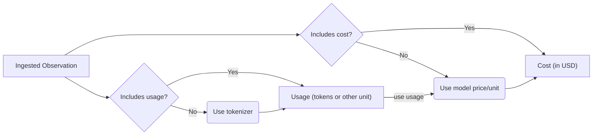

# Model Usage & Cost

Across Langfuse, usage and cost are tracked for LLM generations:

- **Usage**: token/character counts
- **Cost**: USD cost of the generation

Both usage and cost can be either

- [**ingested**](#ingest) via API, SDKs or integrations
- or [**inferred**](#infer) based on the `model` parameter of the generation. Langfuse comes with a list of predefined popular models and their tokenizers including OpenAI, Anthropic, and Google models. You can also add your own [custom model definitions](#custom-model-definitions) or request official support for new models via [GitHub](/issue).

Ingested usage and cost are prioritized over inferred usage and cost:



## Ingest usage and cost [#ingest]

If available in the LLM response, ingesting usage and/or cost is the most accurate and robust way to track usage in Langfuse:

```typescript
langfuse.generation({
  ...
  usage: {
    // usage
    input: integer,
    output: integer,
    total: integer, // if no separate input&output, otherwise derived from input + output
    unit: string, // 'TOKENS' or 'CHARACTERS', defaults to 'TOKENS'

    // usd cost
    inputCost: number
    outputCost: number
    totalCost: number
  },
  ...
})
```

### Compatibility with OpenAI

For increased compatibility with OpenAI, you can also use the following attributes to ingest usage:

```typescript
langfuse.generation({
  usage: {
    // usage
    promptTokens: integer,
    completionTokens: integer,
    totalTokens: integer, // optional, derived from prompt + completion
  },
});
```

## Inferred usage and cost [#infer]

If either usage or cost are not ingested, Langfuse will attempt to infer the missing values based on the `model` parameter of the generation. This is especially useful for some model providers or self-hosted models which do not include usage or cost in the response.

Langfuse comes with a **list of predefined popular models and their tokenizers** including **OpenAI, Anthropic, Google**. Check out the [full list](https://cloud.langfuse.com/project/clkpwwm0m000gmm094odg11gi/models) (you need to sign-in).

You can also add your own **custom model definitions** (see [below](#custom-model-definitions)) or request official support for new models via [GitHub](/issue).

### Usage

If a tokenizer is specified for the model, Langfuse automatically calculates token amounts for ingested generations.

The following tokenizers are currently supported:

| Tokenizer | Package                                                                            |
| --------- | ---------------------------------------------------------------------------------- |
| `openai`  | [`js-tiktoken`](https://www.npmjs.com/package/js-tiktoken)                         |
| `claude`  | [`@anthropic-ai/tokenizer`](https://www.npmjs.com/package/@anthropic-ai/tokenizer) |

### Cost

Model definitions include prices per unit (input, output, total).

Langfuse automatically calculates cost for ingested generations if (1) usage is ingested or inferred, (2) and a matching model definition includes prices.

### Custom model definitions [#custom-model-definitions]

You can flexibly add your own model definitions to Langfuse. This is especially useful for self-hosted or fine-tuned models which are not included in the list of Langfuse maintained models.

<Frame border></Frame>

Models are matched to generations based on:

| Generation Attribute | Model Attribute | Notes                                                                                                                                                                                                                      |
| -------------------- | --------------- | -------------------------------------------------------------------------------------------------------------------------------------------------------------------------------------------------------------------------- |
| `model`              | `match_pattern` | Uses regular expressions, e.g. `(?i)^(gpt-4-0125-preview)$` matches `gpt-4-0125-preview`.                                                                                                                                  |
| `unit`               | `unit`          | Unit on the usage object of the generation (e.g. `TOKENS` or `CHARACTERS`) needs to match.                                                                                                                                 |
| `start_time`         | `start_time`    | Optional, can be used to update the price of a model without affecting past generations. If multiple models match, the model with the most recent `model.start_time` that is earlier than `generation.start_time` is used. |

User-defined models take priority over models maintained by Langfuse.

**Further details**

When using the `openai` tokenizer, you need to specify the following tokenization config. You can also copy the config from the list of predefined OpenAI models. See the OpenAI [documentation](https://github.com/openai/openai-cookbook/blob/main/examples/How_to_count_tokens_with_tiktoken.ipynb) for further details. `tokensPerName` and `tokensPerMessage` are required for chat models.

```json
{
  "tokenizerModel": "gpt-3.5-turbo", // tiktoken model name
  "tokensPerName": -1, // OpenAI Chatmessage tokenization config
  "tokensPerMessage": 4 // OpenAI Chatmessage tokenization config
}
```

## Troubleshooting

**Usage and cost are missing for historical generations**. Except for changes in prices, Langfuse does not retroactively infer usage and cost for existing generations when model definitions are changed. You can request a batch job (Langfuse Cloud) or run a [script](/docs/deployment/self-host#migrate-models) (self-hosting) to apply new model definitions to existing generations.
