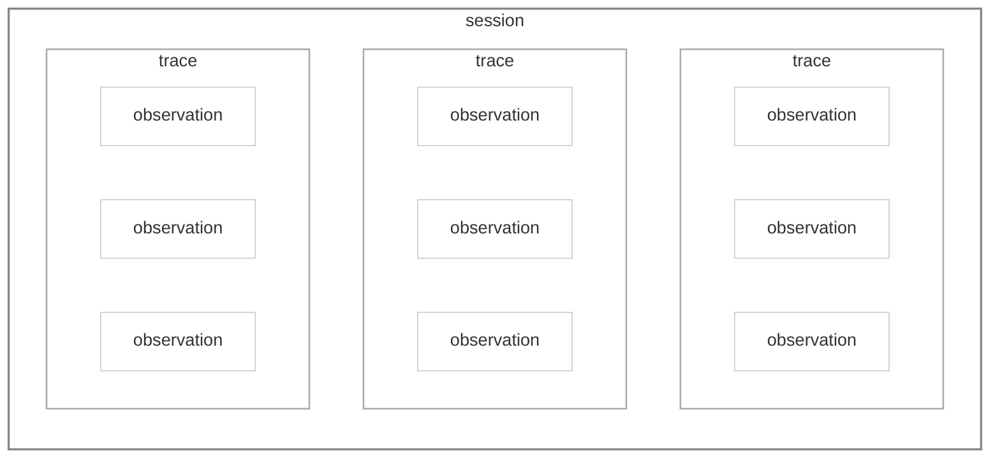
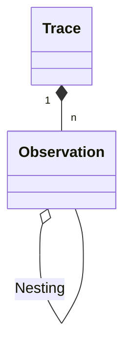
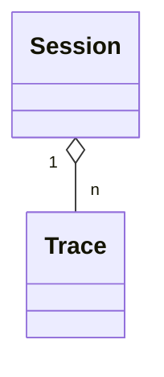

# Core Concepts

todo
## Traces, Observations and Sessions

Langfuse organizes an application's data into three core concepts: sessions, traces and observations.

### Traces

A `trace` typically represents a single request or operation.
For example, when a user asks a question to a chatbot, that interaction, from the user's question to the bot's response, is captured as one trace. 

It contains the overall input and output of the function, as well as metadata about the request ( i.e. user, session, tags, etc.).

import ObservationTypesList from "@/components-mdx/observation-types-list.mdx";

### Observations

Each trace can contain multiple `observations` to log the individual steps of the execution.  Example observations include LLM text generations, toolcalls, RAG retrieval steps, etc.

#### Nesting

Observations can be nested. The example below shows a trace with a nested observation.

Hierarchical structure of traces in Langfuse

Example trace in Langfuse UI

Example trace in Langfuse UI

#### Types

Langfuse supports a number of LLM application specific [observation types](/docs/observability/features/observation-types):

<ObservationTypesList />

The advantage of using observation types is that you can filter on them, and certain types have special handling in the Langfuse UI.

### Sessions

Optionally, traces can be grouped into [sessions](/docs/tracing-features/sessions).
Sessions are used to group traces that are part of the same user interaction.
A common example is a thread in a chat interface. 

Optionally, sessions aggregate traces

Example session in Langfuse UI

<Frame fullWidth></Frame>

Using sessions is recommended for applications with multi-turn conversations or workflows. Please refer to the [Sessions](/docs/tracing-features/sessions) documentation to add sessions to your traces.
