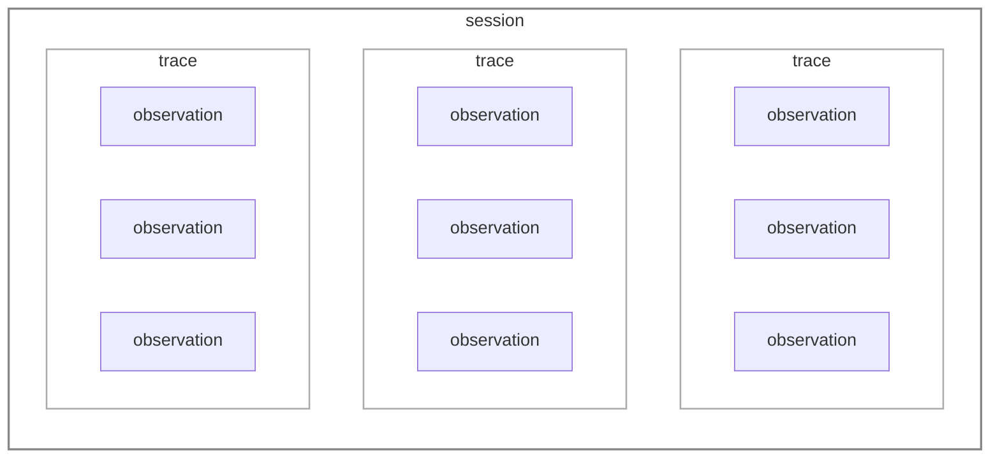
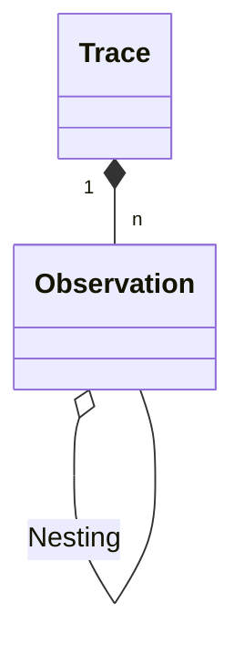
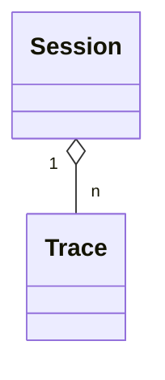
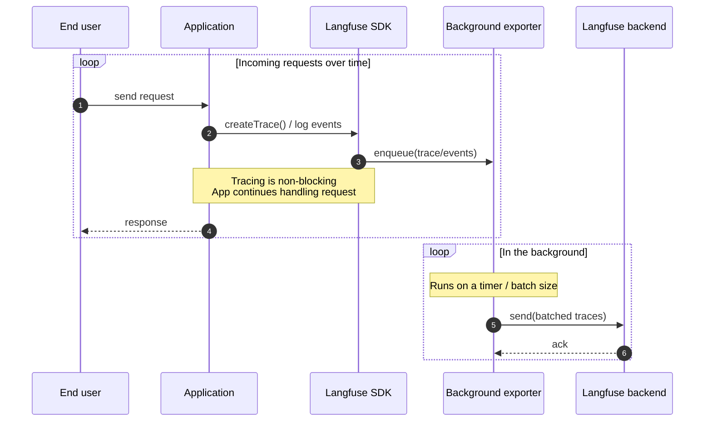
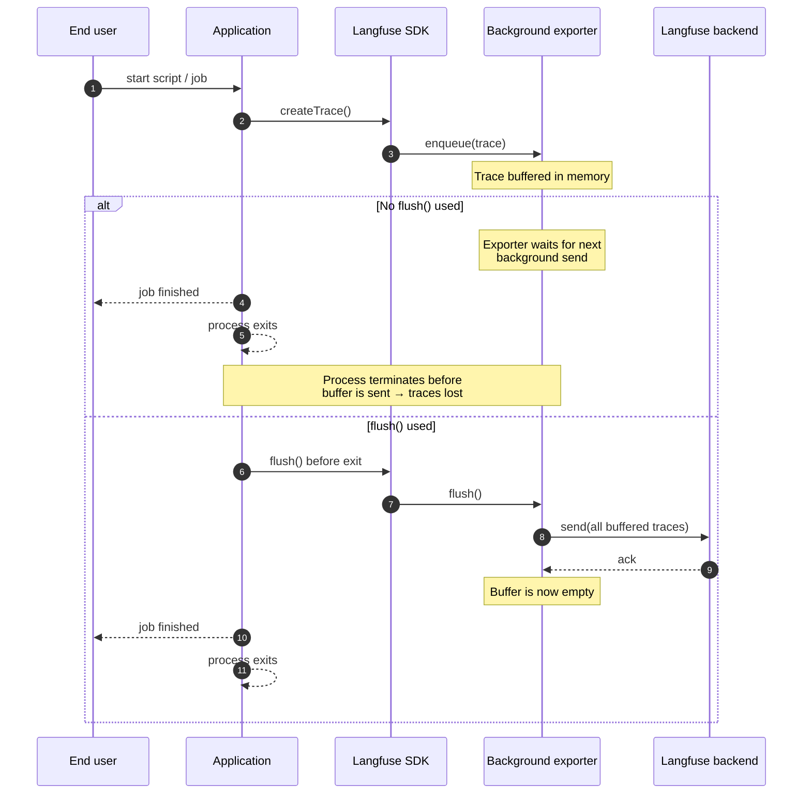

# Core Concepts

This page digs into the underlying concepts of how Langfuse structures and captures your data. Understanding these will make debugging and working with traces easier.

Ready to start? Check out the [Get Started guide](/docs/observability/get-started) to ingest your first trace.

## Observations, Traces, and Sessions

Langfuse organizes an application's data into three core concepts: observations, traces, and sessions.

import ObservationTypesList from "@/components-mdx/observation-types-list.mdx";

### Observations

`Observations` are the individual steps within a trace. Langfuse supports a number of LLM application specific [observation types](/docs/observability/features/observation-types), for example _generations_, _toolcalls_, _RAG retrieval steps_, etc.

Observations can be nested. The example below shows a trace with a nested observation.

Hierarchical structure of observations in Langfuse

Example trace in Langfuse UI

Example trace in Langfuse UI

### Traces

A `trace` typically represents a single request or operation.
For example, when a user asks a question to a chatbot, that interaction, from the user's question to the bot's response, is captured as one trace. 

It contains the overall input and output of the function, as well as metadata about the request ( i.e. user, session, tags, etc.).

### Sessions

Optionally, traces can be grouped into [sessions](/docs/tracing-features/sessions).
Sessions are used to group traces that are part of the same user interaction.
A common example is a thread in a chat interface. 

Optionally, sessions aggregate traces

Example session in Langfuse UI

<Frame fullWidth></Frame>

Using sessions is recommended for applications with multi-turn conversations or workflows. Please refer to the [Sessions](/docs/tracing-features/sessions) documentation to add sessions to your traces.

## Adding Attributes

Once you've structured your data into traces and observations, you can enrich them with additional attributes. These attributes act as labels that help you filter, segment, and analyze your traces for specific use cases.

There are different types of attributes you can add:

| Attribute | Description |
|-----------|-------------|
| [Environments](/docs/observability/features/environments) | Separate data from different deployment contexts like `production`, `staging`, or `development` |
| [Tags](/docs/observability/features/tags) | Flexible labels to categorize traces by feature, API endpoint, or workflow |
| [User](/docs/observability/features/users) | Track which end-user triggered each trace |
| [Metadata](/docs/observability/features/metadata) | Flexible key-value store for custom information |
| [Releases & Versions](/docs/observability/features/releases-and-versioning) | Track application versions and component changes |

## How Langfuse Captures Data

Now that you understand the data model, let's explore how Langfuse actually captures and processes your traces.

### Built on OpenTelemetry

Langfuse is built on [OpenTelemetry](https://opentelemetry.io/), an open standard for collecting telemetry data from applications. 

This means you're not locked into using only Langfuse-specific SDKs. You can also send your traces to multiple destinations at once, like Langfuse for LLM observability and Datadog for infrastructure monitoring. 

See the [OpenTelemetry integration guide](/integrations/native/opentelemetry) for detailed documentation on integrating OpenTelemetry with Langfuse.

#### Instrumentation

Instrumentation is the process of adding code to record its behavior. Once this recording is turned on, Langfuse (through OpenTelemetry) can automatically capture these events and structure them into traces and observations. 

The [Get Started guide](/docs/observability/get-started) walks you through the process of instrumenting a function in your application.

### Background Processing

In order to avoid slowing down your application, Langfuse doesn't send traces synchronously the moment they're created. 
Instead, Langfuse batches traces locally and sends them in the background, keeping your application fast and responsive.

#### Long-running applications

The approach above works well for long-running applications (like web servers or APIs) because the background exporter continuously runs and has plenty of time to flush batches on its own.

#### Short-lived applications

For applications that start, execute something, and shut down quickly (short-lived applications), there's a risk that the application terminates while there are still unsent traces in the queue. 

To avoid losing data, short-lived applications __must explicitly call [`flush()`](/docs/observability/features/queuing-batching#manual-flushing) before exiting__. This forces the exporter to send all buffered traces immediately, so nothing is lost when the process terminates.

