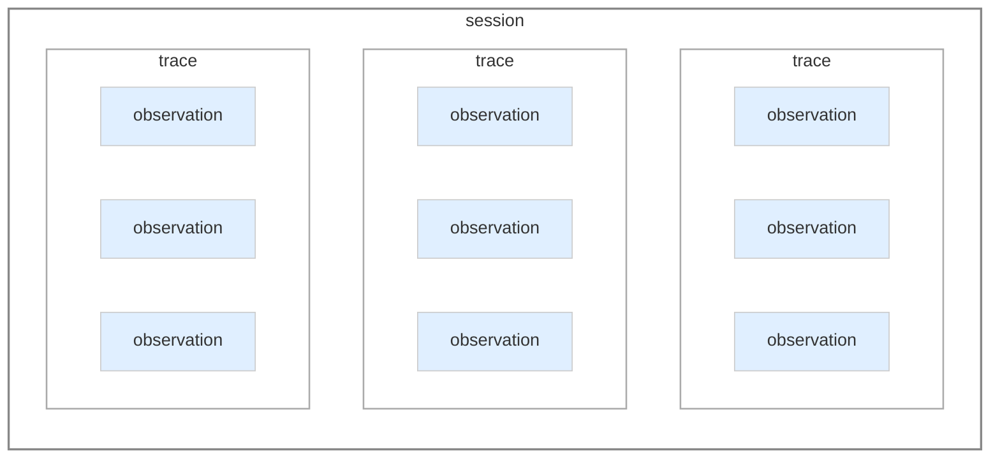
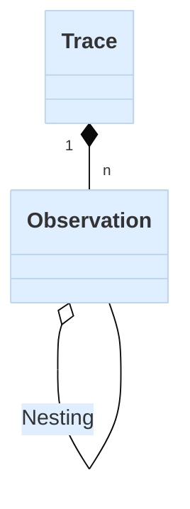
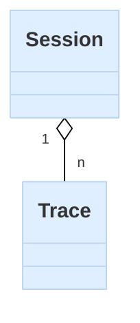
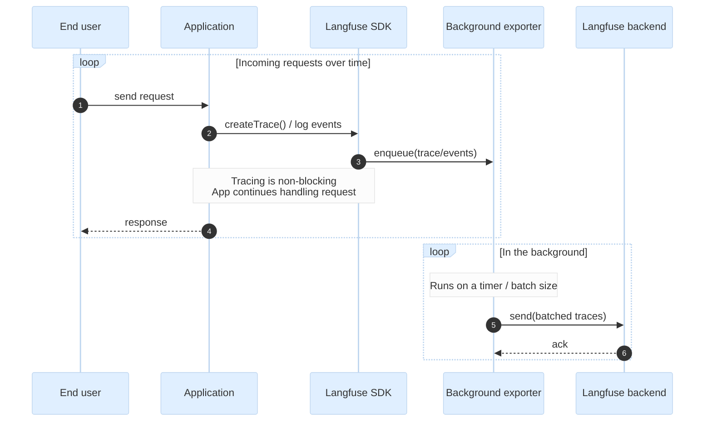
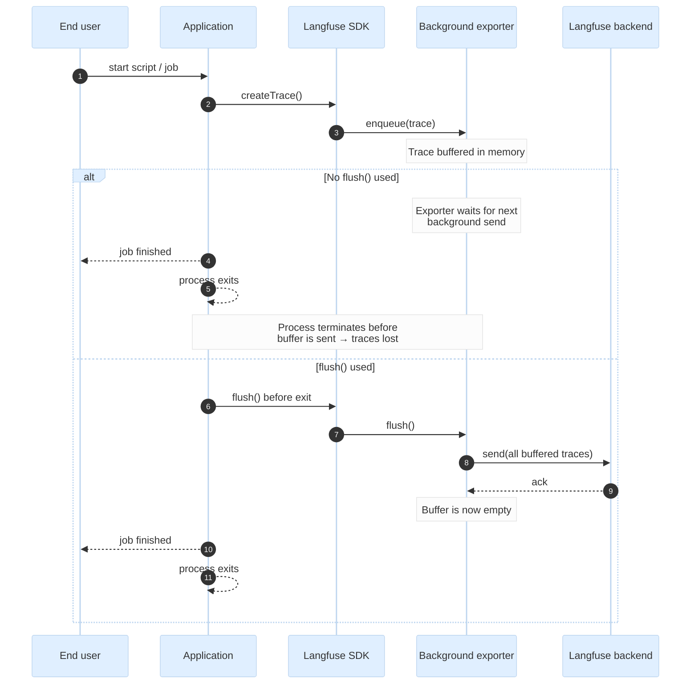

# Core Concepts

This page digs into the underlying concepts of how Langfuse structures and captures your data. Understanding these will make debugging and working with traces easier.

Ready to start? Check out the [Get Started guide](/docs/observability/get-started) to ingest your first trace.

## Traces, Observations and Sessions

Langfuse organizes an application's data into three core concepts: sessions, traces and observations.

### Traces

A `trace` typically represents a single request or operation.
For example, when a user asks a question to a chatbot, that interaction, from the user's question to the bot's response, is captured as one trace. 

It contains the overall input and output of the function, as well as metadata about the request ( i.e. user, session, tags, etc.).

import ObservationTypesList from "@/components-mdx/observation-types-list.mdx";

### Observations

Each trace can contain multiple `observations` to log the individual steps of the execution.  Example observations include LLM text generations, toolcalls, RAG retrieval steps, etc.

#### Nesting

Observations can be nested. The example below shows a trace with a nested observation.

Hierarchical structure of traces in Langfuse

Example trace in Langfuse UI

Example trace in Langfuse UI

#### Types

Langfuse supports a number of LLM application specific [observation types](/docs/observability/features/observation-types):

<ObservationTypesList />

The advantage of using observation types is that you can filter on them, and certain types have special handling in the Langfuse UI.

### Sessions

Optionally, traces can be grouped into [sessions](/docs/tracing-features/sessions).
Sessions are used to group traces that are part of the same user interaction.
A common example is a thread in a chat interface. 

Optionally, sessions aggregate traces

Example session in Langfuse UI

<Frame fullWidth></Frame>

Using sessions is recommended for applications with multi-turn conversations or workflows. Please refer to the [Sessions](/docs/tracing-features/sessions) documentation to add sessions to your traces.

## How Langfuse Captures Data

Now that you understand the data model, let's explore how Langfuse actually captures and processes your traces.

### Built on OpenTelemetry

Langfuse is built on [OpenTelemetry](https://opentelemetry.io/), an open standard for collecting telemetry data from applications. 

This means you're not locked into using only Langfuse-specific SDKs. If you're already using a framework that supports OpenTelemetry—like the Vercel AI SDK, LangChain, or LlamaIndex—it'll work with Langfuse out of the box. You can also send your traces to multiple destinations at once, like Langfuse for LLM observability and Datadog for infrastructure monitoring.

Your instrumentation code stays portable. If you decide to self-host Langfuse or switch to a different observability platform later, you won't need to rewrite your tracing code.

### Background Processing

When you add Langfuse tracing to your application, it doesn't send traces immediately the moment they're created. That would introduce network calls in the middle of your request or script, slowing down your application.

Instead, Langfuse batches traces locally and sends them in the background, keeping your application fast and responsive.

#### Long-running applications

The approach above is perfect for long-running applications (like web servers or APIs) because the background exporter continuously runs and has plenty of time to flush batches on its own.

#### Short-lived applications

For applications that start, execute something, and shut down quickly (such as scripts, CLI tools, or serverless functions), there's a risk that the application terminates while there are still unsent traces in the queue. 

To avoid losing data, short-lived applications must explicitly call `flush()` before exiting. This forces the exporter to send all buffered traces immediately, ensuring nothing is lost when the process terminates.

