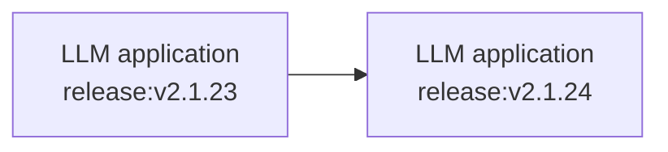
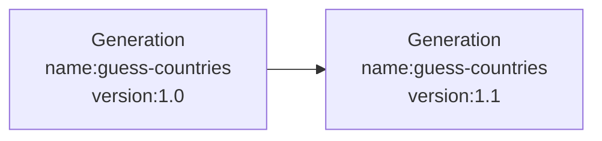

# Releases & Versioning

You can track the effect of changes to your LLM app on metrics in Langfuse. This allows you to:

- **Run experiments (A/B tests)** in production and measure the impact on costs, latencies and quality.
  - _Example_: "What is the impact of switching to a new model?"
- **Explain changes to metrics** over time.
  - _Example:_ "Why did latency in this chain increase?"

## Releases



A `release` tracks the overall version of your application. Commonly it is set to the _semantic version_ or _git commit hash_ of your application.

The SDKs look for a `release` in the following order:

1. SDK initialization
2. Environment variable
3. Automatically on popular platforms

### Initialization

<Tabs items={["Python SDK", "JS/TS", "Environment variable"]}>

<Tab title="Python SDK">

The Python SDK allows you to set the release when initializing the client:

```python
from langfuse import Langfuse, get_client

# Set the release when initializing the client
langfuse = Langfuse(release="v2.1.24")
client = get_client()
```

You can also update the trace's release after creation:

```python
from langfuse import observe, get_client

@observe()
def process_data():
    # Get the client and update the current trace
    langfuse = get_client()
    langfuse.update_current_trace(release="v2.1.24")
    # ...

# With context managers
langfuse = get_client()
with langfuse.start_as_current_span(name="my-operation") as span:
    span.update_trace(release="v2.1.24")
```

</Tab>
<Tab>

The JS/TS SDK will look for a `LANGFUSE_RELEASE` environment variable. Use it to configure the release e.g. in your CI/CD pipeline.

```bash
LANGFUSE_RELEASE = "<release_tag>" # <- github sha or other identifier
```

</Tab>
<Tab title="Environment variable">

The SDKs will look for a `LANGFUSE_RELEASE` environment variable. Use it to configure the release e.g. in your CI/CD pipeline.

```bash
LANGFUSE_RELEASE = "<release_tag>" # <- github sha or other identifier
```


</Tab>

</Tabs>

**Automatically on popular platforms**

If no other `release` is set, the Langfuse SDKs default to a set of known release environment variables.

Supported platforms include: Vercel, Heroku, Netlify. See the full list of support environment variables for [JS/TS](https://github.com/langfuse/langfuse-js/blob/v3-stable/langfuse-core/src/release-env.ts) and [Python](https://github.com/langfuse/langfuse-python/blob/main/langfuse/_utils/environment.py).

## Versions



The `version` parameter can be added to `traces` and all observation types (`span`, `generation`, `event`). Thereby, you can track the effect of a new `version` on the metrics of an object with a specific `name` using [Langfuse analytics](/docs/analytics).

<Tabs items={["Python SDK", "JS/TS", "Langchain (Python)","Langchain (JS)"]}>
<Tab>
When using the `@observe()` decorator:

```python
from langfuse import observe, get_client

@observe()
def process_data():
    langfuse = get_client()

    # Set version at trace level
    langfuse.update_current_trace(version="1.0")

    # Set version at observation level
    langfuse.update_current_span(version="1.0")
```

When creating spans directly:

```python
from langfuse import get_client

langfuse = get_client()

# Set version when creating a span
with langfuse.start_as_current_span(
    name="process-data",
    version="1.0"
) as span:
    # Processing...

    # Create a generation with version
    with span.start_as_current_generation(
        name="guess-countries",
        model="gpt-4o",
        version="1.0"
    ) as generation:
        # Generation code...
        pass
```

The version parameter can be included in both spans and generations, and can be set either during creation or updated later.

</Tab>
<Tab>

```ts /version: "1.0"/
langfuse.generation({
  name: "guess-countries",
  version: "1.0",
});
```

`langfuse.trace()`, `langfuse.span()` and `langfuse.event()` also take an optional `version` parameter.

</Tab>
<Tab>

```python /version="1.0"/
from langfuse.callback import CallbackHandler

handler = CallbackHandler(version="1.0")
```

</Tab>
<Tab>

```ts /version: "1.0"/
import { CallbackHandler } from "langfuse-langchain";

const handler = new CallbackHandler({
  version: "1.0",
});
```

</Tab>
</Tabs>

_Version parameter in Langfuse interface_

<Frame border>
  
</Frame>
