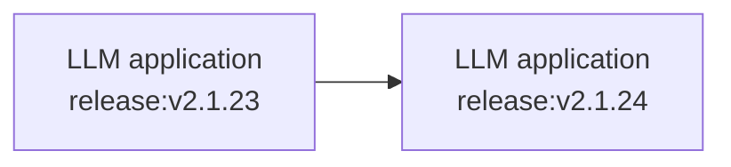
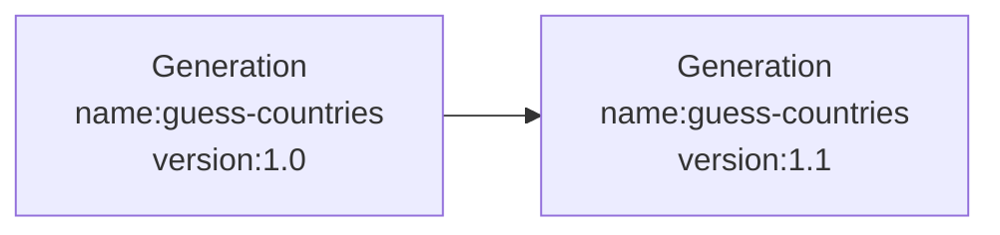

import { PropagationRestrictionsCallout } from "@/components/PropagationRestrictionsCallout";

# Releases & Versioning

You can track the effect of changes to your LLM app on metrics in Langfuse. This allows you to:

- **Run experiments (A/B tests)** in production and measure the impact on costs, latencies and quality.
  - _Example_: "What is the impact of switching to a new model?"
- **Explain changes to metrics** over time.
  - _Example:_ "Why did latency in this chain increase?"

## Releases



A `release` tracks the overall version of your application. Commonly it is set to the _semantic version_ or _git commit hash_ of your application.

The SDKs look for a `release` in the following order:

1. SDK initialization
2. Environment variable
3. Automatically set release identifiers on popular deployment platforms

### Initialization

<LangTabs items={["Python SDK", "JS/TS SDK", "Environment variable"]}>

<Tab title="Python SDK">

The Python SDK allows you to set the release when initializing the client:

```python
from langfuse import Langfuse

# Set the release when initializing the client
langfuse = Langfuse(release="v2.1.24")
```

</Tab>
<Tab>

The JS/TS SDK will look for a `LANGFUSE_RELEASE` environment variable. Use it to configure the release e.g. in your CI/CD pipeline.

```bash
LANGFUSE_RELEASE = "<release_tag>" # <- github sha or other identifier
```

</Tab>
<Tab title="Environment variable">

The SDKs will look for a `LANGFUSE_RELEASE` environment variable. Use it to configure the release e.g. in your CI/CD pipeline.

```bash
LANGFUSE_RELEASE = "<release_tag>" # <- github sha or other identifier
```

</Tab>

</LangTabs>

**Automatically on popular platforms**

If no other `release` is set, the Langfuse SDKs default to a set of known release environment variables.

Supported platforms include: Vercel, Heroku, Netlify. See the full list of support environment variables for [JS/TS](https://github.com/langfuse/langfuse-js/blob/v3-stable/langfuse-core/src/release-env.ts) and [Python](https://github.com/langfuse/langfuse-python/blob/main/langfuse/_utils/environment.py).

## Versions



The `version` parameter can be added to all observation types (e.g., `span`, `generation`, `event`, and [other observation types](/docs/observability/features/observation-types)). Thereby, you can track the effect of a new `version` on the metrics of an object with a specific `name` using [Langfuse analytics](/docs/analytics).

<LangTabs items={["Python SDK", "JS/TS SDK", "Langchain (Python)","Langchain (JS)"]}>
<Tab>
**Set Version on all observations within a context:**

```python /propagate_attributes(version="1.0")/
from langfuse import observe, propagate_attributes

@observe()
def process_data():
    # Propagate version to all child observations
    with propagate_attributes(version="1.0"):
        # All nested operations automatically inherit version
        result = perform_processing()

        return result
```

When creating observations directly:

```python /propagate_attributes(version="1.0")/
from langfuse import get_client, propagate_attributes

langfuse = get_client()

with langfuse.start_as_current_observation(as_type="span", name="process-data") as span:
    # Propagate version to all child observations
    with propagate_attributes(version="1.0"):
        # All observations created here automatically have version="1.0"
        with span.start_as_current_observation(
            as_type="generation",
            name="guess-countries",
            model="gpt-4o"
        ) as generation:
            # This generation automatically has version="1.0"
            pass
```

**Version on a specific observation:**

```python
from langfuse import get_client

langfuse = get_client()

with langfuse.start_as_current_observation(as_type="span", name="process-data", version="1.0") as span:
    # This span has version="1.0"
    pass
```

</Tab>
<Tab>

**Propagating version to all observations within a context:**

```ts /propagateAttributes/
import { startActiveObservation, propagateAttributes } from "@langfuse/tracing";

await startActiveObservation("process-data", async (span) => {
  // Propagate version to all child observations
  await propagateAttributes(
    {
      version: "1.0",
    },
    async () => {
      // All observations created here automatically have version="1.0"
      const generation = startObservation(
        "guess-countries",
        { model: "gpt-4" },
        { asType: "generation" }
      );
      // This generation automatically has version="1.0"
      generation.end();
    }
  );
});
```

**Version on a specific observation:**

```ts
import { startObservation } from "@langfuse/tracing";

const generation = startObservation(
  "guess-countries",
  { model: "gpt-4" },
  { asType: "generation" }
);
generation.update({ version: "1.0" });
generation.end();
```

</Tab>
<Tab>

```python /version="1.0"/
from langfuse.callback import CallbackHandler

handler = CallbackHandler(version="1.0")
```

</Tab>
<Tab>

```ts /version: "1.0"/
import { CallbackHandler } from "langfuse-langchain";

const handler = new CallbackHandler({
  version: "1.0",
});
```

</Tab>
</LangTabs>

<PropagationRestrictionsCallout attributes={["version"]} />

_Version parameter in Langfuse interface_

<Frame>
  
</Frame>
