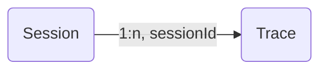

# Sessions

Many interactions with LLM applications span multiple traces. `Sessions` in Langfuse are a way to group these traces together and see a simple **session replay** of the entire interaction. Get started by adding a `sessionId` when creating a trace.



Add a `session_id` / `sessionId` when creating a trace. This can be any string that you use to identify the session (e.g., chat ID, conversation thread ID). All traces with the same `session_id` / `sessionId` will be grouped together.

Use `propagate_attributes()` / `propagateAttributes()` to ensure the session identifier applies to all spans in the trace, enabling accurate session grouping and replay functionality. See the [Attribute Propagation](/docs/observability/features/attribute-propagation) page for comprehensive examples and best practices.

<LangTabs items={["Python SDK", "JS/TS SDK", "OpenAI (Python)", "Langchain (Python)", "Langchain (JS/TS)", "Flowise"]}>

<Tab title="Python SDK (v3)">

```python
from langfuse import observe, propagate_attributes

@observe()
def handle_chat_message(message, chat_id):
    with propagate_attributes(session_id=chat_id):
        context = load_conversation_history(chat_id)
        response = generate_response(message, context)
        save_to_history(chat_id, message, response)
        return response
```

See [Attribute Propagation](/docs/observability/features/attribute-propagation) for more details.

</Tab>
<Tab title="JS/TS SDK">

```ts
import { observe, propagateAttributes } from "@langfuse/tracing";

const handleChatMessage = observe(async (message: string, chatId: string) => {
  return await propagateAttributes({
    sessionId: chatId
  }, async () => {
    const context = await loadConversationHistory(chatId);
    const response = await generateResponse(message, context);
    await saveToHistory(chatId, message, response);
    return response;
  });
}, { name: 'handle-chat-message' });
```

See [Attribute Propagation](/docs/observability/features/attribute-propagation) for more details.

</Tab>
<Tab>

```python
from langfuse.openai import openai

completion = openai.chat.completions.create(
  name="test-chat",
  model="gpt-3.5-turbo",
  messages=[
    {"role": "system", "content": "You are a calculator."},
    {"role": "user", "content": "1 + 1 = "}],
  temperature=0,
  metadata={"langfuse_session_id": "your-session-id"}
)
```

</Tab>
<Tab>

```python
from langfuse.langchain import CallbackHandler

handler = CallbackHandler()

# Pass langfuse_session_id as metadata to the chain invocation
chain.invoke(
    {"animal": "dog"},
    config={
        "callbacks": [handler],
        "metadata": {
            "langfuse_session_id": "your-session-id",
        },
    },
)
```

</Tab>
<Tab title="Langchain (JS/TS)">

When using the [CallbackHandler](/integrations/frameworks/langchain), you can pass the `sessionId` to the constructor:

```ts
const handler = new CallbackHandler({
  sessionId: "your-session-id",
});
```

You can also set the `session_id` dynamically via the runnable configuration in the chain invocation:

```ts
import { CallbackHandler } from "langfuse-langchain";

const langfuseHandler = new CallbackHandler();

// Your existing Langchain code to create the chain
...

// Pass langfuseSessionId as metadata to the chain invocation to be parsed as the Langfuse session_id
await chain.invoke(
  { input: "<user_input>" },
  { callbacks: [langfuseHandler], metadata: { langfuseSessionId: "your-session-id" } }
);
```

When using the integration with the JS SDK (see [interop docs](/integrations/frameworks/langchain#interoperability)), set the sessionId via `langfuse.trace()`:

```ts
import { CallbackHandler, Langfuse } from "langfuse-langchain";
const langfuse = new Langfuse();

const trace = langfuse.trace({
  sessionId: "your-session-id",
});
const langfuseHandler = new CallbackHandler({ root: trace });

// Add Langfuse handler as callback to your langchain chain/agent
await chain.invoke({ input: "<user_input>" }, { callbacks: [langfuseHandler] });
```

</Tab>

<Tab title="Flowise">
The [Flowise Integration](/docs/flowise) automatically maps the Flowise chatId to the Langfuse sessionId. Flowise 1.4.10 or higher is required.

</Tab>

</LangTabs>

## Example

Try this feature using the public [example project](/docs/demo).

_Example session spanning multiple traces_

<Frame fullWidth></Frame>

## Other features

- Publish a session to share with others as a public link ([example](https://cloud.langfuse.com/project/clkpwwm0m000gmm094odg11gi/sessions/lf.docs.conversation.TL4KDlo))
- Bookmark a session to easily find it later
- Annotate sessions by adding `scores` via the Langfuse UI to record human-in-the-loop evaluations
- How to [evaluate sessions](/faq/all/evaluating-sessions-conversations) in Langfuse?

## GitHub Discussions

import { GhDiscussionsPreview } from "@/components/gh-discussions/GhDiscussionsPreview";

<GhDiscussionsPreview labels={["feat-sessions"]} />
