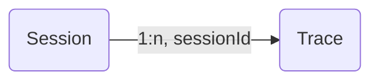

import { PropagationRestrictionsCallout } from "@/components/PropagationRestrictionsCallout";

# Sessions

Many interactions with LLM applications span multiple traces and observations. `Sessions` in Langfuse are a special way to group these observations across traces together and see a simple **session replay** of the entire interaction. Get started by propagating the `sessionId` attribute across observations.



Propagate a `sessionId` across observations that span multiple traces. The `sessionId` can be any US-ASCII character string less than 200 characters that you use to identify the session. All observations with the same `sessionId` will be grouped together including their enclosing traces. If a session ID exceeds 200 characters, it will be dropped.

<LangTabs items={["Python SDK", "JS/TS SDK", "OpenAI (Python)", "Langchain (Python)", "Langchain (JS/TS)", "Flowise"]}>

<Tab title="Python SDK (v3)">
When using the `@observe()` decorator:

```python /propagate_attributes(session_id="your-session-id")/
from langfuse import observe, propagate_attributes

@observe()
def process_request():
    # Propagate session_id to all child observations
    with propagate_attributes(session_id="your-session-id"):
        # All nested observations automatically inherit session_id
        result = process_chat_message()

        return result
```

When creating observations directly:

```python /propagate_attributes(session_id="chat-session-123")/
from langfuse import get_client, propagate_attributes

langfuse = get_client()

with langfuse.start_as_current_observation(
    as_type="span",
    name="process-chat-message"
) as root_span:
    # Propagate session_id to all child observations
    with propagate_attributes(session_id="chat-session-123"):
        # All observations created here automatically have session_id
        with root_span.start_as_current_observation(
            as_type="generation",
            name="generate-response",
            model="gpt-4o"
        ) as gen:
            # This generation automatically has session_id
            pass
```

</Tab>
<Tab title="JS/TS SDK">

When using the context manager:

```ts /propagateAttributes/
import { startActiveObservation, propagateAttributes } from "@langfuse/tracing";

await startActiveObservation("context-manager", async (span) => {
  span.update({
    input: { query: "What is the capital of France?" },
  });

  // Propagate sessionId to all child observations
  await propagateAttributes(
    {
      sessionId: "session-123",
    },
    async () => {
      // All observations created here automatically have sessionId
      // ... your logic ...
    },
  );
});
```

When using the `observe` wrapper:

```ts /propagateAttributes/
import { observe, propagateAttributes } from "@langfuse/tracing";

const processChatMessage = observe(
  async (message: string) => {
    // Propagate sessionId to all child observations
    return await propagateAttributes({ sessionId: "session-123" }, async () => {
      // All nested observations automatically inherit sessionId
      const result = await processMessage(message);
      return result;
    });
  },
  { name: "process-chat-message" },
);

const result = await processChatMessage("Hello!");
```

See [JS/TS SDK docs](/docs/sdk/typescript/guide) for more details.

</Tab>
<Tab>

```python /propagate_attributes(session_id="your-session-id")/
from langfuse import get_client, propagate_attributes
from langfuse.openai import openai

langfuse = get_client()

with langfuse.start_as_current_observation(as_type="span", name="openai-call"):
    # Propagate session_id to all observations including OpenAI generation
    with propagate_attributes(session_id="your-session-id"):
        completion = openai.chat.completions.create(
            name="test-chat",
            model="gpt-3.5-turbo",
            messages=[
                {"role": "system", "content": "You are a calculator."},
                {"role": "user", "content": "1 + 1 = "}
            ],
            temperature=0,
        )
```

</Tab>
<Tab>

```python /propagate_attributes(session_id="your-session-id")/
from langfuse import get_client, propagate_attributes
from langfuse.langchain import CallbackHandler

langfuse = get_client()
handler = CallbackHandler()

with langfuse.start_as_current_observation(as_type="span", name="langchain-call"):
    # Propagate session_id to all observations
    with propagate_attributes(session_id="your-session-id"):
        # Pass handler to the chain invocation
        chain.invoke(
            {"animal": "dog"},
            config={"callbacks": [handler]},
        )
```

</Tab>
<Tab title="Langchain (JS/TS)">

Use `propagateAttributes()` with the CallbackHandler:

```ts /propagateAttributes/
import { startActiveObservation, propagateAttributes } from "@langfuse/tracing";
import { CallbackHandler } from "langfuse-langchain";

const langfuseHandler = new CallbackHandler();

await startActiveObservation("langchain-call", async () => {
  // Propagate sessionId to all observations
  await propagateAttributes(
    {
      sessionId: "your-session-id",
    },
    async () => {
      // Pass handler to the chain invocation
      await chain.invoke(
        { input: "<user_input>" },
        { callbacks: [langfuseHandler] },
      );
    },
  );
});
```

</Tab>

<Tab title="Flowise">
The [Flowise Integration](/docs/flowise) automatically maps the Flowise chatId to the Langfuse sessionId. Flowise 1.4.10 or higher is required.

</Tab>

</LangTabs>

<PropagationRestrictionsCallout attributes={["sessionId"]} />

## Example

Try this feature using the public [example project](/docs/demo).

_Example session spanning multiple traces_

<Frame fullWidth></Frame>

## Other features

- Publish a session to share with others as a public link ([example](https://cloud.langfuse.com/project/clkpwwm0m000gmm094odg11gi/sessions/lf.docs.conversation.TL4KDlo))
- Bookmark a session to easily find it later
- Annotate sessions by adding `scores` via the Langfuse UI to record human-in-the-loop evaluations
- How to [evaluate sessions](/faq/all/evaluating-sessions-conversations) in Langfuse?

## GitHub Discussions

import { GhDiscussionsPreview } from "@/components/gh-discussions/GhDiscussionsPreview";

<GhDiscussionsPreview labels={["feat-sessions"]} />
