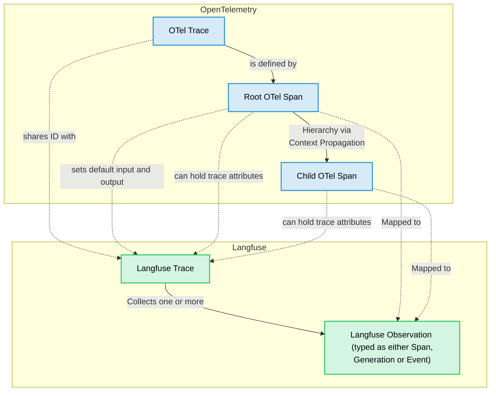

import GetStartedPythonSdk from "@/components-mdx/get-started/python-sdk.mdx";
import EnvJS from "@/components-mdx/env-js.mdx";
import JSSDKPackages from "@/components-mdx/js-sdk-packages.mdx";
import { Rocket, Plug, Settings, LifeBuoy, BookOpen } from "lucide-react";

# Langfuse SDKs

Langfuse offers two SDKs for **Python** and **JS/TS**. The Langfuse SDKs are the recommended way to create [custom observations and traces](/docs/observability/sdk/instrumentation#custom-instrumentation) and use the Langfuse [prompt-management](/docs/prompt-management/overview) and [evaluation](/docs/evaluation/overview) features. Both SDKs are OpenTelemetry-based, async by default, and interoperate with Langfuse [native integrations](/integrations).


<details>
<summary>Requirements for self-hosted Langfuse</summary>

<Tabs items={["Python SDK", "JS/TS SDK"]}>
<Tab title="Python SDK v3">
<Callout type="info">
If you are self-hosting Langfuse, the Python SDK v3 requires [**Langfuse platform version >= 3.63.0**](https://github.com/langfuse/langfuse/releases/tag/v3.63.0) for traces to be correctly processed.
</Callout>
</Tab>
<Tab title="TypeScript SDK v4">
<Callout type="info">

If you are self-hosting Langfuse, the TypeScript SDK v4 requires **Langfuse platform version ≥ 3.95.0** for all features to work correctly.
</Callout>
</Tab>
</Tabs>

</details>


<details>
<summary>Legacy documentation</summary>

<Tabs items={["Python SDK", "JS/TS SDK"]}>
<Tab title="Python">
This documentation is for the Python SDK v3. Documentation for the legacy Python SDK v2 can be found [here](https://python-sdk-v2.docs-snapshot.langfuse.com/docs/observability/sdk/python/decorators).
</Tab>
<Tab title="TypeScript">
This documentation is for the TypeScript SDK v4. Documentation for the legacy TypeScript SDK v3 can be found [here](https://js-sdk-v3.docs-snapshot.langfuse.com/docs/observability/sdk/typescript/guide/).
</Tab>
</Tabs>

</details>

**Key benefits**

- Based on [OpenTelemetry](https://opentelemetry.io/), so you can use any OTEL-based instrumentation library for your LLM stack.
- Fully async requests, meaning Langfuse adds almost no latency.
- Accurate latency tracking via synchronous timestamps.
- IDs available for downstream use.
- Great DX when nesting observations.
- Cannot break your application: SDK errors are caught and logged.
- Interoperable with Langfuse [native integrations](/integrations).

## Quickstart

Follow the quickstart guide to get the first trace into Langfuse. See the [setup](#setup) section for more details.

<Tabs items={["Python", "TypeScript"]}>
<Tab title="Python">
<GetStartedPythonSdk />
</Tab>
<Tab title="TypeScript">

**1. Install packages:**

```bash
npm install @langfuse/tracing @langfuse/otel @opentelemetry/sdk-node
```

**2. Set environment variables:**

<EnvJS />

**3. Initialize OpenTelemetry:**

Create an `instrumentation.ts` to register the Langfuse span processor so traces reach Langfuse.

```ts filename="instrumentation.ts" /LangfuseSpanProcessor/
import { NodeSDK } from "@opentelemetry/sdk-node";
import { LangfuseSpanProcessor } from "@langfuse/otel";

const sdk = new NodeSDK({
  spanProcessors: [new LangfuseSpanProcessor()],
});

sdk.start();
```

Import this file at the top of your app's entry point (e.g., `index.ts`).

**4. Instrument your app:**

Use a Langfuse [integration](/integrations) or manual instrumentation. The `startActiveObservation` helper manages the OpenTelemetry context for you.

```ts filename="index.ts" /startActiveObservation/
import "./instrumentation";
import { startActiveObservation } from "@langfuse/tracing";

async function main() {
  await startActiveObservation("my-first-trace", async (span) => {
    span.update({
      input: "Hello, Langfuse!",
      output: "This is my first trace!",
    });
  });
}

main();
```

**5. Run your application and see the trace in Langfuse:**

```bash
npx tsx index.ts
```

<Frame>

</Frame>

Public link to the [trace in Langfuse](https://cloud.langfuse.com/project/cloramnkj0002jz088vzn1ja4/traces/ef10df7b3f9e4a8adc834c18934bace0?timestamp=2025-12-03T14%3A44%3A10.907Z&observation=c71b480595bbe18c).


</Tab>
</Tabs>

## Setup

### Install the SDK

<Tabs items={["Python", "TypeScript"]}>
<Tab title="Python">

Pip install the [Langfuse Python SDK](https://pypi.org/project/langfuse/).

```bash
pip install langfuse
```
</Tab>
<Tab title="TypeScript">

Install the relevant packages for a full tracing setup:

```bash
npm install @langfuse/tracing @langfuse/otel @opentelemetry/sdk-node
```

<JSSDKPackages />

</Tab>
</Tabs>

### Configure credentials

Add your Langfuse credentials to your environment variables. You can get your credentials by signing up for a free [Langfuse Cloud](https://cloud.langfuse.com) account or by [self-hosting Langfuse](https://langfuse.com/self-hosting).

If you are self-hosting Langfuse or using a [data region](/security/data-regions) other than the default (EU, https://cloud.langfuse.com), ensure you configure the host argument or the `LANGFUSE_BASE_URL` environment variable (recommended).

Make sure that you have a `.env` file in your project root and a package like `dotenv` to load the variables.

<EnvJS />

<Callout type="info">
If you create multiple `Langfuse` instances with the same `public_key`, the singleton instance is reused and new arguments are ignored.
</Callout>

### Initialize OpenTelemetry (JS/TS)

The Langfuse TypeScript SDK's tracing is built on top of OpenTelemetry, so you need to set up the OpenTelemetry SDK. The `LangfuseSpanProcessor` is the key component that sends traces to Langfuse.

```ts filename="instrumentation.ts" /LangfuseSpanProcessor/
import { NodeSDK } from "@opentelemetry/sdk-node";
import { LangfuseSpanProcessor } from "@langfuse/otel";

const sdk = new NodeSDK({
  spanProcessors: [new LangfuseSpanProcessor()],
});

sdk.start();
```

The `LangfuseSpanProcessor` is the key component that sends traces to Langfuse.

For more options to configure the LangfuseSpanProcessor such as masking, filtering, and more, see [the advanced usage](/docs/observability/sdk/typescript/advanced-usage).

You can learn more about setting up OpenTelemetry in your JS environment [here](https://opentelemetry.io/docs/languages/js/getting-started/nodejs/).

<Callout type="info">
**Next.js users:**

If you are using Next.js, please use the OpenTelemetry setup via the `NodeSDK` described above rather than via `registerOTel` from `@vercel/otel`. This is because [the `@vercel/otel` package does not yet support the OpenTelemetry JS SDK v2](https://github.com/vercel/otel/issues/154) on which the `@langfuse/tracing` and `@langfuse/otel` packages are based.

[See here for a full example for the Vercel AI SDK with NextJS on Vercel](/docs/observability/sdk/typescript/instrumentation#native-instrumentation).

</Callout>


### Client Setup [#client-setup]

<Tabs items={["Python", "TypeScript"]}>
<Tab title="Python">
```python filename="Initialize client"
from langfuse import get_client

langfuse = get_client()

# Verify connection
if langfuse.auth_check():
    print("Langfuse client is authenticated and ready!")
else:
    print("Authentication failed. Please check your credentials and host.")
```

<details>
<summary>Key configuration options</summary>

All key configuration options are listed in the [Python SDK reference](https://python.reference.langfuse.com/langfuse#Langfuse).

| Constructor Argument        | Environment Variable                 | Description                                                                                                                           | Default value                  |
| --------------------------- | ------------------------------------ | ------------------------------------------------------------------------------------------------------------------------------------- | ------------------------------ |
| `public_key`                | `LANGFUSE_PUBLIC_KEY`                | Your Langfuse project's public API key. **Required.**                                                                                 |                                |
| `secret_key`                | `LANGFUSE_SECRET_KEY`                | Your Langfuse project's secret API key. **Required.**                                                                                 |                                |
| `base_url`                 | `LANGFUSE_BASE_URL`                 | API host for your Langfuse instance.                                                                                                   | `"https://cloud.langfuse.com"` |
| `timeout`                   | `LANGFUSE_TIMEOUT`                   | Timeout in seconds for API requests.                                                                                                  | `5`                            |
| `httpx_client`              | -                                    | Custom `httpx.Client` for non-tracing HTTP requests.                                                                                  |                                |
| `debug`                     | `LANGFUSE_DEBUG`                     | Enables verbose logging.                                                                                                              | `False`                        |
| `tracing_enabled`           | `LANGFUSE_TRACING_ENABLED`           | Toggles Langfuse instrumentation; if `False`, tracing calls become no-ops.                                                            | `True`                         |
| `flush_at`                  | `LANGFUSE_FLUSH_AT`                  | Number of spans to batch before sending.                                                                                              | `512`                          |
| `flush_interval`            | `LANGFUSE_FLUSH_INTERVAL`            | Seconds between batch flushes.                                                                                                        | `5`                            |
| `environment`               | `LANGFUSE_TRACING_ENVIRONMENT`       | Environment name (lowercase alphanumeric, hyphen/underscore).                                                                         | `"default"`                   |
| `release`                   | `LANGFUSE_RELEASE`                   | Release identifier for grouping analytics.                                                                                            |                                |
| `media_upload_thread_count` | `LANGFUSE_MEDIA_UPLOAD_THREAD_COUNT` | Background threads for media uploads.                                                                                                 | `1`                            |
| `sample_rate`               | `LANGFUSE_SAMPLE_RATE`               | [Sampling](/docs/observability/features/sampling) rate between `0.0` and `1.0`.                                                       | `1.0`                          |
| `mask`                      | -                                    | [Mask](/docs/observability/sdk/advanced-features#mask-sensitive-data) sensitive data before export.                                   |                                |
|                             | `LANGFUSE_MEDIA_UPLOAD_ENABLED`      | Whether to upload media files to Langfuse storage (useful to disable when self-hosting).                                              | `True`                         |

</details>

</Tab>
<Tab title="TypeScript">

Initialize the `LangfuseClient` to interact with Langfuse. The client will automatically use the environment variables you set above.

```ts filename="client.ts"
import { LangfuseClient } from "@langfuse/client";

const langfuse = new LangfuseClient();
```

<details>
<summary>Alternative: Configure via constructor</summary>

You can also pass configuration options directly to the constructor:

```ts filename="client.ts"
import { LangfuseClient } from "@langfuse/client";

const langfuse = new LangfuseClient({
  publicKey: "your-public-key",
  secretKey: "your-secret-key",
  baseUrl: "https://cloud.langfuse.com", // or your self-hosted instance
});
```

</details>


</Tab>
</Tabs>

### Access the client globally (Python)

The Langfuse client is a singleton. It can be accessed anywhere in your application using the `get_client` function.

Optionally, you can initialize the client via `Langfuse()` to pass in configuration options (see above). Otherwise, it is created automatically when you call `get_client()` based on environment variables.

```python
from langfuse import get_client

# Optionally, initialize the client with configuration options
# langfuse = Langfuse(public_key="pk-lf-...", secret_key="sk-lf-...")

# Get the default client
client = get_client()
```

### OpenTelemetry foundation

Building on OpenTelemetry provides:

- **Standardization** with the wider observability ecosystem and tooling.
- **Robust context propagation** so nested spans stay connected, even across async workloads.
- **Attribute propagation** to keep `userId`, `sessionId`, `metadata`, `version`, and `tags` aligned across observations.
- **Ecosystem interoperability** meaning third-party instrumentations automatically appear inside Langfuse traces.

The following diagram shows how Langfuse maps to native OpenTelemetry concepts:



- **OTel Trace**: An OTel-trace represents the entire lifecycle of a request or transaction as it moves through your application and its services. A trace is typically a sequence of operations, like an LLM generating a response followed by a parsing step. The root (first) span created in a sequence defines the OTel trace. OTel traces do not have a start and end time, they are defined by the root span.
- **OTel Span**: A span represents a single unit of work or operation within a trace. Spans have a start and end time, a name, and can have attributes (key-value pairs of metadata). Spans can be nested to create a hierarchy, showing parent-child relationships between operations.
- **Langfuse Trace**: A Langfuse trace collects observations and holds trace attributes such as `session_id`, `user_id` as well as overall input and outputs. It shares the same ID as the OTel trace and its attributes are set via specific OTel span attributes that are automatically propagated to the Langfuse trace.
- **Langfuse Observation**: In Langfuse terminology, an "observation" is a Langfuse-specific representation of an OTel span. It can be a generic span (Langfuse-span), a specialized "generation" (Langfuse-generation), a point-in-time event (Langfuse-event), or [other observation types](/docs/observability/features/observation-types).
  - **Langfuse Span**: A Langfuse-span is a generic OTel span in Langfuse, designed for non-LLM operations.
  - **Langfuse Generation**: A Langfuse-generation is a specialized type of OTel span in Langfuse, designed specifically for Large Language Model (LLM) calls. It includes additional fields like `model`, `model_parameters`, `usage_details` (tokens), and `cost_details`.
  - **Langfuse Event**: A Langfuse-event tracks a point in time action.
- **Context Propagation**: OpenTelemetry automatically handles the propagation of the current trace and span context. This means when you call another function (whether it's also traced by Langfuse, an OTel-instrumented library, or a manually created span), the new span will automatically become a child of the currently active span, forming a correct trace hierarchy.
- **Attribute Propagation**: Certain trace attributes (`user_id`, `session_id`, `metadata`, `version`, `tags`) can be automatically propagated to all child observations using `propagate_attributes()`. This ensures consistent attribute coverage across all observations in a trace. See the [instrumentation docs](/docs/observability/sdk/python/instrumentation#propagating-trace-attributes) for details.

The Langfuse SDKs provides wrappers around OTel spans (`LangfuseSpan`, `LangfuseGeneration`) that offer convenient methods for interacting with Langfuse-specific features like scoring and media handling, while still being native OTel spans under the hood. You can also use these wrapper objects to add Langfuse trace attributes via `update_trace()` or use `propagate_attributes()` for automatic propagation to all child observations.

## Learn more

<Cards num={2}>
  <Card
    icon={<Rocket size="24" />}
    title="Instrument your app"
    href="/docs/observability/sdk/instrumentation"
    arrow
  />
  <Card
    icon={<Plug size="24" />}
    title="Advanced features"
    href="/docs/observability/sdk/advanced-features"
    arrow
  />
  <Card
    icon={<Settings size="24" />}
    title="Upgrade path"
    href="/docs/observability/sdk/upgrade-path"
    arrow
  />
  <Card
    icon={<LifeBuoy size="24" />}
    title="Troubleshooting & FAQ"
    href="/docs/observability/sdk/troubleshooting-and-faq"
    arrow
  />
  <Card
    icon={<BookOpen size="24" />}
    title="Python API reference"
    href="https://python.reference.langfuse.com"
    newWindow
    arrow
  />
  <Card
    icon={<BookOpen size="24" />}
    title="JS/TS API reference"
    href="https://js.reference.langfuse.com/"
    newWindow
    arrow
  />
</Cards>

## Other languages

Via the [public API](/docs/api-and-data-platform/features/public-api) you can integrate Langfuse from any runtime. For tracing specifically, send OpenTelemetry spans from your preferred instrumentation (Java, Go, etc.) to the [Langfuse OTel endpoint](/integrations/native/opentelemetry).
