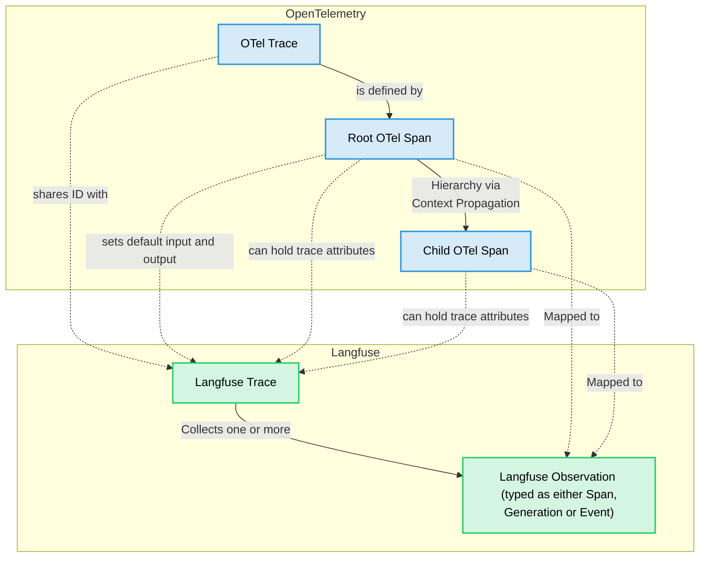

import GetStartedPythonSdk from "@/components-mdx/get-started/python-sdk.mdx";
import EnvJS from "@/components-mdx/env-js.mdx";
import JSSDKPackages from "@/components-mdx/js-sdk-packages.mdx";
import { Rocket, Plug, Settings, LifeBuoy, BookOpen } from "lucide-react";

# Langfuse SDKs

Langfuse offers two SDKs for **Python** and **JS/TS**. The Langfuse SDKs are the recommended way to integrate custom instrumentation, evaluations, and prompt tooling with Langfuse. Both SDKs are OpenTelemetry-based, async by default, and interoperate with Langfuse integrations.

<details>
<summary>Legacy documentation</summary>

<Tabs items={["Python SDK", "JS/TS SDK"]}>
<Tab title="Python">
This documentation is for the Python SDK v3. Documentation for the legacy Python SDK v2 can be found [here](https://python-sdk-v2.docs-snapshot.langfuse.com/docs/observability/sdk/python/decorators).
</Tab>
<Tab title="TypeScript">
This documentation is for the TypeScript SDK v4. Documentation for the legacy TypeScript SDK v3 can be found [here](https://js-sdk-v3.docs-snapshot.langfuse.com/docs/observability/sdk/typescript/guide/).
</Tab>
</Tabs>

</details>

<details>
<summary>Requirements for self-hosted Langfuse</summary>

<Tabs items={["Python SDK", "JS/TS SDK"]}>
<Tab title="Python SDK v3">
<Callout type="info">
If you are self-hosting Langfuse, the Python SDK v3 requires [**Langfuse platform version >= 3.63.0**](https://github.com/langfuse/langfuse/releases/tag/v3.63.0) for traces to be correctly processed.
</Callout>
</Tab>
<Tab title="TypeScript SDK v4">
<Callout type="info">

If you are self-hosting Langfuse, the TypeScript SDK v4 requires **Langfuse platform version ≥ 3.95.0** for all features to work correctly.
</Callout>
</Tab>
</Tabs>

</details>


**Key benefits**

- Based on OpenTelemetry, so you can use any OTEL-based instrumentation library for your LLM stack.
- Fully async requests, meaning Langfuse adds almost no latency.
- Accurate latency tracking via synchronous timestamps.
- IDs available for downstream use.
- Great DX when nesting observations.
- Cannot break your application—SDK errors are caught and logged.
- Interoperable with Langfuse [integrations](/integrations).

## Quickstart

Follow the path for your runtime to get the first trace into Langfuse.

<Tabs items={["Python", "TypeScript"]}>
<Tab title="Python">
<GetStartedPythonSdk />
</Tab>
<Tab title="TypeScript">

**Install packages**

Install the packages that power tracing with OpenTelemetry:

```bash
npm install @langfuse/tracing @langfuse/otel @opentelemetry/sdk-node
```

Learn more about the packages [here](/docs/observability/sdk/overview#packages).

**Set environment variables**

Add your Langfuse credentials to your environment. Make sure that you have a `.env` file in your project root and a package like `dotenv` to load the variables.

<EnvJS />

**Initialize OpenTelemetry**

Create an `instrumentation.ts` to register the Langfuse span processor so traces reach Langfuse.

```ts filename="instrumentation.ts" /LangfuseSpanProcessor/
import { NodeSDK } from "@opentelemetry/sdk-node";
import { LangfuseSpanProcessor } from "@langfuse/otel";

const sdk = new NodeSDK({
  spanProcessors: [new LangfuseSpanProcessor()],
});

sdk.start();
```

Import this file at the top of your app's entry point (e.g., `index.ts`).

**Instrument your app**

Use a Langfuse [integration](/integrations) or manual instrumentation. The `startActiveObservation` helper manages the OpenTelemetry context for you.

```ts filename="index.ts" /startActiveObservation/
import "./instrumentation";
import { startActiveObservation } from "@langfuse/tracing";

async function main() {
  await startActiveObservation("my-first-trace", async (span) => {
    span.update({
      input: "Hello, Langfuse!",
      output: "This is my first trace!",
    });
  });
}

main();
```

**Run your application**

Execute your application and the trace will appear in Langfuse.

```bash
npx tsx index.ts
```


</Tab>
</Tabs>

## Install the SDK

<Tabs items={["Python", "TypeScript"]}>
<Tab title="Python">
```bash
pip install langfuse
```
</Tab>
<Tab title="TypeScript">
```bash
npm install @langfuse/tracing @langfuse/otel @opentelemetry/sdk-node
```

<JSSDKPackages />

</Tab>
</Tabs>

## Configure credentials

Add your Langfuse credentials to your environment. 

<EnvJS />

## Initialize tracing

<Tabs items={["Python", "TypeScript"]}>
<Tab title="Python">
```python filename="Initialize client"
from langfuse import get_client

langfuse = get_client()

# Verify connection
if langfuse.auth_check():
    print("Langfuse client is authenticated and ready!")
else:
    print("Authentication failed. Please check your credentials and host.")
```

<details>
<summary>Key configuration options</summary>

All key configuration options are listed in the [Python SDK reference](https://python.reference.langfuse.com/langfuse#Langfuse).

| Constructor Argument        | Environment Variable                 | Description                                                                                                                           | Default value                  |
| --------------------------- | ------------------------------------ | ------------------------------------------------------------------------------------------------------------------------------------- | ------------------------------ |
| `public_key`                | `LANGFUSE_PUBLIC_KEY`                | Your Langfuse project's public API key. **Required.**                                                                                 |                                |
| `secret_key`                | `LANGFUSE_SECRET_KEY`                | Your Langfuse project's secret API key. **Required.**                                                                                 |                                |
| `base_url`                 | `LANGFUSE_BASE_URL`                 | API host for your Langfuse instance.                                                                                                   | `"https://cloud.langfuse.com"` |
| `timeout`                   | `LANGFUSE_TIMEOUT`                   | Timeout in seconds for API requests.                                                                                                  | `5`                            |
| `httpx_client`              | -                                    | Custom `httpx.Client` for non-tracing HTTP requests.                                                                                  |                                |
| `debug`                     | `LANGFUSE_DEBUG`                     | Enables verbose logging.                                                                                                              | `False`                        |
| `tracing_enabled`           | `LANGFUSE_TRACING_ENABLED`           | Toggles Langfuse instrumentation; if `False`, tracing calls become no-ops.                                                            | `True`                         |
| `flush_at`                  | `LANGFUSE_FLUSH_AT`                  | Number of spans to batch before sending.                                                                                              | `512`                          |
| `flush_interval`            | `LANGFUSE_FLUSH_INTERVAL`            | Seconds between batch flushes.                                                                                                        | `5`                            |
| `environment`               | `LANGFUSE_TRACING_ENVIRONMENT`       | Environment name (lowercase alphanumeric, hyphen/underscore).                                                                         | `"default"`                   |
| `release`                   | `LANGFUSE_RELEASE`                   | Release identifier for grouping analytics.                                                                                            |                                |
| `media_upload_thread_count` | `LANGFUSE_MEDIA_UPLOAD_THREAD_COUNT` | Background threads for media uploads.                                                                                                 | `1`                            |
| `sample_rate`               | `LANGFUSE_SAMPLE_RATE`               | [Sampling](/docs/observability/features/sampling) rate between `0.0` and `1.0`.                                                       | `1.0`                          |
| `mask`                      | -                                    | [Mask](/docs/observability/sdk/advanced-features#mask-sensitive-data) sensitive data before export.                                   |                                |
|                             | `LANGFUSE_MEDIA_UPLOAD_ENABLED`      | Whether to upload media files to Langfuse storage (useful to disable when self-hosting).                                              | `True`                         |

</details>

</Tab>
<Tab title="TypeScript">
```ts filename="instrumentation.ts" /LangfuseSpanProcessor/
import { NodeSDK } from "@opentelemetry/sdk-node";
import { LangfuseSpanProcessor } from "@langfuse/otel";

const sdk = new NodeSDK({
  spanProcessors: [new LangfuseSpanProcessor()],
});

sdk.start();
```

Configure tracing via environment variables (see above) and by passing options to `LangfuseSpanProcessor`, e.g. `mask`, `shouldExportSpan`, or `exportMode`. Advanced options such as sampling, isolated tracer providers, serverless flushing, and multi-project exports are covered in [Advanced features](/docs/observability/sdk/advanced-features).

All key configuration options are listed in the [JS/TS SDK reference](https://js.reference.langfuse.com/classes/_langfuse_otel.LangfuseSpanProcessor.html).

<Callout type="info">
**Next.js users:** use the `NodeSDK` setup above instead of `registerOTel` from `@vercel/otel`, which does not yet support the OpenTelemetry JS SDK v2.
</Callout>
</Tab>
</Tabs>

## Access the client globally

<Tabs items={["Python", "TypeScript"]}>
<Tab title="Python">
The Langfuse client is a singleton. It can be accessed anywhere in your application using the `get_client()` function.

Optionally, you can initialize the client via `Langfuse()` to manually pass in the Langfuse credentials. Otherwise, it is created automatically when you call `get_client()` based on environment variables.

```python
from langfuse import get_client
 
# Get the default client
client = get_client()
```
<details>
<summary>Alternative: configure via constructor</summary>

```python filename="Initialize client"
from langfuse import Langfuse

langfuse = Langfuse(
  public_key="pk-lf-...", 
  secret_key="sk-lf-...",
  base_url="https://cloud.langfuse.com"
)
```
</details>


</Tab>
<Tab title="TypeScript">
Use `LangfuseClient` for non-tracing APIs (datasets, prompts, scores). Environment variables are picked up automatically.

```ts filename="client.ts"
import { LangfuseClient } from "@langfuse/client";

const langfuse = new LangfuseClient();
```

<details>
<summary>Alternative: configure via constructor</summary>

```ts filename="client.ts"
import { LangfuseClient } from "@langfuse/client";

const langfuse = new LangfuseClient({
  publicKey: "your-public-key",
  secretKey: "your-secret-key",
  baseUrl: "https://cloud.langfuse.com",
});
```

</details>


</Tab>
</Tabs>

## OpenTelemetry foundation

Building on OpenTelemetry provides:

- **Standardization** with the wider observability ecosystem and tooling.
- **Robust context propagation** so nested spans stay connected, even across async workloads.
- **Attribute propagation** to keep `userId`, `sessionId`, `metadata`, `version`, and `tags` aligned across observations.
- **Ecosystem interoperability** meaning third-party instrumentations automatically appear inside Langfuse traces.

The following diagram shows how Langfuse maps to native OpenTelemetry concepts:



## Learn more

<Cards num={2}>
  <Card
    icon={<Rocket size="24" />}
    title="Instrument your app"
    href="/docs/observability/sdk/instrumentation"
    arrow
  />
  <Card
    icon={<Plug size="24" />}
    title="Advanced features"
    href="/docs/observability/sdk/advanced-features"
    arrow
  />
  <Card
    icon={<Settings size="24" />}
    title="Upgrade path"
    href="/docs/observability/sdk/upgrade-path"
    arrow
  />
  <Card
    icon={<LifeBuoy size="24" />}
    title="Troubleshooting & FAQ"
    href="/docs/observability/sdk/troubleshooting-and-faq"
    arrow
  />
  <Card
    icon={<BookOpen size="24" />}
    title="Python API reference"
    href="https://python.reference.langfuse.com"
    newWindow
    arrow
  />
  <Card
    icon={<BookOpen size="24" />}
    title="JS/TS API reference"
    href="https://js.reference.langfuse.com/"
    newWindow
    arrow
  />
</Cards>

## Other languages

Via the [public API](/docs/api-and-data-platform/features/public-api) you can integrate Langfuse from any runtime. For tracing specifically, send OpenTelemetry spans from your preferred instrumentation (Java, Go, etc.) to the [Langfuse OTel endpoint](/integrations/native/opentelemetry).
