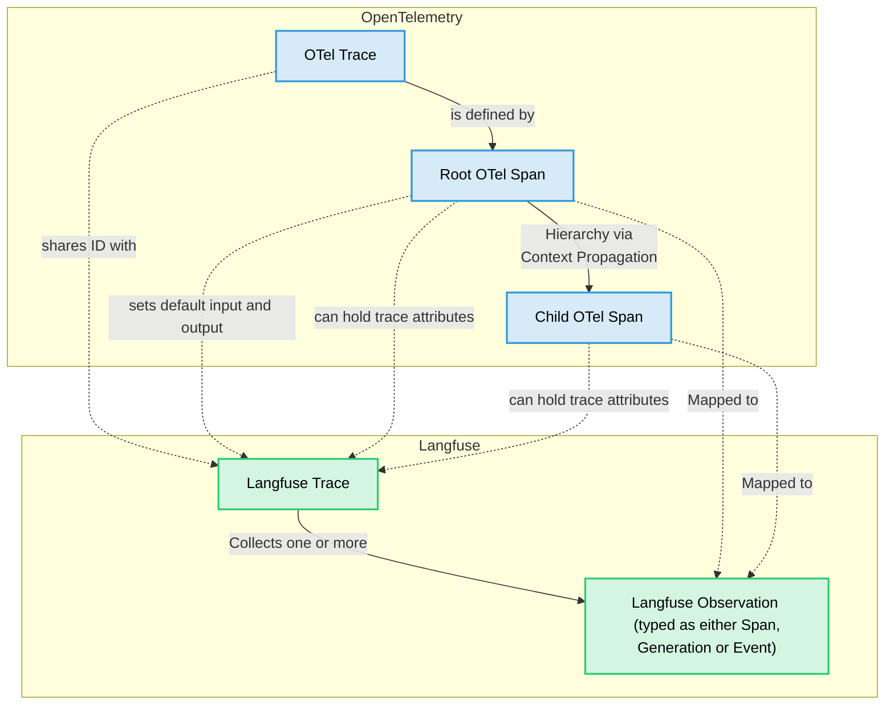

import GetStartedPythonSdk from "@/components-mdx/get-started/python-sdk.mdx";
import EnvJS from "@/components-mdx/env-js.mdx";
import JSSDKPackages from "@/components-mdx/js-sdk-packages.mdx";
import { Rocket, Plug, Settings, LifeBuoy, BookOpen } from "lucide-react";

# Langfuse SDKs

Langfuse offers two SDKs for **Python** and **JS/TS**. The Langfuse SDKs are the recommended way to create [custom observations and traces](/docs/observability/sdk/instrumentation#custom-instrumentation) and use the Langfuse [prompt-management](/docs/prompt-management/overview) and [evaluation](/docs/evaluation/overview) features. Both SDKs are OpenTelemetry-based, async by default, and interoperate with Langfuse [native integrations](/integrations).


<details>
<summary>Requirements for self-hosted Langfuse</summary>

<Callout type="info">
If you are self-hosting Langfuse, the Python SDK v3 requires [**Langfuse platform version ≥ 3.63.0**](https://github.com/langfuse/langfuse/releases/tag/v3.63.0) and the TypeScript SDK v4 requires [**Langfuse platform version ≥ 3.95.0**](https://github.com/langfuse/langfuse/releases/tag/v3.95.0) for all features to work correctly. For traces to be correctly processed.
</Callout>

</details>


<details>
<summary>Legacy documentation</summary>

This documentation is for the latest versions of the Langfuse SDKs.

- Documentation for the legacy Python SDK v2 can be found [here](https://python-sdk-v2.docs-snapshot.langfuse.com/docs/observability/sdk/python/decorators).
- Documentation for the legacy TypeScript SDK v3 can be found [here](https://js-sdk-v3.docs-snapshot.langfuse.com/docs/observability/sdk/typescript/guide/).

</details>

**Key benefits**

- Based on [OpenTelemetry](https://opentelemetry.io/), so you can use any OTEL-based instrumentation library for your LLM stack.
- Fully [async requests](/docs/observability/data-model#background-processing), meaning Langfuse adds almost no latency.
- Accurate latency tracking via synchronous timestamps.
- IDs available for downstream use.
- Great DX when nesting observations.
- Cannot break your application: SDK errors are caught and logged.
- Interoperable with Langfuse [native integrations](/integrations).

## Quickstart

Follow the quickstart guide to get the first trace into Langfuse. See the [setup](#setup) section for more details.

<LangTabs items={["Python SDK", "JS/TS SDK"]}>
<Tab title="Python SDK">
<GetStartedPythonSdk />
</Tab>
<Tab title="JS/TS SDK">

**1. Install packages:**

```bash
npm install @langfuse/tracing @langfuse/otel @opentelemetry/sdk-node
```

**2. Set environment variables:**

<EnvJS />

**3. Initialize OpenTelemetry:**

Create an `instrumentation.ts` to register the Langfuse span processor so traces reach Langfuse.

```ts filename="instrumentation.ts" /LangfuseSpanProcessor/
import { NodeSDK } from "@opentelemetry/sdk-node";
import { LangfuseSpanProcessor } from "@langfuse/otel";

const sdk = new NodeSDK({
  spanProcessors: [new LangfuseSpanProcessor()],
});

sdk.start();
```

Import this file at the top of your app's entry point (e.g., `index.ts`).

**4. Instrument your app:**

Instrumentation means adding code that records what’s happening in your application so it can be sent to Langfuse. There are three main ways of instrumenting your code with the TypeScript SDK.

In this example we will use the [context manager](/docs/observability/sdk/instrumentation#context-manager). You can also use the [decorator](/docs/observability/sdk/instrumentation#observe-wrapper) or create [manual observations](/docs/observability/sdk/instrumentation#manual-observations).

```ts filename="index.ts" /startActiveObservation/
import "./instrumentation";
import { startActiveObservation } from "@langfuse/tracing";

async function main() {
  await startActiveObservation("my-first-trace", async (span) => {
    span.update({
      input: "Hello, Langfuse!",
      output: "This is my first trace!",
    });
  });
}

main();
```

**5. Run your application and see the trace in Langfuse:**

```bash
npx tsx index.ts
```

<Frame>

</Frame>

See the [trace in Langfuse](https://cloud.langfuse.com/project/cloramnkj0002jz088vzn1ja4/traces/ef10df7b3f9e4a8adc834c18934bace0?timestamp=2025-12-03T14%3A44%3A10.907Z&observation=c71b480595bbe18c).


</Tab>
</LangTabs>

## Setup

This section covers all detail of setting up the Langfuse SDKs. Follow the [Quickstart](#quickstart) guide to create your first trace. 

<Steps>

### Install the SDK

<LangTabs items={["Python SDK", "JS/TS SDK"]}>
<Tab title="Python SDK">

Pip install the [Langfuse Python SDK](https://pypi.org/project/langfuse/).

```bash
pip install langfuse
```
</Tab>
<Tab title="JS/TS SDK">

The Langfuse JS/TS SDK is designed to be modular. Install the relevant packages for a full tracing setup:

```bash
npm install @langfuse/tracing @langfuse/otel @opentelemetry/sdk-node
```

<JSSDKPackages />

</Tab>
</LangTabs>

### Configure credentials

To authenticate with Langfuse, add your Langfuse credentials as environment variables. You can get your credentials by signing up for a free [Langfuse Cloud](https://cloud.langfuse.com) account or by [self-hosting Langfuse](https://langfuse.com/self-hosting).

If you are self-hosting Langfuse or using a [data region](/security/data-regions) other than the default (EU, https://cloud.langfuse.com), ensure you configure the host argument or the `LANGFUSE_BASE_URL` environment variable.

You can also pass the credentials [directly to the constructor](#client-setup).

<EnvJS />

### Initialize OpenTelemetry (JS/TS only)

<LangTabs items={["Python SDK", "JS/TS SDK"]}>
<Tab title="Python SDK">

The Python SDK automatically sets up OpenTelemetry when [initializing the client](#client-setup).

</Tab>
<Tab title="JS/TS SDK">

The JS/TS SDK's tracing is built on top of OpenTelemetry, so you need to set up the OpenTelemetry SDK. The [`LangfuseSpanProcessor`](https://langfuse-js-git-main-langfuse.vercel.app/classes/_langfuse_otel.LangfuseSpanProcessor.html) is the key component that sends traces to Langfuse.

```ts filename="instrumentation.ts" /LangfuseSpanProcessor/
import { NodeSDK } from "@opentelemetry/sdk-node";
import { LangfuseSpanProcessor } from "@langfuse/otel";

const sdk = new NodeSDK({
  spanProcessors: [new LangfuseSpanProcessor()],
});

sdk.start();
```

For more options to configure the [`LangfuseSpanProcessor`](https://langfuse-js-git-main-langfuse.vercel.app/classes/_langfuse_otel.LangfuseSpanProcessor.html) such as masking, filtering, and more, see [the advanced usage](/docs/observability/sdk/typescript/advanced-usage).

You can learn more about setting up OpenTelemetry in your JS environment [here](https://opentelemetry.io/docs/languages/js/getting-started/nodejs/).

<Callout type="info">
**Next.js users:**

If you are using Next.js, please use the OpenTelemetry setup via the `NodeSDK` described above rather than via `registerOTel` from `@vercel/otel`. This is because [the `@vercel/otel` package does not yet support the OpenTelemetry JS SDK v2](https://github.com/vercel/otel/issues/154) on which the `@langfuse/tracing` and `@langfuse/otel` packages are based.

[See here for a full example for the Vercel AI SDK with NextJS on Vercel](/docs/observability/sdk/typescript/instrumentation#native-instrumentation).

</Callout>

</Tab>
</LangTabs>


### Client Setup [#client-setup]

<LangTabs items={["Python SDK", "JS/TS SDK"]}>
<Tab title="Python SDK">

Initialize the Langfuse client with [`get_client()`](https://python.reference.langfuse.com/langfuse#get_client) to interact with Langfuse. It will automatically use the environment variables you set above.

```python filename="Initialize client"
from langfuse import get_client

langfuse = get_client()

# Verify connection
if langfuse.auth_check():
    print("Langfuse client is authenticated and ready!")
else:
    print("Authentication failed. Please check your credentials and host.")
```

The Langfuse client is a singleton. It can be accessed anywhere in your application using the [`get_client()`](https://python.reference.langfuse.com/langfuse#get_client) function.

<details>
<summary>Alternative: Configure via constructor</summary>

Optionally, you can initialize the client via [`Langfuse()`](https://python.reference.langfuse.com/langfuse#Langfuse) to pass in configuration options (see below). Otherwise, it is created automatically when you call [`get_client()`](https://python.reference.langfuse.com/langfuse#get_client) based on environment variables.

<Callout type="info">
If you create multiple `Langfuse` instances with the same `public_key`, the singleton instance is reused and new arguments are ignored.
</Callout>

```python filename="Initialize client"
from langfuse import Langfuse

langfuse = Langfuse(
  public_key="your-public-key",
  secret_key="your-secret-key",
  base_url="https://cloud.langfuse.com", # 🇪🇺 EU region
  # base_url="https://us.cloud.langfuse.com", # 🇺🇸 US region
)
```

All key configuration options are listed in the [Python SDK reference](https://python.reference.langfuse.com/langfuse#Langfuse).

</details>

</Tab>
<Tab title="JS/TS SDK">

Initialize the [`LangfuseClient`](https://langfuse-js-git-main-langfuse.vercel.app/classes/_langfuse_client.LangfuseClient.html) to interact with Langfuse. The client will automatically use the environment variables you set above.

```ts filename="client.ts"
import { LangfuseClient } from "@langfuse/client";

const langfuse = new LangfuseClient();
```

<details>
<summary>Alternative: Configure via constructor</summary>

You can also pass the Langfuse credentials directly to the constructor:

```ts filename="client.ts"
import { LangfuseClient } from "@langfuse/client";

const langfuse = new LangfuseClient({
  publicKey: "your-public-key",
  secretKey: "your-secret-key",
  baseUrl: "https://cloud.langfuse.com", // or your self-hosted instance
});
```
</details>


</Tab>
</LangTabs>

### Use the SDK

With the SDK set up, you can: 

- [Instrument your application](/docs/observability/sdk/instrumentation#custom-observations)
- Use [Langfuse Prompt Management](/docs/prompt-management/get-started)
- Run [Experiments](/docs/evaluation/experiments/experiments-via-sdk) and create [Scores](/docs/evaluation/evaluation-methods/custom-scores)
- [Query data](/docs/api-and-data-platform/features/query-via-sdk)

</Steps>


## OpenTelemetry foundation

The Langfuse SDKs are built on top of [OpenTelemetry](https://opentelemetry.io/). This provides:

- **Standardization** with the wider observability ecosystem and tooling.
- **Robust context propagation** so nested spans stay connected, even across async workloads.
- **Attribute propagation** to keep `userId`, `sessionId`, `metadata`, `version`, and `tags` aligned across observations.
- **Ecosystem interoperability** meaning third-party instrumentations automatically appear inside Langfuse traces.

The following diagram shows how Langfuse maps to native OpenTelemetry concepts:



- [**OTel Trace**](https://opentelemetry.io/docs/concepts/observability-primer/#distributed-traces): An OTel-trace represents the entire lifecycle of a request or transaction as it moves through your application and its services. A trace is typically a sequence of operations, like an LLM generating a response followed by a parsing step. The root (first) span created in a sequence defines the OTel trace. OTel traces do not have a start and end time, they are defined by the root span.
- [**OTel Span**](https://opentelemetry.io/docs/concepts/observability-primer/#spans): A span represents a single unit of work or operation within a trace. Spans have a start and end time, a name, and can have attributes (key-value pairs of metadata). Spans can be nested to create a hierarchy, showing parent-child relationships between operations.
- [**Langfuse Trace**](/docs/observability/data-model#traces): A Langfuse trace collects observations and holds trace attributes such as `session_id`, `user_id` as well as overall input and outputs. It shares the same ID as the OTel trace and its attributes are set via specific OTel span attributes that are automatically propagated to the Langfuse trace.
- [**Langfuse Observation**](/docs/observability/data-model#observations): In Langfuse terminology, an "observation" is a Langfuse-specific representation of an OTel span. It can be a generic span (Langfuse-span), a specialized "generation" (Langfuse-generation), a point-in-time event (Langfuse-event), or [other observation types](/docs/observability/features/observation-types).
  - **Langfuse Span**: A Langfuse-span is a generic OTel span in Langfuse, designed for non-LLM operations.
  - **Langfuse Generation**: A Langfuse-generation is a specialized type of OTel span in Langfuse, designed specifically for Large Language Model (LLM) calls. It includes additional fields like `model`, `model_parameters`, `usage_details` (tokens), and `cost_details`.
  - **Langfuse Event**: A Langfuse-event tracks a point in time action.
  - [**Other observation types**](/docs/observability/features/observation-types): Langfuse supports other observation types such as tool calls, RAG retrieval steps, etc.
- **Context Propagation**: OpenTelemetry automatically handles the propagation of the current trace and span context. This means when you call another function (whether it's also traced by Langfuse, an OTel-instrumented library, or a manually created span), the new span will automatically become a child of the currently active span, forming a correct trace hierarchy.
- [**Attribute Propagation**](/docs/observability/sdk/instrumentation#add-attributes-to-observations): Certain trace attributes (`user_id`, `session_id`, `metadata`, `version`, `tags`) can be automatically propagated to all child observations using `propagate_attributes()`. This ensures consistent attribute coverage across all observations in a trace. See the [instrumentation docs](/docs/observability/sdk/python/instrumentation#propagating-trace-attributes) for details.

The Langfuse SDKs provides wrappers around OTel spans (`LangfuseSpan`, `LangfuseGeneration`) that offer convenient methods for interacting with Langfuse-specific features like scoring and media handling, while still being native OTel spans under the hood. You can also use these wrapper objects to add Langfuse trace attributes via `update_trace()` or use `propagate_attributes()` for automatic propagation to all child observations.

## Learn more

<Cards num={2}>
  <Card
    icon={<Rocket size="24" />}
    title="Instrument your app"
    href="/docs/observability/sdk/instrumentation"
    arrow
  />
  <Card
    icon={<Plug size="24" />}
    title="Advanced features"
    href="/docs/observability/sdk/advanced-features"
    arrow
  />
  <Card
    icon={<Settings size="24" />}
    title="Upgrade path"
    href="/docs/observability/sdk/upgrade-path"
    arrow
  />
  <Card
    icon={<LifeBuoy size="24" />}
    title="Troubleshooting & FAQ"
    href="/docs/observability/sdk/troubleshooting-and-faq"
    arrow
  />
  <Card
    icon={<BookOpen size="24" />}
    title="Python API reference"
    href="https://python.reference.langfuse.com"
    newWindow
    arrow
  />
  <Card
    icon={<BookOpen size="24" />}
    title="JS/TS API reference"
    href="https://js.reference.langfuse.com/"
    newWindow
    arrow
  />
</Cards>

## Other languages

Via the [public API](/docs/api-and-data-platform/features/public-api) you can integrate Langfuse from any runtime. For tracing specifically, send OpenTelemetry spans from your preferred instrumentation (Java, Go, etc.) to the [Langfuse OTel endpoint](/integrations/native/opentelemetry).

You can find a list of community maintained SDKs [here](https://github.com/langfuse/langfuse-examples?tab=readme-ov-file#community-maintained-sdks).
