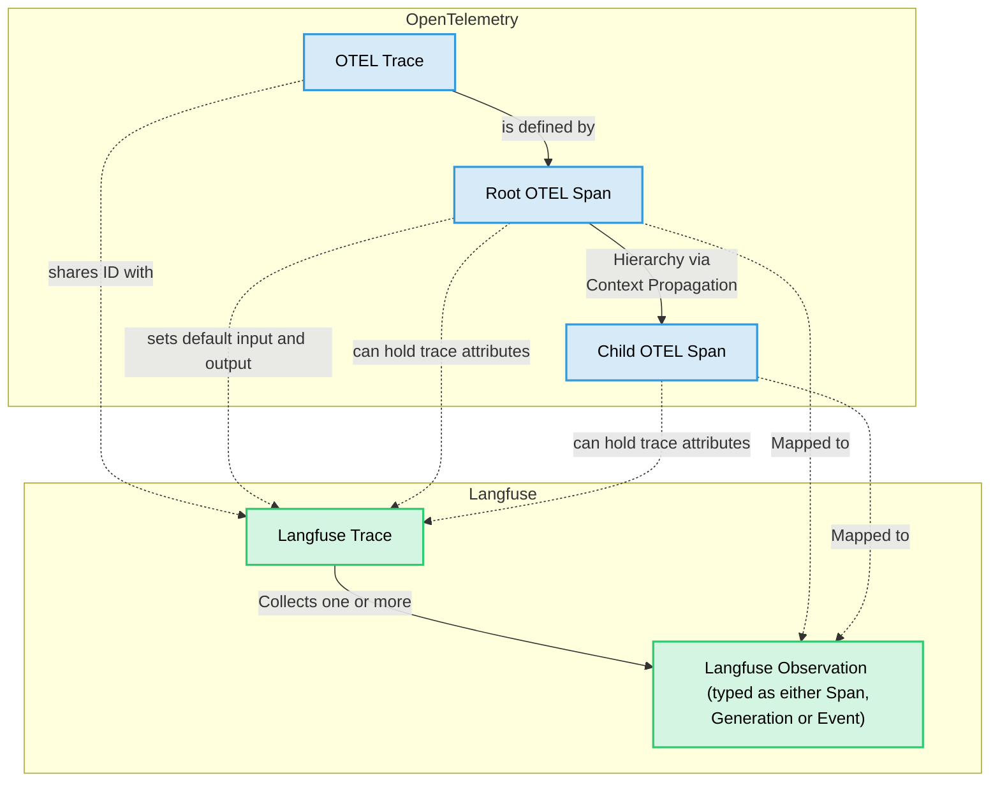

# Python SDK

<Callout type="info">

If you are self-hosting Langfuse, the Python SDK v3 requires [**Langfuse platform version >= 3.63.0**](https://github.com/langfuse/langfuse/releases/tag/v3.63.0) for traces to be correctly processed.

</Callout>

Our [OpenTelemetry-based](https://opentelemetry.io/) Python SDK (v3) is the latest generation of the SDK designed for a improved developer experience and enhanced ease of use. Built on the robust OpenTelemetry Python SDK, it offers a more intuitive API for comprehensive tracing of your LLM application.

The v3 SDK introduces several key benefits:

- **Improved Developer Experience**: A more intuitive API means less code to write for tracing your application, simplifying the integration process.
- **Unified Context Sharing**: Seamlessly hook into the tracing context of the current span to update it or create child spans. This is particularly beneficial for integrating with other instrumented libraries.
- **Broad Third-Party Integrations**: Any library instrumented with OpenTelemetry will work out-of-the-box with the Langfuse SDK. Spans from these libraries are automatically captured and correctly nested within your Langfuse traces.

There are three main ways of instrumenting your application with the new Langfuse SDK. All of them are fully interoperable with each other.

## Get started

import GetStartedPythonSdk from "@/components-mdx/get-started/python-sdk.mdx";

<GetStartedPythonSdk/>

## Learn more

import { Rocket, Plug, Beaker, Settings, LifeBuoy, BookOpen } from "lucide-react";

<Cards num={2}>
    <Card
        icon={<Rocket size="24" />}
        title="Setup"
        href="/docs/observability/sdk/python/setup"
        arrow
    />
    <Card
        icon={<Plug size="24" />}
        title="Instrumentation"
        href="/docs/observability/sdk/python/instrumentation"
        arrow
    />
    <Card
        icon={<Beaker size="24" />}
        title="Evaluation"
        href="/docs/observability/sdk/python/evaluation"
        arrow
    />
    <Card
        icon={<Settings size="24" />}
        title="Advanced usage"
        href="/docs/observability/sdk/python/advanced-usage"
        arrow
    />
    <Card
        icon={<LifeBuoy size="24" />}
        title="Troubleshooting & FAQ"
        href="/docs/observability/sdk/python/troubleshooting-and-faq"
        arrow
    />
    <Card
        icon={<BookOpen size="24" />}
        title="Reference"
        href="https://python.reference.langfuse.com"
        newWindow
        arrow
    />
</Cards>

## OTEL and Langfuse

The Langfuse v3 SDK is built upon [OpenTelemetry (OTEL)](https://opentelemetry.io/), a standard for observability. Understanding the relation between OTEL and Langfuse is not required to use the SDK, but it is helpful to have a basic understanding of the concepts. OTEL related concepts are abstracted away and you can use the SDK without being deeply familiar with them.

- **OTEL Trace**: An OTEL-trace represents the entire lifecycle of a request or transaction as it moves through your application and its services. A trace is typically a sequence of operations, like an LLM generating a response followed by a parsing step. The root (first) span created in a sequence defines the OTEL-trace. OTEL-traces do not have a start and end time, they are defined by the root span.
- **OTEL Span**: A span represents a single unit of work or operation within a trace. Spans have a start and end time, a name, and can have attributes (key-value pairs of metadata). Spans can be nested to create a hierarchy, showing parent-child relationships between operations.
- **Langfuse Trace**: A Langfuse trace collects observations and holds trace attributes such as `session_id`, `user_id` as well as overall input and outputs. It shares the same ID as the OTEL trace and its attributes are set via specific OTEL span attributes that are automatically propagated to the Langfuse trace.
- **Langfuse Observation**: In Langfuse terminology, an "observation" is a Langfuse-specific representation of an OTEL span. It can be a generic span (Langfuse-span) or a specialized "generation" (Langfuse-generation) or a point in time event (Langfuse-event)
  - **Langfuse Span**: A Langfuse-span is a generic OTEL-span in Langfuse, designed for non-LLM operations.
  - **Langfuse Generation**: A Langfuse-generation is a specialized type of OTEL-span in Langfuse, designed specifically for Large Language Model (LLM) calls. It includes additional fields like `model`, `model_parameters`, `usage_details` (tokens), and `cost_details`.
  - **Langfuse Event**: A Langfuse-event tracks a point in time action.
- **Context Propagation**: OpenTelemetry automatically handles the propagation of the current trace and span context. This means when you call another function (whether it's also traced by Langfuse, an OTEL-instrumented library, or a manually created span), the new span will automatically become a child of the currently active span, forming a correct trace hierarchy.

The Langfuse SDK provides wrappers around OTEL spans (`LangfuseSpan`, `LangfuseGeneration`) that offer convenient methods for interacting with Langfuse-specific features like scoring and media handling, while still being native OTEL spans under the hood. You can also use these wrapper objects to add Langfuse trace attributes.

