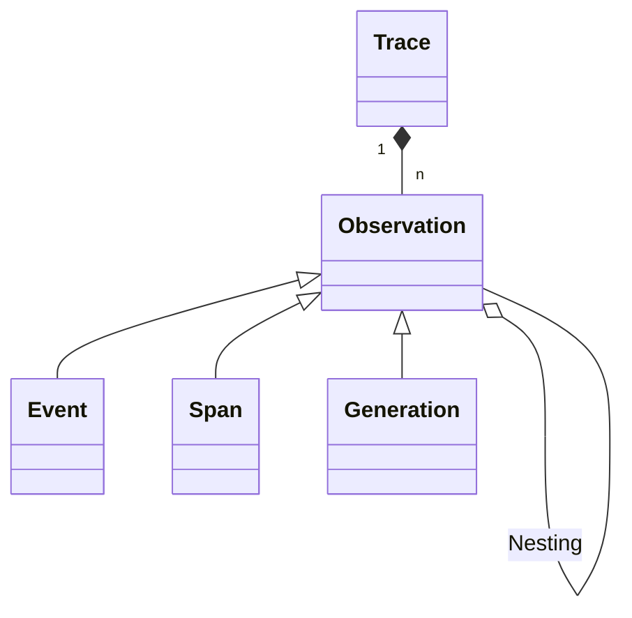

# Tracing

LLM apps use increasingly complex abstractions (chains, agents with tools, advanced prompts). The nested traces in AssistMe help to understand what is going on and get to the root cause of problems.

## Introduction



- Each backend execution is logged with a single `trace`.
- Each trace can contain multiple `observations` to log the individual steps of the execution.
  - Observations are of different types:
    - `Events` are the basic building block. They are used to track discrete events in a trace.
    - `Spans` represent durations of units of work in a trace.
    - `Generations` are spans which are used to log generations of AI models. They contain additional attributes about the model, the prompt/completion. For generations, [token usage and costs](/docs/model-usage-and-cost) are automatically calculated.
  - Observations can be nested.

Follow the integration docs to send traces to AssistMe. You can use:

{/* - [API](/docs/api) */}
{/* 
## Example

Automatically traced with Langchain integration:

<Frame></Frame>

## Detect and fix problems

1. Collect user feedback from the frontend
2. Filter down to executions that had poor quality
3. Use the debugging UI to get to the root cause of the problem

## Share via public link

You can share a trace with anyone via a public link. The link is read-only.

_Example: https://cloud.AssistMe.com/public/traces/lf.docs.conversation.u6Wl2hG_

<Frame></Frame> */}

### Working with traces

Tags enable you to flexibly add metadata to your traces.
You can filter for tags in the AssistMe UI. You can also group traces in the UI for comparison and pattern identification.
Use descriptive tags and leverage the filtering and grouping capabilities of the AssistMe UI to enhance trace management and analysis workflows.

{/* ### Get started

When choosing tags, consider what aspects of the traces you might want to filter for or group by in your analysis. You may use tags to indicate specific versions of your app ('app-v1', 'app-v2'), specific LLM techniques you used ('rag', 'one-shot', 'few-shot'), or the environment of your app ('local', 'staging', 'prod').

<Frame></Frame> */}


### Use API to create traces

<Tabs items={["API"]}>
  <Tab>
 
  ```bash
  curl --location 'http://staging.assistme.chat/api/v1/traces' \
  --header 'Content-Type: application/json' \
  --header 'Accept: application/json' \
  --header "Authorization: Bearer {AssistMe_public_key}"
  --data '{
    "traceId": "<string>",
    "name": "<string>",
    "value": "<integer>",
    "observationId": "<optional_string>"
  }'
  ```
 
  </Tab>

</Tabs>