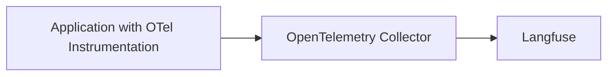

# OpenTelemetry Collector

Langfuse can act as an OpenTelemetry Collector.

If already have an OpenTelemetry Collector and want to export traces to Langfuse, you can use the following configuration.



## Get Started

<Steps>

### Get Base64 Encoded API Keys

Langfuse uses [Basic Auth](https://en.wikipedia.org/wiki/Basic_access_authentication). Use the following command to get the base64 encoded API keys (referred to as "AUTH_STRING"):

```bash
echo -n "pk-lf-1234567890:sk-lf-1234567890" | base64
```

### Add Langfuse Exporter

Add a Langfuse exporter to your OpenTelemetry Collector configuration:

```yaml
receivers:
  otlp:
    protocols:
    grpc:
      endpoint: 0.0.0.0:4317
    http:
      endpoint: 0.0.0.0:4318

processors:
  batch:
  memory_limiter:
    # 80% of maximum memory up to 2G
    limit_mib: 1500
    # 25% of limit up to 2G
    spike_limit_mib: 512
    check_interval: 5s

exporters:
  otlp/langfuse:
    endpoint: "cloud.langfuse.com/api/public/otel" # EU data region
    # endpoint: "us.cloud.langfuse.com/api/public/otel" # US data region
    headers:
      Authorization: "Basic ${AUTH_STRING}" # Previously encoded API keys

service:
  pipelines:
    traces:
      receivers: [otlp]
      processors: [memory_limiter, batch]
      exporters: [otlp/langfuse]
```

</Steps>
