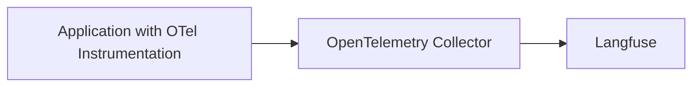

# LLM Observability via OpenTelemetry

[OpenTelemetry](https://opentelemetry.io/) is a [CNCF](https://www.cncf.io/) project that provides a set of specifications, APIs, libraries that define a standard way to collect distributed traces and metrics from your application.

Langfuse can operate as an OpenTelemetry Backend to receive traces on the `/api/public/otel` (OTLP) endpoint. In addition to the [Langfuse SDKs](/docs/sdk/overview) and [native integrations](/docs/integrations/overview), this OpenTelemetry endpoint is designed to increase compatibility with frameworks, libraries, and languages beyond the SDKs and native integrations. Popular OpenTelemetry libraries include OpenLLMetry and OpenLIT which extend Language support of Langfuse tracing to Java and Go and cover frameworks such as AutoGen, Semantic Kernel, and more.

As the [Semantic Conventions](https://opentelemetry.io/docs/specs/semconv/attributes-registry/gen-ai/) for GenAI attributes on traces are still evolving, Langfuse maps the received OTel traces to the [Langfuse data model](/docs/tracing-data-model) and supports additional attributes that are popular in the OTel GenAI ecosystem ([property mapping](#property-mapping)). Please contribute to the discussion on [GitHub](https://github.com/orgs/langfuse/discussions/2509) if an integration does not work as expected or does not parse the correct attributes.

## OpenTelemetry native Langfuse SDK v3

The quickest path to start tracing with Langfuse is the new **OTEL-native Langfuse SDK v3**. The SDK is a thin layer on top of the official OpenTelemetry client that automatically converts all emitted spans into rich Langfuse observations (spans, generations, events) and adds first-class helpers for LLM-specific features such as token usage, cost tracking, prompt linking, and scoring.

Because it lives in the shared OpenTelemetry context, any other library that is already instrumented with OTEL (HTTP frameworks, databases, GenAI instrumentation like OpenLLMetry/OpenLIT, etc.) will seamlessly show up in the same Langfuse traces without additional configuration.

Get started by following the dedicated guide for the Python implementation here: [/docs/sdk/python/sdk-v3](/docs/sdk/python/sdk-v3).

## OpenTelemetry endpoint

Langfuse can receive traces on the `/api/public/otel` (OTLP) endpoint.

If you use a Collector that uses the OpenTelemetry SDK to export traces, you can use the following configuration:

```bash
OTEL_EXPORTER_OTLP_ENDPOINT="https://cloud.langfuse.com/api/public/otel" # 🇪🇺 EU data region
# OTEL_EXPORTER_OTLP_ENDPOINT="https://us.cloud.langfuse.com/api/public/otel" # 🇺🇸 US data region
# OTEL_EXPORTER_OTLP_ENDPOINT="http://localhost:3000/api/public/otel" # 🏠 Local deployment (>= v3.22.0)

OTEL_EXPORTER_OTLP_HEADERS="Authorization=Basic ${AUTH_STRING}"
```

<Callout type="info">

Langfuse uses [Basic Auth](https://en.wikipedia.org/wiki/Basic_access_authentication) to authenticate requests.

You can use the following command to get the base64 encoded API keys (referred to as `AUTH_STRING`): `echo -n "pk-lf-1234567890:sk-lf-1234567890" | base64`.
For long API Keys on GNU systems, you may have to add `-w 0` at the end since `base64` auto-wraps columns.

</Callout>

<Callout type="info">

If your collector requires signal-specific environment variables, the trace endpoint is `/api/public/otel/v1/traces`.

```bash
OTEL_EXPORTER_OTLP_TRACES_ENDPOINT="https://cloud.langfuse.com/api/public/otel/v1/traces" # EU data region
# OTEL_EXPORTER_OTLP_TRACES_ENDPOINT="https://us.cloud.langfuse.com/api/public/otel/v1/traces" # US data region
```

</Callout>

## Custom via OpenTelemetry SDKs

You can use the OpenTelemetry SDKs to directly export traces to Langfuse with the configuration mentioned above. Thereby, Language support of Langfuse is extended to other languages than the ones supported by the [Langfuse SDKs](/docs/sdk/overview) (Python and JS/TS).

As a reference, see [this example notebook](/docs/opentelemetry/example-python-sdk) on how to use the OpenTelemetry Python SDK to export traces to Langfuse.

## Use OpenTelemetry GenAI Instrumentation Libraries

Any OpenTelemetry compatible instrumentation can be used to export traces to Langfuse. Check out the following end-to-end examples of popular instrumentation SDKs to get started:

**Libraries**

- [OpenLIT](/docs/opentelemetry/example-openlit)
- [OpenLLMetry](/docs/opentelemetry/example-openllmetry)
- [Arize](/docs/opentelemetry/example-arize)
- [MLflow](/docs/opentelemetry/example-mlflow)

<details>

<summary>Comparison of OpenTelemetry Instrumentation Libraries</summary>

| Category   | Item                          | OpenLLMetry | openlit | Arize |
| ---------- | ----------------------------- | ----------- | ------- | ----- |
| LLMs       | AI21                          |             | ✅      |       |
|            | Aleph Alpha                   | ✅          |         |       |
|            | Amazon Bedrock                | ✅          | ✅      | ✅    |
|            | Anthropic                     | ✅          | ✅      | ✅    |
|            | Assembly AI                   |             | ✅      |       |
|            | Azure AI Inference            |             | ✅      |       |
|            | Azure OpenAI                  | ✅          | ✅      |       |
|            | Cohere                        | ✅          | ✅      |       |
|            | DeepSeek                      |             | ✅      |       |
|            | ElevenLabs                    |             | ✅      |       |
|            | GitHub Models                 |             | ✅      |       |
|            | Google AI Studio              |             | ✅      |       |
|            | Google Generative AI (Gemini) | ✅          |         |       |
|            | Groq                          | ✅          | ✅      | ✅    |
|            | HuggingFace                   | ✅          | ✅      | ✅    |
|            | IBM Watsonx AI                | ✅          |         |       |
|            | Mistral AI                    | ✅          | ✅      | ✅    |
|            | NVIDIA NIM                    |             | ✅      |       |
|            | Ollama                        | ✅          | ✅      |       |
|            | OpenAI                        | ✅          | ✅      | ✅    |
|            | OLA Krutrim                   |             | ✅      |       |
|            | Prem AI                       |             | ✅      |       |
|            | Replicate                     | ✅          |         |       |
|            | SageMaker (AWS)               | ✅          |         |       |
|            | Titan ML                      |             | ✅      |       |
|            | Together AI                   | ✅          | ✅      |       |
|            | vLLM                          |             | ✅      |       |
|            | Vertex AI                     | ✅          | ✅      | ✅    |
|            | xAI                           |             | ✅      |       |
| Vector DBs | AstraDB                       |             | ✅      |       |
|            | Chroma                        | ✅          |         |       |
|            | ChromaDB                      |             | ✅      |       |
|            | LanceDB                       | ✅          |         |       |
|            | Marqo                         | ✅          |         |       |
|            | Milvus                        | ✅          | ✅      |       |
|            | Pinecone                      | ✅          | ✅      |       |
|            | Qdrant                        | ✅          | ✅      |       |
|            | Weaviate                      | ✅          |         |       |
| Frameworks | AutoGen / AG2                 |             | ✅      | ✅    |
|            | ControlFlow                   |             | ✅      |       |
|            | CrewAI                        | ✅          | ✅      | ✅    |
|            | Crawl4AI                      |             | ✅      |       |
|            | Dynamiq                       |             | ✅      |       |
|            | EmbedChain                    |             | ✅      |       |
|            | FireCrawl                     |             | ✅      |       |
|            | Guardrails AI                 |             | ✅      | ✅    |
|            | Haystack                      | ✅          | ✅      | ✅    |
|            | Julep AI                      |             | ✅      |       |
|            | LangChain                     | ✅          | ✅      | ✅    |
|            | LlamaIndex                    | ✅          | ✅      | ✅    |
|            | Letta                         |             | ✅      |       |
|            | LiteLLM                       | ✅          | ✅      | ✅    |
|            | mem0                          |             | ✅      |       |
|            | MultiOn                       |             | ✅      |       |
|            | Phidata                       |             | ✅      |       |
|            | SwarmZero                     |             | ✅      |       |
|            | LlamaIndex Workflows          |             |         | ✅    |
|            | LangGraph                     |             |         | ✅    |
|            | DSPy                          |             |         | ✅    |
|            | Prompt flow                   |             |         | ✅    |
|            | Instructor                    |             |         | ✅    |
| GPUs       | AMD Radeon                    |             | ✅      |       |
|            | NVIDIA                        |             | ✅      |       |
| JavaScript | OpenAI Node SDK               |             |         | ✅    |
|            | LangChain.js                  |             |         | ✅    |
|            | Vercel AI SDK                 |             |         | ✅    |

</details>

**Framework integrations powered by OpenTelemetry**

- [Hugging Face smolagents](/docs/integrations/smolagents)
- [CrewAI](/docs/integrations/crewai)
- [AutoGen](/docs/integrations/autogen)
- [Semantic Kernel](/docs/integrations/semantic-kernel)
- [Pydantic AI](/docs/integrations/pydantic-ai)
- [Spring AI](/docs/integrations/spring-ai)
- [LlamaIndex](/docs/integrations/llama-index)
- [LlamaIndex Workflows](/docs/integrations/llama-index/workflows)

## Export from OpenTelemetry Collector



If you run an [OpenTelemetry Collector](https://opentelemetry.io/docs/collector), you can use the following configuration to export traces to Langfuse:

```yml
receivers:
  otlp:
    protocols:
    grpc:
      endpoint: 0.0.0.0:4317
    http:
      endpoint: 0.0.0.0:4318

processors:
  batch:
  memory_limiter:
    # 80% of maximum memory up to 2G
    limit_mib: 1500
    # 25% of limit up to 2G
    spike_limit_mib: 512
    check_interval: 5s

exporters:
  otlphttp/langfuse:
    endpoint: "https://cloud.langfuse.com/api/public/otel" # EU data region
    # endpoint: "https://us.cloud.langfuse.com/api/public/otel" # US data region
    headers:
      Authorization: "Basic ${AUTH_STRING}" # Previously encoded API keys

service:
  pipelines:
    traces:
      receivers: [otlp]
      processors: [memory_limiter, batch]
      exporters: [otlphttp/langfuse]
```

### Filtering Spans sent to Langfuse

In case you want to selectively send OTel Spans to Langfuse, you can use the OTel Collector [filterprocessor](https://github.com/open-telemetry/opentelemetry-collector-contrib/blob/main/processor/filterprocessor/README.md).
It enables you to filter spans based on attributes, span names, and more.
As this applies on a Span level, you may risk incomplete traces and should be careful when applying complex filter rules.
Langfuse also requires that a root span is sent to our backend to ensure that a trace is created correctly.

With the configuration below, you would only forward Spans which have a `gen_ai.system` attribute set to `openai`:

```yml
receivers:
  otlp:
    protocols:
    grpc:
      endpoint: 0.0.0.0:4317
    http:
      endpoint: 0.0.0.0:4318

processors:
  filter/openaisystem:
    error_mode: ignore
    traces:
      span:
        - 'attributes["gen_ai.system"] != "openai"'

exporters:
  otlphttp/langfuse:
    endpoint: "https://cloud.langfuse.com/api/public/otel" # EU data region
    # endpoint: "https://us.cloud.langfuse.com/api/public/otel" # US data region
    headers:
      Authorization: "Basic ${AUTH_STRING}" # Previously encoded API keys

service:
  pipelines:
    traces:
      receivers: [otlp]
      processors: [filter/openaisystem]
      exporters: [otlphttp/langfuse]
```

## Property Mapping [#property-mapping]

<Callout type="info">

Please [raise an issue on GitHub](/issues) if an integration does not work as expected or does not parse the correct attributes.

</Callout>

Langfuse accepts any span that adheres to the OpenTelemetry specification.
In addition, we map many GenAI specific properties to properties in the Langfuse data model to provide a seamless experience when using OpenTelemetry with Langfuse.
First and foremost, we stick to the [OpenTelemetry Gen AI Conventions](https://opentelemetry.io/docs/specs/semconv/attributes-registry/gen-ai/), but also map vendor specific properties from common frameworks.
All attributes and resourceAttributes are available within the Langfuse `metadata` property as a fallback.

LLM Calls are tracked as `GENERATION` spans (see [data model](/docs/tracing-data-model)). Any span that includes an attribute mapped to `model` is considered a LLM call and thus tracked as a `GENERATION` span.

Langfuse uses the `langfuse.*` namespace to map properties from OpenTelemetry to the Langfuse data model.
This enables features like linking [Prompts](/docs/prompts/get-started) to spans, adding [tags](/docs/tracing-features/tags), or marking traces as public.
Attributes in the Langfuse namespace take precedence over the generic mapping we specify below.
Some of the attributes are only taken into consideration if they are set on the root span. We mark those in the table below.
The following Langfuse specific properties are supported:

| OpenTelemetry Attribute   | Langfuse Property | Type       | Root Span only | Description                                                                                                                                                                       |
| ------------------------- | ----------------- | ---------- | -------------- | --------------------------------------------------------------------------------------------------------------------------------------------------------------------------------- |
| `langfuse.session.id`     | `sessionId`       | `string`   | `true`         | The [session ID](/docs/tracing-features/sessions) for the request.                                                                                                                |
| `langfuse.user.id`        | `userId`          | `string`   | `true`         | The [user ID](/docs/tracing-features/users) for the request.                                                                                                                      |
| `langfuse.public`         | `public`          | `boolean`  | `true`         | Mark the trace as public to be able to [share it via url](/docs/tracing-features/url). This can be changed later in the Langfuse UI.                                              |
| `langfuse.release`        | `release`         | `string`   | `true`         | The [release](/docs/tracing-features/releases-and-versioning) for the request.                                                                                                    |
| `langfuse.version`        | `version`         | `string`   | `true`         | The [version](/docs/tracing-features/releases-and-versioning) for the request.                                                                                                    |
| `langfuse.tags`           | `tags`            | `string[]` | `true`         | The [tags](/docs/tracing-features/tags) for the request.                                                                                                                          |
| `langfuse.prompt.name`    | `promptName`      | `string`   | `false`        | The [prompt name](/docs/prompts/get-started) for the request.                                                                                                                     |
| `langfuse.prompt.version` | `promptVersion`   | `int`      | `false`        | The [prompt version](/docs/prompts/get-started) for the request.                                                                                                                  |
| `langfuse.environment`    | `environment`     | `string`   | `false`        | The environment for the request.                                                                                                                                                  |
| `langfuse.metadata`       | `metadata`        | `string`   | `false`        | Accepts a JSON string. All keys within the `langfuse.metadata` object on attributes or resourceAttributes are mapped to the top-level metadata object on traces and observations. |
| `langfuse.metadata.*`     | `metadata`        | `string`   | `false`        | All keys prefixed with `langfuse.metadata` on attributes or resourceAttributes are mapped to the top-level metadata object on traces and observations.                            |

Below, we present a non-exhaustive list of additional mappings that Langfuse applies.
These mappings are based on OTel GenAI semantic conventions and vendor-specific implementations that deviate from these conventions:

| OpenTelemetry Attribute       | Langfuse Property   | Description                                                                                                                                                      |
| ----------------------------- | ------------------- | ---------------------------------------------------------------------------------------------------------------------------------------------------------------- |
| `gen_ai.usage.cost`           | `costDetails.total` | The total [cost](/docs/model-usage-and-cost) of the request.                                                                                                     |
| `gen_ai.usage.*`              | `usageDetails.*`    | Maps all keys within [usage](/docs/model-usage-and-cost) aside from `cost` to `usageDetails`. Token properties are simplified to `input`, `output`, and `total`. |
| `llm.token_count.*`           | `usageDetails.*`    | Maps all keys within [usage](/docs/model-usage-and-cost) to `usageDetails`. Token properties are simplified to `input`, `output`, and `total`.                   |
| `gen_ai.request.model`        | `model`             | The [model](/docs/model-usage-and-cost) used for the request.                                                                                                    |
| `gen_ai.response.model`       | `model`             | The [model](/docs/model-usage-and-cost) used for the response.                                                                                                   |
| `llm.model_name`              | `model`             | The [model](/docs/model-usage-and-cost) used for the request.                                                                                                    |
| `model`                       | `model`             | The [model](/docs/model-usage-and-cost) used for the request.                                                                                                    |
| `gen_ai.request.*`            | `modelParameters`   | Maps all keys within request to `modelParameters`.                                                                                                               |
| `llm.invocation_parameters.*` | `modelParameters`   | Maps all keys within request to `modelParameters`.                                                                                                               |
| `session.id`                  | `sessionId`         | The [session ID](/docs/tracing-features/sessions) for the request.                                                                                               |
| `user.id`                     | `userId`            | The [user ID](/docs/tracing-features/users) for the request.                                                                                                     |
| `gen_ai.prompt`               | `input`             | Input field.                                                                                                                                                     |
| `gen_ai.completion`           | `output`            | Output field.                                                                                                                                                    |
| `input.value`                 | `input`             | Input field. Used by OpenInference based traces.                                                                                                                 |
| `output.value`                | `output`            | Output field. Used by OpenInference based traces.                                                                                                                |
| `mlflow.spanInputs`           | `input`             | Input field. Used by MLflow based traces.                                                                                                                        |
| `mlflow.spanOutputs`          | `output`            | Output field. Used by MLflow based traces.                                                                                                                       |
| `deployment.environment.name` | `environment`       | The environment for the request.                                                                                                                                 |
| `deployment.environment`      | `environment`       | The environment for the request.                                                                                                                                 |

## Metadata Properties

Langfuse only supports filtering on top-level keys within the `metadata` of an event.
By default, all OpenTelemetry attributes and resource attributes are mapped into an `attributes` and `resourceAttributes` key within `metadata` and, therefore, not queryable.
If you want to query on specific attributes, you can use the `langfuse.metadata` prefix to map them to the top-level `metadata` object.
The following snippet will produce a filterable `user_name` property in the `metadata` object of the trace:

```python
with tracer.start_as_current_span("Langfuse Attributes") as span:
    span.set_attribute("langfuse.metadata.user_name", "user-123")
```

## Troubleshooting

- If you encounter `4xx` errors while self-hosting Langfuse, please upgrade your deployment to the latest version. The OpenTelemetry endpoint was first introduced in Langfuse [v3.22.0](https://github.com/langfuse/langfuse/releases/tag/v3.22.0) and has seen significant improvements since then.
- Langfuse does not support `gRPC` for the OpenTelemetry endpoint. Please use `HTTP/protobuf` instead.
