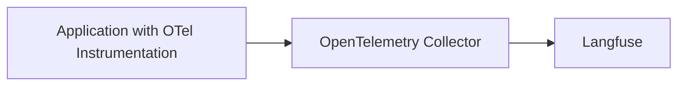

# LLM Observability via OpenTelemetry

<AvailabilityBanner
  availability={{
    hobby: "public-beta",
    pro: "public-beta",
    team: "public-beta",
    selfHosted: "public-beta",
  }}
/>

<Callout emoji="🚧">

OpenTelemetry support in Langfuse is in public beta and APIs might still change. The public beta is intended to gather feedback and improve the integration based on your needs.
Please share all feedback in the [OpenTelemetry Support GitHub Discussion](https://github.com/orgs/langfuse/discussions/2509).

</Callout>

[OpenTelemetry](https://opentelemetry.io/) is a [CNCF](https://www.cncf.io/) project that provides a set of specifications, APIs, libraries that define a standard way to collect distributed traces and metrics from your application.

Langfuse can operate as an OpenTelemetry Backend to receive traces on the `/api/public/otel` (OTLP) endpoint. In addition to the [Langfuse SDKs](/docs/sdk/overview) and [native integrations](/docs/integrations/overview), this OpenTelemetry endpoint is designed to increase compatibility with frameworks, libraries, and languages beyond the SDKs and native integrations. Popular OpenTelemetry libraries include OpenLLMetry and OpenLIT which extend Language support of Langfuse tracing to Java and Go and cover frameworks such as AutoGen, Semantic Kernel, and more.

As the [Semantic Conventions](https://opentelemetry.io/docs/specs/semconv/attributes-registry/gen-ai/) for GenAI attributes on traces are still evolving, Langfuse maps the received OTel traces to the [Langfuse data model](/docs/tracing-data-model) and supports additional attributes that are popular in the OTel GenAI ecosystem ([property mapping](#property-mapping)). Please contribute to the discussion on [GitHub](https://github.com/orgs/langfuse/discussions/2509) if an integration does not work as expected or does not parse the correct attributes.

## OpenTelemetry endpoint

Langfuse can receive traces on the `/api/public/otel` (OTLP) endpoint.

If you use a Collector that uses the OpenTelemetry SDK to export traces, you can use the following configuration:

```bash
OTEL_EXPORTER_OTLP_ENDPOINT="https://cloud.langfuse.com/api/public/otel" # EU data region
# OTEL_EXPORTER_OTLP_ENDPOINT="https://us.cloud.langfuse.com/api/public/otel" # US data region

OTEL_EXPORTER_OTLP_HEADERS="Authorization=Basic ${AUTH_STRING}"
```

<Callout type="info">

Langfuse uses [Basic Auth](https://en.wikipedia.org/wiki/Basic_access_authentication) to authenticate requests.

You can use the following command to get the base64 encoded API keys (referred to as `AUTH_STRING`): `echo -n "pk-lf-1234567890:sk-lf-1234567890" | base64`

</Callout>

<Callout type="info">

If your collector requires signal-specific environment variables, the trace endpoint is `/api/public/otel/v1/traces`.

```bash
OTEL_EXPORTER_OTLP_TRACES_ENDPOINT="https://cloud.langfuse.com/api/public/otel/v1/traces" # EU data region
# OTEL_EXPORTER_OTLP_TRACES_ENDPOINT="https://us.cloud.langfuse.com/api/public/otel/v1/traces" # US data region
```

</Callout>

## Use OpenTelemetry GenAI Instrumentation Libraries

Any OpenTelemetry compatible instrumentation can be used to export traces to Langfuse. Check out the following end-to-end examples of popular instrumentation SDKs to get started:

- [OpenLIT](/docs/opentelemetry/example-openlit)
- [OpenLLMetry](/docs/opentelemetry/example-openllmetry)

<details>

<summary>Comparison of OpenTelemetry Instrumentation Libraries</summary>

| Category   | Item                          | OpenLLMetry | openlit |
| ---------- | ----------------------------- | ----------- | ------- |
| LLMs       | AI21                          |             | ✅      |
|            | Aleph Alpha                   | ✅          |         |
|            | Amazon Bedrock                | ✅          | ✅      |
|            | Anthropic                     | ✅          | ✅      |
|            | Assembly AI                   |             | ✅      |
|            | Azure AI Inference            |             | ✅      |
|            | Azure OpenAI                  | ✅          | ✅      |
|            | Cohere                        | ✅          | ✅      |
|            | DeepSeek                      |             | ✅      |
|            | ElevenLabs                    |             | ✅      |
|            | GitHub Models                 |             | ✅      |
|            | Google AI Studio              |             | ✅      |
|            | Google Generative AI (Gemini) | ✅          |         |
|            | Groq                          | ✅          | ✅      |
|            | HuggingFace                   | ✅          | ✅      |
|            | IBM Watsonx AI                | ✅          |         |
|            | Mistral AI                    | ✅          | ✅      |
|            | NVIDIA NIM                    |             | ✅      |
|            | Ollama                        | ✅          | ✅      |
|            | OpenAI                        | ✅          | ✅      |
|            | OLA Krutrim                   |             | ✅      |
|            | Prem AI                       |             | ✅      |
|            | Replicate                     | ✅          |         |
|            | SageMaker (AWS)               | ✅          |         |
|            | Titan ML                      |             | ✅      |
|            | Together AI                   | ✅          | ✅      |
|            | vLLM                          |             | ✅      |
|            | Vertex AI                     | ✅          | ✅      |
|            | xAI                           |             | ✅      |
| Vector DBs | AstraDB                       |             | ✅      |
|            | Chroma                        | ✅          |         |
|            | ChromaDB                      |             | ✅      |
|            | LanceDB                       | ✅          |         |
|            | Marqo                         | ✅          |         |
|            | Milvus                        | ✅          | ✅      |
|            | Pinecone                      | ✅          | ✅      |
|            | Qdrant                        | ✅          | ✅      |
|            | Weaviate                      | ✅          |         |
| Frameworks | AutoGen / AG2                 |             | ✅      |
|            | ControlFlow                   |             | ✅      |
|            | CrewAI                        | ✅          | ✅      |
|            | Crawl4AI                      |             | ✅      |
|            | Dynamiq                       |             | ✅      |
|            | EmbedChain                    |             | ✅      |
|            | FireCrawl                     |             | ✅      |
|            | Guardrails AI                 |             | ✅      |
|            | Haystack                      | ✅          | ✅      |
|            | Julep AI                      |             | ✅      |
|            | LangChain                     | ✅          | ✅      |
|            | LlamaIndex                    | ✅          | ✅      |
|            | Letta                         |             | ✅      |
|            | LiteLLM                       | ✅          | ✅      |
|            | mem0                          |             | ✅      |
|            | MultiOn                       |             | ✅      |
|            | Phidata                       |             | ✅      |
|            | SwarmZero                     |             | ✅      |
| GPUs       | AMD Radeon                    |             | ✅      |
|            | NVIDIA                        |             | ✅      |

</details>

## Export from OpenTelemetry Collector



If you run an OpenTelemetry Collector, you can use the following configuration to export traces to Langfuse:

```yml
receivers:
  otlp:
    protocols:
    grpc:
      endpoint: 0.0.0.0:4317
    http:
      endpoint: 0.0.0.0:4318

processors:
  batch:
  memory_limiter:
    # 80% of maximum memory up to 2G
    limit_mib: 1500
    # 25% of limit up to 2G
    spike_limit_mib: 512
    check_interval: 5s

exporters:
  otlp/langfuse:
    endpoint: "cloud.langfuse.com/api/public/otel" # EU data region
    # endpoint: "us.cloud.langfuse.com/api/public/otel" # US data region
    headers:
      Authorization: "Basic ${AUTH_STRING}" # Previously encoded API keys

service:
  pipelines:
    traces:
      receivers: [otlp]
      processors: [memory_limiter, batch]
      exporters: [otlp/langfuse]
```

## Property Mapping [#property-mapping]

<Callout type="info">

Please [raise an issue on GitHub](/issues) if an integration does not work as expected or does not parse the correct attributes.

</Callout>

Langfuse accepts any span that adheres to the OpenTelemetry specification.
In addition, we map many GenAI specific properties to properties in the Langfuse data model to provide a seamless experience when using OpenTelemetry with Langfuse.
First and foremost, we stick to the [OpenTelemetry Gen AI Conventions](https://opentelemetry.io/docs/specs/semconv/attributes-registry/gen-ai/), but also map vendor specific properties from common frameworks.
All attributes and resourceAttributes are available within the Langfuse `metadata` property as a fallback.

Below, we share a non-exhaustive list of mappings that Langfuse applies:

| OpenTelemetry Attribute | Langfuse Property   | Description                                                                                                                                                      |
| ----------------------- | ------------------- | ---------------------------------------------------------------------------------------------------------------------------------------------------------------- |
| `gen_ai.usage.cost`     | `costDetails.total` | The total [cost](/docs/model-usage-and-cost) of the request.                                                                                                     |
| `gen_ai.usage.*`        | `usageDetails.*`    | Maps all keys within [usage](/docs/model-usage-and-cost) aside from `cost` to `usageDetails`. Token properties are simplified to `input`, `output`, and `total`. |
| `gen_ai.request.model`  | `model`             | The [model](/docs/model-usage-and-cost) used for the request.                                                                                                    |
| `gen_ai.response.model` | `model`             | The [model](/docs/model-usage-and-cost) used for the response.                                                                                                   |
| `gen_ai.request.*`      | `modelParameters`   | Maps all keys within request to `modelParameters`.                                                                                                               |
| `langfuse.session.id`   | `sessionId`         | The [session ID](/docs/tracing-features/sessions) for the request.                                                                                               |
| `session.id`            | `sessionId`         | The [session ID](/docs/tracing-features/sessions) for the request.                                                                                               |
| `langfuse.user.id`      | `userId`            | The [user ID](/docs/tracing-features/users) for the request.                                                                                                     |
| `user.id`               | `userId`            | The [user ID](/docs/tracing-features/users) for the request.                                                                                                     |
| `gen_ai.prompt`         | `input`             | Input field. Deprecated by OpenTelemetry as event properties should be preferred.                                                                                |
| `gen_ai.completion`     | `output`            | Output field. Deprecated by OpenTelemetry as event properties should be preferred.                                                                               |
