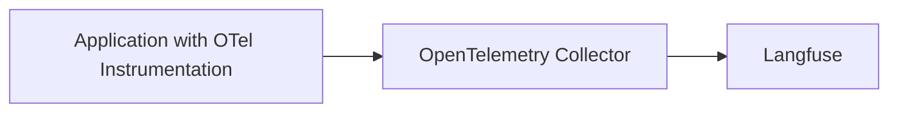
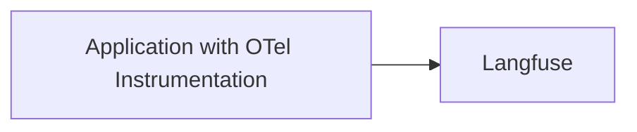

# OpenTelemetry

<AvailabilityBanner
  availability={{
    hobby: "public-beta",
    pro: "public-beta",
    team: "public-beta",
    selfHosted: "public-beta",
  }}
/>

<Callout type="warning">

OpenTelemetry support in Langfuse is experimental.
All APIs may change at any point in time without prior notice.

The public beta is intended to gather feedback and improve the integration based on your needs.
Please share all feedback in the [OpenTelemetry Support GitHub Discussion](https://github.com/orgs/langfuse/discussions/2509).

</Callout>

[OpenTelemetry](https://opentelemetry.io/) is a [CNCF](https://www.cncf.io/) project that provides a set of specifications, APIs, libraries that define a standard way to collect distributed traces and metrics from your application.
OpenTelemetry maintains an experimental set of [Semantic Conventions](https://opentelemetry.io/docs/specs/semconv/attributes-registry/gen-ai/) for GenAI attributes on traces.
In addition, to the [Langfuse SDKs](/docs/sdk/overview) and [native integrations](/docs/integrations/overview), we added experimental support for OpenTelemetry to increase compatibility.

## Getting Started

Langfuses offers an OpenTelemetry Collector. To get started with the OpenTelemetry integration:

### Endpoint: `/api/public/otel`

- EU: `OTEL_EXPORTER_OTLP_ENDPOINT="https://cloud.langfuse.com/api/public/otel"`
- US: `OTEL_EXPORTER_OTLP_ENDPOINT="https://us.cloud.langfuse.com/api/public/otel"`

### Authentication

[Basic Auth](https://en.wikipedia.org/wiki/Basic_access_authentication) with your Langfuse API keys. Commonly referred to as `OTEL_EXPORTER_OTLP_HEADERS`.

1. Use the following command to get the base64 encoded API keys (referred to as "AUTH_STRING"): `echo -n "pk-lf-1234567890:sk-lf-1234567890" | base64`

2. Add the following authentication header: `OTEL_EXPORTER_OTLP_HEADERS="Authorization=Basic ${AUTH_STRING}"`

## OpenTelemetry Collector

If you already have an OpenTelemetry Collector and want to export traces to Langfuse, you can use the following configuration:

import { BookOpen } from "lucide-react";

<Cards>
  <Card
    icon={<BookOpen />}
    title="OpenTelemetry Collector"
    href="/docs/opentelemetry/example-opentelemetry-collector"
  />
</Cards>

## OpenTelemetry Instrumentation Libraries

<Callout type="info">

Please [raise an issue on GitHub](/issues) if an integration does not work as expected or does not parse the correct attributes. This might happen as not all OTel compatible instrumentation follows the OpenTelemetry GenAI Semantic Conventions or there are relevant additional attributes that are not yet covered by the Semantic Conventions.

</Callout>

Any OTel compatible instrumentation can be used to send traces to Langfuse. Check out the following end-to-end examples of popular instrumentation SDKs to get started:

<Cards>
  <Card
    title="OpenLIT"
    href="/docs/opentelemetry/example-openlit"
    icon={<BookOpen />}
  />
  <Card
    title="Pydantic AI"
    href="/docs/opentelemetry/example-pydantic-ai"
    icon={<BookOpen />}
  />
  <Card
    title="OpenLLMetry"
    href="/docs/opentelemetry/example-openllmetry"
    icon={<BookOpen />}
  />
</Cards>

### Comparison of OpenTelemetry Instrumentation Libraries

| **Category**   | **Item**                      | **OpenLLMetry** | **openlit** |
| -------------- | ----------------------------- | --------------- | ----------- |
| **LLMs**       | AI21                          |                 | ✅          |
|                | Aleph Alpha                   | ✅              |             |
|                | Amazon Bedrock                | ✅              | ✅          |
|                | Anthropic                     | ✅              | ✅          |
|                | Assembly AI                   |                 | ✅          |
|                | Azure AI Inference            |                 | ✅          |
|                | Azure OpenAI                  | ✅              | ✅          |
|                | Cohere                        | ✅              | ✅          |
|                | DeepSeek                      |                 | ✅          |
|                | ElevenLabs                    |                 | ✅          |
|                | GitHub Models                 |                 | ✅          |
|                | Google AI Studio              |                 | ✅          |
|                | Google Generative AI (Gemini) | ✅              |             |
|                | Groq                          | ✅              | ✅          |
|                | HuggingFace                   | ✅              | ✅          |
|                | IBM Watsonx AI                | ✅              |             |
|                | Mistral AI                    | ✅              | ✅          |
|                | NVIDIA NIM                    |                 | ✅          |
|                | Ollama                        | ✅              | ✅          |
|                | OpenAI                        | ✅              | ✅          |
|                | OLA Krutrim                   |                 | ✅          |
|                | Prem AI                       |                 | ✅          |
|                | Replicate                     | ✅              |             |
|                | SageMaker (AWS)               | ✅              |             |
|                | Titan ML                      |                 | ✅          |
|                | Together AI                   | ✅              | ✅          |
|                | vLLM                          |                 | ✅          |
|                | Vertex AI                     | ✅              | ✅          |
|                | xAI                           |                 | ✅          |
| **Vector DBs** | AstraDB                       |                 | ✅          |
|                | Chroma                        | ✅              |             |
|                | ChromaDB                      |                 | ✅          |
|                | LanceDB                       | ✅              |             |
|                | Marqo                         | ✅              |             |
|                | Milvus                        | ✅              | ✅          |
|                | Pinecone                      | ✅              | ✅          |
|                | Qdrant                        | ✅              | ✅          |
|                | Weaviate                      | ✅              |             |
| **Frameworks** | AutoGen / AG2                 |                 | ✅          |
|                | ControlFlow                   |                 | ✅          |
|                | CrewAI                        | ✅              | ✅          |
|                | Crawl4AI                      |                 | ✅          |
|                | Dynamiq                       |                 | ✅          |
|                | EmbedChain                    |                 | ✅          |
|                | FireCrawl                     |                 | ✅          |
|                | Guardrails AI                 |                 | ✅          |
|                | Haystack                      | ✅              | ✅          |
|                | Julep AI                      |                 | ✅          |
|                | LangChain                     | ✅              | ✅          |
|                | LlamaIndex                    | ✅              | ✅          |
|                | Letta                         |                 | ✅          |
|                | LiteLLM                       | ✅              | ✅          |
|                | mem0                          |                 | ✅          |
|                | MultiOn                       |                 | ✅          |
|                | Phidata                       |                 | ✅          |
|                | SwarmZero                     |                 | ✅          |
| **GPUs**       | AMD Radeon                    |                 | ✅          |
|                | NVIDIA                        |                 | ✅          |

## Property Mapping

Langfuse accepts any span that adheres to the OpenTelemetry specification.
In addition, we map many GenAI specific properties to properties in the Langfuse data model to provide a seamless experience when using OpenTelemetry with Langfuse.
First and foremost, we stick to the [OpenTelemetry Gen AI Conventions](https://opentelemetry.io/docs/specs/semconv/attributes-registry/gen-ai/), but also map vendor specific properties from common frameworks.
All attributes and resourceAttributes are available within the Langfuse `metadata` property as a fallback.

Below, we share a non-exhaustive list of mappings that Langfuse applies:

| OpenTelemetry Attribute | Langfuse Property   | Description                                                                                                                                                      |
| ----------------------- | ------------------- | ---------------------------------------------------------------------------------------------------------------------------------------------------------------- |
| `gen_ai.usage.cost`     | `costDetails.total` | The total [cost](/docs/model-usage-and-cost) of the request.                                                                                                     |
| `gen_ai.usage.*`        | `usageDetails.*`    | Maps all keys within [usage](/docs/model-usage-and-cost) aside from `cost` to `usageDetails`. Token properties are simplified to `input`, `output`, and `total`. |
| `gen_ai.request.model`  | `model`             | The [model](/docs/model-usage-and-cost) used for the request.                                                                                                    |
| `gen_ai.response.model` | `model`             | The [model](/docs/model-usage-and-cost) used for the response.                                                                                                   |
| `gen_ai.request.*`      | `modelParameters`   | Maps all keys within request to `modelParameters`.                                                                                                               |
| `langfuse.session.id`   | `sessionId`         | The [session ID](/docs/tracing-features/sessions) for the request.                                                                                               |
| `session.id`            | `sessionId`         | The [session ID](/docs/tracing-features/sessions) for the request.                                                                                               |
| `langfuse.user.id`      | `userId`            | The [user ID](/docs/tracing-features/users) for the request.                                                                                                     |
| `user.id`               | `userId`            | The [user ID](/docs/tracing-features/users) for the request.                                                                                                     |
| `gen_ai.prompt`         | `input`             | Input field. Deprecated by OpenTelemetry as event properties should be preferred.                                                                                |
| `gen_ai.completion`     | `output`            | Output field. Deprecated by OpenTelemetry as event properties should be preferred.                                                                               |
