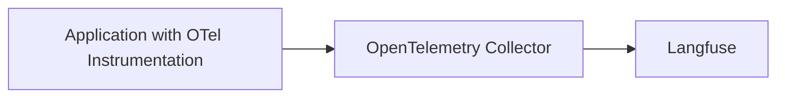

# LLM Observability via OpenTelemetry

[OpenTelemetry](https://opentelemetry.io/) is a [CNCF](https://www.cncf.io/) project that provides a set of specifications, APIs, libraries that define a standard way to collect distributed traces and metrics from your application.

Langfuse can operate as an OpenTelemetry Backend to receive traces on the `/api/public/otel` (OTLP) endpoint. In addition to the [Langfuse SDKs](/docs/sdk/overview) and [native integrations](/integrations), this OpenTelemetry endpoint is designed to increase compatibility with frameworks, libraries, and languages beyond the SDKs and native integrations. Popular OpenTelemetry libraries include OpenLLMetry and OpenLIT which extend Language support of Langfuse tracing to Java and Go and cover frameworks such as AutoGen, Semantic Kernel, and more.

As the [Semantic Conventions](https://opentelemetry.io/docs/specs/semconv/attributes-registry/gen-ai/) for GenAI attributes on traces are still evolving, Langfuse maps the received OTel traces to the [Langfuse data model](/docs/tracing-data-model) and supports additional attributes that are popular in the OTel GenAI ecosystem ([property mapping](#property-mapping)). Please contribute to the discussion on [GitHub](https://github.com/orgs/langfuse/discussions/2509) if an integration does not work as expected or does not parse the correct attributes.

## OpenTelemetry native Langfuse SDK v3

The quickest path to start tracing with Langfuse is the new **OTEL-native Langfuse SDK v3**. The SDK is a thin layer on top of the official OpenTelemetry client that automatically converts all emitted spans into rich Langfuse observations (spans, generations, events) and adds first-class helpers for LLM-specific features such as token usage, cost tracking, prompt linking, and scoring.

Because it lives in the shared OpenTelemetry context, any other library that is already instrumented with OTEL (HTTP frameworks, databases, GenAI instrumentation like OpenLLMetry/OpenLIT, etc.) will seamlessly show up in the same Langfuse traces without additional configuration.

Get started by following the dedicated guide for the Python implementation here: [/docs/sdk/python/sdk-v3](/docs/sdk/python/sdk-v3).

## OpenTelemetry endpoint

Langfuse can receive traces on the `/api/public/otel` (OTLP) endpoint.

If you use a Collector that uses the OpenTelemetry SDK to export traces, you can use the following configuration:

```bash
OTEL_EXPORTER_OTLP_ENDPOINT="https://cloud.langfuse.com/api/public/otel" # 🇪🇺 EU data region
# OTEL_EXPORTER_OTLP_ENDPOINT="https://us.cloud.langfuse.com/api/public/otel" # 🇺🇸 US data region
# OTEL_EXPORTER_OTLP_ENDPOINT="http://localhost:3000/api/public/otel" # 🏠 Local deployment (>= v3.22.0)

OTEL_EXPORTER_OTLP_HEADERS="Authorization=Basic ${AUTH_STRING}"
```

<Callout type="info">

Langfuse uses [Basic Auth](https://en.wikipedia.org/wiki/Basic_access_authentication) to authenticate requests.

You can use the following command to get the base64 encoded API keys (referred to as `AUTH_STRING`): `echo -n "pk-lf-1234567890:sk-lf-1234567890" | base64`.
For long API Keys on GNU systems, you may have to add `-w 0` at the end since `base64` auto-wraps columns.

</Callout>

<Callout type="info">

If your collector requires signal-specific environment variables, the trace endpoint is `/api/public/otel/v1/traces`.

```bash
OTEL_EXPORTER_OTLP_TRACES_ENDPOINT="https://cloud.langfuse.com/api/public/otel/v1/traces" # EU data region
# OTEL_EXPORTER_OTLP_TRACES_ENDPOINT="https://us.cloud.langfuse.com/api/public/otel/v1/traces" # US data region
```

</Callout>

## Custom via OpenTelemetry SDKs

You can use the OpenTelemetry SDKs to directly export traces to Langfuse with the configuration mentioned above. Thereby, Language support of Langfuse is extended to other languages than the ones supported by the [Langfuse SDKs](/docs/sdk/overview) (Python and JS/TS).

As a reference, see [this example notebook](/docs/opentelemetry/example-python-sdk) on how to use the OpenTelemetry Python SDK to export traces to Langfuse.

## Use OpenTelemetry GenAI Instrumentation Libraries

Any OpenTelemetry compatible instrumentation can be used to export traces to Langfuse. Check out the following end-to-end examples of popular instrumentation SDKs to get started:

**Libraries**

- [OpenLIT](/docs/opentelemetry/example-openlit)
- [OpenLLMetry](/docs/opentelemetry/example-openllmetry)
- [Arize](/docs/opentelemetry/example-arize)
- [MLflow](/docs/opentelemetry/example-mlflow)

<details>

<summary>Comparison of OpenTelemetry Instrumentation Libraries</summary>

| Category   | Item                          | OpenLLMetry | openlit | Arize |
| ---------- | ----------------------------- | ----------- | ------- | ----- |
| LLMs       | AI21                          |             | ✅      |       |
|            | Aleph Alpha                   | ✅          |         |       |
|            | Amazon Bedrock                | ✅          | ✅      | ✅    |
|            | Anthropic                     | ✅          | ✅      | ✅    |
|            | Assembly AI                   |             | ✅      |       |
|            | Azure AI Inference            |             | ✅      |       |
|            | Azure OpenAI                  | ✅          | ✅      |       |
|            | Cohere                        | ✅          | ✅      |       |
|            | DeepSeek                      |             | ✅      |       |
|            | ElevenLabs                    |             | ✅      |       |
|            | GitHub Models                 |             | ✅      |       |
|            | Google AI Studio              |             | ✅      |       |
|            | Google Generative AI (Gemini) | ✅          |         |       |
|            | Groq                          | ✅          | ✅      | ✅    |
|            | HuggingFace                   | ✅          | ✅      | ✅    |
|            | IBM Watsonx AI                | ✅          |         |       |
|            | Mistral AI                    | ✅          | ✅      | ✅    |
|            | NVIDIA NIM                    |             | ✅      |       |
|            | Ollama                        | ✅          | ✅      |       |
|            | OpenAI                        | ✅          | ✅      | ✅    |
|            | OLA Krutrim                   |             | ✅      |       |
|            | Prem AI                       |             | ✅      |       |
|            | Replicate                     | ✅          |         |       |
|            | SageMaker (AWS)               | ✅          |         |       |
|            | Titan ML                      |             | ✅      |       |
|            | Together AI                   | ✅          | ✅      |       |
|            | vLLM                          |             | ✅      |       |
|            | Vertex AI                     | ✅          | ✅      | ✅    |
|            | xAI                           |             | ✅      |       |
| Vector DBs | AstraDB                       |             | ✅      |       |
|            | Chroma                        | ✅          |         |       |
|            | ChromaDB                      |             | ✅      |       |
|            | LanceDB                       | ✅          |         |       |
|            | Marqo                         | ✅          |         |       |
|            | Milvus                        | ✅          | ✅      |       |
|            | Pinecone                      | ✅          | ✅      |       |
|            | Qdrant                        | ✅          | ✅      |       |
|            | Weaviate                      | ✅          |         |       |
| Frameworks | AutoGen / AG2                 |             | ✅      | ✅    |
|            | ControlFlow                   |             | ✅      |       |
|            | CrewAI                        | ✅          | ✅      | ✅    |
|            | Crawl4AI                      |             | ✅      |       |
|            | Dynamiq                       |             | ✅      |       |
|            | EmbedChain                    |             | ✅      |       |
|            | FireCrawl                     |             | ✅      |       |
|            | Guardrails AI                 |             | ✅      | ✅    |
|            | Haystack                      | ✅          | ✅      | ✅    |
|            | Julep AI                      |             | ✅      |       |
|            | LangChain                     | ✅          | ✅      | ✅    |
|            | LlamaIndex                    | ✅          | ✅      | ✅    |
|            | Letta                         |             | ✅      |       |
|            | LiteLLM                       | ✅          | ✅      | ✅    |
|            | mem0                          |             | ✅      |       |
|            | MultiOn                       |             | ✅      |       |
|            | Phidata                       |             | ✅      |       |
|            | SwarmZero                     |             | ✅      |       |
|            | LlamaIndex Workflows          |             |         | ✅    |
|            | LangGraph                     |             |         | ✅    |
|            | DSPy                          |             |         | ✅    |
|            | Prompt flow                   |             |         | ✅    |
|            | Instructor                    |             |         | ✅    |
| GPUs       | AMD Radeon                    |             | ✅      |       |
|            | NVIDIA                        |             | ✅      |       |
| JavaScript | OpenAI Node SDK               |             |         | ✅    |
|            | LangChain.js                  |             |         | ✅    |
|            | Vercel AI SDK                 |             |         | ✅    |

</details>

**Framework integrations powered by OpenTelemetry**

- [Hugging Face smolagents](/integrations/frameworks/smolagents)
- [CrewAI](/integrations/frameworks/crewai)
- [AutoGen](/integrations/frameworks/autogen)
- [Semantic Kernel](/integrations/frameworks/semantic-kernel)
- [Pydantic AI](/integrations/frameworks/pydantic-ai)
- [Spring AI](/integrations/frameworks/spring-ai)
- [LlamaIndex](/integrations/frameworks/llamaindex)
- [LlamaIndex Workflows](/integrations/frameworks/llamaindex-workflows)

## Export from OpenTelemetry Collector



If you run an [OpenTelemetry Collector](https://opentelemetry.io/docs/collector), you can use the following configuration to export traces to Langfuse:

```yml
receivers:
  otlp:
    protocols:
    grpc:
      endpoint: 0.0.0.0:4317
    http:
      endpoint: 0.0.0.0:4318

processors:
  batch:
  memory_limiter:
    # 80% of maximum memory up to 2G
    limit_mib: 1500
    # 25% of limit up to 2G
    spike_limit_mib: 512
    check_interval: 5s

exporters:
  otlphttp/langfuse:
    endpoint: "https://cloud.langfuse.com/api/public/otel" # EU data region
    # endpoint: "https://us.cloud.langfuse.com/api/public/otel" # US data region
    headers:
      Authorization: "Basic ${AUTH_STRING}" # Previously encoded API keys

service:
  pipelines:
    traces:
      receivers: [otlp]
      processors: [memory_limiter, batch]
      exporters: [otlphttp/langfuse]
```

### Filtering Spans sent to Langfuse

In case you want to selectively send OTel Spans to Langfuse, you can use the OTel Collector [filterprocessor](https://github.com/open-telemetry/opentelemetry-collector-contrib/blob/main/processor/filterprocessor/README.md).
It enables you to filter spans based on attributes, span names, and more.
As this applies on a Span level, you may risk incomplete traces and should be careful when applying complex filter rules.
Langfuse also requires that a root span is sent to our backend to ensure that a trace is created correctly.

With the configuration below, you would only forward Spans which have a `gen_ai.system` attribute set to `openai`:

```yml
receivers:
  otlp:
    protocols:
    grpc:
      endpoint: 0.0.0.0:4317
    http:
      endpoint: 0.0.0.0:4318

processors:
  filter/openaisystem:
    error_mode: ignore
    traces:
      span:
        - 'attributes["gen_ai.system"] != "openai"'

exporters:
  otlphttp/langfuse:
    endpoint: "https://cloud.langfuse.com/api/public/otel" # EU data region
    # endpoint: "https://us.cloud.langfuse.com/api/public/otel" # US data region
    headers:
      Authorization: "Basic ${AUTH_STRING}" # Previously encoded API keys

service:
  pipelines:
    traces:
      receivers: [otlp]
      processors: [filter/openaisystem]
      exporters: [otlphttp/langfuse]
```

## Property Mapping [#property-mapping]

Langfuse aims to be compliant with the [OpenTelemetry GenAI semantic conventions](https://opentelemetry.io/docs/specs/semconv/gen-ai/gen-ai-agent-spans/) and support major LLM instrumentation frameworks.

Furthermore, Langfuse uses attributes within the `langfuse.*` namespace to map OpenTelemetry span attributes directly to the Langfuse data model. These specific attributes always take precedence over the generic OpenTelemetry conventions and are recommended for all users that are manually instrumenting their applications.

<Callout type="info">
Please [raise an issue on GitHub](/issues) if any mapping or integration does not work as expected or does not parse the correct attributes.
</Callout>

Below is a non-exhaustive mapping of Langfuse data model attributes to OpenTelemetry span attributes.


### Trace-Level Attributes

These attributes are applied to the trace record in Langfuse. They may be set on any span in the trace.

#### `name`

The name of the trace.

* `langfuse.trace.name`: `string`
* Span name of the root span


#### `userId`

The unique identifier for the end-user.

* `langfuse.user.id`: `string`
* `user.id`: `string`

#### `sessionId`

The unique identifier for the user session.

* `langfuse.session.id`: `string`
* `session.id`: `string`

#### `release`

The release version of your application.

* `langfuse.release`: `string`

#### `public`

A boolean flag to mark a trace as public, allowing it to be shared via a URL.

* `langfuse.trace.public`: `boolean`

#### `tags`

An array of strings to categorize or label the trace.

* `langfuse.trace.tags`: `string[]`

#### `metadata`

A flexible object for storing any additional, unstructured data on the trace.

* `langfuse.trace.metadata.*`: `string`
* Root span's observation metadata (see below for mapping)

<Callout type="info">
**Filtering by metadata key in Langfuse**

Langfuse only supports filtering on top-level keys within the `metadata` of an event.

By default, all OpenTelemetry attributes and resource attributes are mapped into an `attributes` and `resourceAttributes` key within `metadata` and are thus not queryable.

If you want to query on specific attributes, you can use the `langfuse.trace.metadata` prefix to map them to the top-level `metadata` object of the trace.
The following snippet will produce a filterable `user_name` property in the `metadata` object of the trace:

```python
with tracer.start_as_current_span("Langfuse Attributes") as span:
    span.set_attribute("langfuse.trace.metadata.user_name", "user-123")
```

</Callout>

#### `input`

The initial input for the entire trace.

* `langfuse.trace.input`: `string`
* Root span's observation input (see below for mapping)

#### `output`

The final output for the entire trace.

* `langfuse.trace.output`: `string`
* Root span's observation output (see below for mapping)

#### `version`

The version of the trace, useful for tracking changes to your application logic.

* Root span's attributes mapped to `version`


#### `environment`

The deployment environment where the trace was generated.

* Root span's attributes mapped to `environment`

### Observation-Level Attributes

These attributes are applied to individual observations (spans) within a trace.

#### `type`

The type of observation

* `langfuse.observation.type`: `"span" | "generation" | "event"`, default: `"span"`
* Any span that includes an attribute mapped to `model` is considered a LLM call and thus tracked as a `generation` observation.

#### `level`

The severity level of the observation

* `langfuse.observation.level`: `"DEBUG" | "DEFAULT" | "WARNING" | "ERROR"`, default: `"DEFAULT"`
* Inferred from OpenTelemetry `span.status.code`

#### `statusMessage`

A message describing the status of the observation, often used for errors.

* `langfuse.observation.status_message`: `string`
* Inferred from OpenTelemetry `span.status.message`

#### `metadata`

A flexible object for storing any additional, unstructured data on the observation. Example key: `langfuse.observation.metadata.user_name`.

* `langfuse.observation.metadata.*`: `string`

<Callout type="info">
**Filtering by metadata key in Langfuse**

Langfuse only supports filtering on top-level keys within the `metadata` of an event.

By default, all OpenTelemetry attributes and resource attributes are mapped into an `attributes` and `resourceAttributes` key within `metadata` and are thus not queryable.

If you want to query on specific attributes, you can use the `langfuse.trace.metadata` prefix to map them to the top-level `metadata` object of the trace.
The following snippet will produce a filterable `user_name` property in the `metadata` object of the trace:

```python
with tracer.start_as_current_span("Langfuse Attributes") as span:
    span.set_attribute("langfuse.trace.metadata.user_name", "user-123")
```

</Callout>

#### `input`

The input data for this specific observation.

* `langfuse.observation.input`: `(JSON) string`
* `gen_ai.prompt`: `string`; OTEL GenAI SemConv
* `input.value`: `string`; used by OpenInference
* `mlflow.spanInputs`: `string`; used by MLFlow


#### `output`

The output data from this specific observation.

* `langfuse.observation.output`: `(JSON) string`
* `gen_ai.completion`: `string`; OTEL GenAI SemConv
* `output.value`: `string`; used by OpenInference
* `mlflow.spanOutputs`: `string`; used by MLFlow


#### `model`

**Only applies to observations of type `generation`**

The name of the generative model used.

* `langfuse.observation.model.name`: `string`
* `gen_ai.request.model`: `string`; OTEL GenAI SemConv
* `gen_ai.response.model`: `string`; OTEL GenAI SemConv
* `llm.model_name`: `string`
* `model`: `string`

#### `modelParameters`

**Only applies to observations of type `generation`**

Key-value pairs representing the settings used for the model invocation.

* `langfuse.observation.model.parameters`: `JSON string of Record<string, string>`
* `gen_ai.request.*`: string | int; OTEL GenAI SemConv
* `llm.invocation_parameters.*`: string | int; OTEL GenAI SemConv

#### `usage`

**Only applies to observations of type `generation`**

An object detailing the token counts for the generation.

* `langfuse.observation.usage_details`: `JSON string of Record<string, integer>`
* `gen_ai.usage.*`: integer
* `llm.token_count.*`: integer

#### `cost`

**Only applies to observations of type `generation`**

The calculated cost of the generation in USD.

* `langfuse.observation.cost_details`: `JSON string of Record<string, float>`
* `gen_ai.usage.cost`: float; will be set as the `total` cost key

#### `prompt`

**Only applies to observations of type `generation`**

The name of a versioned prompt managed in Langfuse.

* `langfuse.observation.prompt.name`: `string`
* `langfuse.observation.prompt.version`: `integer`


#### `completionStartTime`

**Only applies to observations of type `generation`**

The timestamp for when the model began generating the completion.

* `langfuse.observation.completion_start_time`: `ISO 8601 date string`


#### `version`

The version of the observation, useful for tracking changes to your application logic.

* `langfuse.version`: `string`


#### `environment`

The deployment environment where the observation was generated.

* `langfuse.environment`: `string`
* `deployment.environment`: `string`
* `deployment.environment.name`: `string`


## Troubleshooting

- If you encounter `4xx` errors while self-hosting Langfuse, please upgrade your deployment to the latest version. The OpenTelemetry endpoint was first introduced in Langfuse [v3.22.0](https://github.com/langfuse/langfuse/releases/tag/v3.22.0) and has seen significant improvements since then.
- Langfuse does not support `gRPC` for the OpenTelemetry endpoint. Please use `HTTP/protobuf` instead.
