# Langfuse Prompts Data Model

## Prompt Object

```json filename="Example prompt in Langfuse with custom config"
{
  "name": "movie-critic",
  "type": "text",
  "prompt": "As a {{criticLevel}} movie critic, do you like {{movie}}?",
  "config": {
    "model": "gpt-4o",
    "temperature": 0.5,
    "supported_languages": ["en", "fr"]
  },
  "version": 1,
  "labels": ["production", "staging", "latest"],
  "tags": ["movies"]
}
```

- `name`: Unique name of the prompt within a Langfuse project.
- `type`: The [type](#type) of the prompt content (`text` or `chat`). Default is `text`.
- `prompt`: The text template with variables (e.g. `This is a prompt with a {{variable}}`). For chat prompts, this is a list of chat messages each with `role` and `content` but can also contain [placeholders](#message-placeholders).
- `config`: Optional JSON object to store any parameters (e.g. model parameters or model tools).
- `version`: Integer to indicate the version of the prompt. The version is automatically incremented when creating a new prompt version.
- `labels`: [Labels](#versioning-and-labels) that can be used to fetch specific prompt versions in the SDKs.
  - When using a prompt without specifying a label, Langfuse will serve the version with the `production` label.
  - `latest` points to the most recently created version.
  - You can create any additional labels, e.g. for different environments (`staging`, `production`) or tenants (`tenant-1`, `tenant-2`).
- `tags`: Use tags to categorize prompts, e.g. to filter them in the UI or SDKs. All versions of a prompt share the same tags.

## Chat vs Text prompts [#type]

Langfuse supports two types of prompts: **text** and **chat**. The key difference is in how the content is structured:

### Text Prompts

Text prompts contain a single string with optional variables. They are ideal for simple completions or when using models that expect a single text input.

```json filename="Text prompt example"
{
  "name": "movie-critic",
  "type": "text",
  "prompt": "As a {{criticLevel}} movie critic, do you like {{movie}}?",
  "version": 1
}
```

When compiled, text prompts return a single string:

```python
# Returns: "As an expert movie critic, do you like Dune 2?"
```

### Chat Prompts

Chat prompts contain an array of messages, each with a `role` and `content`. They are designed for conversational models and multi-turn interactions.

```json filename="Chat prompt example"
{
  "name": "movie-critic-chat",
  "type": "chat",
  "prompt": [
    {
      "role": "system",
      "content": "You are a {{criticLevel}} movie critic"
    },
    {
      "role": "user",
      "content": "Do you like {{movie}}?"
    }
  ],
  "version": 1
}
```

When compiled, chat prompts return an array of message objects:

```python
# Returns: [
#   {"role": "system", "content": "You are an expert movie critic"},
#   {"role": "user", "content": "Do you like Dune 2?"}
# ]
```

Both prompt types support variable substitution using `{{variable}}` syntax and can include custom configuration parameters.

## Versioning and Labels [#versioning-and-labels]

Langfuse prompt [versioning](/docs/prompt-management/features/prompt-version-control) automatically creates incremental versions (1, 2, 3...) each time you update a prompt with the same name, while labels act as pointers to specific versions for deployment management. The `production` label serves as the default version returned by SDKs when no specific label is requested, `latest` automatically points to the most recently created version, and you can create custom labels (like `staging`, `tenant-1`, or `prod-a`) to manage different environments, tenants, or A/B testing scenarios - allowing you to safely deploy, test, and rollback prompts by simply reassigning labels rather than changing code.

```mermaid
graph LR
    subgraph "Prompt Management"
      subgraph "Prompt Version History"
          V1["Version 1"]
          V2["Version 2"]
          V3["Version 3"]
          V4["Version 4"]
          V1 -.-> V2
          V2 -.-> V3
          V3 -.-> V4
      end

      subgraph "Prompt Labels"
        PROD["🏷️ production<br/>(default)"]
        LATEST["🏷️ latest<br/>(auto-updated)"]
        TENANT["🏷️ tenant-b<br/>(custom)"]
      end
    end

    PROD -->|targets| V2
    LATEST -->|targets| V4
    TENANT -->|targets| V4

    SDK["SDK Request<br/>get_prompt('movie-critic')"] -->|resolves via| PROD

    SDK2["SDK Request<br/>get_prompt('movie-critic', label='latest')"] -->|resolves via| LATEST

    class V1,V2,V3,V4 version
    class PROD,LATEST,TENANT label
    class SDK sdk,sdk2
```



{/* TODO: linking to traces, composition */}
