# Core Concepts

This page discusses prompt management concepts and best practices. If you haven't already, check out the [overview](/docs/prompt-management/overview) page on why it's valuable for observability of your application.

Ready to start? Check out the [Get Started guide](/docs/prompt-management/get-started) to create your first prompt.


## The Prompt Object

Langfuse considers a prompt to be a combination of both the instructions for the LLM (this can be a single string or an array of messages) and, optionally, [additional configuration](/docs/prompt-management/features/config) that influences the behavior.

The prompt object also has a couple of attributes for managing different versions, variants, and deployments. This page will guide you through the most important principles of how to use prompts productively.

For detailed information about all prompt object fields and methods, see the [SDK reference documentation](https://api.reference.langfuse.com).


### Chat vs Text Prompts

Langfuse supports two prompt types. The `type` field determines the format and cannot be changed after creation.

<div className="grid grid-cols-1 md:grid-cols-2 mt-6 gap-4">

<div className="[&_pre]:break-words [&_pre]:whitespace-pre-wrap">

```json filename="Text prompt example"
{
  "name": "movie-critic",
  "type": "text",
  "prompt": "As a movie critic, do you like Dune 2?",
  "version": 1
}
```

</div>

<div className="[&_pre]:break-words [&_pre]:whitespace-pre-wrap">

```json filename="Chat prompt example"
{
  "name": "movie-critic-chat",
  "type": "chat",
  "prompt": [
    {
      "role": "system",
      "content": "You are a movie critic."
    },
    {
      "role": "user",
      "content": "Do you like Dune 2?"
    }
  ],
  "version": 1
}
```

</div>

</div>

**Text prompts** are single strings, ideal for simple use cases or when you only need a system message.

**Chat prompts** are arrays of messages with specific roles (system, user, assistant), useful when you want to manage complete conversation structures, include example exchanges, or handle chat history.

<Callout type="info">
**When to use chat prompts:** Most applications start with a text prompt. As you build more complex logic that requires managing multiple messages, role-based structures, or chat history, it makes sense to switch to chat prompts. This allows you to manage the complete conversation structure in your prompt management system.
</Callout>


### Dynamic rendering of prompts

You can add variables to your prompts that can be dynamically filled out at runtime. There are different types of variables you can use, explained below.

Prompts support three ways to insert dynamic content at runtime:

| Type | Use Case |
|------|----------|
| [Variables](/docs/prompt-management/features/variables) | Insert dynamic text into messages |
| [Prompt References](/docs/prompt-management/features/composability) | Reuse prompts across other prompts, avoid duplicating common instructions |
| [Message Placeholders](/docs/prompt-management/features/message-placeholders) | Insert arrays of messages (e.g., chat history) |

## Prompt Caching


Langfuse Prompt Management uses cached prompts for 2 main reasons
1. it adds no latency to your application. 
2. it removes availability risk.

This means your first few traces after updating a prompt might still be using the old version. If immediate updates are critical for your use case, you can disable caching or configure a shorter TTL (time-to-live). 

See the [caching documentation](/docs/prompt-management/features/caching) for details on how caching works and how to configure it.


## Versioning and Labels

Understanding how versions and labels work together is essential for managing prompts in production. They serve different but complementary purposes.

**Versions** provide an immutable history of every prompt change. Each update creates a new version (1, 2, 3...).

**Labels** are pointers to specific versions. Your code would typically point to labels. Common labels include:
- `production` - Default label, used by production applications
- `latest` - Always points to the newest version
- Custom labels - Create labels for staging, testing, tenants, or A/B tests

Learn more about [versioning](/docs/prompt-management/features/prompt-version-control) and [labels](/docs/prompt-management/features/labels).

```mermaid
graph LR
    subgraph "Prompt Management"
      subgraph "Prompt Version History"
          V1["Version 1"]
          V2["Version 2"]
          V3["Version 3"]
          V4["Version 4"]
          V1 -.-> V2
          V2 -.-> V3
          V3 -.-> V4
      end

      subgraph "Prompt Labels"
        PROD["🏷️ production<br/>(default)"]
        LATEST["🏷️ latest<br/>(auto-updated)"]
        TENANT["🏷️ tenant-b<br/>(custom)"]
      end
    end

    PROD -->|targets| V2
    LATEST -->|targets| V4
    TENANT -->|targets| V4

    SDK["SDK Request<br/>get_prompt('movie-critic')"] -->|resolves via| PROD

    SDK2["SDK Request<br/>get_prompt('movie-critic', label='latest')"] -->|resolves via| LATEST

    class V1,V2,V3,V4 version
    class PROD,LATEST,TENANT label
    class SDK sdk,sdk2
```



### Deployment Workflow

Here's a typical workflow for deploying prompt changes:

1. **Create and test:** Create a new prompt version (automatically gets the `latest` label)
2. **Validate:** Test the new version in your development environment or using the playground
3. **Deploy:** Update the `production` label to point to the new version
4. **Monitor:** Your production application automatically picks up the new version on the next fetch
5. **Rollback if needed:** Simply reassign the `production` label back to a previous version

Since your code references the labels, all this happens without changing code.


