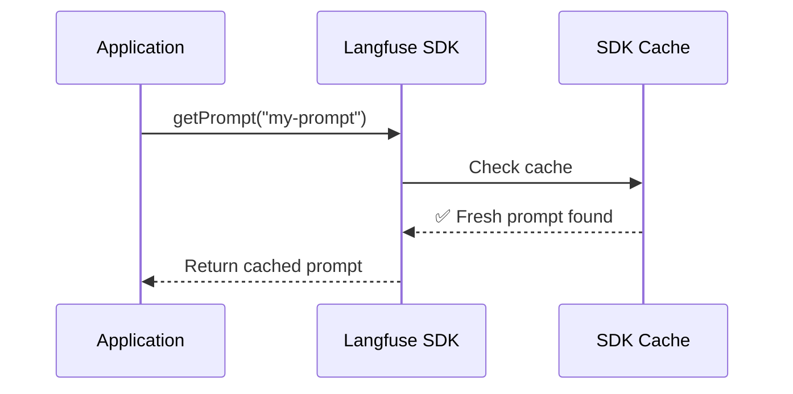
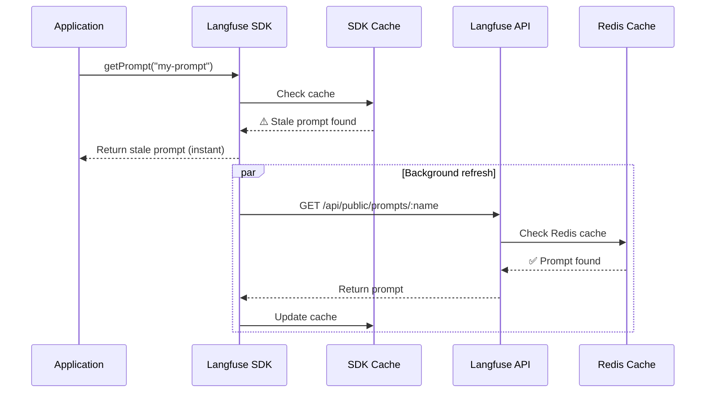
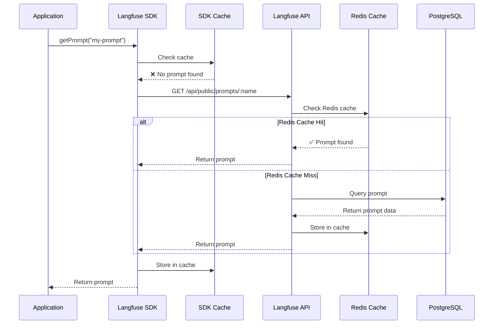
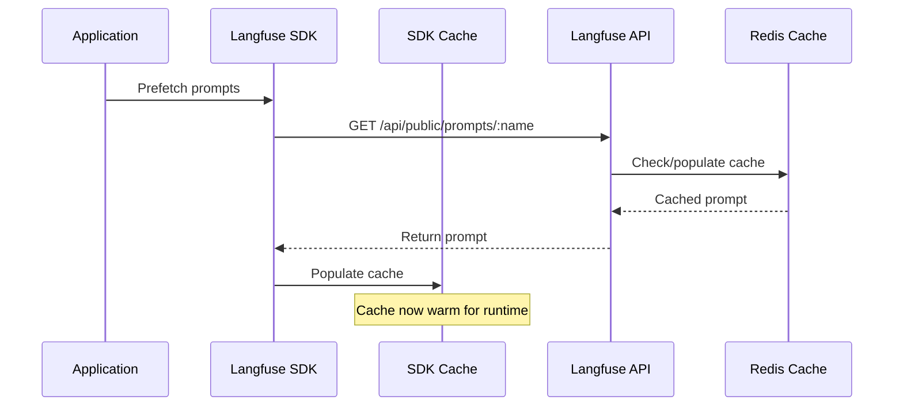
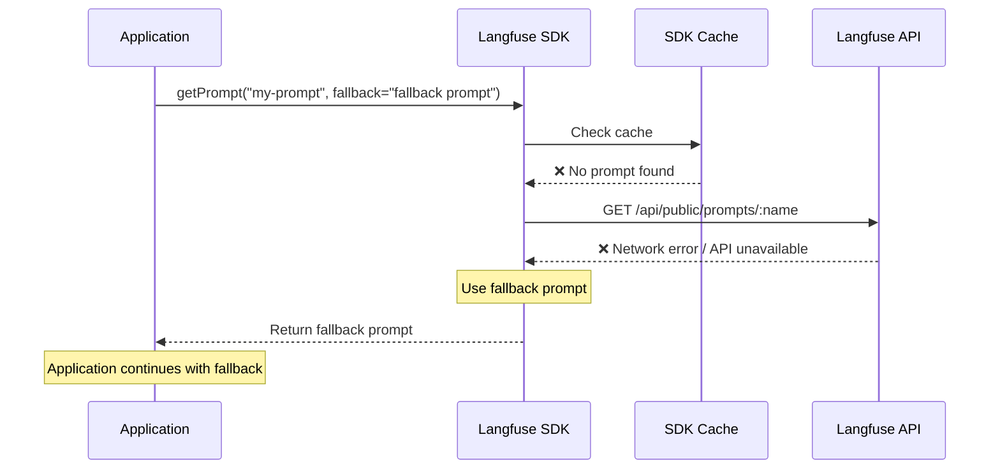

# Caching of Prompts in Client SDKs

Langfuse prompts are cached client-side in the SDKs, so **there's no latency impact after the first use** and no availability risk. You can also pre-fetch prompts on startup to populate the cache or provide a fallback prompt.

<Tabs items={["Cache Hit", "Background Revalidation", "Cache Miss", "Optional: Pre-fetch", "Optional: Fallback"]}>
<Tab>

When the SDK cache contains a fresh prompt, it's returned **immediately** without any network requests.



</Tab>
<Tab>

When the cache TTL has expired, stale prompts are served **immediately** while it **revalidates in the background**.



This ensures **high availability** - users never wait for network requests while the cache stays fresh.

</Tab>
<Tab>

When no cached prompt exists (e.g., first application startup), the prompt is fetched from the API. The API caches prompts in a Redis cache to ensure low latency.



Multiple fallback layers ensure **resilience** - if Redis is unavailable, the database serves as backup.

</Tab>
<Tab>

Pre-fetching prompts during application startup ensures that the cache is populated before runtime requests.

This step is optional and often unnecessary. Typically, the minimal latency experienced during the first use after a service starts is acceptable. See examples below on how to set this up.



</Tab>
<Tab>

When both the local cache is empty and the Langfuse API is unavailable, a fallback prompt can be used to ensure 100% availability.

This is rarely necessary because the prompts API is highly available, and we closely monitor its performance ([status page](https://status.langfuse.com)). In the event of a brief service disruption, the SDK-level prompt cache typically ensures that applications remain unaffected.



</Tab>
</Tabs>

## Optional: Customize caching duration (TTL)

The caching duration is configurable if you wish to reduce network overhead of the Langfuse Client. The default cache TTL is 60 seconds. After the TTL expires, the SDKs will refetch the prompt in the background and update the cache. Refetching is done asynchronously and does not block the application.

<Tabs items={["Python", "JS/TS"]}>
<Tab>

```python
# Get current `production` prompt version and cache for 5 minutes
prompt = langfuse.get_prompt("movie-critic", cache_ttl_seconds=300)
```

</Tab>

<Tab>

```ts
// Get current `production` version and cache prompt for 5 minutes
const prompt = await langfuse.getPrompt("movie-critic", undefined, {
  cacheTtlSeconds: 300,
});
```

</Tab>

</Tabs>

## Optional: Disable caching [#disable-caching]

You can disable caching by setting the `cacheTtlSeconds` to `0`. This will ensure that the prompt is fetched from the Langfuse API on every call. This is recommended for non-production use cases where you want to ensure that the prompt is always up to date with the latest version in Langfuse.

<Tabs items={["Python", "JS/TS"]} >
<Tab>

```python
prompt = langfuse.get_prompt("movie-critic", cache_ttl_seconds=0)

# Common in non-production environments, no cache + latest version
prompt = langfuse.get_prompt("movie-critic", cache_ttl_seconds=0, label="latest")
```

</Tab>

<Tab>

```ts
const prompt = await langfuse.getPrompt("movie-critic", undefined, {
  cacheTtlSeconds: 0,
});

// Common in non-production environments, no cache + latest version
const prompt = await langfuse.getPrompt("movie-critic", undefined, {
  cacheTtlSeconds: 0,
  label: "latest",
});
```

</Tab>
</Tabs>

## Optional: Guaranteed availability of prompts [#guaranteed-availability]

While usually not necessary, you can ensure 100% availability of prompts by pre-fetching them on application startup and providing a fallback prompt. Please follow this [guide](/docs/prompt-management/features/guaranteed-availability) for more information.

## Performance measurement of inital fetch

We measured the execution time of the following snippet with fully disabled caching. You can run [this notebook](/guides/cookbook/prompt_management_performance_benchmark) yourself to verify the results.

```python
prompt = langfuse.get_prompt("perf-test", cache_ttl_seconds=0)
prompt.compile(input="test")
```

Results from 1000 sequential executions using Langfuse Cloud (includes network latency):

<div className="sm:grid sm:grid-cols-2 gap-4">

<Frame className="max-w-md">
  
</Frame>

```
count    1000.000000
mean        0.039335 sec
std         0.014172 sec
min         0.032702 sec
25%         0.035387 sec
50%         0.037030 sec
75%         0.041111 sec
99%         0.068914 sec
max         0.409609 sec
```

</div>
