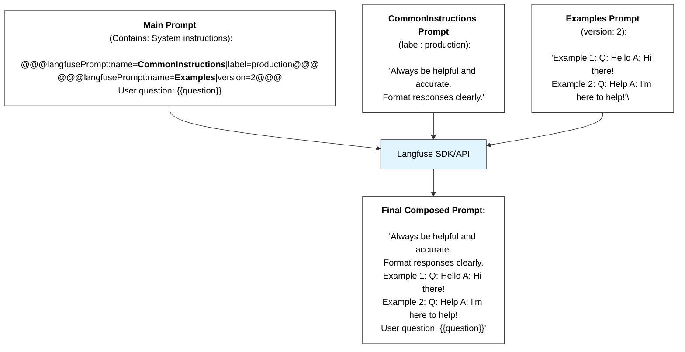

# Prompt Composability

As you create more prompts, you will often find yourself using the same snippets of text or instructions in multiple prompts. To avoid duplication, you can compose prompts by referencing other prompts.

## What composability can do

- Create modular **prompt components** that can be reused across multiple prompts
- **Maintain** common instructions, examples, or context in a single place
- **Update dependent prompts** automatically when base prompts change


<CloudflareVideo
  videoId="6e9c25ba3d4c72363680af5dfb6a9bd2"
  aspectRatio={16 / 9}
/>

## How composability works

When you fetch a prompt that contains references to other prompts, the Langfuse SDK/API automatically resolves these references and replaces the tags with the actual content from the referenced prompts.

The following diagram illustrates how prompt composability works in Langfuse:



## Get started

<Tabs items={["Langfuse UI", "Python SDK"]}>

<Tab>
When creating the prompt via the Langfuse UI, you can use the `Add prompt reference` button to insert a prompt reference tag into your prompt.

<CloudflareVideo
  videoId="442e83cda5a94c08faf20b8365f73726"
  aspectRatio={16 / 9}
  gifStyle
/>

</Tab>

<Tab>

You can reference other **text** prompts in your prompts using a simple tag format:

```bash
@@@langfusePrompt:name=PromptName|version=1@@@
```

You can also use a label instead of a specific version for dynamic resolution:

```bash
@@@langfusePrompt:name=PromptName|label=production@@@
```

</Tab>

</Tabs>