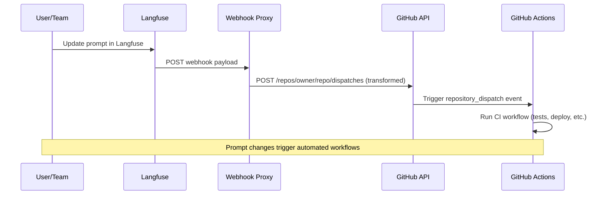
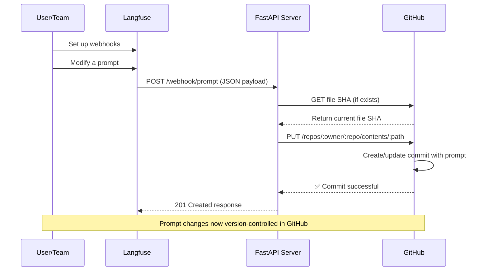

# GitHub Integration for Langfuse Prompts

There are two methods to integrate Langfuse prompts with GitHub:

- [**GitHub Actions Webhook**](#trigger-github-actions) - Trigger CI/CD workflows when prompts change. Requires a webhook proxy to transform payloads.
- [**Sync Langfuse Prompts to a repository**](#sync-langfuse-prompts-to-a-repository) - Store prompts in a specific file in your repository. This involves a webhook server that listens for prompt version changes and commits them to the repository.

---

## Trigger GitHub Actions [#trigger-github-actions]

Trigger GitHub Actions workflows when Langfuse prompts change using `repository_dispatch` events.



> **Note:** GitHub's `repository_dispatch` API requires a specific payload format with `event_type` and `client_payload` fields. Since Langfuse webhooks send the prompt data directly, you need an intermediate webhook proxy to transform the payload into the correct format for GitHub.

### 1. Create GitHub Workflow

`.github/workflows/langfuse-ci.yml`:

```yaml
name: Langfuse Prompt CI
on:
  repository_dispatch:
    types: [langfuse-prompt-update]
  workflow_dispatch:

jobs:
  test:
    runs-on: ubuntu-latest
    steps:
      - uses: actions/checkout@v4
      - name: Run tests
        run: |
          echo "Testing prompt: ${{ github.event.client_payload.prompt.name }} v${{ github.event.client_payload.prompt.version }}"
          # Add your test commands
          # npm test
          # python -m pytest
          
  deploy:
    needs: test
    runs-on: ubuntu-latest
    if: contains(github.event.client_payload.prompt.labels, 'production')
    steps:
      - uses: actions/checkout@v4
      - name: Deploy to production
        run: |
          echo "Deploying ${{ github.event.client_payload.prompt.name }} v${{ github.event.client_payload.prompt.version }}"
          # Your deployment commands
```

**Accessing webhook data:** Use `github.event.client_payload.*` to access prompt data:

```yaml
# Example: Access webhook data in your workflow
- name: Process prompt data
  run: |
    echo "Action: ${{ github.event.client_payload.action }}"
    echo "Prompt: ${{ github.event.client_payload.prompt.name }}"
    echo "Version: ${{ github.event.client_payload.prompt.version }}"
    echo "Labels: ${{ github.event.client_payload.prompt.labels }}"
    
- name: Deploy only production prompts
  if: contains(github.event.client_payload.prompt.labels, 'production')
  run: echo "Deploying production prompt"
```

### 2. Create GitHub Token for Actions

**Steps:**
1. **GitHub Settings > Developer settings > Personal access tokens**
2. **Generate new token (classic or fine-grained)**
3. **Select scope** (see table below)

| Token Type | Required Permissions |
|------------|-------------------|
| Personal Access Token (classic) | `repo` scope (public repos) or `public_repo` scope (private repos) |
| Fine-grained PAT or GitHub App | `read` and `write` to `actions` |

### 3. Deploy Webhook Proxy

Since GitHub's `repository_dispatch` API expects a payload with `event_type` and `client_payload` fields, you need an intermediate service to transform Langfuse webhook payloads. Below are examples using Cloudflare Workers (serverless) and a Python server.

<Tabs items={["Cloudflare Workers", "Python Server"]}>
<Tab>

Deploy this Cloudflare Worker to transform Langfuse webhooks into GitHub `repository_dispatch` format:

```javascript
export default {
  async fetch(request, env) {
    if (request.method !== "POST") {
      return new Response("Method not allowed", { status: 405 });
    }

    try {
      const langfusePayload = await request.json();

      // Transform to GitHub repository_dispatch format
      const githubPayload = {
        event_type: "langfuse-prompt-update",
        client_payload: langfusePayload,
      };

      const response = await fetch(
        `https://api.github.com/repos/${env.GITHUB_OWNER}/${env.GITHUB_REPO}/dispatches`,
        {
          method: "POST",
          headers: {
            Accept: "application/vnd.github+json",
            Authorization: `Bearer ${env.GITHUB_TOKEN}`,
            "Content-Type": "application/json",
            "User-Agent": "Langfuse-Webhook-Proxy",
          },
          body: JSON.stringify(githubPayload),
        }
      );

      if (!response.ok) {
        const error = await response.text();
        return new Response(`GitHub API error: ${error}`, {
          status: response.status,
        });
      }

      return new Response(JSON.stringify({ status: "dispatched" }), {
        status: 200,
        headers: { "Content-Type": "application/json" },
      });
    } catch (error) {
      return new Response(`Error: ${error.message}`, { status: 500 });
    }
  },
};
```

**Environment variables required:**
- `GITHUB_OWNER`: Your GitHub username or organization
- `GITHUB_REPO`: Your repository name
- `GITHUB_TOKEN`: Your GitHub Personal Access Token

</Tab>
<Tab>

Deploy this Python server as a webhook proxy:

```python
from fastapi import FastAPI, HTTPException, Request
import httpx
import os

app = FastAPI(title="Langfuse GitHub Actions Proxy")

GITHUB_TOKEN = os.environ["GITHUB_TOKEN"]
GITHUB_OWNER = os.environ["GITHUB_OWNER"]
GITHUB_REPO = os.environ["GITHUB_REPO"]

@app.post("/webhook")
async def proxy_webhook(request: Request):
    """Transform Langfuse webhook to GitHub repository_dispatch format."""
    langfuse_payload = await request.json()
    
    # Transform to GitHub repository_dispatch format
    github_payload = {
        "event_type": "langfuse-prompt-update",
        "client_payload": langfuse_payload
    }
    
    async with httpx.AsyncClient() as client:
        response = await client.post(
            f"https://api.github.com/repos/{GITHUB_OWNER}/{GITHUB_REPO}/dispatches",
            headers={
                "Accept": "application/vnd.github+json",
                "Authorization": f"Bearer {GITHUB_TOKEN}",
                "Content-Type": "application/json",
                "User-Agent": "Langfuse-Webhook-Proxy"
            },
            json=github_payload
        )
        
        if response.status_code not in (200, 204):
            raise HTTPException(
                status_code=response.status_code,
                detail=f"GitHub API error: {response.text}"
            )
    
    return {"status": "dispatched"}

@app.get("/health")
async def health():
    return {"healthy": True}
```

**Install dependencies:**

```bash
pip install fastapi uvicorn httpx
```

**Run the server:**

```bash
GITHUB_TOKEN=your_token GITHUB_OWNER=owner GITHUB_REPO=repo uvicorn main:app --host 0.0.0.0 --port 8000
```

Deploy to Render, Fly.io, Railway, or any platform that supports Python web apps.

</Tab>
</Tabs>

### 4. Configure Langfuse Webhook

1. Go to **Prompts > Automations** in your Langfuse project
2. Click **Create Webhook**
3. Set endpoint URL to your webhook proxy:
   - Cloudflare Workers: `https://your-worker.your-subdomain.workers.dev`
   - Python Server: `https://your-server.example.com/webhook`

### 5. Test GitHub Actions Integration

1. **Update a prompt** in Langfuse with the `production` label
2. **Check your webhook proxy logs** to verify the request was received
3. **Check GitHub Actions** tab for triggered workflow
4. **Verify** that both test and deploy jobs run successfully

---

## Sync Langfuse Prompts to a repository [#sync-langfuse-prompts-to-a-repository]

Automatically sync prompt changes from Langfuse to GitHub using [Prompt Version Webhooks](/docs/prompt-management/features/webhooks). This enables version control for prompts and can trigger CI/CD workflows.

### Overview of the Sync Workflow

Whenever you save a new prompt version in Langfuse, it's automatically committed to your GitHub repository. With this setup, you can also trigger CI/CD workflows when prompts change.



### Prerequisites for Sync

1. **Langfuse Project:** [Prompt setup](/docs/prompts/get-started) with Project Owner access
2. **GitHub Repository:** Public or private repo to store prompts
3. **GitHub PAT:** Personal Access Token with minimum required permissions (see Step 2 for details)
4. **Python 3.9+ (for the example below, can be any language)** with FastAPI, Uvicorn, httpx, Pydantic
5. **Public HTTPS endpoint** for your webhook server (Render, Fly.io, Heroku, etc.)

### Step 1: Configure a Prompt Webhook in Langfuse

1. Go to **Prompts > Webhooks** in your Langfuse project
2. Click **Create Webhook**
3. (optional) filter events: filter by which prompt version events to receive webhooks (default: `created`, `updated`, `deleted`)
4. Set endpoint URL: `https://<your-domain>/webhook/prompt`
5. Save and copy the **Signing Secret**

**Note:** Your endpoint must return 2xx status codes. Langfuse retries failed webhooks with exponential backoff.

#### Sample Webhook Payload

Sample webhook payload:

```json
{
  "id": "550e8400-e29b-41d4-a716-446655440000",
  "timestamp": "2024-07-10T10:30:00Z",
  "type": "prompt-version",
  "action": "created",
  "prompt": {
    "id": "prompt_abc123",
    "name": "movie-critic",
    "version": 3,
    "projectId": "xyz789",
    "labels": ["production", "latest"],
    "prompt": "As a {{criticLevel}} movie critic, rate {{movie}} out of 10.",
    "type": "text",
    "config": { "...": "..." },
    "commitMessage": "Improved critic persona",
    "tags": ["entertainment"],
    "createdAt": "2024-07-10T10:30:00Z",
    "updatedAt": "2024-07-10T10:30:00Z"
  }
}
```

### Step 2: Prepare Your GitHub Repo and Token for Sync

Create a `.env` file with your GitHub credentials:

```bash
GITHUB_TOKEN=<your_github_pat_here>
GITHUB_REPO_OWNER=<github_username_or_org>
GITHUB_REPO_NAME=<repo_name>
# (Optional) GITHUB_FILE_PATH=langfuse_prompt.json
# (Optional) GITHUB_BRANCH=main
# (Optional) REQUIRED_LABEL=production
```

Replace placeholders with your actual values. The server will commit prompts to `langfuse_prompt.json` on the `main` branch by default. If `REQUIRED_LABEL` is set, only prompts with that specific label will be synced to GitHub.

#### GitHub PAT Permissions for Sync

For the webhook to work, your GitHub Personal Access Token needs **minimal permissions**:

| Permission Type      | Required Permissions                                                                 |
| -------------------- | ------------------------------------------------------------------------------------ |
| Required Permissions | Contents: Read and write, Metadata: Read-only                                        |
| Legacy Token Scopes  | For public repositories: `public_repo` scope, For private repositories: `repo` scope |

### Step 3: Implement the FastAPI Webhook Server

Create `main.py` with this FastAPI server:

```python
from typing import Any, Dict
from uuid import UUID
import json
import base64

import httpx
from pydantic import BaseModel, Field
from pydantic_settings import BaseSettings, SettingsConfigDict
from fastapi import FastAPI, HTTPException, Body

class GitHubSettings(BaseSettings):
    """GitHub repository configuration."""
    GITHUB_TOKEN: str
    GITHUB_REPO_OWNER: str
    GITHUB_REPO_NAME: str
    GITHUB_FILE_PATH: str = "langfuse_prompt.json"
    GITHUB_BRANCH: str = "main"
    REQUIRED_LABEL: str = ""  # Optional: only sync prompts with this label

    model_config = SettingsConfigDict(
        env_file=".env",
        env_file_encoding="utf-8",
        case_sensitive=True
    )

config = GitHubSettings()

class LangfuseEvent(BaseModel):
    """Langfuse webhook event structure."""
    id: UUID = Field(description="Event identifier")
    timestamp: str = Field(description="Event timestamp")
    type: str = Field(description="Event type")
    action: str = Field(description="Performed action")
    prompt: Dict[str, Any] = Field(description="Prompt content")

async def sync(event: LangfuseEvent) -> Dict[str, Any]:
    """Synchronize prompt data to GitHub repository."""
    # Check if prompt has required label (if specified)
    if config.REQUIRED_LABEL:
        prompt_labels = event.prompt.get("labels", [])
        if config.REQUIRED_LABEL not in prompt_labels:
            return {"skipped": f"Prompt does not have required label '{config.REQUIRED_LABEL}'"}
    
    api_endpoint = f"https://api.github.com/repos/{config.GITHUB_REPO_OWNER}/{config.GITHUB_REPO_NAME}/contents/{config.GITHUB_FILE_PATH}"

    request_headers = {
        "Authorization": f"Bearer {config.GITHUB_TOKEN}",
        "Accept": "application/vnd.github.v3+json"
    }

    content_json = json.dumps(event.prompt, indent=2)
    encoded_content = base64.b64encode(content_json.encode("utf-8")).decode("utf-8")

    name = event.prompt.get("name", "unnamed")
    version = event.prompt.get("version", "unknown")
    message = f"{event.action}: {name} v{version}"

    payload = {
        "message": message,
        "content": encoded_content,
        "branch": config.GITHUB_BRANCH
    }

    async with httpx.AsyncClient() as http_client:
        try:
            existing = await http_client.get(api_endpoint, headers=request_headers, params={"ref": config.GITHUB_BRANCH})
            if existing.status_code == 200:
                payload["sha"] = existing.json().get("sha")
        except Exception:
            pass

        try:
            response = await http_client.put(api_endpoint, headers=request_headers, json=payload)
            response.raise_for_status()
            return response.json()
        except Exception as e:
            raise HTTPException(status_code=500, detail=f"Repository sync failed: {str(e)}")

app = FastAPI(title="Langfuse GitHub Sync", version="1.0")

@app.post("/webhook/prompt", status_code=201)
async def receive_webhook(event: LangfuseEvent = Body(...)):
    """Process Langfuse webhook and sync to GitHub."""
    result = await sync(event)
    return {
        "status": "synced",
        "commit_info": result.get("commit", {}),
        "file_info": result.get("content", {})
    }

@app.get("/status")
async def health_status():
    """Service health check."""
    return {"healthy": True}
```

The server validates webhook payloads, retrieves existing file SHAs if needed, and commits prompt changes to GitHub with descriptive commit messages.

#### Dependencies

Install dependencies:

```bash
pip install fastapi uvicorn pydantic-settings httpx
```

#### Running Locally

Run locally:

```bash
uvicorn main:app --reload --port 8000
```

Test the health endpoint at `http://localhost:8000/health`. Use ngrok or similar to expose localhost for webhook testing.

### Step 4: Deploy and Connect the Server

1. **Deploy:** Use Render, Fly.io, Heroku, or similar. Set environment variables and ensure HTTPS is enabled.

2. **Update Webhook:** In Langfuse, edit your webhook and set the URL to `https://your-domain.com/webhook/prompt`.

3. **Test:** Update a prompt in Langfuse and verify a new commit appears in your GitHub repository.

### Security Considerations

- **Verify signatures:** Use the signing secret and `x-langfuse-signature` header to validate requests
- **Limit PAT scope:** Use fine-grained tokens restricted to specific repositories
- **Handle retries:** The implementation is idempotent - duplicate events won't create conflicting commits
