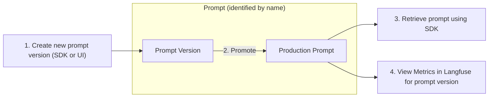

# Prompt Management

Use Langfuse to effectively manage and version your prompts. This allows you to iterate quickly, publish new prompt versions without redeploying your app, and track metrics by version.

The workflow for managing prompts in Langfuse includes the following steps:

1. Create a new prompt or update exisiting to create a new prompt version
2. Promote a prompt version to production
3. Retrieve the prompt in your app using the SDK (production or specific version)
4. View metrics in Langfuse for a prompt version
