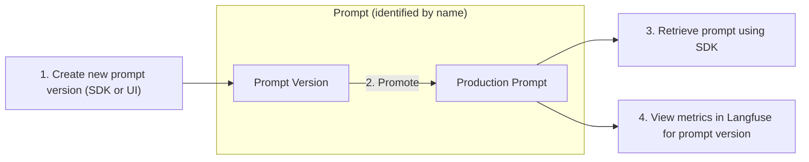

import { Callout } from "nextra-theme-docs";
import { CloudflareVideo } from "@/components/CloudflareVideo";

# Prompt Management

Use Langfuse to effectively manage and version your prompts. This allows you to iterate quickly, publish new prompt versions without redeploying your app, and track metrics by version.

```python
# get current production prompt in application
langfuse.get_prompt("prompt name")
```

## How to use Langfuse for prompt management

<Callout type="info">

This feature is currently in beta, the API is stable and performance/UI will be improved significantly over the next weeks. Please share your feedback on our [Discord](/discord).

</Callout>

The workflow for managing prompts in Langfuse includes the following steps:



### Create / Update prompts

**Create**

<Tabs items={["Langfuse UI", "Python SDK", "JS/TS SDK"]}>
<Tab>

<CloudflareVideo
  videoId="3c9bf36417e79dd2d68c3bba2a8f0a98"
  aspectRatio={1.24}
  gifStyle
  className="max-w-lg"
/>

</Tab>
<Tab>

```python
langfuse.create_prompt(
  name: "prompt name",
  prompt: "This is a prompt with a {{variable}}",
  is_active: True # directly promote to production?
)
```

</Tab>

<Tab>

```typescript
await langfuse.createPrompt({
  name: "prompt name",
  prompt: "This is a prompt with a {{variable}}",
  isActive: true, // directly promote to production?
});
```

</Tab>

</Tabs>

**Update**

Use the edit button in the Langfuse UI or create a new prompt version via the SDKs with the same name.

### Promote prompt to production

Set a promot version to `active` when creating it via the SDKs. In the Langfuse UI, you can promote a prompt version to production:

<CloudflareVideo
  videoId="7b91335f4625123f2e3b9b652da7c19d"
  aspectRatio={16 / 9}
  gifStyle
  className="max-w-lg"
/>

### Retrieve prompt in your application

<Tabs items={["Python SDK", "JS/TS SDK"]}>
<Tab>

```python
# get current production version
prompt = langfuse.get_prompt("prompt name")

# get specific version
prompt = langfuse.get_prompt("prompt name", version=3)

# insert variables into prompt template
compiled_prompt = prompt.compile(input="test")
```

</Tab>

<Tab>

```typescript
// get current production version
const prompt = await langfuse.getPrompt("prompt name");

// get specific version
const prompt = await langfuse.getPrompt("prompt name", { version: 3 });

// insert variables into prompt template
const compiledPrompt = prompt.compile({ input: "test" });
```

</Tab>

</Tabs>

### Tag generations to get metrics by prompt version

Add the prompt object to the `generation` call in the SDKs to link the generation in [Langfuse Tracing](/docs/tracing) to the prompt version. This allows you to track metrics by prompt name and version in the Langfuse UI.

<Tabs items={["Python SDK", "JS/TS SDK"]}>
<Tab>

```diff
langfuse.generation(
    ...
+   prompt=prompt
    ...
)
```

</Tab>

<Tab>

This feature is not yet available in the JS/TS SDK. We will add it soon.

</Tab>

</Tabs>

## Performance

While [Langfuse Tracing](/docs/tracing) is fully asynchronous and non-blocking, managing prompts in Langfuse adds latency to your application when retrieving the prompt. Currently the prompt is retrieved from the Langfuse API every time you fetch it via the SDKs. We will introduce caching in future releases to reduce the performance impact.

**Quick performance measurement**

We measured the execution time of the following snippet (retrieval and prompt compilation):

```python
prompt = langfuse.get_prompt("perf-test")
prompt.compile(input="test")
```

Results from 1000 sequential executions:

<div className="sm:grid sm:grid-cols-2 gap-4">

<Frame className="max-w-md">
  
</Frame>

```
count  1000.000000
mean      0.178465 sec
std       0.058125 sec
min       0.137314 sec
25%       0.161333 sec
50%       0.165919 sec
75%       0.171736 sec
max       0.687994 sec
```

</div>
