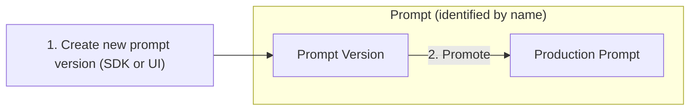

import { Callout } from "nextra-theme-docs";
import { CloudflareVideo } from "@/components/Video";

# Prompt Management

Use AssistMe to effectively manage and version your prompts. This allows you to iterate quickly, publish new prompt versions without redeploying your app, and track metrics by version.

## How to use AssistMe for prompt management

<Callout type="info">

This feature is currently in beta, the API is stable and performance/UI will be improved significantly over the next weeks. Please share your feedback on our [Discord](/discord).

</Callout>

The workflow for managing prompts in AssistMe includes the following steps:

### Create / Update prompts

**Create**

<CloudflareVideo
  videoId="3c9bf36417e79dd2d68c3bba2a8f0a98"
  aspectRatio={1.24}
  gifStyle
  className="max-w-xl"
/>

**Update**

Use the edit button in the Langfuse UI or create a new prompt version via the SDKs with the same name.

### Promote prompt to production

Set a prompt version to `active` when creating. In the AssistMe UI, you can promote a prompt version to production:

<CloudflareVideo
  videoId="7b91335f4625123f2e3b9b652da7c19d"
  aspectRatio={16 / 9}
  gifStyle
  className="max-w-xl"
/>

