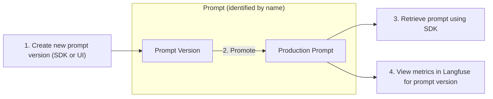

import { Callout } from "nextra-theme-docs";
import { CloudflareVideo } from "@/components/Video";

# Prompt Management

Use Langfuse to effectively manage and version your prompts. This allows you to iterate quickly, publish new prompt versions without redeploying your app, and track metrics by prompt version.

<Tabs items={["Python SDK", "JS/TS SDK"]}>
<Tab>

```python
from langfuse import Langfuse

langfuse = Langfuse()

# Get current production prompt in application
langfuse.get_prompt("prompt name")
```

</Tab>
<Tab>

```typescript
import { Langfuse } from "langfuse";

const langfuse = new Langfuse();

// Get current production prompt in application
langfuse.getPrompt("prompt name");
```

</Tab>
</Tabs>

The workflow for managing prompts in Langfuse includes the following steps:



## Create / Update prompts

**Create**

<Tabs items={["Langfuse UI", "Python SDK", "JS/TS SDK"]}>
<Tab>

<CloudflareVideo
  videoId="3c9bf36417e79dd2d68c3bba2a8f0a98"
  aspectRatio={1.24}
  gifStyle
  className="max-w-xl"
/>

</Tab>
<Tab>

```python
langfuse.create_prompt(
  name: "prompt name",
  prompt: "This is a prompt with a {{variable}}",
  is_active: True # directly promote to production?
)
```

</Tab>

<Tab>

```typescript
await langfuse.createPrompt({
  name: "prompt name",
  prompt: "This is a prompt with a {{variable}}",
  isActive: true, // directly promote to production?
});
```

</Tab>

</Tabs>

**Update**

Use the edit button in the Langfuse UI or create a new prompt version via the SDKs with the same name.

## Promote prompt to production

Set a prompt version to `active` when creating it via the SDKs. In the Langfuse UI, you can promote a prompt version to production:

<CloudflareVideo
  videoId="0a1cc222b766594947efd00af62e7a67"
  aspectRatio={16.2 / 9}
  gifStyle
  className="max-w-xl"
/>

## Retrieve prompt in your application

<Tabs items={["Python SDK", "JS/TS SDK"]}>
<Tab>

```python
# Get current production version
prompt = langfuse.get_prompt("prompt name")

# Get specific version
prompt = langfuse.get_prompt("prompt name", version=3)

# Get specific version and extend cache TTL from default 60 to 300 seconds
prompt = langfuse.get_prompt("prompt name", version=3, cache_ttl_seconds=300)

# Insert variables into prompt template
compiled_prompt = prompt.compile(input="test")
```

</Tab>

<Tab>

```typescript
// Get current production version
const prompt = await langfuse.getPrompt("prompt name");

// Get specific version of a prompt (here version 3). Prompt is returned even if not active.
const prompt = await langfuse.getPrompt("prompt name", 3);

// Get specific version and extend cache TTL from default 1 to 5 minutes
const prompt = await langfuse.getPrompt("prompt name", 3, {
  cacheTtlSeconds: 300,
});

// Insert variables into prompt template
const compiledPrompt = prompt.compile({ input: "test" });
```

</Tab>

</Tabs>

### Caching in client SDKs

While [Langfuse Tracing](/docs/tracing/overview) is fully asynchronous and non-blocking, managing prompts in Langfuse adds latency to your application when retrieving the prompt. To minimize the impact on your application, prompts are cached for 60 seconds in the client SDKs once fetched. The cache TTL can be configured directly in the SDKs.

<Callout type="info">

When refetching a prompt fails but an expired version is in the cache, the SDKs will return the expired version, preventing application blockage due to network issues.

</Callout>

<Tabs items={["Python SDK", "JS/TS SDK"]}>
<Tab>

```python
# Get current production prompt version and cache for 5 minutes
prompt = langfuse.get_prompt("prompt name", cache_ttl_seconds=300)

# Get a specific prompt version and cache for 5 minutes
prompt = langfuse.get_prompt("prompt name", version=3, cache_ttl_seconds=300)

# Disable caching for a prompt
prompt = langfuse.get_prompt("prompt name", cache_ttl_seconds=0)
```

</Tab>

<Tab>

```typescript
// Get current production version and cache prompt for 5 minutes
const prompt = await langfuse.getPrompt("prompt name", undefined, {
  cacheTtlSeconds: 300,
});

// Get prompt version 3 and cache for 5 minutes
const prompt = await langfuse.getPrompt("prompt name", 3, {
  cacheTtlSeconds: 300,
});

// Disable caching for a prompt
const prompt = await langfuse.getPrompt("prompt name", undefined, {
  cacheTtlSeconds: 0,
});
```

</Tab>

</Tabs>

### Performance on first fetch (excluding cache hits)

We measured the execution time of the following snippet (prompt retrieval and compilation). Note that this excludes cache hits where the prompt is available immediately.

```python
prompt = langfuse.get_prompt("perf-test")
prompt.compile(input="test")
```

Results from 1000 sequential executions in a local jupyter notebook using Langfuse Cloud (includes network latency):

<div className="sm:grid sm:grid-cols-2 gap-4">

<Frame className="max-w-md">
  
</Frame>

```
count  1000.000000
mean      0.178465 sec
std       0.058125 sec
min       0.137314 sec
25%       0.161333 sec
50%       0.165919 sec
75%       0.171736 sec
max       0.687994 sec
```

</div>

## Link generations in Langfuse Tracing to prompt versions

Add the prompt object to the `generation` call in the SDKs to link the generation in [Langfuse Tracing](/docs/tracing/overview) to the prompt version. This allows you to track metrics by prompt name and version in the Langfuse UI.

<Tabs items={["Python SDK", "JS/TS SDK"]}>
<Tab>

```diff
langfuse.generation(
    ...
+   prompt=prompt
    ...
)
```

</Tab>

<Tab>

```diff
langfuse.generation({
    ...
+   prompt: prompt
    ...
})
```

</Tab>

</Tabs>

## Demo

We used this feature for our Docs Q&A Chatbot and traced it with Langfuse. You can get view-only access to the project by signing up to the [public demo](/docs/demo).
