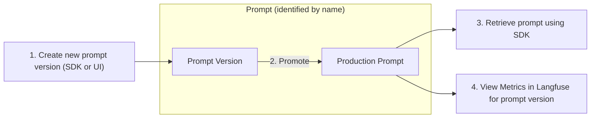

import { Callout } from "nextra-theme-docs";

# Prompt Management

Use Langfuse to effectively manage and version your prompts. This allows you to iterate quickly, publish new prompt versions without redeploying your app, and track metrics by version.

## How to use Langfuse for prompt management

<Callout type="info">

This feature is currently in beta, the API is stable and performance/UI will be improved significantly over the next weeks. Please share your feedback on our [Discord](/discord).

</Callout>

The workflow for managing prompts in Langfuse includes the following steps:



## Performance

While [Langfuse Tracing](/docs/tracing) is fully asynchronous and non-blocking, managing prompts in Langfuse adds latency to your application when retrieving the prompt. Currently the prompt is retrieved from the Langfuse API every time you fetch it via the SDKs. We will introduce caching in future releases to reduce the performance impact.

**Quick performance measurement**

We measured the execution time of the following snippet (retrieval and prompt compilation):

```python
prompt = langfuse.get_prompt("perf-test")
prompt.compile(input="test")
```

Results from 1000 sequential executions:

<div className="sm:grid sm:grid-cols-2 gap-4">

<Frame className="max-w-md">
  
</Frame>

```
count  1000.000000
mean      0.178465 sec
std       0.058125 sec
min       0.137314 sec
25%       0.161333 sec
50%       0.165919 sec
75%       0.171736 sec
max       0.687994 sec
```

</div>
