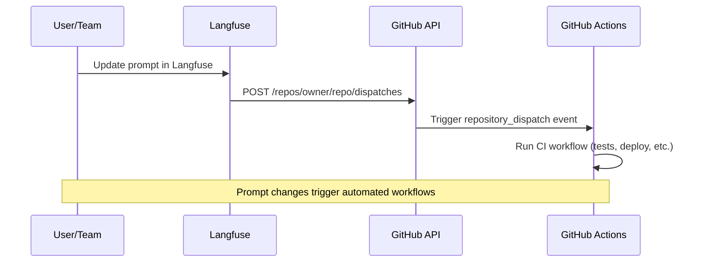

# Trigger GitHub Actions from Langfuse Webhooks

Trigger GitHub Actions workflows when Langfuse prompts change using `repository_dispatch` events.




## 1. Create GitHub Workflow

`.github/workflows/langfuse-ci.yml`:

```yaml
name: Langfuse Prompt CI
on:
  repository_dispatch:
    types: [langfuse-prompt-update]
  workflow_dispatch:

jobs:
  test:
    runs-on: ubuntu-latest
    steps:
      - uses: actions/checkout@v4
      - name: Run tests
        run: |
          echo "Testing prompt: ${{ github.event.client_payload.prompt.name }} v${{ github.event.client_payload.prompt.version }}"
          # Add your test commands
          # npm test
          # python -m pytest
          
  deploy:
    needs: test
    runs-on: ubuntu-latest
    if: contains(github.event.client_payload.prompt.labels, 'production')
    steps:
      - uses: actions/checkout@v4
      - name: Deploy to production
        run: |
          echo "Deploying ${{ github.event.client_payload.prompt.name }} v${{ github.event.client_payload.prompt.version }}"
          # Your deployment commands
```

**Accessing webhook data:** Use `github.event.client_payload.*` to access prompt data:

```yaml
# Example: Access webhook data in your workflow
- name: Process prompt data
  run: |
    echo "Action: ${{ github.event.client_payload.action }}"
    echo "Prompt: ${{ github.event.client_payload.prompt.name }}"
    echo "Version: ${{ github.event.client_payload.prompt.version }}"
    echo "Labels: ${{ github.event.client_payload.prompt.labels }}"
    
- name: Deploy only production prompts
  if: contains(github.event.client_payload.prompt.labels, 'production')
  run: echo "Deploying production prompt"
```

## 2. Create GitHub Token


**Steps:**
1. **GitHub Settings > Developer settings > Personal access tokens**
2. **Generate new token (classic or fine-grained)**
3. **Select scope** (see table below)

| Token Type | Required Permissions |
|------------|-------------------|
| Personal Access Token (classic) | `repo` scope (public repos) or `public_repo` scope (private repos) |
| Fine-grained PAT or GitHub App | `read` and `write` to `actions` |


## 3. Configure Langfuse Webhook

1. Go to **Prompts > Webhooks** in your Langfuse project
2. Click **Create Webhook**
3. Set endpoint URL: `https://api.github.com/repos/{owner}/{repo}/dispatches`
4. Add headers:
   - `Accept: application/vnd.github+json`
   - `Authorization: Bearer {your_github_token}`


**Important:** Store your GitHub token securely in the Authorization header. Langfuse encrypts webhook headers and stores them securely.

## 4. Test

1. **Update a prompt** in Langfuse with the `production` label
2. **Check GitHub Actions** tab for triggered workflow
3. **Verify** that both test and deploy jobs run successfully

