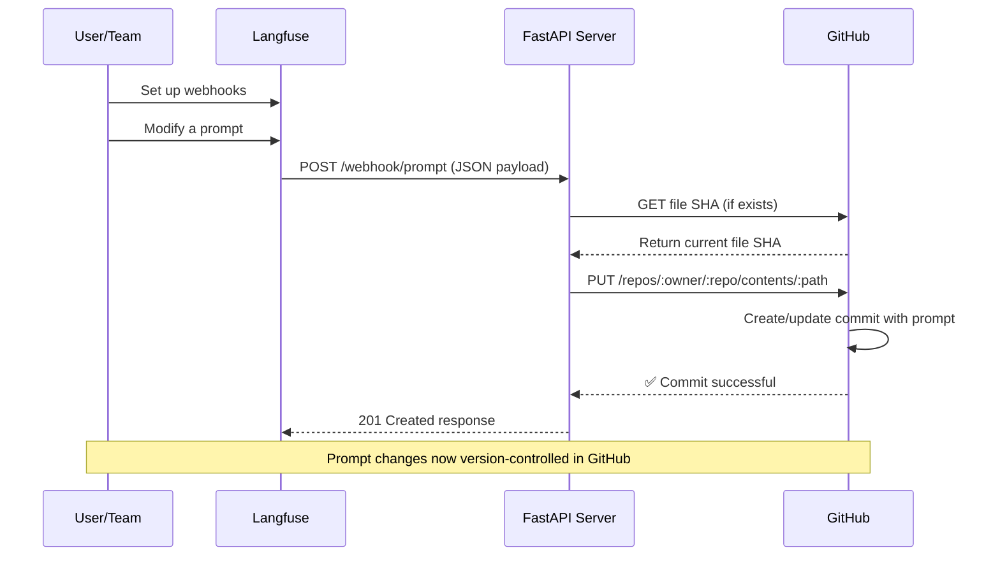

# Sync Your Langfuse Prompt with GitHub via Webhooks

Automatically sync prompt changes from Langfuse to GitHub using [Prompt Version Webhooks](https://langfuse.com/docs/integrations/webhooks). This enables version control for prompts and can trigger CI/CD workflows.

## Overview of the Workflow

Whenever you save a new prompt version in Langfuse, it's automatically committed to your GitHub repository. With this setup, you can also trigger CI/CD workflows when prompts change.



## Prerequisites

1. **Langfuse Project:** [Prompt setup](/docs/prompts/get-started) with Project Owner access
2. **GitHub Repository:** Public or private repo to store prompts
3. **GitHub PAT:** Personal Access Token with minimum required permissions (see Step 2 for details)
4. **Python 3.9+ (for the example below, can be any language)** with FastAPI, Uvicorn, httpx, Pydantic
5. **Public HTTPS endpoint** for your webhook server (Render, Fly.io, Heroku, etc.)

## Step 1: Configure a Prompt Webhook in Langfuse

1. Go to **Prompts > Webhooks** in your Langfuse project
2. Click **Create Webhook**
3. (optional) filter events: filter by which prompt version events to receive webhooks (default: `created`, `updated`, `deleted`)
4. Set endpoint URL: `https://<your-domain>/webhook/prompt`
5. Save and copy the **Signing Secret**

**Note:** Your endpoint must return 2xx status codes. Langfuse retries failed webhooks with exponential backoff.

### Sample Webhook Payload

Sample webhook payload:

```json
{
  "id": "550e8400-e29b-41d4-a716-446655440000",
  "timestamp": "2024-07-10T10:30:00Z",
  "type": "prompt-version",
  "action": "created",
  "prompt": {
    "id": "prompt_abc123",
    "name": "movie-critic",
    "version": 3,
    "projectId": "xyz789",
    "labels": ["production", "latest"],
    "prompt": "As a {{criticLevel}} movie critic, rate {{movie}} out of 10.",
    "type": "text",
    "config": { "...": "..." },
    "commitMessage": "Improved critic persona",
    "tags": ["entertainment"],
    "createdAt": "2024-07-10T10:30:00Z",
    "updatedAt": "2024-07-10T10:30:00Z"
  }
}
```

## Step 2: Prepare Your GitHub Repo and Token

Create a `.env` file with your GitHub credentials:

```bash
GITHUB_TOKEN=<your_github_pat_here>
GITHUB_REPO_OWNER=<github_username_or_org>
GITHUB_REPO_NAME=<repo_name>
# (Optional) GITHUB_FILE_PATH=langfuse_prompt.json
# (Optional) GITHUB_BRANCH=main
```

Replace placeholders with your actual values. The server will commit prompts to `langfuse_prompt.json` on the `main` branch by default.

#### GitHub PAT Permissions

For the webhook to work, your GitHub Personal Access Token needs **minimal permissions**:

| Permission Type | Required Permissions |
|----------------|---------------------|
| Required Permissions | Contents: Read and write, Metadata: Read-only |
| Legacy Token Scopes | For public repositories: `public_repo` scope, For private repositories: `repo` scope |


## Step 3: Implement the FastAPI Webhook Server

Create `main.py` with this FastAPI server:

```python
from typing import Any, Dict
from uuid import UUID
import json
import base64

import httpx
from pydantic import BaseModel, Field
from pydantic_settings import BaseSettings, SettingsConfigDict
from fastapi import FastAPI, HTTPException, Body

class GitHubSettings(BaseSettings):
    """GitHub repository configuration."""
    GITHUB_TOKEN: str
    GITHUB_REPO_OWNER: str
    GITHUB_REPO_NAME: str
    GITHUB_FILE_PATH: str = "langfuse_prompt.json"
    GITHUB_BRANCH: str = "main"

    model_config = SettingsConfigDict(
        env_file=".env", 
        env_file_encoding="utf-8",
        case_sensitive=True
    )

config = GitHubSettings()

class LangfuseEvent(BaseModel):
    """Langfuse webhook event structure."""
    id: UUID = Field(description="Event identifier")
    timestamp: str = Field(description="Event timestamp")
    type: str = Field(description="Event type")
    action: str = Field(description="Performed action")
    prompt: Dict[str, Any] = Field(description="Prompt content")

async def sync(event: LangfuseEvent) -> Dict[str, Any]:
    """Synchronize prompt data to GitHub repository."""
    api_endpoint = f"https://api.github.com/repos/{config.GITHUB_REPO_OWNER}/{config.GITHUB_REPO_NAME}/contents/{config.GITHUB_FILE_PATH}"
    
    request_headers = {
        "Authorization": f"Bearer {config.GITHUB_TOKEN}",
        "Accept": "application/vnd.github.v3+json"
    }
    
    content_json = json.dumps(event.prompt, indent=2)
    encoded_content = base64.b64encode(content_json.encode("utf-8")).decode("utf-8")
    
    name = event.prompt.get("name", "unnamed")
    version = event.prompt.get("version", "unknown")
    message = f"{event.action}: {name} v{version}"
    
    payload = {
        "message": message,
        "content": encoded_content,
        "branch": config.GITHUB_BRANCH
    }
    
    async with httpx.AsyncClient() as http_client:
        try:
            existing = await http_client.get(api_endpoint, headers=request_headers, params={"ref": config.GITHUB_BRANCH})
            if existing.status_code == 200:
                payload["sha"] = existing.json().get("sha")
        except Exception:
            pass
        
        try:
            response = await http_client.put(api_endpoint, headers=request_headers, json=payload)
            response.raise_for_status()
            return response.json()
        except Exception as e:
            raise HTTPException(status_code=500, detail=f"Repository sync failed: {str(e)}")

app = FastAPI(title="Langfuse GitHub Sync", version="1.0")

@app.post("/webhook/prompt", status_code=201)
async def receive_webhook(event: LangfuseEvent = Body(...)):
    """Process Langfuse webhook and sync to GitHub."""
    result = await sync(event)
    return {
        "status": "synced",
        "commit_info": result.get("commit", {}),
        "file_info": result.get("content", {})
    }

@app.get("/status")
async def health_status():
    """Service health check."""
    return {"healthy": True}
```

The server validates webhook payloads, retrieves existing file SHAs if needed, and commits prompt changes to GitHub with descriptive commit messages.

### Dependencies

Install dependencies:

```bash
pip install fastapi uvicorn pydantic-settings httpx
```

### Running Locally

Run locally:

```bash
uvicorn main:app --reload --port 8000
```

Test the health endpoint at `http://localhost:8000/health`. Use ngrok or similar to expose localhost for webhook testing.

## Step 4: Deploy and Connect the Server

1. **Deploy:** Use Render, Fly.io, Heroku, or similar. Set environment variables and ensure HTTPS is enabled.

2. **Update Webhook:** In Langfuse, edit your webhook and set the URL to `https://your-domain.com/webhook/prompt`.

3. **Test:** Update a prompt in Langfuse and verify a new commit appears in your GitHub repository.

## Security Considerations

- **Verify signatures:** Use the signing secret and `x-langfuse-signature` header to validate requests
- **Limit PAT scope:** Use fine-grained tokens restricted to specific repositories
- **Handle retries:** The implementation is idempotent - duplicate events won't create conflicting commits

