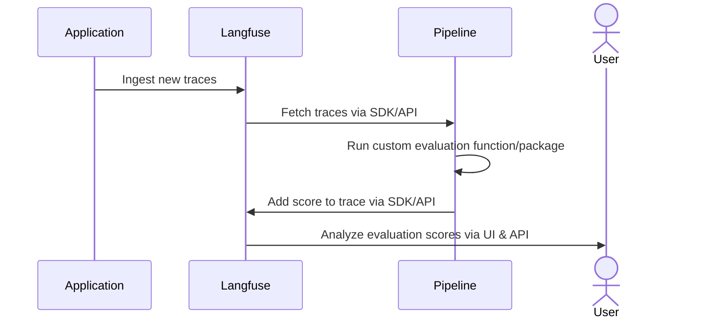

# Custom Scores via API/SDKs

Langfuse gives you full flexibility to ingest custom [`scores`](/docs/scores) via the Langfuse SDKs or API. If scores are required to follow a specific schema, you can define and refer a [`score configuration (config)`](/docs/scores/custom#how-to-define-score-configurations) in the Langfuse UI or via our API. The scoring workflow allows you to run custom quality checks on the output of your workflows at runtime, or to run custom human evaluation workflows.

Exemplary use cases:

- **Deterministic rules at runtime**: e.g. check if output contains a certain keyword, adheres to a specified structure/format or if the output is longer than a certain length.
- **Custom internal workflow tooling**: build custom internal tooling that helps you manage human-in-the-loop workflows. Ingest scores back into Langfuse, optionally following your custom schema by referencing a config.
- **Automated data pipeline**: continuously monitor the quality by fetching traces from Langfuse, running custom evaluations, and ingesting scores back into Langfuse.

## How to add scores

You can add scores via the Langfuse SDKs or API. When ingesting data via API you can define scores to be of data type numeric, categorical or boolean. Further, if you'd like to ensure that your scores follow a specific schema, you can define a score config in the Langfuse UI or via our API. 

<Tabs items={["Python SDK", "JS/TS SDK", "API"]}>
<Tab>

```python
langfuse.score(
    trace_id=message.trace_id,
    observation_id=message.generation_id, # optional
    name="accuracy",
    value=1,
    comment="Factually correct", # optional
    id="unique_id" # optional, can be used as an indempotency key to update the score subsequently
    config_id="78545-6565-3453654-43543" # optional, to ensure that the score follows a specific schema
    data_type="CATEGORICAL" # optional, inferred if config_id passed, otherwise can be defined manually as NUMERIC, CATEGORICAL or BOOLEAN. Defaults to NUMERIC when not set
    string_value="Correct" # optional, inferred if config_id passed or of type BOOLEAN, otherwise can be defined manually for CATEGORICAL data types
)
```

→ More details in [Python SDK docs](/docs/sdk/python)

</Tab>
<Tab>

```typescript
await langfuse.score({
  traceId: message.traceId,
  observationId: message.generationId, // optional
  name: "accuracy",
  value: 1,
  comment: "Factually correct", // optional
  id: "unique_id", // optional, can be used as an indempotency key to update the score subsequently
  configId: "78545-6565-3453654-43543", // optional, to ensure that the score follows a specific schema
  dataType: "CATEGORICAL", // optional, inferred if configId passed, otherwise can be defined manually as NUMERIC, CATEGORICAL or BOOLEAN. Defaults to NUMERIC when not set
  stringValue: "Correct", // optional, inferred if config_id passed or of type BOOLEAN, otherwise can be defined manually for CATEGORICAL data types
});
```

→ More details in [JS/TS SDK docs](/docs/sdk/typescript/guide#score)

</Tab>
<Tab>

Check out [API reference](/docs/api) for more details on POST/GET scores endpoints.

</Tab>
</Tabs>

## How to define score configurations 

A score config includes the desired score name, data type, and constraints on score value range such as min and max values for numerical data types and custom categories for categorical data types. See [API reference](/docs/api) for more details on POST/GET score configs endpoints. Configs are crucial to ensure that scores comply with a specific schema therefore standardizing them for future analysis.

## Data pipeline example



You can run custom evaluations on data in Langfuse by fetching traces from Langfuse (e.g. via the Python SDK) and then adding evaluation results as [`scores`](/docs/scores) back to the traces in Langfuse.
