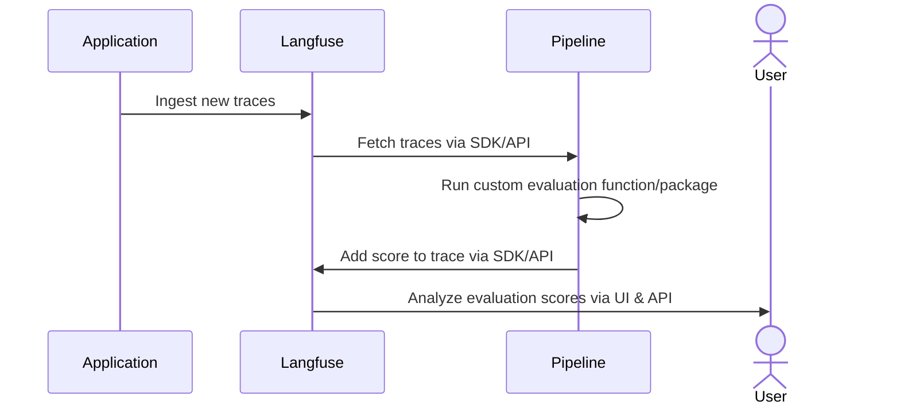

# Custom Scores via API/SDKs

Langfuse gives you full flexibility to ingest custom [`scores`](/docs/scores) via the Langfuse SDKs or API. If scores are required to follow a specific schema, you can define and refer a [`score configuration (config)`](/docs/scores/custom#how-to-define-score-configurations) in the Langfuse UI or via our API. The scoring workflow allows you to run custom quality checks on the output of your workflows at runtime, or to run custom human evaluation workflows.

Exemplary use cases:

- **Deterministic rules at runtime**: e.g. check if output contains a certain keyword, adheres to a specified structure/format or if the output is longer than a certain length.
- **Custom internal workflow tooling**: build custom internal tooling that helps you manage human-in-the-loop workflows. Ingest scores back into Langfuse, optionally following your custom schema by referencing a config.
- **Automated data pipeline**: continuously monitor the quality by fetching traces from Langfuse, running custom evaluations, and ingesting scores back into Langfuse.

## How to add scores

You can add scores via the Langfuse SDKs or API. When ingesting data via API you can define scores to be of data type numeric, categorical or boolean. Further, if you'd like to ensure that your scores follow a specific schema, you can define a score config in the Langfuse UI or via our API. 

When ingesting scores, you may provide:
- **Value**: required, of type `string` or `float`
- **Data Type**: optional, of type `NUMERIC`, `CATEGORICAL` or `BOOLEAN`
- **Config Id**: optional, of type `string`

**Certain score properties might be inferred based on your input**. If you don't provide a score data type it will always be inferred. See tables below for details. For boolean and categorical scores, we will provide the score value in both numerical and string format where possible. The score value format that is not provided as input, i.e. the translated value is referred to as the inferred value in the tables below. On read for boolean scores both numerical and string representations of the score value will be returned, e.g. both 1 and True. For categorical scores, the string representation is always provided and a numerical mapping of the category will be produced only if a score config was provided. 

### Score ingestion: provide value only

| Value      | Data Type   | Config Id | Description                  | Inferred Data Type | Inferred Value representation | Valid |
|------------|-------------|-----------|------------------------------|--------------------|----------------------------|-------|
| `1`        | `Null`      | `Null`    | Data type is inferred        | `NUMERIC`          | `Null`                     | Yes   |
| `depth`    | `Null`      | `Null`    | Data type is inferred        | `CATEGORICAL`      | `Null`                     | Yes   |

### Score ingestion: provide data type and no config

| Value      | Data Type     | Config Id | Description                            | Inferred Value representation | Valid |
|------------|---------------|-----------|----------------------------------------|-------------------------|-------|
| `1`        | `NUMERIC`     | `Null`    | No properties inferred                 | `Null`                  | Yes   |
| `depth`    | `CATEGORICAL` | `Null`    | No properties inferred                 | `Null`                  | Yes   |
| `1`        | `Boolean`     | `Null`    | String value representation inferred   | `True`                  | Yes   |
| `depth`    | `NUMERIC`     | `Null`    | Error: data type of value does not match provided data type |    | No    |
| `1`        | `CATEGORICAL` | `Null`    | Error: data type of value does not match provided data type |    | No    |
| `true`     | `Boolean`     | `Null`    | Error: boolean data type expects numeric input value        |    | No    |
| `3`        | `Boolean`     | `Null`    | Error: boolean data type expects `0` or `1` as input value  |    | No    |

### Score ingestion: provide config 

Whenever you provide a config, the score data will be validated against the config. The following rules apply:
- **Score Name**: Must equal the config's name
- **Score Data Type**: When provided, must match the config's data type
- **Score Value**: Must match the config's data type and be within the config's value range:
  - **Numeric**: Value must be within the min and max values defined in the config (if provided, min and max are optional and otherwise are assumed as -∞ and +∞ respectively)
  - **Categorical**: Value must map to one of the categories defined in the config
  - **Boolean**: Value must equal `0` or `1`

| Value      | Data Type     | Config Id   | Description                                             | Inferred Data Type | Inferred Value representation | Valid    |
|------------|---------------|-------------|---------------------------------------------------------|--------------------|----------------------------|-------------|
| `1`        | `Null`        | `78545`     | Data type inferred                                      | `NUMERIC`          | `Null`                     | Conditional |
| `depth`    | `Null`        | `78545`     | Data type and numeric value inferred                    | `CATEGORICAL`      | `4` numeric config category mapping | Conditional |
| `1`        | `NUMERIC`     | `78545`     | No properties inferred                                  |                    | `Null`                     | Conditional |
| `depth`    | `CATEGORICAL` | `78545`     | Numeric value inferred                                  |                    | `4` numeric config category mapping | Conditional |
| `1`        | `BOOLEAN`     | `78545`     | String value inferred                                   |                    | `True`                     | Conditional |
| `depth`    | `NUMERIC`     | `78545`     | Error: data type of value does not match provided data type  |               |                            | No          |
| `1`        | `CATEGORICAL` | `78545`     | Error: data type of value does not match provided data type  |               |                            | No          |
| `true`     | `BOOLEAN`     | `78545`     | Error: boolean data type expects numeric input value    |                    |                            | No          |


<Tabs items={["Python SDK", "JS/TS SDK", "API"]}>
<Tab>

```python
langfuse.score(
    trace_id=message.trace_id,
    observation_id=message.generation_id, # optional
    name="depth",
    value="Good", # required, can be passed as string or float 
    comment="Factually correct", # optional
    id="unique_id" # optional, can be used as an indempotency key to update the score subsequently
    config_id="78545-6565-3453654-43543" # optional, to ensure that the score follows a specific schema
    data_type="CATEGORICAL" # optional, possibly inferred
)
```

→ More details in [Python SDK docs](/docs/sdk/python)

</Tab>
<Tab>

```typescript
await langfuse.score({
  traceId: message.traceId,
  observationId: message.generationId, // optional
  name: "depth",
  value: "Good", // required, can be passed as string or float 
  comment: "Factually correct", // optional
  id: "unique_id", // optional, can be used as an indempotency key to update the score subsequently
  configId: "78545-6565-3453654-43543", // optional, to ensure that the score follows a specific schema
  dataType: "CATEGORICAL", // optional, possibly inferred
});
```

→ More details in [JS/TS SDK docs](/docs/sdk/typescript/guide#score)

</Tab>
<Tab>

Check out [API reference](/docs/api) for more details on POST/GET scores endpoints.

</Tab>
</Tabs>

## Creating Score Config object in Langfuse

A `score config` includes the desired score name, data type, and constraints on score value range such as min and max values for numerical data types and custom categories for categorical data types. See [API reference](/docs/api) for more details on POST/GET score configs endpoints. Configs are crucial to ensure that scores comply with a specific schema therefore standardizing them for future analysis.

| Attribute       | Type   | Description                                                                                                                  |
| --------------- | ------ | ---------------------------------------------------------------------------------------------------------------------------- |
| `id`            | string | Unique identifier of the score config.                                                                                       |
| `name`          | string | Name of the score config, e.g. user_feedback, hallucination_eval                                                             |
| `dataType`      | string | Can be either `NUMERIC`, `CATEGORICAL` or `BOOLEAN`                                                                          |
| `isArchived`    | boolean | Whether the score config is archived. Defaults to false                                                                     |
| `minValue`      | number | Optional: Sets minimum value for numerical scores. If not set, the minimum value defaults to -∞                              |
| `maxValue`      | number | Optional: Sets maximum value for numerical scores. If not set, the maximum value defaults to +∞                              |
| `categories`    | list   | Optional: Defines categories for categorical scores. List of objects with label value pairs                                  |
| `description`   | string | Optional: Provides further description of the score configuration                                                            | 

## Data pipeline example



You can run custom evaluations on data in Langfuse by fetching traces from Langfuse (e.g. via the Python SDK) and then adding evaluation results as [`scores`](/docs/scores) back to the traces in Langfuse.
