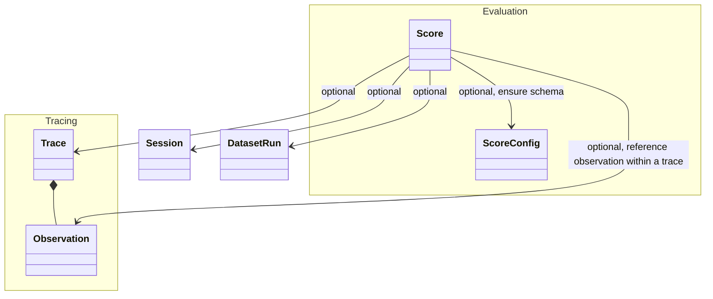

# Evaluation Data Model

Evaluation is critical for the LLM Application Development workflow. Also, it is very specific to a certain use case and application. Thus, the evaluation data model in Langfuse is flexible to represent any evaluation metric. It is used across the evalaution methods outlined in the [overview](/docs/scores/overview).

`Scores` serve as objects for storing evaluation metrics in Langfuse.

- Langfuse supports session and trace level scores. Optionally trace level scores can reference a specific observation within a trace ([tracing data model](/docs/tracing/overview)).
- Typically session level scores are used for comprehensive evaluation of conversational experiences across multiple interactions, while trace level scores are used for evaluation of a single interaction. Dataset run level scores typically attach overall performance scores to dataset run experiments. Trace level scores are used more widely across Langfuse.
- They can be _numeric_, _categorical_, or _boolean_.
- A `comment` can be added to provide additional context or information about the score.

Optionally, scores can be linked to a `score configuration` to ensure they comply with a specific schema. More on this below.

High-level data model and its relations to the [tracing](/docs/tracing/overview), [session data model](/docs/tracing-features/sessions) and [dataset runs](/docs/datasets/overview). A score must be associated with one and only one of trace, session, or dataset run.

How are scores used across Langfuse?

Scores can be used in multiple ways across Langfuse:

1. Displayed on trace/session/dataset run to provide a quick overview
2. Segment all execution traces by scores to e.g. find all traces with a low quality score
3. Analytics: Detailed score reporting with drill downs into use cases and user segments

Frequently used scores

Scores in Langfuse are adaptable (it is just a `name`) and designed to cater to the unique requirements of specific LLM applications. They typically serve to measure the following aspects:

- Quality
  - Factual accuracy
  - Completeness of the information provided
  - Verification against hallucinations
- Style
  - Sentiment portrayed
  - Tonality of the content
  - Potential toxicity
- Security
  - Similarity to prevalent prompt injections
  - Instances of model refusals (e.g., as a language model, ...)

## `Score` object in Langfuse

| Attribute       | Type   | Description                                                                                                                                                                                               |
| --------------- | ------ | --------------------------------------------------------------------------------------------------------------------------------------------------------------------------------------------------------- |
| `name`          | string | Name of the score, e.g. user_feedback, hallucination_eval                                                                                                                                                 |
| `value`         | number | Optional: Numeric value of the score. Always defined for numeric and boolean scores. Optional for categorical scores.                                                                                     |
| `stringValue`   | string | Optional: String equivalent of the score's numeric value for boolean and categorical data types. Automatically set for categorical scores based on the config if the `configId` is provided.              |
| `traceId`       | string | Optional: Id of the trace the score relates to                                                                                                                                                            |
| `observationId` | string | Optional: Observation (e.g. LLM call) the score relates to                                                                                                                                                |
| `sessionId`     | string | Optional: Id of the session the score relates to                                                                                                                                                            |
| `datasetRunId`  | string | Optional: Id of the dataset run the score relates to                                                                                                                                                         |
| `comment`       | string | Optional: Evaluation comment, commonly used for user feedback, eval output or internal notes                                                                                                              |
| `id`            | string | Unique identifier of the score. Auto-generated by SDKs. Optionally can also be used as an indempotency key to update scores.                                                                              |
| `source`        | string | Automatically set based on the souce of the score. Can be either `API`, `EVAL`, or `ANNOTATION`                                                                                                           |
| `dataType`      | string | Automatically set based on the config data type when the `configId` is provided. Otherwise can be defined manually as `NUMERIC`, `CATEGORICAL` or `BOOLEAN`                                               |
| `configId`      | string | Optional: Score config id to ensure that the score follows a specific schema. Can be defined in the Langfuse UI or via API. When provided the score's `dataType` is automatically set based on the config |

## Define schema via `score config`

If you'd like to ensure that your scores follow a specific schema, you can define a `score config` in the Langfuse UI or via our API.

A score config includes:

- Score name
- Data type: `NUMERIC`, `CATEGORICAL`, `BOOLEAN`
- Constraints on score value range:
  - Min/max values for numerical data types
  - Custom categories for categorical data types

Configs are immutable but can be archived (and restored anytime). Using score configs allows you to standardize your scoring schema across your team and ensure that scores are consistent and comparable for future analysis.

## Get started

You can either utilize evaluation scores in Langfuse via:

- [Programmatically via API/SDK](/docs/scores/custom)
  - Example: [User Feedback](/docs/scores/user-feedback)
  - Example: [Custom evaluation pipeline](/docs/scores/external-evaluation-pipelines)
- Managed evaluation methods in Langfuse
  - [LLM-as-a-judge](/docs/scores/model-based-evals)
  - [Human evaluation](/docs/scores/annotation)
