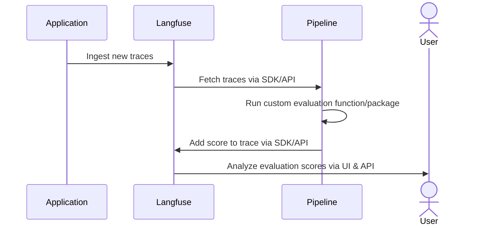

# Evaluate Langfuse LLM Traces with an External Evaluation Pipeline

This cookbook explains how to build an external evaluation pipeline to measure the performance of your production LLM application using Langfuse.

As a rule of thumb, we encourage you to check first if the [evaluations in the Langfuse UI](https://langfuse.com/docs/scores/model-based-evals) cover your use case. If your needs go beyond these, you can still implement in Langfuse custom evaluation templates without code.

Consider implementing an external evaluation pipeline if you need:

- More control over **when** traces get evaluated. You could schedule the pipeline to run at specific times or responding to event-based triggers like Webhooks.
- Greater flexibility with your custom evaluations, when your needs go beyond what's possible with the Langfuse UI
- Version control for your custom evaluations
- The ability to evaluate data using existing evaluation frameworks

If your use case meets any of this situations, let's go ahead and implement your first external evaluation pipeline!

<iframe
  width="100%"
  className="aspect-[3230/2160] rounded mt-10"
  src="https://www.youtube-nocookie.com/embed/rHfME8KDmIw?si=V4m8smxZ219AKmOU"
  title="YouTube video player"
  frameborder="0"
  allow="accelerometer; autoplay; clipboard-write; encrypted-media; gyroscope; picture-in-picture; web-share"
  referrerpolicy="strict-origin-when-cross-origin"
  allowFullScreen
></iframe>

---

By the end of this cookbook, you'll be able to:

- Create a synthetic dataset to test your models.
- Use the Langfuse client to gather and filter traces of previous model runs
- Evaluate these traces offline and incrementally
- Add scores to existing Langfuse traces


Conceptually, we will implement the following architecture:



---

**Note**: While we're using a Jupyter notebook for this cookbook, in production you'd use your preferred orchestration tool. Just make sure to extract the code into a .py file and ensure all dependencies are available at runtime.


## (Prep-work) Loading synthetic traces to Langfuse

In this demo, we'll build a mock application: a science communicator LLM that explains any topic in an engaging and approachable way.

Since we don't have real user data, our first step is to create a synthetic dataset. We'll generate a variety of potential questions that real users might ask. While this is a great way to kickstart your LLM development, collecting real user queries as soon as possible is invaluable.

You can get your Langfuse API keys [here](https://cloud.langfuse.com/) and OpenAI API key [here](https://platform.openai.com/api-keys)


```python
%pip install langfuse openai deepeval --upgrade
```


```python
import os

# Get keys for your project from the project settings page
# https://cloud.langfuse.com
os.environ["LANGFUSE_PUBLIC_KEY"] = ""
os.environ["LANGFUSE_SECRET_KEY"] = ""
os.environ["LANGFUSE_HOST"] = "https://cloud.langfuse.com" # 🇪🇺 EU region
# os.environ["LANGFUSE_HOST"] = "https://us.cloud.langfuse.com" # 🇺🇸 US region

# Your openai key
os.environ["OPENAI_API_KEY"] = ""
```

Let's go ahead and generate a list of topic suggestions that we can later query to our application.


```python
import openai

topic_suggestion = """ You're a world-class journalist, specialized
in figuring out which are the topics that excite people the most.
Your task is to give me 50 suggestions for pop-science topics that the general
public would love to read about. Make sure topics don't repeat.
The output must be a comma-separated list. Generate the list and NOTHING else.
The use of numbers is FORBIDDEN.
"""

output = openai.chat.completions.create(
    messages=[
        {
            "role": "user",
            "content": topic_suggestion
        }
    ],
    model="gpt-4o",

    temperature=1
).choices[0].message.content

topics = [item.strip() for item in output.split(",")]
for topic in topics:
    print(topic)
```

Great job! You now have a list of interesting topics users might ask about. Next, let's have our science communicator LLM handle those queries and add the results to Langfuse. To keep things simple, we'll use Langfuse's `@observe()` decorator. This decorator automatically monitors all LLM calls (generations) nested in the function. We're also using the `langfuse` class to label and tag the traces, making it easier to fetch them later.


```python
from langfuse import observe, get_client
langfuse = get_client()

prompt_template = """
You're an expert science communicator, able to explain complex topics in an
approachable manner. Your task is to respond to the questions of users in an
engaging, informative, and friendly way. Stay factual, and refrain from using
jargon. Your answer should be 4 sentences at max.
Remember, keep it ENGAGING and FUN!

Question: {question}
"""

@observe()
def explain_concept(topic):
    langfuse.update_current_trace(
        name=f"Explanation '{topic}'",
        tags=["ext_eval_pipelines"]
    )
    prompt = prompt_template.format(question=topic)


    return openai.chat.completions.create(
        messages=[
            {
                "role": "user",
                "content": prompt,
            }
        ],
        model="gpt-4o-mini",

        temperature=0.6
    ).choices[0].message.content


for topic in topics:
    print(f"Input: Please explain to me {topic.lower()}")
    print(f"Answer: {explain_concept(topic)} \n")
```

Now you should see in the *Traces* section of the langfuse UI the traces you just added.


Remember, the goal of this tutorial is to show you how to build an external evaluation pipeline. These pipelines will run in your CI/CD environment, or be run in a different orchestrated container service. No matter the environment you choose, three key steps always apply:


1.   **Fetch Your Traces**: Get your application traces to your evaluation environment
2.   **Run Your Evaluations**: Apply any evaluation logic you prefer
3.   **Save Your Results**: Attach your evaluations back to the Langfuse trace used for calculating them.

For the rest of the notebook, we'll have one goal:

---

🎯 Goal: ***Every day, at 5 am, our pipeline should evaluate 50 traces from the previous day***

---

## 1. Fetch Your Traces

Fetching traces from Langfuse is straightforward. Just set up the Langfuse client and use one of its functions to fetch the data. We'll take an incremental approach: first, we'll fetch the initial 10 traces and evaluate them. After that, we'll add our scores back into Langfuse and move on to the next batch of 10 traces. We'll keep this cycle going until we've processed a total of 50 traces.

The `fetch_traces()` function has arguments to filter the traces by tags, timestamps, and beyond. We can also choose the number of samples for pagination. You can find more about other methods to [query traces](https://langfuse.com/docs/query-traces) in our docs.


```python
from langfuse import get_client
from datetime import datetime, timedelta

BATCH_SIZE = 10
TOTAL_TRACES = 50

langfuse = Langfuse(
    secret_key=os.environ["LANGFUSE_SECRET_KEY"],
    public_key=os.environ["LANGFUSE_PUBLIC_KEY"],
    host="https://cloud.langfuse.com"  # 🇪🇺 EU region
)

now = datetime.now()
five_am_today = datetime(now.year, now.month, now.day, 5, 0)
five_am_yesterday = five_am_today - timedelta(days=1)

page = 1
has_more = True

lookback_minutes_traces = now - timedelta(minutes=30)

while has_more:
    traces_batch = langfuse.api.trace.list(page=page,
                                         limit=50,
                                         from_timestamp=lookback_minutes_traces,
                                         tags=["llm_evaluation_trace"]).data

    for trace in traces_batch:
        print(f"Processing {trace.name}")

        if trace.output is None:
            print(f"Warning: \n Trace {trace.name} had no generated output, \
            it was skipped")
            continue

        langfuse.score(
            trace_id=trace.id,
            name="tone",
            value=tone_score(trace)
        )

        jscore = joyfulness_score(trace)
        langfuse.score(
            trace_id=trace.id,
            name="joyfulness",
            value=jscore["score"],
            comment=jscore["reason"]
        )

    # For this example, we are only interested in evaluating traces that have been generated after the timestamp
    lookback_minutes_traces = now - timedelta(minutes=30)

    # You can adjust the filters to your needs, e.g. only fetch traces from a specific user or session
    traces_batch = langfuse.api.trace.list(
        page=page,
        limit=50,
        from_timestamp=lookback_minutes_traces,
        to_timestamp=None,
        user_id=None,
        name=None,
        session_id=None,
        tags=["llm_evaluation_trace"],
    ).data

    if len(traces_batch) < BATCH_SIZE:
        has_more = False
    else:
        page += 1

    print(f"Batch {page} processed 🚀 \n")

If your pipeline ran successfully, you should see your score in the Langfuse UI.


And that's it! You're now ready to integrate these lines into your preferred orchestration tool to ensure they run at the right times.

To achieve our original goal of running the script every day at 5 am, simply schedule a Cron task in your chosen environment with the rule `