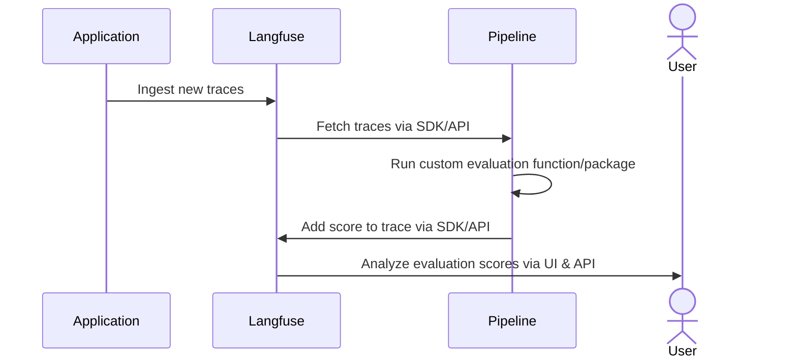

# LLM-as-a-judge in Langfuse

Using LLM-as-a-judge (model-based evaluations) has proven as a powerful evaluation tool next to human annotation. Via Langfuse, we support setting up LLM-evaluators to evaluate your LLM applications integrated with Langfuse. These evaluators are used to score a specific session/trace/LLM-call in Langfuse on criteria such as correctness, toxicity, or hallucinations.

There are two ways to run LLM-as-a-judge in Langfuse:

1. [Via the Langfuse UI (beta)](#ui)
1. [Via external evaluation pipeline](#evaluation-pipeline)

## Via Langfuse UI (beta) [#ui]

<AvailabilityBanner
  availability={{
    hobby: "public-beta",
    pro: "public-beta",
    team: "public-beta",
    selfHosted: "not-available",
  }}
/>

<CloudflareVideo
  videoId="c2debc8ad9e9df71d56f813510ffdf80"
  aspectRatio={16 / 9}
  title="Model-based Evaluations in Langfuse"
  className="mt-10"
  posterStartTime={137}
/>

<Steps>

### Store an API key

To use Langfuse LLM-as-a-judge, you have to bring your own LLM API keys. To do so, navigate to the settings page and insert your API key. We store them encrypted on our servers.

### Create an evaluator

To set up an evaluator, we first need to configure the following:

- Select the model and its parameters.
- Select the evaluation prompt. Langfuse offers a set of managed prompts, but you can also write your own.
- We use function calling to extract the evaluation output. Specify the descriptions for the function parameters `score` and `reasoning`. This is how you can direct the LLM to score on a specific range and provide specific reasoning for the score.

We store this information in an so-called evaluator template, so you can reuse it for multiple evaluators.

<Frame border></Frame>

Second, we need to specify on which `traces` Langfuse should run the evaluator.

- Specify the name of the `scores` which will be created as a result of the evaluation.
- Filter which newly ingested traces should be evaluated. (Coming soon: select existing traces)
- Specify how Langfuse should fill the variables in the template. Langfuse can extract data from `trace`, `generations`, `spans`, or `event` objects which belong to a trace. You can choose to take `Input`, `Output` or `metadata` from each of these objects. For `generations`, `spans`, or `events`, you also have to specify the name of the object. We will always take the latest object that matches the name.
- Reduce the sampling to not run evaluations on each trace. This helps to save LLM API cost.
- Add a delay to the evaluation execution. This is how you can ensure all data arrived at Langfuse servers before evaluation is executed.

<Frame border></Frame>

### See the progress

Once the evaluator is saved, Langfuse will start running evaluations on the traces that match the filter. You can view logs on the log page, or view each evaluator to see configuration and logs.

<Frame border className="max-w-lg">
  
</Frame>

### See scores

Upon receiving new traces, navigate to the trace detail view to see the associated scores.

<Frame border className="max-w-lg">
  
</Frame>

</Steps>

## Via External Evaluation Pipeline [#evaluation-pipeline]

<AvailabilityBanner
  availability={{
    hobby: "full",
    pro: "full",
    team: "full",
    selfHosted: "full",
  }}
/>

You can run your own model-based evals on data in Langfuse by fetching traces from Langfuse (e.g. via the Python SDK) and then adding evaluation results as [`scores`](/docs/scores) back to the traces in Langfuse. This gives you full flexibility to run various eval libraries on your production data and discover which work well for your use case.

The example notebook is a good template to get started with building your own evaluation pipeline.

import { FileCode, BookOpen } from "lucide-react";

<Cards num={2}>
  <Card
    title="Example: External Evaluation Pipeline"
    href="/docs/scores/external-evaluation-pipelines"
    icon={<FileCode />}
  />
</Cards>

## GitHub Discussions

import { GhDiscussionsPreview } from "@/components/gh-discussions/GhDiscussionsPreview";

<GhDiscussionsPreview labels={["feat-evals"]} />
