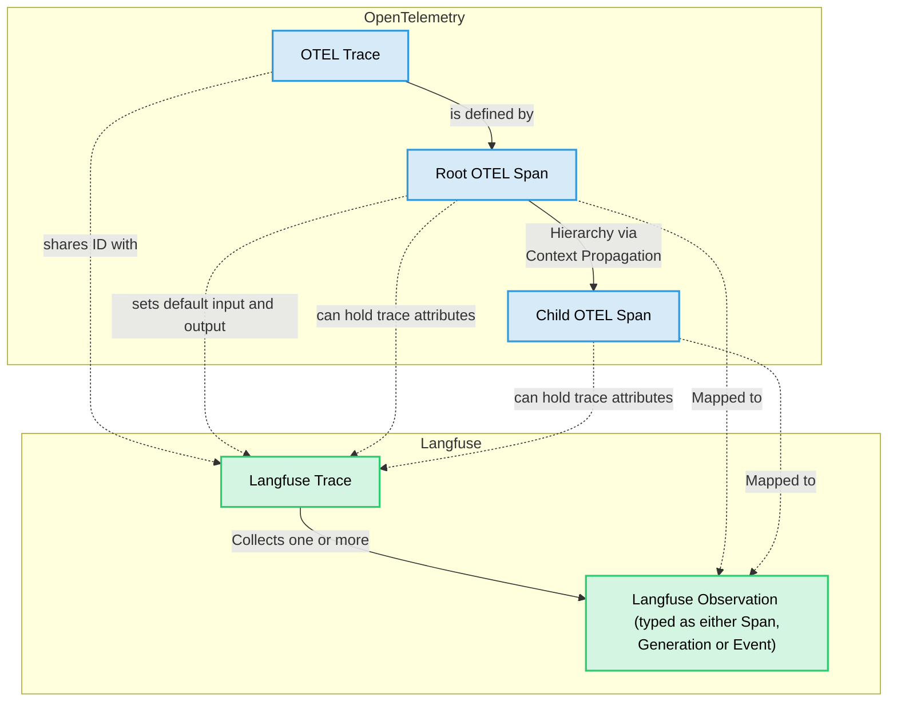

# Python SDK (v3)

<Callout type="info">

The SDK is currently in **beta**. We highly value your feedback! If you encounter any issues or have suggestions, please let us know on [GitHub](https://github.com/langfuse/langfuse/issues).

</Callout>

Our [OpenTelemetry-based](https://opentelemetry.io/) Python SDK (v3) is the latest generation of the SDK designed for a improved developer experience and enhanced ease of use. Built on the robust OpenTelemetry Python SDK, it offers a more intuitive API for comprehensive tracing of your LLM application.

The v3 SDK introduces several key benefits:

- **Improved Developer Experience**: A more intuitive API means less code to write for tracing your application, simplifying the integration process.
- **Unified Context Sharing**: Seamlessly hook into the tracing context of the current span to update it or create child spans. This is particularly beneficial for integrating with other instrumented libraries.
- **Broad Third-Party Integrations**: Any library instrumented with OpenTelemetry will work out-of-the-box with the Langfuse SDK. Spans from these libraries are automatically captured and correctly nested within your Langfuse traces.

There are three main ways of instrumenting your application with the new Langfuse SDK. All of them are fully interoperable with each other.

<Tabs items={["Observe Decorator", "Context Managers", "Manual Observations"]}>

<Tab>
The `@langfuse.observe` decorator is the simplest way to instrument your application. It is a function decorator that can be applied to any function. 

It sets the current span in the context for automatic nesting of child spans and automatically ends it when the function returns. It also automatically captures the function name, arguments, and return value.

```python
from langfuse import get_client, observe

langfuse = get_client()

@observe
def my_function():
    langfuse.update_current_span(output="Hello, world!")

my_function()

# Flush events in short-lived applications
langfuse.flush()
```

</Tab>

<Tab>
Context managers are the recommended way to instrument chunks of work in your application as they automatically handle the start and end of spans, and set the current span in the context for automatic nesting of child spans.

```python
from langfuse import get_client

langfuse = get_client()

# Create a span using a context manager
with langfuse.start_as_current_span(name="process-request") as span:
    # Your processing logic here
    span.update(output="Processing complete")
    
    # Create a nested generation for an LLM call
    with langfuse.start_as_current_generation(name="llm-response", model="gpt-3.5-turbo") as generation:
        # Your LLM call logic here
        generation.update(output="Generated response")

# All spans are automatically closed when exiting their context blocks


# Flush events in short-lived applications
langfuse.flush()
```

</Tab>

<Tab>
Manual observations give you control over when spans start and end and do not set the current span in the context for automatic nesting of child spans. You must explicitly call `.end()` when they're complete.

```python
from langfuse import get_client

langfuse = get_client()

# Create a span without a context manager
span = langfuse.start_span(name="user-request")

# Your processing logic here
span.update(output="Request processed")

# Child spans must be created using the parent span object
nested_span = span.start_span(name="nested-span")
nested_span.update(output="Nested span output")

# Important: Manually end the span
nested_span.end()

# Important: Manually end the parent span
span.end()


# Flush events in short-lived applications
langfuse.flush()
```

</Tab>
</Tabs>


## Setup

### Installation

The v3 SDK is available as a beta release. To install it, run:

```bash
pip install "langfuse>=3.0.0b1"
```

### Initialize Client

Begin by initializing the `Langfuse` client. You must provide your Langfuse public and secret keys. These can be passed as constructor arguments or set as environment variables (recommended).

If you are self-hosting Langfuse or using a data region other than the default (EU, `https://cloud.langfuse.com`), ensure you configure the `host` argument or the `LANGFUSE_HOST` environment variable (recommended).

You can verify your credentials and connectivity to the Langfuse server using `langfuse.auth_check()`. We do not recommend using this in production as this adds latency to your application.

<Tabs items={["via Environment Variables (recommended)", "via Constructor Arguments"]}>
<Tab>
```bash filename=".env"
LANGFUSE_PUBLIC_KEY="pk-lf-..."
LANGFUSE_SECRET_KEY="sk-lf-..."
LANGFUSE_HOST="https://cloud.langfuse.com" # US region: https://us.cloud.langfuse.com
```

```python
from langfuse import get_client

langfuse = get_client()

# Verify connection
if langfuse.auth_check():
    print("Langfuse client is authenticated and ready!")
else:
    print("Authentication failed. Please check your credentials and host.")
```

</Tab>

<Tab>
```python
from langfuse import Langfuse

# Initialize with constructor arguments
langfuse = Langfuse(
  public_key="YOUR_PUBLIC_KEY",
  secret_key="YOUR_SECRET_KEY",
  host="https://cloud.langfuse.com" # US region: https://us.cloud.langfuse.com
)

# Verify connection
if langfuse.auth_check():
    print("Langfuse client is authenticated and ready!")
else:
    print("Authentication failed. Please check your credentials and host.")
```

<Callout type="info">

If you are reinstantiating Langfuse client with different constructor arguments but the same `public_key`, the client will reuse the same instance and ignore the new arguments.

</Callout>

</Tab>

</Tabs>

Key configuration options:

| Constructor Argument        | Environment Variable                 | Description                                                                                                                           | Default value                  |
| --------------------------- | ------------------------------------ | ------------------------------------------------------------------------------------------------------------------------------------- | ------------------------------ |
| `public_key`                | `LANGFUSE_PUBLIC_KEY`                | Your Langfuse project's public API key. **Required.**                                                                                 |                                |
| `secret_key`                | `LANGFUSE_SECRET_KEY`                | Your Langfuse project's secret API key. **Required.**                                                                                 |                                |
| `host`                      | `LANGFUSE_HOST`                      | The API host for your Langfuse instance.                                                                                              | `"https://cloud.langfuse.com"` |
| `timeout`                   | -                                    | Timeout in seconds for API requests.                                                                                                  | `30`                           |
| `httpx_client`              | -                                    | Custom `httpx.Client` for making non-tracing HTTP requests.                                                                           |                                |
| `debug`                     | `LANGFUSE_DEBUG`                     | Enables debug mode for more verbose logging. Set to `True` or `"True"`.                                                               | `False`                        |
| `tracing_enabled`           | `LANGFUSE_TRACING_ENABLED`           | Enables or disables the Langfuse client. If `False`, all observability calls become no-ops.                                           | `True`                         |
| `flush_at`                  | `LANGFUSE_FLUSH_AT`                  | Number of spans to batch before sending to the API.                                                                                   | `512`                          |
| `flush_interval`            | `LANGFUSE_FLUSH_INTERVAL`            | Time in seconds between batch flushes.                                                                                                | `5`                            |
| `environment`               | `LANGFUSE_TRACING_ENVIRONMENT`       | Environment name for tracing (e.g., "development", "staging", "production"). Must be lowercase alphanumeric with hyphens/underscores. | `"default"`                    |
| `release`                   | `LANGFUSE_RELEASE`                   | [Release](/docs/tracing-features/releases-and-versioning) version/hash of your application. Used for grouping analytics.              |                                |
| `media_upload_thread_count` | `LANGFUSE_MEDIA_UPLOAD_THREAD_COUNT` | Number of background threads for handling media uploads.                                                                              | `1`                            |
| `sample_rate`               | `LANGFUSE_SAMPLE_RATE`               | [Sampling](/docs/tracing-features/sampling) rate for traces (float between 0.0 and 1.0). `1.0` means 100% of traces are sampled.      | `1.0`                          |
| `mask`                      | -                                    | A function `(data: Any) -> Any` to [mask](/docs/tracing-features/masking) sensitive data in traces before sending to the API.         |                                |

### Accessing the Client Globally

Once initialized, the `Langfuse` client instance can be retrieved anywhere in your application using the `get_client` function. This is useful for accessing the client from different modules or within decorators without passing the instance around.

```python
from langfuse import get_client

# Assuming a client was initialized earlier, possibly in a different module:
# langfuse = Langfuse(public_key="pk-lf-...", secret_key="sk-lf-...")

# Get the default client
client = get_client()
```


## Basic Tracing

Langfuse provides flexible ways to create and manage traces and their constituent observations (spans and generations).

### Creating Observations

You can create spans or generations anywhere in your application. The primary way to do this is using context managers (with `with` statements), which ensure that observations are properly started and ended.

- `langfuse.start_as_current_span()`: Creates a new span and sets it as the currently active observation in the OTEL context for its duration. Any new observations created within this block will be its children.
- `langfuse.start_as_current_generation()`: Similar to the above, but creates a specialized "generation" observation for LLM calls.

```python
from langfuse import Langfuse

langfuse = Langfuse()

with langfuse.start_as_current_span(
    name="user-request-pipeline",
    input={"user_query": "Tell me a joke about OpenTelemetry"},
) as root_span:
    # This span is now active in the context.

    # Add trace attributes
    root_span.update_trace(
        user_id="user_123",
        session_id="session_abc",
        tags=["experimental", "comedy"]
    )

    # Create a nested generation
    with langfuse.start_as_current_generation(
        name="joke-generation",
        model="gpt-4o",
        input=[{"role": "user", "content": "Tell me a joke about OpenTelemetry"}],
        model_parameters={"temperature": 0.7}
    ) as generation:
        # Simulate an LLM call
        joke_response = "Why did the OpenTelemetry collector break up with the span? Because it needed more space... for its attributes!"
        token_usage = {"input_tokens": 10, "output_tokens": 25}

        generation.update(
            output=joke_response,
            usage_details=token_usage
        )
        # Generation ends automatically here

    root_span.update(output={"final_joke": joke_response})
    # Root span ends automatically here
```

### Manual Observations

For scenarios where you need to create an observation (a span or generation) without altering the currently active OpenTelemetry context, you can use `langfuse.start_span()` or `langfuse.start_generation()`.

```python
from langfuse import get_client

langfuse = get_client()

span = langfuse.start_span(name="my-span")

span.end() # Important: Manually end the span
```

<Callout type="warning" title="Manual Ending Required">
  If you use `langfuse.start_span()` or `langfuse.start_generation()`, you are
  responsible for calling `.end()` on the returned observation object. Failure
  to do so will result in incomplete or missing observations in Langfuse. Their
  `start_as_current_...` counterparts used with a `with` statement handle this
  automatically.
</Callout>

**Key Characteristics:**

- **No Context Shift**: Unlike their `start_as_current_...` counterparts, these methods **do not** set the new observation as the active one in the OpenTelemetry context. The previously active span (if any) remains the current context for subsequent operations in the main execution flow.
- **Parenting**: The observation created by `start_span()` or `start_generation()` will still be a child of the span that was active in the context at the moment of its creation.
- **Manual Lifecycle**: These observations are not managed by a `with` block and therefore **must be explicitly ended** by calling their `.end()` method.
- **Nesting Children**:
  - Subsequent observations created using the global `langfuse.start_as_current_span()` (or similar global methods) will _not_ be children of these "manual" observations. Instead, they will be parented by the original active span.
  - To create children directly under a "manual" observation, you would use methods _on that specific observation object_ (e.g., `manual_span.start_as_current_span(...)`).

**When to Use:**

This approach is useful when you need to:

- Record work that is self-contained or happens in parallel to the main execution flow but should still be part of the same overall trace (e.g., a background task initiated by a request).
- Manage the observation's lifecycle explicitly, perhaps because its start and end are determined by non-contiguous events.
- Obtain an observation object reference before it's tied to a specific context block.

**Example with more complex nesting:**

```python
# This outer span establishes an active context.
with langfuse.start_as_current_span(name="main-operation") as main_operation_span:
    # 'main_operation_span' is the current active context.

    # 1. Create a "manual" span using langfuse.start_span().
    #    - It becomes a child of 'main_operation_span'.
    #    - Crucially, 'main_operation_span' REMAINS the active context.
    #    - 'manual_side_task' does NOT become the active context.
    manual_side_task = langfuse.start_span(name="manual-side-task")
    manual_side_task.update(input="Data for side task")

    # 2. Start another operation that DOES become the active context.
    #    This will be a child of 'main_operation_span', NOT 'manual_side_task',
    #    because 'manual_side_task' did not alter the active context.
    with langfuse.start_as_current_span(name="core-step-within-main") as core_step_span:
        # 'core_step_span' is now the active context.
        # 'manual_side_task' is still open but not active in the global context.
        core_step_span.update(input="Data for core step")
        # ... perform core step logic ...
        core_step_span.update(output="Core step finished")
    # 'core_step_span' ends. 'main_operation_span' is the active context again.

    # 3. Complete and end the manual side task.
    # This could happen at any point after its creation, even after 'core_step_span'.
    manual_side_task.update(output="Side task completed")
    manual_side_task.end() # Manual end is crucial for 'manual_side_task'

    main_operation_span.update(output="Main operation finished")
# 'main_operation_span' ends automatically here.

# Expected trace structure in Langfuse:
# - main-operation
#   |- manual-side-task
#   |- core-step-within-main
#     (Note: 'core-step-within-main' is a sibling to 'manual-side-task', both children of 'main-operation')
```

### Nesting Observations


<Tabs items={["Observe Decorator", "Context Managers", "Manual"]}>
<Tab>
The function call hierarchy is automatically captured by the `@observe` decorator reflected in the trace.

```python
from langfuse import observe

@observe
def my_data_processing_function(data, parameter):
    # ... processing logic ...
    return {"processed_data": data, "status": "ok"}


@observe
def main_function(data, parameter):
    return my_data_processing_function(data, parameter)
```

</Tab>

<Tab title="Context Managers">
Nesting is handled automatically by OpenTelemetry's context propagation. When you create a new observation (span or generation) using `start_as_current_span` or `start_as_current_generation`, it becomes a child of the observation that was active in the context when it was created.

```python
with langfuse.start_as_current_span(name="outer-process") as outer_span:
    # outer_span is active

    with langfuse.start_as_current_generation(name="llm-step-1") as gen1:
        # gen1 is active, child of outer_span
        gen1.update(output="LLM 1 output")

    with outer_span.start_as_current_span(name="intermediate-step") as mid_span:
        # mid_span is active, also a child of outer_span
        # This demonstrates using the yielded span object to create children

        with mid_span.start_as_current_generation(name="llm-step-2") as gen2:
            # gen2 is active, child of mid_span
            gen2.update(output="LLM 2 output")

        mid_span.update(output="Intermediate processing done")

    outer_span.update(output="Outer process finished")
```
</Tab>

<Tab>
If you are creating observations manually (not `_as_current_`), you can use the methods on the parent `LangfuseSpan` or `LangfuseGeneration` object to create children. These children will _not_ become the current context unless their `_as_current_` variants are used.

```python
parent = langfuse.start_span(name="manual-parent")

child_span = parent.start_span(name="manual-child-span")
# ... work ...
child_span.end()

child_gen = parent.start_generation(name="manual-child-generation")
# ... work ...
child_gen.end()

parent.end()
```

</Tab>

</Tabs>

### Updating Observations

You can update observations with new information as your code executes.

- For spans/generations created via context managers or assigned to variables: use the `.update()` method on the object.
- To update the _currently active_ observation in the context (without needing a direct reference to it): use `langfuse.update_current_span()` or `langfuse.update_current_generation()`.

**`LangfuseSpan.update()` / `LangfuseGeneration.update()` parameters:**

| Parameter               | Type                            | Description                                                           | Applies To |
| :---------------------- | :------------------------------ | :-------------------------------------------------------------------- | :--------- |
| `input`                 | `Optional[Any]`                 | Input data for the operation.                                         | Both       |
| `output`                | `Optional[Any]`                 | Output data from the operation.                                       | Both       |
| `metadata`              | `Optional[Any]`                 | Additional metadata (JSON-serializable).                              | Both       |
| `version`               | `Optional[str]`                 | Version identifier for the code/component.                            | Both       |
| `level`                 | `Optional[SpanLevel]`           | Severity: `"DEBUG"`, `"DEFAULT"`, `"WARNING"`, `"ERROR"`.             | Both       |
| `status_message`        | `Optional[str]`                 | A message describing the status, especially for errors.               | Both       |
| `completion_start_time` | `Optional[datetime]`            | Timestamp when the LLM started generating the completion (streaming). | Generation |
| `model`                 | `Optional[str]`                 | Name/identifier of the AI model used.                                 | Generation |
| `model_parameters`      | `Optional[Dict[str, MapValue]]` | Parameters used for the model call (e.g., temperature).               | Generation |
| `usage_details`         | `Optional[Dict[str, int]]`      | Token usage (e.g., `{"input_tokens": 10, "output_tokens": 20}`).      | Generation |
| `cost_details`          | `Optional[Dict[str, float]]`    | Cost information (e.g., `{"total_cost": 0.0023}`).                    | Generation |
| `prompt`                | `Optional[PromptClient]`        | Associated `PromptClient` object from Langfuse prompt management.     | Generation |

```python
with langfuse.start_as_current_generation(name="llm-call", model="gpt-3.5-turbo") as gen:
    gen.update(input={"prompt": "Why is the sky blue?"})
    # ... make LLM call ...
    response_text = "Rayleigh scattering..."
    gen.update(
        output=response_text,
        usage_details={"input_tokens": 5, "output_tokens": 50},
        metadata={"confidence": 0.9}
    )

# Alternatively, update the current observation in context:
with langfuse.start_as_current_span(name="data-processing"):
    # ... some processing ...
    langfuse.update_current_span(metadata={"step1_complete": True})
    # ... more processing ...
    langfuse.update_current_span(output={"result": "final_data"})
```

### Setting Trace Attributes

Trace-level attributes apply to the entire trace, not just a single observation. You can set or update these using:

- The `.update_trace()` method on any `LangfuseSpan` or `LangfuseGeneration` object within that trace.
- `langfuse.update_current_trace()` to update the trace associated with the currently active observation.

**Trace attribute parameters:**

| Parameter    | Type                  | Description                                                      |
| :----------- | :-------------------- | :--------------------------------------------------------------- |
| `name`       | `Optional[str]`       | Name for the trace.                                              |
| `user_id`    | `Optional[str]`       | ID of the user associated with this trace.                       |
| `session_id` | `Optional[str]`       | Session identifier for grouping related traces.                  |
| `version`    | `Optional[str]`       | Version of your application/service for this trace.              |
| `input`      | `Optional[Any]`       | Overall input for the entire trace.                              |
| `output`     | `Optional[Any]`       | Overall output for the entire trace.                             |
| `metadata`   | `Optional[Any]`       | Additional metadata for the trace.                               |
| `tags`       | `Optional[List[str]]` | List of tags to categorize the trace.                            |
| `public`     | `Optional[bool]`      | Whether the trace should be publicly accessible (if configured). |

```python
with langfuse.start_as_current_span(name="initial-operation") as span:
    # Set trace attributes early
    span.update_trace(
        user_id="user_xyz",
        session_id="session_789",
        tags=["beta-feature", "llm-chain"]
    )
    # ...
    # Later, from another span in the same trace:
    with span.start_as_current_generation(name="final-generation") as gen:
        # ...
        langfuse.update_current_trace(output={"final_status": "success"}, public=True)
```

### Trace and Observation IDs

Langfuse uses W3C Trace Context compliant IDs:

- **Trace IDs**: 32-character lowercase hexadecimal string (16 bytes).
- **Observation IDs (Span IDs)**: 16-character lowercase hexadecimal string (8 bytes).

You can retrieve these IDs:

- `langfuse.get_current_trace_id()`: Gets the trace ID of the currently active observation.
- `langfuse.get_current_observation_id()`: Gets the ID of the currently active observation.
- `span_obj.trace_id` and `span_obj.id`: Access IDs directly from a `LangfuseSpan` or `LangfuseGeneration` object.

For scenarios where you need to generate IDs outside of an active trace (e.g., to link scores to traces/observations that will be created later, or to correlate with external systems), use:

- `Langfuse.create_trace_id(seed: Optional[str] = None)`(static method): Generates a new trace ID. If a `seed` is provided, the ID is deterministic. Use the same seed to get the same ID. This is useful for correlating external IDs with Langfuse traces.

```python
# Get current IDs
with langfuse.start_as_current_span(name="my-op") as current_op:
    trace_id = langfuse.get_current_trace_id()
    observation_id = langfuse.get_current_observation_id()
    print(f"Current Trace ID: {trace_id}, Current Observation ID: {observation_id}")
    print(f"From object: Trace ID: {current_op.trace_id}, Observation ID: {current_op.id}")

# Generate IDs deterministically
external_request_id = "req_12345"
deterministic_trace_id = Langfuse.create_trace_id(seed=external_request_id)
print(f"Deterministic Trace ID for {external_request_id}: {deterministic_trace_id}")
```

**Linking to Existing Traces (Trace Context)**

If you have a `trace_id` (and optionally a `parent_span_id`) from an external source (e.g., another service, a batch job), you can link new observations to it using the `trace_context` parameter. Note that OpenTelemetry offers native cross-service context propagation, so this is not necessarily required for calls between services that are instrumented with OTEL.

```python
existing_trace_id = "abcdef1234567890abcdef1234567890" # From an upstream service
existing_parent_span_id = "fedcba0987654321" # Optional parent span in that trace

with langfuse.start_as_current_span(
    name="process-downstream-task",
    trace_context={
        "trace_id": existing_trace_id,
        "parent_span_id": existing_parent_span_id # If None, this becomes a root span in the existing trace
    }
) as span:
    # This span is now part of the trace `existing_trace_id`
    # and a child of `existing_parent_span_id` if provided.
    print(f"This span's trace_id: {span.trace_id}") # Will be existing_trace_id
    pass
```

## Client Management

### `flush()`

Manually triggers the sending of all buffered observations (spans, generations, scores, media metadata) to the Langfuse API. This is useful in short-lived scripts or before exiting an application to ensure all data is persisted.

```python
from langfuse import Langfuse

langfuse = Langfuse()
# ... create traces and observations ...
langfuse.flush() # Ensures all pending data is sent
```

The `flush()` method blocks until the queued data is processed by the respective background threads.

### `shutdown()`

Gracefully shuts down the Langfuse client. This includes:

1.  Flushing all buffered data (similar to `flush()`).
2.  Waiting for background threads (for data ingestion and media uploads) to finish their current tasks and terminate.

It's crucial to call `shutdown()` before your application exits to prevent data loss and ensure clean resource release. The SDK automatically registers an `atexit` hook to call `shutdown()` on normal program termination, but manual invocation is recommended in scenarios like:

- Long-running daemons or services when they receive a shutdown signal.
- Applications where `atexit` might not reliably trigger (e.g., certain serverless environments or forceful terminations).

```python
from langfuse import Langfuse

langfuse = Langfuse()
# ... application logic ...

# Before exiting:
langfuse.shutdown()
```

## `@observe` Decorator

The `@observe()` decorator provides a convenient way to automatically trace function executions, including capturing their inputs, outputs, execution time, and any errors. It supports both synchronous and asynchronous functions.

```python
from langfuse import observe

@observe()
def my_data_processing_function(data, parameter):
    # ... processing logic ...
    return {"processed_data": data, "status": "ok"}

@observe(name="custom_llm_call_name", as_type="generation")
async def my_async_llm_call(prompt_text):
    # ... async LLM call ...
    return "LLM response"
```

**Parameters:**

- `name: Optional[str]`: Custom name for the created span/generation. Defaults to the function name.
- `as_type: Optional[Literal["generation"]]`: If set to `"generation"`, a Langfuse generation object is created, suitable for LLM calls. Otherwise, a regular span is created.
- `capture_input: bool`: Whether to capture function arguments as input. Defaults to `True`.
- `capture_output: bool`: Whether to capture function return value as output. Defaults to `True`.
- `transform_to_string: Optional[Callable[[Iterable], str]]`: For functions that return generators (sync or async), this callable can be provided to transform the collected chunks into a single string for the `output` field. If not provided, and all chunks are strings, they will be concatenated. Otherwise, the list of chunks is stored.

**Trace Context and Special Keyword Arguments:**

The `@observe` decorator automatically propagates the OTEL trace context. If a decorated function is called from within an active Langfuse span (or another OTEL span), the new observation will be nested correctly.

You can also pass special keyword arguments to a decorated function to control its tracing behavior:

- `langfuse_trace_id: str`: Explicitly set the trace ID for this function call.
- `langfuse_parent_observation_id: str`: Explicitly set the parent observation ID.
- `langfuse_public_key: str`: Use a specific Langfuse project client (useful in multi-project setups).

```python
@observe()
def my_function(a, b):
    return a + b

# Call with a specific trace context
my_function(1, 2, langfuse_trace_id="my_custom_trace_id_123")
```

## Integrations

### OpenAI Integration

Langfuse offers a drop-in replacement for the OpenAI Python SDK to automatically trace all your OpenAI API calls. Simply change your import statement:

```diff
- import openai
+ from langfuse.openai import openai

# Your existing OpenAI code continues to work as is
# For example:
# client = openai.OpenAI()
# completion = client.chat.completions.create(...)
```

**What's automatically captured:**

- **Requests & Responses**: All prompts/completions, including support for streaming, async operations, and function/tool calls.
- **Timings**: Latencies for API calls.
- **Errors**: API errors are captured with their details.
- **Model Usage**: Token counts (input, output, total).
- **Cost**: Estimated cost in USD (based on model and token usage).
- **Media**: Input audio and output audio from speech-to-text and text-to-speech endpoints.

The integration is fully interoperable with `@observe` and manual tracing methods (`start_as_current_span`, etc.). If an OpenAI call is made within an active Langfuse span, the OpenAI generation will be correctly nested under it.

**Passing Langfuse arguments to OpenAI calls:**

You can pass Langfuse-specific arguments directly to OpenAI client methods. These will be used to enrich the trace data.

```python
from langfuse.openai import openai

client = openai.OpenAI()

response = client.chat.completions.create(
    name="qna-bot-openai",  # Custom name for this generation in Langfuse
    metadata={"user_tier": "premium", "request_source": "web_api"}, # will be added to the Langfuse generation
    model="gpt-4o",
    messages=[{"role": "user", "content": "What is OpenTelemetry?"}],
)
```

Supported Langfuse arguments: `name`, `metadata`, `langfuse_prompt`, `langfuse_public_key`.

### Langchain Integration

Langfuse provides a callback handler for Langchain to trace its operations.

**Setup:**

Initialize the `CallbackHandler` and add it to your Langchain calls, either globally or per-call.

```python
from langfuse.langchain import CallbackHandler
from langchain_openai import ChatOpenAI # Example LLM
from langchain_core.prompts import ChatPromptTemplate

# Initialize the Langfuse handler
langfuse_handler = CallbackHandler()

# Example: Using it with an LLM call
llm = ChatOpenAI(model_name="gpt-4o")
prompt = ChatPromptTemplate.from_template("Tell me a joke about {topic}")
chain = prompt | llm

response = chain.invoke({"topic": "cats"}, config={"callbacks": [langfuse_handler]})
print(response)
```

**What's captured:**

The callback handler maps various Langchain events to Langfuse observations:

- **Chains (`on_chain_start`, `on_chain_end`, `on_chain_error`):** Traced as spans.
- **LLMs (`on_llm_start`, `on_llm_end`, `on_llm_error`, `on_chat_model_start`):** Traced as generations, capturing model name, prompts, responses, and usage if available from the LLM provider.
- **Tools (`on_tool_start`, `on_tool_end`, `on_tool_error`):** Traced as spans, capturing tool input and output.
- **Retrievers (`on_retriever_start`, `on_retriever_end`, `on_retriever_error`):** Traced as spans, capturing the query and retrieved documents.
- **Agents (`on_agent_action`, `on_agent_finish`):** Agent actions and final finishes are captured within their parent chain/agent span.

Langfuse attempts to parse model names, usage, and other relevant details from the information provided by Langchain. The `metadata` argument in Langchain calls can be used to pass additional information to Langfuse, including `langfuse_prompt` to link with managed prompts.

### Third-party integrations

The Langfuse SDK seamlessly integrates with any third-party library that uses OpenTelemetry instrumentation. When these libraries emit spans, they are automatically captured and properly nested within your trace hierarchy. This enables unified tracing across your entire application stack without requiring any additional configuration.

For example, if you're using OpenTelemetry-instrumented databases, HTTP clients, or other services alongside your LLM operations, all these spans will be correctly organized within your traces in Langfuse.

## Scoring

Scores are used to evaluate traces or individual observations (spans/generations). They can represent metrics like quality, user feedback, or automated evaluations.

**Scoring Traces vs. Observations:**

- **Observation Score**: Associated with a specific span or generation (e.g., relevance of an LLM's response).
- **Trace Score**: Associated with the entire trace (e.g., overall user satisfaction for a multi-step process).

**Methods for Creating Scores:**

1.  **`langfuse.create_score()`**:

    - Creates a score for a specified `trace_id` and optionally `observation_id`.
    - Useful when IDs are known, or for scoring after the trace/observation has completed.

    ```python
    langfuse.create_score(
        name="fact_check_accuracy",
        value=0.95, # Can be float for NUMERIC/BOOLEAN, string for CATEGORICAL
        trace_id="trace_abc_123",
        observation_id="obs_def_456", # Optional: if scoring a specific observation
        data_type="NUMERIC", # "NUMERIC", "BOOLEAN", "CATEGORICAL"
        comment="Source verified for 95% of claims."
    )
    ```

2.  **`LangfuseSpan` / `LangfuseGeneration` object methods:**

    - `span_or_generation_obj.score()`: Scores the specific observation object.
    - `span_or_generation_obj.score_trace()`: Scores the entire trace to which the object belongs.

    ```python
    with langfuse.start_as_current_generation(name="summary_generation") as gen:
        # ... LLM call ...
        gen.update(output="summary text...")
        # Score this specific generation
        gen.score(name="conciseness", value=0.8, data_type="NUMERIC")
        # Score the overall trace
        gen.score_trace(name="user_feedback_rating", value="positive", data_type="CATEGORICAL")
    ```

3.  **Context-aware methods:**

    - `langfuse.score_current_span()`: Scores the currently active observation in the context.
    - `langfuse.score_current_trace()`: Scores the trace of the currently active observation.

    ```python
    with langfuse.start_as_current_span(name="complex_task") as task_span:
        # ... perform task ...
        langfuse.score_current_span(name="task_component_quality", value=True, data_type="BOOLEAN")
        # ...
        if task_is_fully_successful:
             langfuse.score_current_trace(name="overall_success", value=1.0, data_type="NUMERIC")
    ```

**Score Parameters:**

| Parameter        | Type                      | Description                                                                                                            |
| :--------------- | :------------------------ | :--------------------------------------------------------------------------------------------------------------------- |
| `name`           | `str`                     | Name of the score (e.g., "relevance", "accuracy"). **Required.**                                                       |
| `value`          | `Union[float, str]`       | Score value. Float for `NUMERIC`/`BOOLEAN`, string for `CATEGORICAL`. **Required.**                                    |
| `trace_id`       | `str`                     | ID of the trace to associate with (for `create_score`). **Required.**                                                  |
| `observation_id` | `Optional[str]`           | ID of the specific observation to score (for `create_score`).                                                          |
| `score_id`       | `Optional[str]`           | Custom ID for the score (auto-generated if None).                                                                      |
| `data_type`      | `Optional[ScoreDataType]` | `"NUMERIC"`, `"BOOLEAN"`, or `"CATEGORICAL"`. Inferred if not provided based on value type and score config on server. |
| `comment`        | `Optional[str]`           | Optional comment or explanation for the score.                                                                         |
| `config_id`      | `Optional[str]`           | Optional ID of a pre-defined score configuration in Langfuse.                                                          |

See [Scoring](/docs/scores/overview) for more details.

## Datasets

[Langfuse Datasets](/docs/datasets/overview) are essential for evaluating and testing your LLM applications by allowing you to manage collections of inputs and their expected outputs.

### Interacting with Datasets

- **Fetching**: Retrieve a dataset and its items using `langfuse.get_dataset(name: str)`. This returns a `DatasetClient` instance, which contains a list of `DatasetItemClient` objects (accessible via `dataset.items`). Each `DatasetItemClient` holds the `input`, `expected_output`, and `metadata` for an individual data point.
- **Creating**: You can programmatically create new datasets with `langfuse.create_dataset(...)` and add items to them using `langfuse.create_dataset_item(...)`.

```python
from langfuse import Langfuse

langfuse = Langfuse()

# Fetch an existing dataset
dataset = langfuse.get_dataset(name="my-eval-dataset")
for item in dataset.items:
    print(f"Input: {item.input}, Expected: {item.expected_output}")

# Briefly: Creating a dataset and an item
new_dataset = langfuse.create_dataset(name="new-summarization-tasks")
langfuse.create_dataset_item(
    dataset_name="new-summarization-tasks",
    input={"text": "Long article..."},
    expected_output={"summary": "Short summary."}
)
```

### Linking Traces to Dataset Items for Runs

The most powerful way to use datasets is by linking your application's executions (traces) to specific dataset items when performing an evaluation run. See our [datasets documentation](/docs/datasets) for more details. The `DatasetItemClient.run()` method provides a context manager to streamline this process.

**How `item.run()` works:**

When you use `with item.run(run_name="your_eval_run_name") as root_span:`:

1.  **Trace Creation**: A new Langfuse trace is initiated specifically for processing this dataset item within the context of the named run.
2.  **Trace Naming & Metadata**:
    - The trace is automatically named (e.g., "Dataset run: your_eval_run_name").
    - Essential metadata is added to this trace, including `dataset_item_id` (the ID of `item`), `run_name`, and `dataset_id`.
3.  **DatasetRunItem Linking**: The SDK makes an API call to Langfuse to create a `DatasetRunItem`. This backend object formally links:
    - The `dataset_item_id`
    - The `trace_id` of the newly created trace
    - The provided `run_name`
    - Any `run_metadata` or `run_description` you pass to `item.run()`.
      This linkage is what populates the "Runs" tab for your dataset in the Langfuse UI, allowing you to see all traces associated with a particular evaluation run.
4.  **Contextual Span**: The context manager yields `root_span`, which is a `LangfuseSpan` object representing the root span of this new trace.
5.  **Automatic Nesting**: Any Langfuse observations (spans or generations) created _inside_ the `with` block will automatically become children of `root_span` and thus part of the trace linked to this dataset item and run.

**Example:**

```python
from langfuse import Langfuse

langfuse = Langfuse()
dataset_name = "qna-eval"
current_run_name = "qna_model_v3_run_05_20" # Identifies this specific evaluation run

# Assume 'my_qna_app' is your instrumented application function
def my_qna_app(question: str, context: str, item_id: str, run_name: str):
    with langfuse.start_as_current_generation(
        name="qna-llm-call",
        input={"question": question, "context": context},
        metadata={"item_id": item_id, "run": run_name}, # Example metadata for the generation
        model="gpt-4o"
    ) as generation:
        # Simulate LLM call
        answer = f"Answer to '{question}' using context." # Replace with actual LLM call
        generation.update(output={"answer": answer})

        # Update the trace with the input and output
        generation.update_trace(
            input={"question": question, "context": context},
            output={"answer": answer},
        )

        return answer

dataset = langfuse.get_dataset(name=dataset_name) # Fetch your pre-populated dataset

for item in dataset.items:
    print(f"Running evaluation for item: {item.id} (Input: {item.input})")

    # Use the item.run() context manager
    with item.run(
        run_name=current_run_name,
        run_metadata={"model_provider": "OpenAI", "temperature_setting": 0.7},
        run_description="Evaluation run for Q&A model v3 on May 20th"
    ) as root_span: # root_span is the root span of the new trace for this item and run.
        # All subsequent langfuse operations within this block are part of this trace.

        # Call your application logic
        generated_answer = my_qna_app(
            question=item.input["question"],
            context=item.input["context"],
            item_id=item.id,
            run_name=current_run_name
        )

        print(f"  Item {item.id} processed. Trace ID: {root_span.trace_id}")

        # Optionally, score the result against the expected output
        if item.expected_output and generated_answer == item.expected_output.get("answer"):
            root_span.score_trace(name="exact_match", value=1.0)
        else:
            root_span.score_trace(name="exact_match", value=0.0)

print(f"\nFinished processing dataset '{dataset_name}' for run '{current_run_name}'.")
```

By using `item.run()`, you ensure each dataset item's processing is neatly encapsulated in its own trace, and these traces are aggregated under the specified `run_name` in the Langfuse UI. This allows for systematic review of results, comparison across runs, and deep dives into individual processing traces.

## Advanced Configuration

### Masking Sensitive Data

If your trace data (inputs, outputs, metadata) might contain sensitive information (PII, secrets), you can provide a `mask` function during client initialization. This function will be applied to all relevant data before it's sent to Langfuse.

The `mask` function should accept `data` as a keyword argument and return the masked data. The returned data must be JSON-serializable.

```python
from langfuse import Langfuse
import re

def pii_masker(data: any, **kwargs) -> any:
    # Example: Simple email masking. Implement your more robust logic here.
    if isinstance(data, str):
        return re.sub(r"[a-zA-Z0-9_.+-]+@[a-zA-Z0-9-]+\.[a-zA-Z0-9-.]+", "[EMAIL_REDACTED]", data)
    elif isinstance(data, dict):
        return {k: pii_masker(data=v) for k, v in data.items()}
    elif isinstance(data, list):
        return [pii_masker(data=item) for item in data]
    return data

langfuse = Langfuse(mask=pii_masker)

# Now, any input/output/metadata will be passed through pii_masker
with langfuse.start_as_current_span(name="user-query", input={"email": "test@example.com", "query": "..."}) as span:
    # The 'email' field in the input will be masked.
    pass
```

### Logging

The Langfuse SDK uses Python's standard `logging` module. The main logger is named `"langfuse"`.
To enable detailed debug logging, you can either:

1.  Set the `debug=True` parameter when initializing the `Langfuse` client.
2.  Set the `LANGFUSE_DEBUG="True"` environment variable.
3.  Configure the `"langfuse"` logger manually:

```python
import logging

langfuse_logger = logging.getLogger("langfuse")
langfuse_logger.setLevel(logging.DEBUG)
```

The default log level for the `langfuse` logger is `logging.WARNING`.

### Sampling

You can configure the SDK to sample traces by setting the `sample_rate` parameter during client initialization (or via the `LANGFUSE_SAMPLE_RATE` environment variable). This value should be a float between `0.0` (sample 0% of traces) and `1.0` (sample 100% of traces).

If a trace is not sampled, none of its observations (spans, generations) or associated scores will be sent to Langfuse.

```python
# Sample approximately 20% of traces
langfuse_sampled = Langfuse(sample_rate=0.2)
```

## OTEL and Langfuse

The Langfuse v3 SDK is built upon [OpenTelemetry (OTEL)](https://opentelemetry.io/), a standard for observability. Understanding the relation between OTEL and Langfuse is not required to use the SDK, but it is helpful to have a basic understanding of the concepts. OTEL related concepts are abstracted away and you can use the SDK without being deeply familiar with them.



- **OTEL Trace**: An OTEL-trace represents the entire lifecycle of a request or transaction as it moves through your application and its services. A trace is typically a sequence of operations, like an LLM generating a response followed by a parsing step. The root (first) span created in a sequence defines the OTEL-trace. OTEL-traces do not have a start and end time, they are defined by the root span.
- **OTEL Span**: A span represents a single unit of work or operation within a trace. Spans have a start and end time, a name, and can have attributes (key-value pairs of metadata). Spans can be nested to create a hierarchy, showing parent-child relationships between operations.
- **Langfuse Trace**: A Langfuse trace collects observations and holds trace attributes such as `session_id`, `user_id` as well as overall input and outputs. It shares the same ID as the OTEL trace and its attributes are set via specific OTEL span attributes that are automatically propagated to the Langfuse trace.
- **Langfuse Observation**: In Langfuse terminology, an "observation" is a Langfuse-specific representation of an OTEL span. It can be a generic span (Langfuse-span) or a specialized "generation" (Langfuse-generation) or a point in time event (Langfuse-event)
    - **Langfuse Span**: A Langfuse-span is a generic OTEL-span in Langfuse, designed for non-LLM operations.
    - **Langfuse Generation**: A Langfuse-generation is a specialized type of OTEL-span in Langfuse, designed specifically for Large Language Model (LLM) calls. It includes additional fields like `model`, `model_parameters`, `usage_details` (tokens), and `cost_details`.
    - **Langfuse Event**: A Langfuse-event is tracks a point in time action. 
- **Context Propagation**: OpenTelemetry automatically handles the propagation of the current trace and span context. This means when you call another function (whether it's also traced by Langfuse, an OTEL-instrumented library, or a manually created span), the new span will automatically become a child of the currently active span, forming a correct trace hierarchy.

The Langfuse SDK provides wrappers around OTEL spans (`LangfuseSpan`, `LangfuseGeneration`) that offer convenient methods for interacting with Langfuse-specific features like scoring and media handling, while still being native OTEL spans under the hood. You can also use these wrapper objects to add Langfuse trace attributes.

## Upgrade from v2

The v3 SDK introduces significant improvements and changes compared to v2. It is **not fully backward compatible**. Here's a summary of key differences and migration steps:

1.  **Core Change: OpenTelemetry Foundation**

    - **v2**: Custom tracing implementation.
    - **v3**: Built on OpenTelemetry. Traces, Spans, and Generations are now OTEL-native. This enables automatic context propagation and interoperability with other OTEL-instrumented libraries. Langfuse will now handle spans emitted by instrumented third-party libraries as well.

2.  **Initialization**:

    - The `Langfuse()` constructor arguments have been updated:
      - `enabled` is now `tracing_enabled`
      - `max_retries` is deprecated (handled by OTEL transport)
      - `sdk_integration` is deprecated
      - `threads` is deprecated
        - For media uploads: use `media_upload_thread_count`
        - For ingestion: handled by OTEL BatchSpanProcessor
        - For score ingestion: one background thread is sufficient
    - For custom TLS settings in self-hosted setups, configure both the httpx client and OTLPSpanExporter

3.  **Creating Traces and Observations**:

    - **v2**: `langfuse.trace()`, `langfuse.span()`, `langfuse.generation()`. These were distinct objects.
    - **v3**:
      - A trace is implicitly created by the first (root) span or generation. There is no direct `langfuse.trace()` method.
      - Use `langfuse.start_as_current_span()`, `langfuse.start_as_current_generation()` (context managers) or `langfuse.start_span()`, `langfuse.start_generation()` (manual `end()`).
      - The `name` parameter is now **required** for all spans and generations and cannot be updated later (only via attributes that must be parsed server-side).
      - The Langfuse Event observation type has been dropped.

4.  **Ending Observations**:

    - **v2**: Some objects might have auto-ended or relied on `update()` with an optional `end_time`.
    - **v3**: All spans and generations **must be explicitly ended** by calling their `.end()` method, or by using them as context managers (`with ... as ...:`), which handles ending automatically. Not ending spans will cause memory leaks.

5.  **IDs and Context**:

    - **v2**: `trace_id` and `observation_id` were often passed around.
    - **v3**:
      - OTEL handles context propagation automatically. Child observations are created under the currently active span/generation in the context.
      - To link to an existing trace from an external system, use the `trace_context={"trace_id": "...", "parent_span_id": "..."}` parameter when creating a new span/generation.
      - Trace IDs and Observation (Span) IDs now follow W3C Trace Context format (32-char hex for trace, 16-char hex for span).
      - Use `Langfuse.create_trace_id()` static method for generating compliant IDs, especially for linking scores or external data.
      - Setting custom observation IDs is not supported.
      - `get_trace_id()` is now `get_current_trace_id()`

6.  **Updating Observations**:

    - **v2**: `trace.update()`, `span.update()`, `generation.update()`.
    - **v3**:
      - Use the `.update()` method on the `LangfuseSpan` or `LangfuseGeneration` object.
      - To update the _currently active_ observation without a direct reference, use `langfuse.update_current_span()` or `langfuse.update_current_generation()`.
      - For trace-level attributes, use `span_obj.update_trace()` or `langfuse.update_current_trace()`.
      - Trace tags are only merged server-side if delivered on different OTEL spans.
      - Trace metadata is merged server-side when delivered via different spans.
      - Metadata for both traces and observations are merged even within same span update calls if they are dicts and on different keys (only first level).

7.  **Decorator (`@observe`)**:

    - **v2**: The top-most decorated function was the trace.
    - **v3**: The top-most decorated function is now the root span. Trace updates must be done by calling `langfuse.update_current_trace()`.

8.  **Langchain Integration**:

    - **v2**: `CallbackHandler` allowed setting trace attributes.
    - **v3**: Trace attributes must now be managed in an enclosing span.

9.  **OpenAI Integration**:

    - **v2**: Passing trace-specific parameters to the OpenAI client invocations ('user_id', 'session_id', 'tags')
    - **v3**: Trace attributes must now be managed in an enclosing span.

10. **LlamaIndex Integration**:
    - There is no Langfuse-specific integration for LlamaIndex. Please use any third-party OTEL-based LlamaIndex instrumentations to get Langfuse traces for your LlamaIndex applications.

### Future support for v2

We will continue to support the v2 SDK for the foreseeable future with critical bug fixes and security patches. We will not be adding any new features to the v2 SDK.

## Troubleshooting

- **Authentication Issues**:
  - Ensure `LANGFUSE_PUBLIC_KEY`, `LANGFUSE_SECRET_KEY`, and `LANGFUSE_HOST` (if not using default cloud) are correctly set either as environment variables or in the `Langfuse()` constructor.
  - Use `langfuse.auth_check()` after initialization to verify credentials. Do not use this in production as this method waits for a response from the server.
- **No Traces Appearing**:
  - Check if `tracing_enabled` is `True` (default).
  - Verify `sample_rate` is not `0.0`.
  - Ensure `langfuse.shutdown()` is called or the program exits cleanly to allow `atexit` hooks to flush data. Manually call `langfuse.flush()` to force data sending.
  - Enable debug logging (`debug=True` or `LANGFUSE_DEBUG="True"`) to see SDK activity and potential errors during exporting.
- **Incorrect Nesting or Missing Spans**:
  - Ensure you are using context managers (`with langfuse.start_as_current_span(...)`) for proper context propagation.
  - If manually creating spans (`langfuse.start_span()`), ensure they are correctly ended with `.end()`.
  - In async code, ensure context is not lost across `await` boundaries if not using Langfuse's async-compatible methods.
- **Langchain/OpenAI Integration Not Working**:
  - Confirm the respective integration (e.g., `from langfuse.openai import openai` or `LangfuseCallbackHandler`) is correctly set up _before_ the calls to the LLM libraries are made.
  - Check for version compatibility issues between Langfuse, Langchain, and OpenAI SDKs.
- **Media Not Appearing**:
  - Ensure `LangfuseMedia` objects are correctly initialized and passed in `input`, `output`, or `metadata`.
  - Check debug logs for any media upload errors. Media uploads happen in background threads.

If you encounter persistent issues, please:

1.  Enable debug logging to gather more information.
2.  Check the Langfuse status page (if applicable for cloud users).
3.  Raise an issue on our [GitHub repository](https://github.com/langfuse/langfuse/issues) with details about your setup, SDK version, code snippets, and debug logs.
